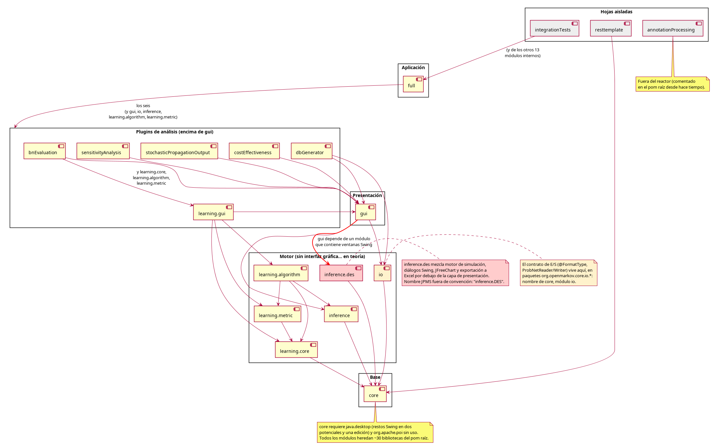
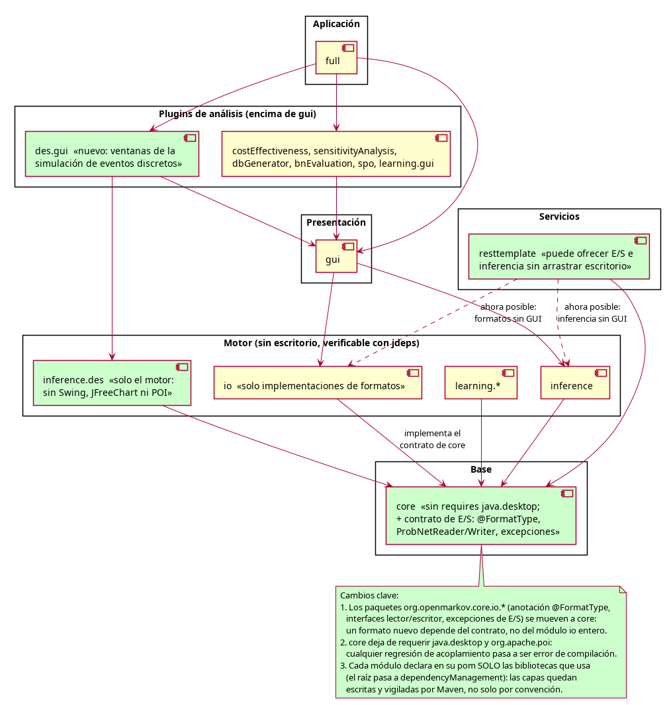
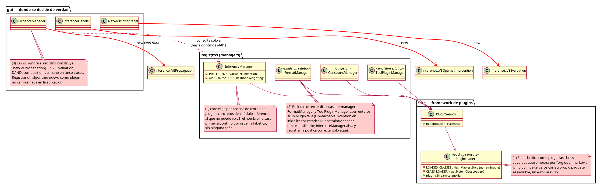
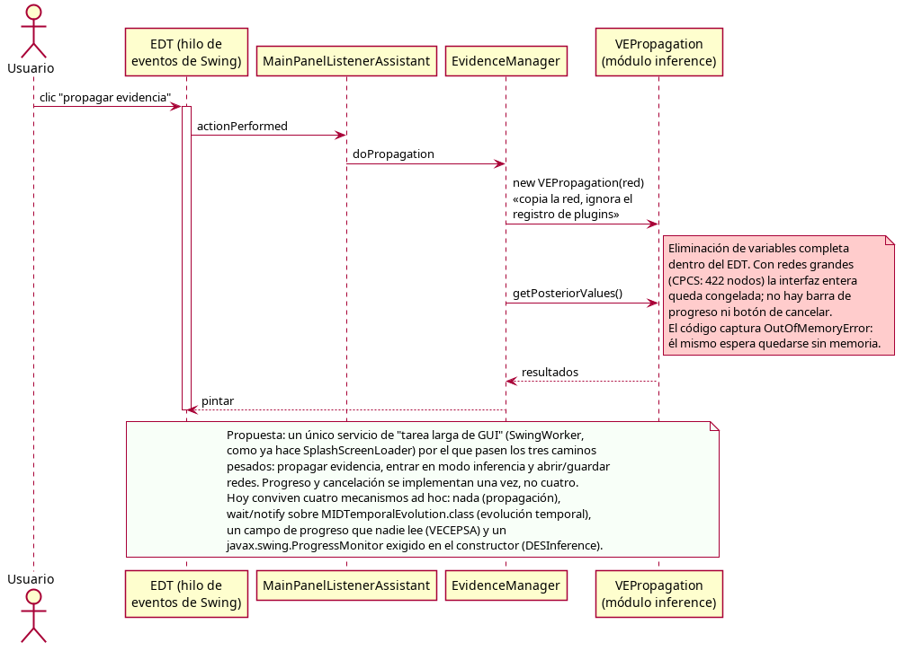
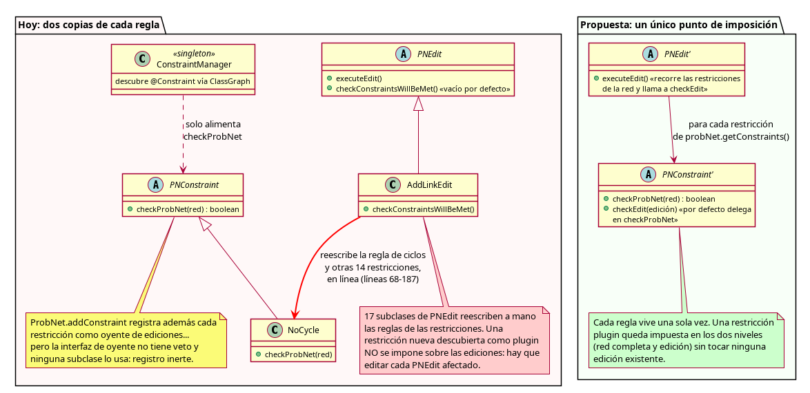
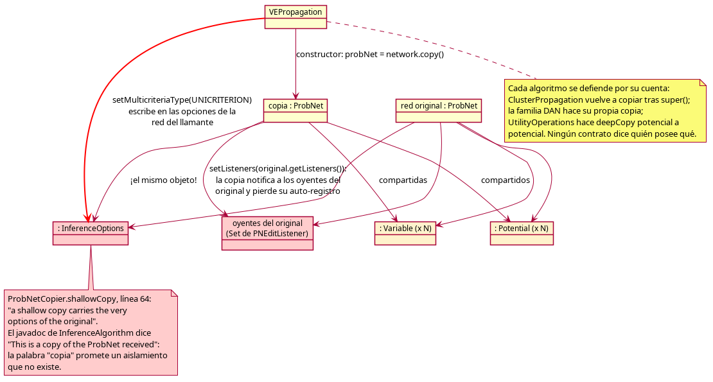
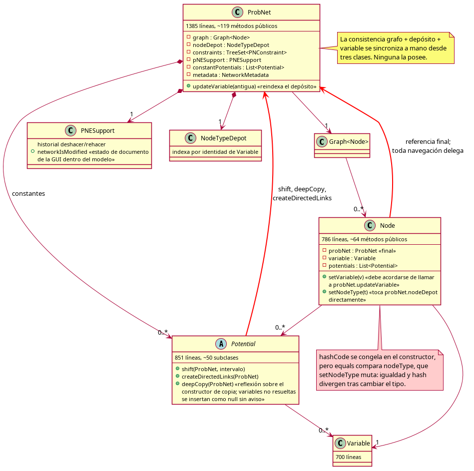

# Análisis del diseño arquitectónico de OpenMarkov

**Fecha:** 4 de agosto de 2026. **Estado del código:** rama `development`, commit `7fba539`.

Este informe recoge los fallos de diseño arquitectónico encontrados en OpenMarkov y propone mejoras para cada uno. No trata errores puntuales de código ni estilo: solo estructura — dependencias entre módulos, reparto de responsabilidades, puntos de extensión y estado global. Cada afirmación cita fichero y líneas del código actual. Los diagramas están hechos con PlantUML; junto a cada imagen `.png` está su fuente `.puml`.

**Cómo se hizo:** seis análisis independientes (módulos, modelo de dominio, plugins, interfaz gráfica, inferencia y preocupaciones transversales) sobre el código real, seguidos de una verificación adversaria: un segundo revisor por dimensión intentó refutar cada hallazgo abriendo los ficheros citados. Solo se incluye lo que sobrevivió; donde la verificación matizó el hallazgo, el matiz está incorporado al texto.

---

## 1. El mapa: los módulos hoy

*Fuente: [modulos-actual.puml](modulos-actual.puml)*

El grafo general es sano: `core` en la base sin dependencias internas, el motor (`inference`, `io`, `learning.*`) encima, `gui` como capa de presentación, y seis módulos de análisis como plugins por encima de `gui` que `full` ensambla. Tres asimetrías merecen mención:

- `full` declara 11 dependencias internas en su `pom.xml` pero su `module-info.java` solo hace `requires` de 4 (`core`, `gui`, `inference`, `io`): los módulos de análisis están en el classpath únicamente para que ClassGraph (la biblioteca de escaneo) los descubra como plugins en tiempo de ejecución. El acoplamiento es por descubrimiento, no por código — coherente con el diseño, pero invisible para quien lea solo los descriptores.
- `resttemplate` (el envoltorio REST con Spring Boot) es el único módulo sin `module-info.java` y solo depende de `core`. La documentación lo describe como "REST wrapper exposing OpenMarkov functionality", pero hoy es un andamiaje de ejemplo: su único controlador sirve "Hello, World!" y dos endpoints de juguete sobre un `ExampleData` de departamentos ([`SimpleController.java`](../../../resttemplate/src/main/java/org/openmarkov/restTemplate/SimpleController.java)); no expone ninguna funcionalidad de OpenMarkov. Aunque quisiera, no podría ofrecer carga de ficheros ni inferencia sin arrastrar el escritorio (ver §2 y §8).
- `integrationTests` depende de los 14 módulos internos, incluido `full`, y guarda bajo `src/main` unas 25 clases de utillaje de desarrollador (análisis estático con javaparser, limpieza, un cliente de Bitbucket en un paquete raíz `bitbucket` fuera de todo espacio de nombres).

Los problemas están en los detalles del grafo, no en su forma. Son los tres marcados en el diagrama y el objeto de las secciones siguientes.

---

## 2. Las capas solo existen por convención: ni Maven ni los `module-info` las vigilan

**Severidad: alta.**

La regla de capas ("`core` sin interfaz gráfica, el motor sin Swing") no está escrita en ningún sitio que una herramienta compruebe:

- El `pom.xml` raíz declara ~30 bibliotecas de terceros en `<dependencies>` (no en `<dependencyManagement>`), líneas 246-431: **todos** los módulos las heredan en ámbito `compile`. `core/pom.xml` no declara ninguna dependencia propia; `mvn -pl core dependency:tree` muestra que el modelo de dominio compila con JFreeChart, FlatLaf, SwingX, JNA y Apache POI (la biblioteca de ficheros Excel) en su classpath. Cualquier clase de `core` puede importar una biblioteca de gráficas y compila sin aviso. Síntoma real: `learning.gui` usa `org.apache.poi.util.StringUtil` solo para unir cadenas ([`CommonUtils.java:1-30`](../../../learning.gui/src/main/java/org/openmarkov/learning/algorithm/nbderived/common/util/CommonUtils.java#L1-L30)).
- Los `module-info.java`, único lugar donde la arquitectura está escrita, mienten por deriva: `core` requiere `org.apache.poi.poi` sin un solo uso; `inference` requiere `java.desktop` y `jeval` sin usarlos; `learning.algorithm` requiere `transitive java.desktop` (impone escritorio a todos sus consumidores) y POI, ambos sin uso; igual `learning.metric`; `gui` requiere `jdk.compiler` sin uso. Dos descriptores conservan bloques de `requires` comentados como historia (`dbGenerator`, `stochasticPropagationOutput`).
- `core` requiere `java.desktop` por tres restos reales: dos potenciales que abren un diálogo Swing al fallar el muestreo ([`TreeWithEventsPotential.java:188`](../../../core/src/main/java/org/openmarkov/core/model/network/potential/treeadd/TreeWithEventsPotential.java#L188), [`TreeWithExcludedEventsPotential.java:131`](../../../core/src/main/java/org/openmarkov/core/model/network/potential/treeadd/TreeWithExcludedEventsPotential.java#L131) — en un servidor sin pantalla eso es una `HeadlessException` o un proceso bloqueado esperando un clic) y una edición cuyo `undo()` declara `javax.swing.undo.CannotUndoException` ([`MonteCarloOptionsEdit.java:8-32`](../../../core/src/main/java/org/openmarkov/core/action/core/MonteCarloOptionsEdit.java#L8-L32)). El grueso del desacople ya se hizo — `PNEdit` y `PNESupport` ya no dependen de Swing — pero estos restos mantienen la puerta abierta.

**Por qué importa.** Publicar `core` (JitPack, `resttemplate`) arrastra el stack de escritorio entero como dependencias transitivas. Retirar o actualizar una biblioteca exige auditar los 17 módulos a mano. Y como los descriptores no son fiables, tampoco sirven para responder "¿qué hace falta para un modo sin interfaz gráfica?".

**Propuesta.**
1. Mover las versiones de terceros a `<dependencyManagement>` en el raíz (como ya se hace con `junit-bom` y `log4j-bom`) y que cada módulo declare exactamente lo que usa. Cambio mecánico, módulo a módulo, verificable con `mvn dependency:analyze`.
2. Podar los `requires` fantasma (la herramienta `jdeps` del JDK los detecta sobre los jars) y añadir esa comprobación como test estático — la infraestructura de análisis estático con javaparser ya existe en `integrationTests`.
3. Arreglar los tres restos Swing de `core` (propagar excepción en los dos potenciales; excepción propia en la edición) y entonces retirar `requires java.desktop`: cualquier regresión futura pasa a ser error de compilación.

*Fuente: [modulos-propuesto.puml](modulos-propuesto.puml)*

---

## 3. El sistema de plugins promete una extensibilidad que ningún eslabón cumple

**Severidad: alta.** El argumento central de la arquitectura — "escribe una clase anotada y aparece sola" — falla en cuatro eslabones consecutivos, del descubrimiento al consumo.

*Fuente: [plugins-promesa-realidad.puml](plugins-promesa-realidad.puml)*

**(1) El descubrimiento filtra por prefijo de paquete.** `PluginLoader` solo clasifica como plugin las clases cuyo nombre cualificado empieza por `org.openmarkov` ([`PluginLoader.java:63-66, 146-166`](../../../core/src/main/java/org/openmarkov/plugin/PluginLoader.java#L63-L66)); todos los managers buscan solo en esa categoría ([`PluginSearch.java:35-39`](../../../core/src/main/java/org/openmarkov/plugin/PluginSearch.java#L35-L39)). Un plugin de terceros con su propio paquete — lo que las convenciones de Java mandan — compila, se anota, está en el classpath… y no aparece, sin error ni aviso. El documento del equipo (`0_miscellaneous/docs/plugins/plugins.tex`) sí registra la restricción en su sección sobre categorías, pero la guía práctica de "cómo añadir un plugin" no la menciona. Matiz: para los módulos del propio proyecto el mecanismo funciona; el fallo afecta a la promesa de extensión externa.

**(2) `core` elige algoritmos por cadena mágica.** `InferenceManager` (en `core`) cablea `PREFERRED_ALGORITHM_NAME = "VariableElimination"` y `APPROXIMATE_ALGORITHM_NAME = "LikelihoodWeighting"` ([`InferenceManager.java:46-50`](../../../core/src/main/java/org/openmarkov/core/inference/annotation/InferenceManager.java#L46-L50)): la infraestructura nombra en texto dos plugins concretos de un módulo (`inference`) que no puede ver. Si el nombre no casa — un renombrado en `inference`, ejecutar sin ese módulo — no falla nada: cae en silencio al primer algoritmo por orden alfabético que acepte la red ([`InferenceManager.java:132-157`](../../../core/src/main/java/org/openmarkov/core/inference/annotation/InferenceManager.java#L132-L157)), un cambio de comportamiento observable sin ninguna señal.

**(3) Cada manager improvisa su política de error.** `FormatManager` (formatos de fichero) y `ToolPluginManager` (herramientas del menú) instancian todos sus plugins dentro de un singleton estático y, si uno falla, lanzan `UnreachableException` dentro del inicializador: un solo plugin defectuoso tumba **toda** la entrada/salida o el menú con un `NoClassDefFoundError` que señala al lugar equivocado ([`FormatManager.java:50-81`](../../../io/src/main/java/org/openmarkov/core/io/format/annotation/FormatManager.java#L50-L81), [`ToolPluginManager.java:39-66`](../../../gui/src/main/java/org/openmarkov/gui/toolplugin/ToolPluginManager.java#L39-L66)). `ConstraintManager` omite en silencio ([`ConstraintManager.java:93-102`](../../../core/src/main/java/org/openmarkov/core/model/network/constraint/ConstraintManager.java#L93-L102)). `InferenceManager` hace lo correcto: registra el aviso y excluye al culpable ([`InferenceManager.java:182-199`](../../../core/src/main/java/org/openmarkov/core/inference/annotation/InferenceManager.java#L182-L199)). Cuatro managers, tres políticas.

**(4) El registro es silencioso ante colisiones y descartes.** Dos plugins con el mismo nombre se resuelven con un `put` que sobreescribe según el orden de escaneo ([`InferenceManager.java:60-66`](../../../core/src/main/java/org/openmarkov/core/inference/annotation/InferenceManager.java#L60-L66), [`ProbDensFunctionManager.java:38-64`](../../../core/src/main/java/org/openmarkov/core/model/network/modelUncertainty/ProbDensFunctionManager.java#L38-L64), `CaseDatabaseManager`, `PotentialPanelManager`); una clase anotada que no extiende la base correcta desaparece de la intersección `annotatedWith(X).childrenOf(Y)` sin rastro. Solo `PotentialUtils` resuelve la colisión de forma determinista (`putIfAbsent` ordenado por herencia) — la solución existe, pero es local.

Además: los contratos reflexivos (constructores concretos, métodos estáticos como el `validate` de `Potential` o `getUniqueInstance()` de los tipos de red) no los puede expresar el sistema de tipos, y la red de seguridad pensada para suplirlo — `ImplementationRequirementsAreMetTest` — está `@Disabled` con 58 clases incumpliendo ([`ImplementationRequirementsAreMetTest.java:18-31`](../../../integrationTests/src/test/java/org/openmarkov/integrationTests/staticAnalysis/verifyImplementationRequirements/ImplementationRequirementsAreMetTest.java#L18-L31)). Matiz de la verificación: el contrato de los tipos de red sí tiene un test activo (`NetworkTypeContractsTest`), y los constructores de los readers/writers del propio repositorio se ejercitan indirectamente en los tests; lo desprotegido son las subclases de `Potential` y cualquier clase nueva o externa. Por último, en el paquete `org.openmarkov.plugin` conviven la API viva (`PluginSearch`/`PluginLoader`) y una API muerta sin ningún uso (`Filter`, `PluginManager`) que despista a quien llega.

**Propuestas.**
1. Descubrir por anotación, no por paquete: ClassGraph localiza clases anotadas en todo el classpath sin cargarlas (`enableAnnotationInfo`). El prefijo quedaría como optimización opcional.
2. Que la preferencia de algoritmo la declare el plugin (un atributo `precedence` o `isExact` en `@InferenceAnnotation`) o la inyecte `full` por configuración; `core` deja de nombrar clases que no ve.
3. Un único ayudante de instanciación en `org.openmarkov.plugin` con la política de `InferenceManager` (aislar, registrar, continuar), usado por todos los managers, e inicialización perezosa fuera de los inicializadores estáticos.
4. Aviso (o fallo) ante claves duplicadas, y un aviso por clase anotada descartada por el doble filtro. El punto de paso común ya existe.
5. Borrar `Filter` y `PluginManager` (recuperables desde git); reactivar el test de requisitos congelando la lista de 58 excepciones para que no crezca.

Nota sobre el sistema de módulos de Java (JPMS): los 17 descriptores son `open module` porque el escaneo reflexivo lo exige, y la aplicación corre en classpath. Los `exports` siguen valiendo en compilación (encapsulan la superficie pública entre módulos), pero en ejecución no hay cerrojo. Si algún día se quisiera encapsulación real, el camino sería `java.util.ServiceLoader` (`provides … with` en cada descriptor), que además eliminaría el escaneo del classpath; mientras tanto, conviene asumir por escrito que JPMS se usa como declaración de dependencias.

---

## 4. La interfaz gráfica puentea la arquitectura que las otras capas ofrecen

**Severidad: alta.** Los mecanismos existen — el registro de plugins, las tareas de `core.inference.tasks`, el sistema de ediciones — pero la capa que decide qué se ejecuta no los usa.

**La GUI instancia algoritmos concretos.** Cinco clases construyen a mano `new VEPropagation(...)`, `VEEvaluation`, `VEExpectedUtilityDecision`, `VEOptimalIntervention`, `DANDecompositionIntoSymmetricDANsEvaluation`, `MIDTemporalEvolution`… ([`EvidenceManager.java:555-563`](../../../gui/src/main/java/org/openmarkov/gui/window/edition/networkEditorPanel/EvidenceManager.java#L555-L563), [`NetworkEditorPanel.java:581-600`](../../../gui/src/main/java/org/openmarkov/gui/window/edition/networkEditorPanel/NetworkEditorPanel.java#L581-L600), [`InferenceHandler.java:209-223`](../../../gui/src/main/java/org/openmarkov/gui/window/InferenceHandler.java#L209-L223), [`TraceTemporalEvolutionDialog.java:270,324,696`](../../../gui/src/main/java/org/openmarkov/gui/dialog/inference/temporalevolution/TraceTemporalEvolutionDialog.java#L270), [`DecisionTreeEditor.java:90`](../../../gui/src/main/java/org/openmarkov/gui/window/decisiontree/DecisionTreeEditor.java#L90)). El detalle revelador: `EvidenceManager` **sí** consulta `InferenceManager` — pero solo para comprobar que hay algoritmo disponible (líneas 74-81); el algoritmo que el registro elige nunca se ejecuta. Registrar un algoritmo de inferencia nuevo como plugin no cambia nada en la aplicación de escritorio. Lo mismo ocurre en `sensitivityAnalysis` (cinco diálogos cablean `VEEvaluation`/`VESensAnPlot`) y `costEffectiveness`.

**Todo el cómputo pesado corre en el hilo de eventos de Swing** (EDT, *Event Dispatch Thread*: el único hilo que pinta la interfaz). Propagar evidencia, entrar en modo inferencia y abrir o guardar un fichero de red son llamadas síncronas desde `actionPerformed` ([`MainPanelListenerAssistant.java:88-168`](../../../gui/src/main/java/org/openmarkov/gui/window/MainPanelListenerAssistant.java#L88-L168), `GUIUtils.executeUIAction` no crea hilo alguno, [`NetworkFileHandler.java:107-118`](../../../gui/src/main/java/org/openmarkov/gui/window/NetworkFileHandler.java#L107-L118)). Con las redes que el proyecto ya maneja (CPCS, 422 nodos), la interfaz entera se congela sin progreso ni cancelación; `doPropagation` captura `OutOfMemoryError`, señal de que el propio código espera cómputos enormes. El mecanismo `freeze()/unfreeze()` de `MainGUI` está desactivado con `if (true) return;` ([`MainGUI.java:108-118`](../../../gui/src/main/java/org/openmarkov/gui/window/MainGUI.java#L108-L118)). Y donde sí hay hilos, cada función reinventa el patrón — cuatro mecanismos de progreso conviven: ninguno (propagación), `wait/notify` sobre el objeto `Class` de `MIDTemporalEvolution` compartido entre módulos ([`MIDTemporalEvolution.java:533`](../../../inference/src/main/java/org/openmarkov/inference/algorithm/temporalevaluation/tasks/MIDTemporalEvolution.java#L533), [`TraceTemporalEvolutionDialog.java:369-386`](../../../gui/src/main/java/org/openmarkov/gui/dialog/inference/temporalevolution/TraceTemporalEvolutionDialog.java#L369-L386) — dos evaluaciones concurrentes se cruzarían las señales), un campo de progreso que nadie lee ([`VECEPSA.java:40`](../../../inference/src/main/java/org/openmarkov/inference/algorithm/variableElimination/tasks/VECEPSA.java#L40)), y un `javax.swing.ProgressMonitor` exigido en el constructor del algoritmo ([`DESInference.java:98`](../../../inference.des/src/main/java/org/openmarkov/inference/DES/DESInference.java#L98) — el motor no puede ejecutarse sin interfaz gráfica).

*Fuente: [gui-edt.puml](gui-edt.puml)*

**Estado global y responsabilidades fundidas.**
- `MainGUI.INSTANCE` es un singleton estático público construido al cargar la clase, fuera del EDT y de todo control de arranque ([`MainGUI.java:44,53-89`](../../../gui/src/main/java/org/openmarkov/gui/window/MainGUI.java#L44)). Los componentes no reciben colaboradores: navegan la variable global con cadenas de cuatro llamadas, incluso desde otro módulo Maven ([`LearningDialog.java:224,902,1017`](../../../learning.gui/src/main/java/org/openmarkov/learning/gui/LearningDialog.java#L224)).
- `NetworkEditorPanel` (1.308 líneas, ~97 métodos públicos) es a la vez documento, vista y controlador: guarda el `ProbNetReader`/`Writer` con que se abrió la red, la ruta del fichero y el indicador de modificación, y `NetsIO.saveNetworkFile` recibe **el panel Swing** para guardar ([`NetsIO.java:91-105`](../../../gui/src/main/java/org/openmarkov/gui/dialog/io/NetsIO.java#L91-L105)). No se puede guardar una red, ni saber si está modificada, sin instanciar la interfaz.
- `TraceTemporalEvolutionDialog` (1.770 líneas, la clase más grande de `gui`) ejecuta inferencia, construye ventanas Swing desde el hilo de trabajo, re-ejecuta el algoritmo para exportar a Excel y escribe el fichero, todo dentro del diálogo ([`TraceTemporalEvolutionDialog.java:262-367, 667-737`](../../../gui/src/main/java/org/openmarkov/gui/dialog/inference/temporalevolution/TraceTemporalEvolutionDialog.java#L262-L367)).
- 21 ediciones (`PNEdit`) viven en el módulo `gui` junto a las 39 de `core`, sin criterio visible; unas 16 no tocan nada de Swing y son operaciones puras de modelo (cambiar el tipo de un nodo, imponer una política, editar una celda de la tabla de probabilidad). Consecuencia: esas operaciones no existen para quien no arrastre el módulo Swing, y `learning.gui` depende de `gui` también para obtener una edición ([`LearningDialog.java:37,914`](../../../learning.gui/src/main/java/org/openmarkov/learning/gui/LearningDialog.java#L37)). Matiz de la verificación: 5 de las 21 sí dependen de clases visuales (`VisualNode`, `VisualNetwork`) y necesitarían adaptación, no traslado.

**Propuestas.**
1. Una fábrica de tareas: la GUI depende solo de las interfaces de `core.inference.tasks` y resuelve la implementación vía `InferenceManager`. Los cinco puntos citados pasan de `new VEPropagation(red)` a pedir la tarea `Propagation` al registro.
2. Un único servicio de "tarea larga de GUI" (sobre `SwingWorker`, como ya hace `SplashScreenLoader`) con progreso y cancelación, por el que pasen los tres caminos pesados. Complementa al punto 4 de §6 (listener de progreso en el contrato de tarea).
3. Extraer un `NetworkDocument` sin Swing (red + fichero + lector/escritor + indicador de modificación + evidencia); el panel lo observa y `NetsIO` lo recibe en lugar del panel. Es la continuación natural de la descomposición ya empezada en ese paquete (`EvidenceManager`, `EditorInputHandler`, `InferencePresenter` ya fueron extraídos).
4. Mover a `core/action` las ~16 ediciones puras (con la lógica de redistribución de probabilidades de `PotentialsTablePanelOperations`, que tampoco importa Swing); adaptar las 5 visuales.
5. Desmontar `MainGUI.INSTANCE` por capas: pasar colaboradores por constructor, empezando por los usos desde `learning.gui` y los *reach-up* de los paneles.

---

## 5. Cada restricción de red vive escrita dos veces

**Severidad: alta.** Una restricción (`PNConstraint`) se impone en dos momentos: sobre la red completa (`checkProbNet`) y sobre cada edición que podría violarla (`PNEdit.checkConstraintsWillBeMet`). El problema: **las dos versiones son código independiente**.

*Fuente: [restricciones-dos-veces.puml](restricciones-dos-veces.puml)*

- `PNConstraint` solo define `checkProbNet`; no existe gancho para validar una edición ([`PNConstraint.java:30-47`](../../../core/src/main/java/org/openmarkov/core/model/network/constraint/PNConstraint.java#L30-L47)).
- `checkConstraintsWillBeMet` está vacío por defecto ([`PNEdit.java:71-82`](../../../core/src/main/java/org/openmarkov/core/action/base/PNEdit.java#L71-L82)) y **17 subclases** de `PNEdit` lo rellenan enumerando clases concretas de restricción y reescribiendo sus reglas en línea: `AddLinkEdit` conoce 15 restricciones y duplica la lógica de `NoCycle` ([`AddLinkEdit.java:68-187`](../../../core/src/main/java/org/openmarkov/core/action/base/linkEdits/AddLinkEdit.java#L68-L187) frente a [`NoCycle.java:21-30`](../../../core/src/main/java/org/openmarkov/core/model/network/constraint/NoCycle.java#L21-L30)). `InvertLinkEdit` usa un tercer estilo: ejecuta, comprueba la red entera y deshace si falla ([`InvertLinkEdit.java:103-135`](../../../core/src/main/java/org/openmarkov/core/action/base/linkEdits/InvertLinkEdit.java#L103-L135)).
- El descubrimiento de restricciones como plugins (`@Constraint` vía ClassGraph) solo alimenta la comprobación de red completa ([`ConstraintManager.java:115-117`](../../../core/src/main/java/org/openmarkov/core/model/network/constraint/ConstraintManager.java#L115-L117)): una restricción nueva **no se impone sobre las ediciones** aunque el sistema la descubra. Y `ProbNet.addConstraint` registra cada restricción como oyente de ediciones, pero la interfaz de oyente no tiene veto y ninguna subclase la usa: registro inerte, resto de un diseño anterior ([`ProbNet.java:177-180`](../../../core/src/main/java/org/openmarkov/core/model/network/ProbNet.java#L177-L180), [`PNEditListener.java:17-58`](../../../core/src/main/java/org/openmarkov/core/action/base/PNEditListener.java#L17-L58)).

El propio `CLAUDE.md` del proyecto recoge la lección de que un arreglo en solo una de las dos copias "no detiene al usuario": la divergencia no es hipotética, ya ha ocurrido.

**Propuesta.** Un único punto de imposición por regla: añadir a `PNConstraint` un método incremental opcional `checkEdit(PNEdit)` cuya implementación por defecto delegue en `checkProbNet`, y que `PNEdit.executeEdit` recorra `probNet.getConstraints()` invocándolo. Cada regla vive una vez; una restricción plugin queda impuesta en ambos niveles sin tocar ninguna edición; las ediciones dejan de conocer restricciones concretas. Eliminar (o dotar de uso) el registro inerte de oyentes.

---

## 6. Nadie sabe quién es dueño de la red durante la inferencia

**Severidad: alta.** El contrato dice una cosa y el código hace otra:

*Fuente: [copia-compartida.puml](copia-compartida.puml)*

- `InferenceAlgorithm` documenta su campo como "*This is a copy of the ProbNet received*" y hace `network.copy()` ([`InferenceAlgorithm.java:35-38,86`](../../../core/src/main/java/org/openmarkov/core/inference/InferenceAlgorithm.java#L35-L38)). Pero `ProbNet.copy()` es explícitamente una copia estructural superficial que comparte `Variable` y `Potential` ([`ProbNet.java:390-400`](../../../core/src/main/java/org/openmarkov/core/model/network/ProbNet.java#L390-L400)) — y también el **mismo objeto** `InferenceOptions` ([`ProbNetCopier.java:64-65`](../../../core/src/main/java/org/openmarkov/core/model/network/ProbNetCopier.java#L64-L65)) y **los oyentes** del `PNESupport` original ([`ProbNetCopier.java:56`](../../../core/src/main/java/org/openmarkov/core/model/network/ProbNetCopier.java#L56)).
- Consecuencia directa: el constructor de `VEPropagation` hace `probNet.getInferenceOptions().getMultiCriteriaOptions().setMulticriteriaType(UNICRITERION)` ([`VEPropagation.java:83-87`](../../../inference/src/main/java/org/openmarkov/inference/algorithm/variableElimination/tasks/VEPropagation.java#L83-L87)) — escribe en las opciones de la red **del llamante**. Y una edición ejecutada sobre la copia notifica a los oyentes del original, mientras la copia pierde su propio auto-registro (su indicador de modificación deja de funcionar) ([`PNESupport.java:55-62,92-95`](../../../core/src/main/java/org/openmarkov/core/action/base/PNESupport.java#L55-L62)).
- Cada algoritmo se defiende por su cuenta: `ClusterPropagation` vuelve a copiar después de que `super()` ya copió ([`ClusterPropagation.java:62-65`](../../../inference/src/main/java/org/openmarkov/inference/algorithm/huginPropagation/ClusterPropagation.java#L62-L65)); la familia DAN (redes de análisis de decisiones) no extiende `InferenceAlgorithm` y hace su propia copia; `UtilityOperations` hace `deepCopy` potencial a potencial antes de escalar. Un `TODO` vivo lo confirma: "*Revisar todas las heuristicas que suponian que trabajaban con una copia*" ([`EliminationHeuristic.java:62-64`](../../../core/src/main/java/org/openmarkov/core/inference/heuristic/EliminationHeuristic.java#L62-L64)).
- La misma indefinición, llevada a hilos: el análisis probabilístico de sensibilidad lanza un pool con un hilo por procesador y **todas** las tareas `Simulation` comparten la misma instancia de `ProbNet`; cada una escribe en ella los potenciales muestreados (`sampleNetworkPotentials(probNet)`, [`VECEPSA.java:128-145`](../../../inference/src/main/java/org/openmarkov/inference/algorithm/variableElimination/tasks/VECEPSA.java#L128-L145)). Cuando la carrera estalla, el bucle exterior no la arregla: limpia los resultados y reintenta con la mitad de hilos (`numThreads /= 2`, [`VECEPSA.java:63-82`](../../../inference/src/main/java/org/openmarkov/inference/algorithm/variableElimination/tasks/VECEPSA.java#L63-L82)) hasta que deja de fallar — enmascara la condición de carrera en lugar de eliminarla, y a veces con resultados parciales muestreados por otra tanda.

A esto se suma que **el contrato de las tareas no define ciclo de vida**: `Task` son dos setters sin semántica de estados ([`Task.java:22-28`](../../../core/src/main/java/org/openmarkov/core/inference/tasks/Task.java#L22-L28), con su `//TODO Write a real documentation`). `VEPropagation` cachea el resultado para siempre y cambiar la evidencia después devuelve resultados obsoletos; `StochasticPropagation` recalcula cada vez y además degrada su propio estado entre llamadas; `DANEvaluation` lanza `UnsupportedOperationException` en dos métodos de la interfaz. La única implementación pensada para varias consultas (`ClusterPropagation.updateEvidence` sobre el árbol compilado) es justo la que la GUI no usa: construye un `VEPropagation` nuevo — con copia de red incluida — por cada propagación, porque reutilizar el objeto no es fiable.

Y el esqueleto común no es común: el preprocesamiento (expansión temporal, imposición de políticas, extensión de evidencia, descuentos) son métodos de `VariableElimination`, no del marco ([`VariableElimination.java:66-116`](../../../inference/src/main/java/org/openmarkov/inference/algorithm/variableElimination/tasks/VariableElimination.java#L66-L116)); ni Hugin ni los algoritmos de muestreo lo ejecutan, así que la misma tarea `Propagation` tiene semántica distinta según el algoritmo. La proyección a red de Markov está copiada literalmente tres veces ([`TaskUtilities.java:245-271`](../../../core/src/main/java/org/openmarkov/core/inference/tasks/TaskUtilities.java#L245-L271), [`ClusterPropagation.java:76-100`](../../../inference/src/main/java/org/openmarkov/inference/algorithm/huginPropagation/ClusterPropagation.java#L76-L100), [`HybridElimination.java:87-113`](../../../inference/src/main/java/org/openmarkov/inference/heuristic/hybridElimination/HybridElimination.java#L87-L113)).

**Propuestas.**
1. Contrato de propiedad explícito y único: la tarea recibe la red y **o bien** documenta que no la muta jamás (y entonces `InferenceOptions` se copia, no se comparte), **o bien** hace ella la copia profunda de lo que vaya a tocar. El arreglo más barato y de más efecto: que `shallowCopy` copie `InferenceOptions` (es un objeto pequeño) y **no** transfiera oyentes por defecto — el traspaso de oyentes pasa a ser una operación opcional y consciente.
2. Definir el ciclo de vida de `Task` (una consulta por objeto, o invalidación de caché al cambiar setters — pero una sola semántica) y documentarlo en la interfaz.
3. Subir el preprocesamiento al marco (una plantilla en `InferenceAlgorithm` o en las tareas) y dejar una sola copia de la proyección a red de Markov, en `TaskUtilities`.
4. Añadir al contrato de tarea un listener de progreso/cancelación (interfaz pequeña en `core`), sustituyendo los cuatro mecanismos ad hoc de §4; `MIDTemporalEvolution` lo invocaría en lugar de `notifyAll()` sobre su propio objeto `Class`.

---

## 7. El modelo de dominio: una clase-dios y un ciclo mantenido a mano

**Severidad: media, pero es el terreno sobre el que se construye todo lo demás.**

*Fuente: [dominio-ciclo.puml](dominio-ciclo.puml)*

- `ProbNet` tiene 1.385 líneas y ~119 métodos públicos: grafo, depósito de nodos por tipo, restricciones, potenciales constantes, metadatos, criterios de decisión **y** la maquinaria de sesión de edición (`PNESupport`: pilas de deshacer/rehacer e indicador de modificado/guardado — estado de documento de la GUI viajando con el objeto de dominio a `inference`, `learning` e `io`; [`PNESupport.java:267-299`](../../../core/src/main/java/org/openmarkov/core/action/base/PNESupport.java#L267-L299), leído desde la GUI en [`NetworkEditorPanel.java:924-925,1171`](../../../gui/src/main/java/org/openmarkov/gui/window/edition/networkEditorPanel/NetworkEditorPanel.java#L924-L925)).
- La consistencia entre el grafo, el depósito (`NodeTypeDepot`, indexado por identidad de `Variable`) y la variable de cada nodo se sincroniza por convención de llamada: `Node.setVariable` debe acordarse de llamar a `probNet.updateVariable(oldVariable)` ([`Node.java:166-170`](../../../core/src/main/java/org/openmarkov/core/model/network/Node.java#L166-L170)), y `Node.setNodeType` manipula directamente `probNet.nodeDepot` gracias a la visibilidad de paquete ([`Node.java:272-283`](../../../core/src/main/java/org/openmarkov/core/model/network/Node.java#L272-L283)). Ninguna clase posee el invariante; cualquier vía nueva de mutación (una edición, un algoritmo de aprendizaje, un plugin) puede saltárselo y compila.
- `Node.hashCode` se congela en el constructor pero `equals` compara el `nodeType`, que `setNodeType` muta: igualdad y hash divergen tras cambiar el tipo de un nodo ([`Node.java:80,133,426-437`](../../../core/src/main/java/org/openmarkov/core/model/network/Node.java#L80)) — contrato roto para cualquier colección hash.
- La raíz `Potential` depende de `ProbNet` (`shift`, `createDirectedLinks`, `deepCopy`), cerrando el ciclo. `deepCopy` resuelve variables por nombre y, si el nombre no está en la red destino, **inserta `null` sin queja** ([`Potential.java:795-815`](../../../core/src/main/java/org/openmarkov/core/model/network/potential/Potential.java#L795-L815)); además instancia la subclase por reflexión sobre un constructor de copia que el compilador no exige — un potencial nuevo sin ese constructor revienta en el primer `deepCopy`, y la verificación estática que lo cubriría está en `integrationTests`, no en los tests de `core`.
- El tamaño de una tabla se calcula multiplicando los números de estados en un `int` sin control de desbordamiento (`AbstractIndexedPotential.computeTableSize`), y `TablePotential` captura la `NegativeArraySizeException` resultante para lanzar un `new OutOfMemoryError()` fabricado a mano ([`TablePotential.java:59-60`](../../../core/src/main/java/org/openmarkov/core/model/network/potential/TablePotential.java#L59-L60)). El fallo real — una red cuyo producto de estados no cabe en un `int` — se disfraza de falta de memoria, viaja como `Error` en lugar de como excepción del dominio, y no existe ninguna capa donde comprobar el tamaño antes de construir (relevante para las redes grandes que el proyecto ya maneja).
- La jerarquía `Potential` (~50 subclases) no encapsula sus variantes: campos públicos mutables (`StrategicTablePotential.strategyTrees` con 38 accesos externos desde 11 ficheros, `GTablePotential.elementTable`, el `Map properties` de la raíz) y cadenas de `instanceof` en todas las operaciones de tablas ([`TablePotentialMerge.java:113-291`](../../../core/src/main/java/org/openmarkov/core/model/network/potential/operation/TablePotentialMerge.java#L113-L291), y lo mismo en aritmética, maximización, suma, eliminación y transformación). La clase base fabrica `UniformPotential` en `addVariable`/`removeVariable`, descartando en silencio el contenido de los tipos que no sobreescriben (con `FIXME`, [`Potential.java:694-730`](../../../core/src/main/java/org/openmarkov/core/model/network/potential/Potential.java#L694-L730)). Del rediseño ya documentado en `0_miscellaneous/docs/rediseno-potenciales`, tres problemas están corregidos (P1, P3, P5) y dos siguen vigentes (los campos consultados por `instanceof` y el `switch` sobre `PotentialRole`, P6).

**Propuestas.**
1. Dirigir la mutación de identidad a través de `ProbNet` (`renameVariable`, `changeNodeType`) y reducir la visibilidad de los setters de `Node` que exigen reindexado externo: el invariante pasa a tener un dueño único.
2. En `Potential.deepCopy`, fallar con excepción cuando una variable no se resuelva, y apoyarse en el método abstracto `copy()` — que el compilador sí exige — en lugar de la reflexión.
3. Sacar el estado de documento (modificado/guardado) de `PNESupport` a la capa de documento de la GUI (el `NetworkDocument` de §4 es el sitio natural), y no transferir oyentes en las copias (§6).
4. Continuar el rediseño de potenciales: encapsular los campos públicos tras accesores y preguntar por capacidad (interfaz) en vez de por clase concreta en las operaciones.

---

## 8. Transversales: excepciones, localización, E/S, diagnóstico

**(a) Las excepciones de dominio están fusionadas con la maquinaria de localización.** Imprimir cualquier excepción (`toString`) dispara: singleton `StringDatabase` → escaneo de classpath con ClassGraph → resolución de plantillas por reflexión sobre campos privados con `setAccessible(true)` ([`OpenMarkovException.java:27-35`](../../../core/src/main/java/org/openmarkov/core/exception/OpenMarkovException.java#L27-L35), [`IOpenMarkovException.java:138-182`](../../../core/src/main/java/org/openmarkov/core/exception/IOpenMarkovException.java#L138-L182), [`StringDatabase.java:173-189`](../../../core/src/main/java/org/openmarkov/core/localize/StringDatabase.java#L173-L189)). El texto se busca por el nombre cualificado de la clase en un XML: renombrar o mover una excepción (o un `PNEdit`) rompe su mensaje sin aviso del compilador. `BundleSearch`, dentro de `core`, codifica literalmente los paquetes de `sensitivityAnalysis` y `stochasticPropagationOutput` — módulos que dependen de `core` ([`IOpenMarkovException.java:236-245`](../../../core/src/main/java/org/openmarkov/core/exception/IOpenMarkovException.java#L236-L245)): dependencia dirigida hacia arriba por nombre. Y la GUI duplica línea a línea el algoritmo de búsqueda de claves ([`ExceptionDialog.java:87-125`](../../../gui/src/main/java/org/openmarkov/gui/dialog/ExceptionDialog.java#L87-L125)). Con la decisión del equipo de "solo inglés", esta indirección no compra internacionalización: solo fragilidad. **Propuesta:** cada excepción construye su mensaje en inglés en su constructor; `StringDatabase` queda para los textos de la interfaz; `BundleSearch` sale de `core`.

**(b) El punto de extensión de formatos de E/S está cerrado en la práctica.** `FormatManager.getProbNetReader(URL)` trata la extensión `elv` como caso especial y asume que todo lo demás es XML con atributo `formatVersion` con un punto ([`FormatManager.java:119-160`](../../../io/src/main/java/org/openmarkov/core/io/format/annotation/FormatManager.java#L119-L160)): un formato no XML (JSON, el `.net` de Hugin) sería descubierto como plugin y aun así inalcanzable. La prueba empírica: XMLBIF, el último formato incorporado, entró **heredando del lector nativo con su anotación `@FormatType` comentada** ([`XMLBIFReader.java:28-29`](../../../io/src/main/java/org/openmarkov/io/xmlbif/XMLBIFReader.java#L28-L29)), y el lector PGMX lo enumera en su `switch` ([`PGMXReader.java:37-40`](../../../io/src/main/java/org/openmarkov/io/probmodel/reader/PGMXReader.java#L37-L40)). Además `checkStructure`, la validación del camino principal de apertura, tiene el cuerpo entero comentado: aparenta validar y no hace nada ([`FormatManager.java:240-258`](../../../io/src/main/java/org/openmarkov/core/io/format/annotation/FormatManager.java#L240-L258)). El contrato es asimétrico (el lector recibe `URL`, el escritor `String`) y no hay variante sobre *streams* para consumidores sin sistema de ficheros — como `resttemplate`. **Propuesta:** mover el reconocimiento al contrato del plugin (un `canRead(URL)` o extensión+versión declaradas en la anotación), dejar `FormatManager` como registro puro, y añadir la variante de streams. Junto con mover el contrato (`@FormatType`, `ProbNetReader`/`Writer`, excepciones de E/S) de los paquetes `org.openmarkov.core.io.*` del módulo `io` a `core` (§1-2): hoy un formato nuevo debe depender del módulo `io` entero, con Apache POI y los cuatro formatos existentes, solo para ver la anotación.

**(c) Diagnóstico fragmentado.** Cuatro mecanismos conviven en `src/main` (conteos verificados): 13 ficheros usan `OpenMarkovLogger.LOGGER` — una única categoría log4j para toda la aplicación, que anula el filtrado por paquete —, 17 crean su logger por clase con categoría propia, 47 escriben por `System.out` y 36 usan `printStackTrace`. En una aplicación de escritorio sin consola visible, esos dos últimos canales simplemente se pierden. **Propuesta:** logger por clase como norma, `OpenMarkovLogger` como fachada en extinción, y una regla de análisis estático (la infraestructura ya existe) que impida regresiones de `System.out`/`printStackTrace` en `src/main`.

**(d) Espacio de claves de localización global y plano.** `StringDatabase` funde los bundles de todos los módulos con `putAll` (clave = nombre de fichero del bundle) y aplana todas las claves en un único mapa: dos módulos con la misma clave se pisan, gana el último según un orden de escaneo no declarado ([`StringDatabase.java:70-78,163-171`](../../../core/src/main/java/org/openmarkov/core/localize/StringDatabase.java#L70-L78)). Como los módulos son plugins, ninguna compilación lo detecta. **Propuesta mínima:** detectar la colisión al fusionar y registrarla; mejor, espaciar las claves por proveedor.

**(e) La biblioteca interna `org.openmarkov.java`** resultó, medida, mucho más pequeña de lo que sugiere su fama: 17 ficheros, 1.243 líneas, con duplicaciones puntuales del JDK (`NullUtils.equals` ≡ `Objects.equals`) y solapes con las Apache Commons que `core` ya requiere. No merece reubicación; sí congelar su crecimiento (regla: antes de añadir una utilidad, mirar JDK y Commons) y dejar de exportar los paquetes que nadie más usa. El problema de fondo es más ancho que esta biblioteca: `core` exporta 47 paquetes — para quien use OpenMarkov como biblioteca, la API pública es en la práctica toda la implementación, y cualquier refactor interno es potencialmente un cambio incompatible para terceros.

**(f) `inference.des` es la excepción a la regla de capas.** Todos los demás análisis son plugins encima de `gui`; este módulo mezcla el motor de simulación de eventos discretos (DES), diálogos Swing completos, gráficas JFreeChart y exportación a Excel **por debajo** de la capa gráfica (`inference.des/module-info.java:1-13` requiere `java.desktop`, JFreeChart y POI; `CEDESDialog`, `DESResultsWindow` en el mismo paquete plano que `DESInference`, cuyo constructor exige un `javax.swing.ProgressMonitor`). El motor no puede usarse sin pantalla, y sus ventanas no pueden reutilizar los componentes de `gui` porque crearía un ciclo. Su nombre JPMS, `inference.DES`, es además el único fuera de la convención `org.openmarkov.*`. **Propuesta:** partirlo siguiendo el patrón existente — el motor queda abajo, sin escritorio; las ventanas suben a un módulo plugin encima de `gui`, como los otros cinco análisis.

---

## 9. Prioridades

El patrón que se repite en casi todos los hallazgos: **la arquitectura declarada y la arquitectura efectiva divergen, y ninguna herramienta mide la distancia**. Los mecanismos correctos existen (registro de plugins, tareas, ediciones, restricciones descubiertas, module-info) pero los puntos de consumo los puentean, y como nada falla cuando se puentean, la distancia crece.

Ordenado por relación beneficio/esfuerzo:

**Baratos y direccionales (días):**
1. Podar los `requires` fantasma y arreglar los tres restos Swing de `core`; retirar `requires java.desktop` (§2).
2. Política única de error en los managers de plugins + avisos de colisión/descarte (§3).
3. Borrar la API muerta (`Filter`, `PluginManager`) y el registro inerte de restricciones como oyentes (§3, §5).
4. `shallowCopy`: copiar `InferenceOptions` y no transferir oyentes (§6). Es el arreglo pequeño con más efecto silencioso del informe.
5. Renombrar el módulo JPMS `inference.DES` y decidir el destino de `annotationProcessing` (dentro o fuera, pero no a medias).
6. Dar a cada `Simulation` del análisis probabilístico de sensibilidad su propia copia de la red y retirar el reintento con la mitad de hilos (§6); calcular el tamaño de tabla con `Math.multiplyExact` y una excepción de dominio en lugar del `OutOfMemoryError` fabricado (§7).

**Estructurales de alcance medio (semanas):**
7. Dependencias por módulo con `dependencyManagement` en el raíz + verificación con `dependency:analyze`/`jdeps` como test (§2).
8. `PNConstraint.checkEdit` con imposición desde `PNEdit.executeEdit`: una regla, un sitio (§5).
9. Fábrica de tareas usada por la GUI y los módulos de análisis; `core` deja de nombrar algoritmos por cadena (§3, §4).
10. Servicio único de tarea larga de GUI + listener de progreso/cancelación en el contrato de tarea (§4, §6).
11. Mover el contrato de E/S a `core` y abrir `FormatManager` (§8b).

**Rediseños de fondo (a planificar):**
12. Contrato de propiedad y ciclo de vida de las tareas de inferencia; preprocesamiento en el marco (§6).
13. `NetworkDocument` y desmontaje progresivo de `MainGUI.INSTANCE` (§4).
14. Mutación de identidad con dueño único en el dominio; continuar el rediseño de potenciales (§7).
15. Si algún día se quiere encapsulación real en ejecución: migrar el descubrimiento a `ServiceLoader` (§3).

---

## Apéndice: método y fiabilidad

El análisis se hizo con agentes independientes leyendo el código de la rama `development` (commit `7fba539`), una dimensión cada uno, con instrucción explícita de citar fichero y líneas y de descartar todo problema ya corregido (varios documentos previos de `0_miscellaneous/docs` describen estados que ya no existen; todo se contrastó con el código actual). Después, cada hallazgo pasó una verificación adversaria: un segundo revisor por dimensión intentó refutarlo abriendo los ficheros citados.

De los 38 hallazgos: 26 quedaron confirmados y 5 confirmados parcialmente (los matices están incorporados al texto); ninguno fue refutado. Los 6 hallazgos transversales (§8) y uno de inferencia quedaron sin verificador adversario por un corte de sesión; sus citas clave se comprobaron directamente sobre los ficheros al redactar este informe, con una corrección (el conteo de ficheros de producción que usan `OpenMarkovLogger` es 13, no 58). Un agente crítico final buscó huecos no cubiertos por las seis dimensiones y aportó cuatro — la condición de carrera del análisis de sensibilidad, el desbordamiento del tamaño de tabla, la superficie de 47 paquetes exportados y el estado real de `resttemplate` —, verificados también contra el código antes de incorporarlos.

Los diagramas se construyeron a partir de un inventario aparte de las dependencias reales (`pom.xml` y `module-info.java` de los 17 módulos) y de tamaños medidos de las clases citadas.
