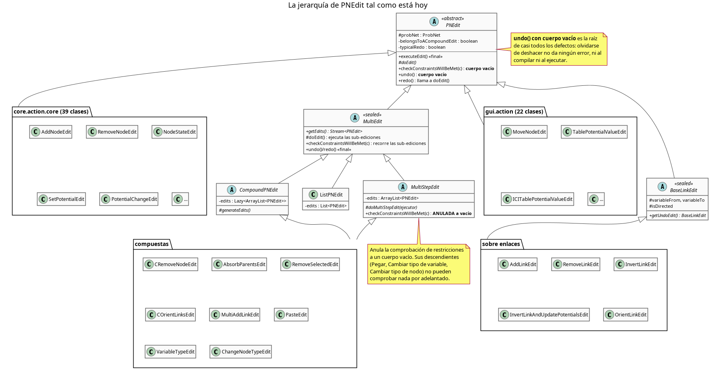
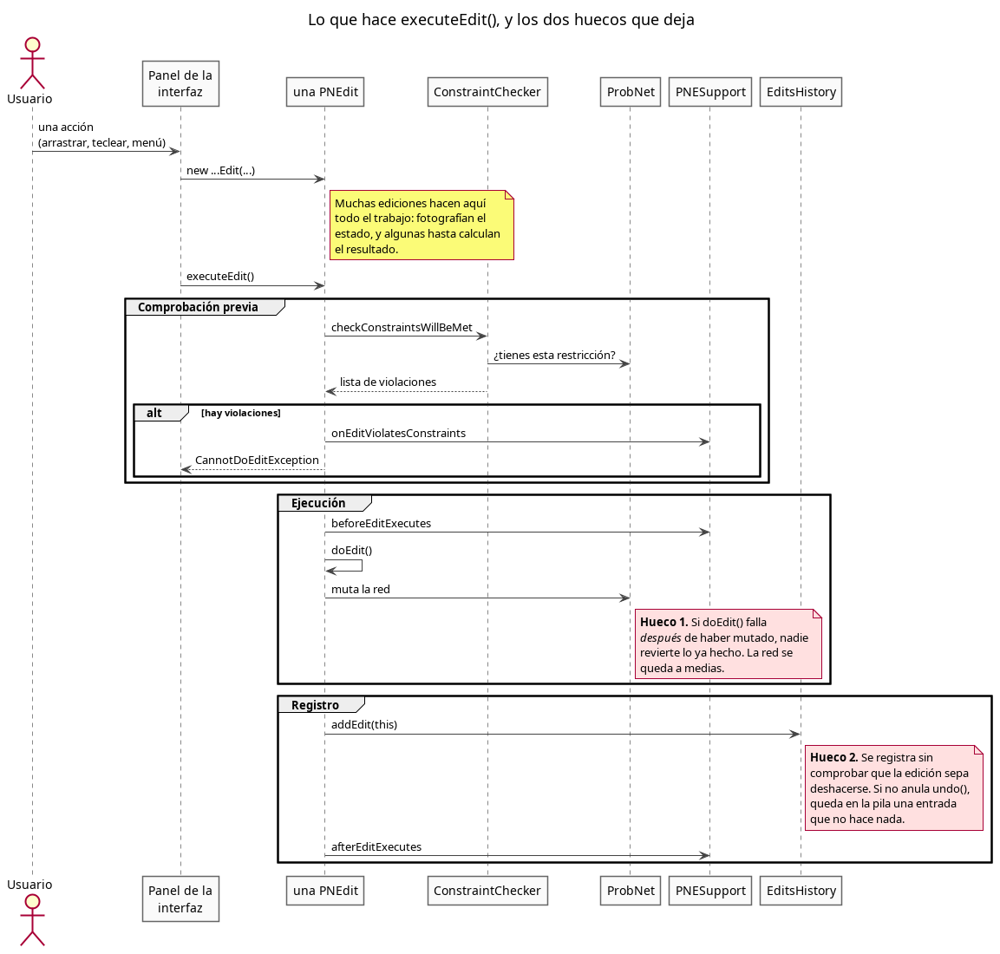
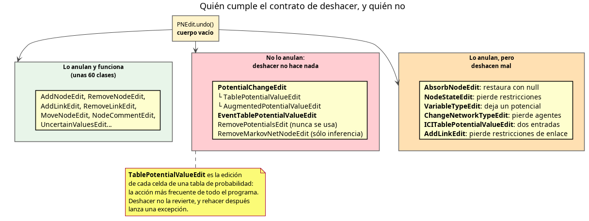
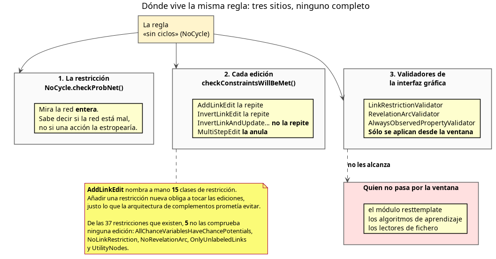
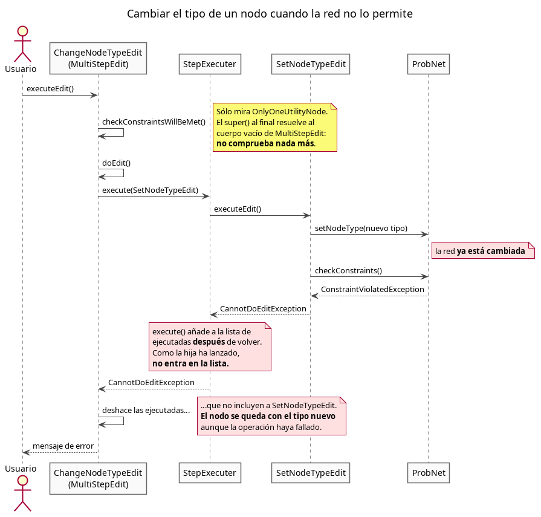
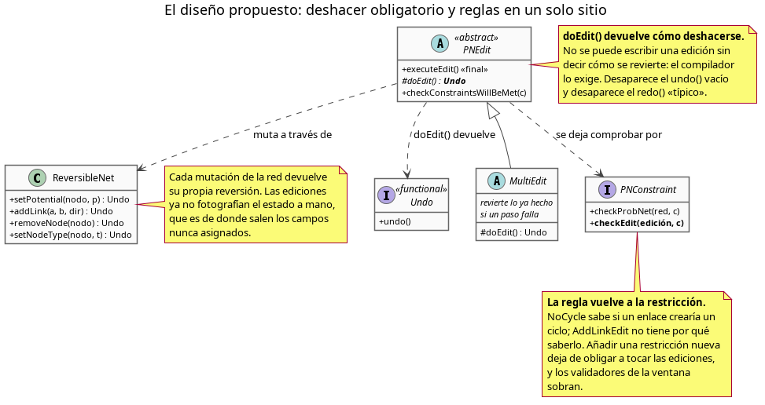

# Análisis de las ediciones (la jerarquía de `PNEdit`)

**Fecha:** 5 de agosto de 2026 · **Rama:** `development` · **Revisión de partida:** `7fba539`

---

## 1. Qué he mirado, y cómo

He revisado las **73 clases** cuyo nombre acaba en `Edit` —de las cuales 6 son el andamiaje
abstracto (`PNEdit`, `MultiEdit`, `CompoundPNEdit`, `ListPNEdit`, `MultiStepEdit`, `BaseLinkEdit`)
y **67 son ediciones concretas**— más las clases que forman su maquinaria (`PNESupport`,
`EditsHistory`, `EditsHistoryStacker`, `ConstraintChecker`, `PNEditListener`). Están repartidas
así:

| Paquete | Ficheros `*Edit.java` | Papel |
|---|---:|---|
| `core.action.base` | 5 | el andamiaje: ejecutar, deshacer, rehacer, agrupar |
| `core.action.base.linkEdits` | 7 | añadir, quitar, invertir y orientar enlaces |
| `core.action.core` | 40 | el grueso del modelo: nodos, potenciales, criterios, tipos |
| `gui.action` | 21 | acciones que sólo existen desde la ventana |

Para cada clase he leído el constructor, `doEdit()`, `undo()`, `redo()` y
`checkConstraintsWillBeMet()`, y para cada defecto he buscado **quién lo alcanza**: qué acción de
un usuario, o qué llamada de otro módulo, llega hasta ahí. Los defectos que no tienen a nadie que
los alcance los señalo como tales y no los propongo como trabajo.

> **Una limitación, dicha por delante.** Este proyecto exige JDK 25 (*Java Development Kit*, el
> juego de herramientas para compilar y ejecutar Java). En esta máquina sólo hay JDK 21, así que
> **no he podido compilar ni ejecutar nada**. Todo lo que sigue está leído del código, no
> reproducido. Los casos que marco como «alcanzable» los he seguido hasta la línea que los
> construye, pero conviene confirmarlos con una prueba antes de tocar nada.

---

## 2. Cómo funciona hoy

Una edición es un objeto que sabe hacer un cambio en la red y, en principio, deshacerlo.



El camino de una edición es siempre el mismo, y está en `PNEdit.executeEdit()`, que es `final`:



La idea es buena y está bien elegida: un único punto de entrada, comprobación previa, aviso a los
observadores, registro en el historial. El problema no es la idea; es que **la clase base no obliga
a nada**, y por debajo de ese esqueleto conviven varias reglas de juego contradictorias.

---

## 3. Los problemas de diseño

### D1 — `undo()` tiene el cuerpo vacío, así que olvidarse de deshacer no da ningún error

```java
public void undo() {
}
```

Ésta es la raíz de casi todo lo demás. Una edición nueva compila, se ejecuta, entra en el
historial y aparece en el menú «Deshacer» **sin que nadie haya escrito cómo se deshace**. El
usuario pulsa Ctrl+Z, el programa dice que ha deshecho, y no ha deshecho nada.



Cuatro clases no lo anulan en absoluto, y seis lo anulan mal. La lista está en el apartado 4.

Lo mismo vale, en menor grado, para `checkConstraintsWillBeMet()`: también tiene el cuerpo vacío,
así que una edición nueva no comprueba ninguna regla y nadie se entera.

### D2 — La misma regla está escrita en tres sitios, y ninguno la aplica entera



Una restricción de red (`PNConstraint`) sabe decir si una red **está** mal. Para saber si una
acción **la dejaría** mal, cada edición vuelve a escribir la regla por su cuenta. `AddLinkEdit`
nombra a mano **quince** clases de restricción en 120 líneas de `if`:

```java
if (probNet.getConstraintOfClass(NoCycle.class) instanceof NoCycle constraint) {
    if (probNet.existsPath(node2, node1, true, Collections.emptyList())) {
        constraintChecker.addException(new ConstraintViolatedException.ThereIsACycle(...));
    }
}
```

Esto choca de frente con lo que la arquitectura de complementos promete. El `CLAUDE.md` dice que
para añadir una restricción basta con anotar una clase y el cargador la descubre solo, sin tocar
ningún registro central. Es verdad para `checkProbNet`, y **es falso para las ediciones**: una
restricción nueva que deba impedir acciones obliga a repasar las 73 clases y añadirle un `if` a
las que le afecten. Nadie va a hacer eso, y de hecho no se ha hecho: **de las 37 restricciones que
existen, 5 no las comprueba ninguna edición** (`AllChanceVariablesHaveChancePotentials`,
`NoLinkRestriction`, `NoRevelationArc`, `OnlyUnlabeledLinks`, `UtilityNodes`).

Hay un tercer sitio, además. `NoLinkRestriction` sí se respeta, pero desde un validador de la
ventana:

```java
// gui/validator/LinkRestrictionValidator.java
if (!net.hasConstraintOfClass(NoLinkRestriction.class)) { … }
```

Eso deja fuera a todo el que no pase por la ventana: el módulo `resttemplate`, los algoritmos de
aprendizaje y los lectores de fichero.

### D3 — Conviven dos estrategias opuestas: «comprobar antes» y «probar y revertir»

`PNEdit.checkConstraintsWillBeMet` se documenta como *«un contrato que dice que ninguna restricción
se violará después de la edición»*. Pero `MultiStepEdit` lo anula a un cuerpo vacío:

```java
@Override public void checkConstraintsWillBeMet(ConstraintChecker constraintChecker) {
}
```

Así que sus tres descendientes —`PasteEdit`, `VariableTypeEdit` y `ChangeNodeTypeEdit`, es decir
pegar, cambiar el tipo de una variable y cambiar el tipo de un nodo— **no pueden comprobar nada por
adelantado**. Aplican los pasos y revierten si algo falla.

Se nota en que `PasteEdit` tuvo que inventarse un apaño: una edición anónima al final, que no hace
nada, sólo para poder comprobar la red **después** de haberla modificado.

```java
PNEdit verifier = new PNEdit(probNet) {
    @Override public void checkConstraintsWillBeMet(ConstraintChecker c) { probNet.checkConstraintsIn(c); }
    @Override protected void doEdit() { }
};
```

Y se nota en un detalle que engaña al lector: `VariableTypeEdit.checkConstraintsWillBeMet` termina
con `super.checkConstraintsWillBeMet(constraintChecker)`, que **parece** delegar en el recorrido de
sub-ediciones de `MultiEdit` pero resuelve al cuerpo vacío de `MultiStepEdit`. La línea no hace
nada. Lo mismo en `ChangeNodeTypeEdit`.

Las dos estrategias son defendibles. Tener las dos a la vez, sin decir cuál rige, no.

### D4 — `doEdit()` no es atómico, y nadie lo exige

Toda la maquinaria de reversión supone que `doEdit()` o bien hace todo su trabajo o bien no toca
nada. La prueba `CompoundEditIsRedoneOnFailTest` valida justo ese caso limpio. Pero varias
implementaciones reales mutan la red y **luego** lanzan:



`InvertLinkEdit` es el único que se ha dado cuenta: llama a su propio `undo()` antes de lanzar. Es
un parche correcto y solitario, y además rompe la simetría, porque una edición que ya se ha
deshecho a sí misma no debería poder deshacerse otra vez.

### D5 — No está decidido dónde se fotografía el estado anterior

Hay tres costumbres distintas conviviendo:

- **En el constructor.** `NodeStateEdit` fotografía en el constructor los potenciales del nodo y
  los de **todos sus vecinos**. `TablePotentialValueEdit` va más lejos: hace en el constructor todo
  el cálculo de redistribución de probabilidades, de modo que `doEdit()` sólo intercambia dos
  objetos.
- **En `doEdit()`.** `AddLinkEdit`, `RemoveLinkEdit`, `AbsorbNodeEdit`.
- **En ninguno.** `AbsorbNodeEdit` declara tres campos para deshacer y rehacer y no asigna ninguno
  (apartado 4, defecto G3).

La diferencia importa: una foto tomada en el constructor caduca si la edición se ejecuta más tarde,
después de otras ediciones. Y hacer el trabajo en el constructor significa que construir una
edición **ya modifica cosas**, lo cual es exactamente lo que `constraintsWillBeMet()` supone que no
pasa cuando la ventana lo llama para pintar la flecha de un enlace en verde o en rojo.

### D6 — El protocolo de rehacer es frágil y cada clase lo escribe distinto

Rehacer se apoya en un interruptor:

```java
public void redo() {
    if (typicalRedo) { doEdit(); } else { typicalRedo = true; }
}
```

Quien quiera rehacer de otra manera tiene que hacer tres cosas en el orden correcto:
`setTypicalRedo(false)`, luego `super.redo()`, luego su trabajo. He contado **seis variantes** en
el código: la correcta (`AddLinkEdit`), sin `setTypicalRedo` (`SetPotentialEdit`, que acaba
aplicando el cambio dos veces), sin `super.redo()` (`OtherPropertyEdit`, `ImposePolicyEdit`), sólo
`super.redo()` (`AddFindingEdit`), `super.redo()` más trabajo repetido (`RemoveFindingEdit`), y
anulación completa sin llamar a nada (`SetNodeTypeEdit`).

Un protocolo que hay que recordar en tres pasos es un protocolo que se va a escribir mal.

### D7 — Hay ediciones que ejecutan otras ediciones por fuera del mecanismo

`ICITablePotentialValueEdit.doEdit()` construye y ejecuta otra edición:

```java
ICIPotentialEdit iciPotentialEdit = …;
iciPotentialEdit.executeEdit();
```

Sin marcarla como parte de una edición compuesta. Resultado: **una sola acción del usuario deja dos
entradas en el historial**, y hacen falta dos Ctrl+Z para deshacerla. Para eso existen
`CompoundPNEdit` y `MultiStepEdit`.

En la misma línea, `COrientLinksEdit.equals()` llama a `getEdits()`, que en `CompoundPNEdit`
dispara la generación perezosa y marca las sub-ediciones. Comparar dos ediciones **cambia su
estado**.

---

## 4. Defectos concretos

### 4.1 Graves: llegan al usuario y pierden o corrompen datos

#### G1 · Editar una celda de una tabla de probabilidad no se puede deshacer, y rehacer revienta

[`core/action/core/PotentialChangeEdit.java`](../../../core/src/main/java/org/openmarkov/core/action/core/PotentialChangeEdit.java) · [`gui/action/TablePotentialValueEdit.java`](../../../gui/src/main/java/org/openmarkov/gui/action/TablePotentialValueEdit.java)

`PotentialChangeEdit` no anula `undo()`. Sus dos descendientes tampoco.

- **Deshacer no hace nada.** La entrada pasa a la pila de deshechas y el potencial nuevo sigue
  puesto.
- **Rehacer lanza una excepción.** `redo()` vuelve a llamar a `doEdit()`, que empieza por
  `node.removePotential(oldPotential)`. Ese potencial ya no está en el nodo, `removePotential`
  devuelve `false`, se lanza `CannotRemovePotential` y `PNEdit.redo()` lo envuelve en
  `UnreachableException`.

**Cómo se llega:** [`gui/component/ValuesTable.java:193`](../../../gui/src/main/java/org/openmarkov/gui/component/ValuesTable.java#L193), al teclear un valor en una celda de la
tabla de probabilidad condicionada. Es la acción más frecuente del programa. También desde ocho
paneles de potenciales (`BinomialPotentialPanel`, `WeibullPotentialPanel`,
`ConditionalGaussianPotentialPanel`, `DeltaPotentialPanel`, `GLMPotentialPanel`,
`IndicatorPotentialPanel`, `PiecewiseExponentialPanel`, `FunctionPotentialPanel`).

**Propuesta.** Escribir `undo()` en `PotentialChangeEdit`: quitar `newPotential` y volver a poner
`oldPotential`. Es corto, y arregla las once vías de una vez.

#### G2 · Deshacer una absorción de nodo borra los potenciales del hijo

[`core/action/core/AbsorbNodeEdit.java`](../../../core/src/main/java/org/openmarkov/core/action/core/AbsorbNodeEdit.java)

Tres campos se leen y **nunca se asignan**:

| Campo | Se lee en | Vale siempre |
|---|---|---|
| `oldUtilityPotentials` | `undo()`, línea 180 | `null` |
| `newPotentials` | `redo()`, línea 228 | `null` |
| `newParentLinks` | `undo()` 182, `redo()` 223 | lista vacía |

`Node.setPotentials(null)` limpia la lista. Así que `undo()` deja al hijo de utilidad **sin ningún
potencial**, y `redo()` hace lo mismo. Los dos bucles sobre `newParentLinks` no se ejecutan nunca.

Hay un cuarto problema en el mismo sitio: `mergeUtilityChildren()` llama a
`componentPotential.replaceVariable(...)` sobre el potencial del propio hijo, destruyendo el dato
que `undo()` necesitaría.

**Cómo se llega:** [`gui/window/edition/networkEditorPanel/NetworkEditorPanel.java:1035`](../../../gui/src/main/java/org/openmarkov/gui/window/edition/networkEditorPanel/NetworkEditorPanel.java#L1035), opción
«absorber nodo» del menú contextual.

**Propuesta.** Asignar los tres campos en `doEdit()`, y trabajar sobre una copia del potencial en
`mergeUtilityChildren()`. Si el trabajo resulta mayor de lo que parece, la alternativa honrada es
desactivar la opción del menú hasta arreglarla, no dejarla borrando datos en silencio.

#### G3 · Cambiar el tipo de una variable deja un potencial que no se deshace

[`core/action/core/VariableTypeEdit.java:130`](../../../core/src/main/java/org/openmarkov/core/action/core/VariableTypeEdit.java#L130)

Dentro de `doMultiStepEdit()`, en medio de una secuencia de pasos que sí van por el ejecutor, hay
una mutación suelta:

```java
node.setPotentials(new ArrayList<>(List.of(uniformPotential)));   // línea 130 — sin stepExecuter
if (this.updatePotential) {
    VariableTypeEdit.setUniformPotentialToNode(node, stepExecuter);   // línea 132 — con stepExecuter
}
```

Dos consecuencias. Primera: ese cambio no está en la lista de pasos ejecutados, así que **no se
deshace**. Segunda, peor: el paso de la línea 132 fotografía el estado *después* de la línea 130,
de modo que su `undo()` restaura el potencial uniforme recién puesto, no el original.

**Propuesta.** Envolver la línea 130 en un `RawSetPotentialEdit` y pasarla por `stepExecuter`.

#### G4 · Deshacer un cambio de estados pierde las restricciones de enlace

[`core/action/core/NodeStateEdit.java:243`](../../../core/src/main/java/org/openmarkov/core/action/core/NodeStateEdit.java#L243)

El método `resetLink(Node)` es privado y **nadie lo llama**. Es el único sitio donde se llenan
`linkRestrictionMap` y `revelationConditionMap`. Así que en `undo()` los dos bucles que restauran
restricciones de enlace y condiciones de revelación recorren mapas siempre vacíos.

`modifyState` puede invalidar esas restricciones, porque su tamaño depende del número de estados.
Deshacer devuelve los estados pero no las restricciones.

**Cómo se llega:** cualquier alta, baja o reordenación de estados en el diálogo de propiedades de
un nodo que tenga restricciones de enlace.

**Propuesta.** Decidir qué se quería: o se llama a `resetLink(node)` desde `doEdit()` antes de
modificar, o se borra el método y los dos mapas. Dejarlo como está es lo peor de las dos opciones,
porque el `undo()` aparenta restaurarlas.

#### G5 · Un cambio de tipo de nodo que falla deja el nodo con el tipo nuevo

[`gui/action/ChangeNodeTypeEdit.java:77`](../../../gui/src/main/java/org/openmarkov/gui/action/ChangeNodeTypeEdit.java#L77)

Está dibujado en el diagrama del apartado D4. `SetNodeTypeEdit.doEdit()` cambia el tipo, comprueba
la red entera, y lanza si no cuadra — sin revertir el cambio. Y como `StepExecuter.execute()`
apunta la edición en la lista **después** de que `executeEdit()` vuelva, la edición que ha fallado
no entra en la lista y la reversión del padre no la alcanza.

**Propuesta.** Que `doEdit()` restaure el tipo anterior antes de lanzar. Y, en la maquinaria,
que `StepExecuter.execute()` apunte la edición **antes** de ejecutarla, para que la reversión del
padre la incluya siempre.

#### G6 · Deshacer un cambio de tipo de red borra los agentes

[`core/action/core/ChangeNetworkTypeEdit.java`](../../../core/src/main/java/org/openmarkov/core/action/core/ChangeNetworkTypeEdit.java)

```java
@Override public void undo() {
    probNet.setNetworkType(currentNetworkType);
    if (!probNet.isMultiagent()) {
        probNet.setAgents(null);        // los agentes originales se pierden
    }
}
```

Si la red ya tenía agentes antes de la edición y el tipo al que se vuelve no es multiagente, se
pierden. Además `doEdit()` sobrescribe los agentes existentes con dos inventados («Agent 1»,
«Agent 2») sin guardar los anteriores.

**Propuesta.** Guardar la lista de agentes en `doEdit()` y restaurarla en `undo()`.

#### G7 · Borrar una selección opera dos veces sobre los mismos enlaces

[`gui/action/RemoveSelectedEdit.java`](../../../gui/src/main/java/org/openmarkov/gui/action/RemoveSelectedEdit.java)

`generateEdits()` añade un `RemoveLinkEdit` por cada enlace de la selección —incluidos los enlaces
*de los nodos seleccionados*— y además un `CRemoveNodeEdit` por cada nodo, que a su vez genera sus
propios `RemoveLinkEdit` para todos sus padres e hijos.

Los dos conjuntos se solapan. El segundo borrado no encuentra el enlace, pero **sí vuelve a
reescribir los potenciales del nodo destino**, quitándole otra vez la variable. Deshacer restaura
en el orden inverso una secuencia que ya estaba mal.

**Propuesta.** Quedarse sólo con los enlaces cuyos dos extremos sobreviven, y dejar el resto a
`CRemoveNodeEdit`.

#### G8 · Invertir un enlace actualizando potenciales no comprueba ninguna restricción

[`core/action/base/linkEdits/InvertLinkAndUpdatePotentialsEdit.java`](../../../core/src/main/java/org/openmarkov/core/action/base/linkEdits/InvertLinkAndUpdatePotentialsEdit.java)

Esta clase no anula `checkConstraintsWillBeMet()` y tampoco llama a `probNet.checkProbNet()` como
sí hace su hermana `InvertLinkEdit`. Puede crear un ciclo en una red bayesiana, que por definición
es acíclica.

**Cómo se llega:** [`gui/window/MainPanelListenerAssistant.java:223`](../../../gui/src/main/java/org/openmarkov/gui/window/MainPanelListenerAssistant.java#L223), opción «invertir enlace y
actualizar potenciales».

**Propuesta.** A corto plazo, copiar la comprobación de `NoCycle` de `InvertLinkEdit`. A largo
plazo es el apartado 5: la regla debe estar en `NoCycle`, no copiada en dos ediciones.

### 4.2 Medios: fallan en casos concretos, o hacen trabajo de más

| # | Dónde | Qué pasa |
|---|---|---|
| M1 | [`AddNodeEdit:90`](../../../core/src/main/java/org/openmarkov/core/action/core/AddNodeEdit.java#L90) | Para `NoEventNodes` se construye la excepción con `this.newNode`, que en el momento de comprobar vale `null` (se asigna en `doEdit()`). El mensaje de error saldrá vacío o lanzará. |
| M2 | [`AddNodeEdit:177`](../../../core/src/main/java/org/openmarkov/core/action/core/AddNodeEdit.java#L177) | `doEdit()` usa `addNodeConsistently()` y `redo()` usa `addNode()`. Rehacer no reconstruye lo que «consistently» añade. |
| M3 | `AddLinkEdit.undo()` | No restaura el potencial de restricción ni los estados reveladores del enlace. `RemoveLinkEdit.undo()` sí lo hace. Deshacer un enlace añadido sobre uno que ya tenía restricciones las pierde. |
| M4 | `OrientLinkEdit.getUndoEdit()` | Devuelve `this`. El inverso de orientar no es orientar. `learning.metric/Metric.afterUndoingEdit` lo usa para actualizar su caché, y la actualiza en el sentido equivocado. El algoritmo PC construye `OrientLinkEdit` en tres sitios. |
| M5 | `DecisionCriteriaEdit` | `UP` en el primer criterio y `DOWN` en el último acceden a `criterionIndex ± 1` sin guarda: `IndexOutOfBoundsException`. |
| M6 | [`PasteEdit:60`](../../../gui/src/main/java/org/openmarkov/gui/action/PasteEdit.java#L60) | `nodes.stream().mapToDouble(…).max().getAsDouble()` sobre una lista vacía lanza `NoSuchElementException`. Pegar una selección de sólo enlaces. |
| M7 | `ICITablePotentialValueEdit` | Deja dos entradas en el historial por una acción (D7). Además su `undo()` sólo llama a `super.undo()`, que está vacío: aparenta deshacer y no deshace. |
| M8 | `RemoveFindingEdit.redo()` | Llama a `super.redo()` (que ya ejecuta `doEdit()`) y luego repite el trabajo. |
| M9 | `SetPotentialEdit.redo()` | Llama a `super.redo()` sin `setTypicalRedo(false)`: aplica el cambio dos veces. |
| M10 | `SetPotentialEdit(Node)` | `node.getPotentials().getFirst()` sin guarda, mientras el constructor de dos argumentos sí comprueba la lista vacía. |
| M11 | [`VariableTypeEdit:127`](../../../core/src/main/java/org/openmarkov/core/action/core/VariableTypeEdit.java#L127) | `node.getPotentials().getFirst()` sin guarda. |
| M12 | `MultiAddLinkEdit` | Descarta en silencio los pares que ya tienen enlace o que violarían `NoSelfLoop`. El usuario selecciona diez nodos, pide enlazarlos y no se entera de cuáles se han quedado fuera. Es la regla que el `CLAUDE.md` llama «un arreglo que esconde el problema no es un arreglo». |
| M13 | `PNESupport` | El javadoc dice *«uses a concurrent set»* y el campo es `Collections.synchronizedSet(new LinkedHashSet<>())`. Recorrer un conjunto sincronizado sin tomar su cerrojo no es seguro, y `executeEdit()` lo recorre. `setListeners` promete ser atómico y son dos operaciones. Sobra el `import java.util.concurrent.ConcurrentHashMap`. |
| M14 | [`VisualNetwork:1020`](../../../gui/src/main/java/org/openmarkov/gui/graphic/VisualNetwork.java#L1020) | Se llama a `constraintsWillBeMet()` en cada movimiento del ratón mientras se dibuja un enlace, para colorear la flecha. Eso recorre `existsPath` entero. Con las redes CPCS que se acaban de añadir a las pruebas (422 nodos) se va a notar. |
| M15 | `ConstraintChecker` | Guarda las violaciones en un `HashSet<ConstraintViolatedException>`. Las excepciones no definen `equals` ni `hashCode`, así que la deduplicación que el conjunto sugiere no ocurre nunca. Un `ArrayList` diría la verdad. |

### 4.3 Menores y limpieza

- [`gui/action/RemoveSelectedEdit.java:43`](../../../gui/src/main/java/org/openmarkov/gui/action/RemoveSelectedEdit.java#L43) — un `System.out.println()` de depuración.
- [`core/action/core/CRemoveNodeEdit.java`](../../../core/src/main/java/org/openmarkov/core/action/core/CRemoveNodeEdit.java) — tres campos declarados y nunca usados: `siblings`,
  `marginalizedPotentials`, `allPotentials`.
- [`core/action/core/RemovePotentialsEdit.java`](../../../core/src/main/java/org/openmarkov/core/action/core/RemovePotentialsEdit.java) — **no la construye nadie**. Clase muerta.
- [`core/action/core/AbsorbNodeEdit.java:78`](../../../core/src/main/java/org/openmarkov/core/action/core/AbsorbNodeEdit.java#L78) — `LogManager.getLogger(...)` cuyo resultado se
  descarta; y `new Variable(mergedName.toString())` sobre algo que ya es un `String`.
- [`core/action/core/SetPotentialVariablesEdit.java`](../../../core/src/main/java/org/openmarkov/core/action/core/SetPotentialVariablesEdit.java) — el comentario `// fallback: broken but
  doesn't crash`. Un comentario que admite que la rama está mal, en el código y no en un informe.
- [`core/action/base/EditsHistory.java:105`](../../../core/src/main/java/org/openmarkov/core/action/base/EditsHistory.java#L105) — comentario copiado: dice *«adds it to the undone
  list»* cuando añade a la lista de hechas.
- `PNEdit.setProbNet()` es público y nadie lo llama. Permite cambiar la red de una edición ya
  registrada en el historial.
- Nueve clases anulan `toString()` y se saltan la localización que `PNEdit.toString()` monta con
  `localize()`. El menú «Deshacer» mezcla textos del fichero de idioma con textos escritos a mano
  en el código (`"Add link"`, `"Remove link"`, `"Invert link"`).
- [`core/action/base/MultiEdit.java`](../../../core/src/main/java/org/openmarkov/core/action/base/MultiEdit.java) — el `import java.util.Iterator` no se usa, y `ListPNEdit`
  importa `ArrayList`, `Collection` y `Collections` de los que sólo usa uno.
- `RemoveMarkovNetNodeEdit` no anula `undo()`. **No es un defecto**: sólo lo usa
  [`HuginForest:302`](../../../inference/src/main/java/org/openmarkov/inference/algorithm/huginPropagation/HuginForest.java#L302) sobre una red de Markov auxiliar de la inferencia, donde no hay historial. Lo
  anoto para que no se «arregle» por confusión.

---

## 5. Propuesta de rediseño

Los quince defectos del apartado 4.2 se pueden ir arreglando uno a uno, y los ocho graves hay que
arreglarlos. Pero si sólo se hace eso, dentro de un año habrá otros quince, porque el diseño no
impide ninguno de ellos.



### P1 — Que `doEdit()` devuelva cómo deshacerse

```java
@FunctionalInterface
public interface Undo { void undo(); }

protected abstract Undo doEdit() throws DoEditException;
```

`PNEdit` guarda lo que `doEdit()` devuelve y `undo()` pasa a ser `final`, llamándolo. Ya no hay
`undo()` vacío que heredar, ni interruptor `typicalRedo`: rehacer es volver a llamar a `doEdit()` y
guardar la nueva reversión.

Lo que esto compra:

- **G1 desaparece de raíz.** No se puede escribir una edición sin decir cómo se revierte: no
  compila.
- **D6 desaparece.** Un solo camino para rehacer, sin protocolo de tres pasos.
- **G2 desaparece.** Los campos «para deshacer» dejan de existir, y con ellos los campos nunca
  asignados.
- **D5 se decide sola.** La foto del estado se toma dentro de `doEdit()`, porque es ahí donde se
  construye la reversión.

El coste es real: hay que tocar las 73 clases. Pero es un cambio mecánico —convertir el cuerpo de
`undo()` en la lambda que `doEdit()` devuelve— y el compilador señala una por una las que faltan.

### P2 — Que la red devuelva la reversión de cada mutación

```java
Undo u1 = net.setPotential(nodo, nuevo);
Undo u2 = net.addLink(a, b, true);
```

Con esto la mayoría de las ediciones pasan a ser una línea de trabajo y un `Undo` compuesto, y
desaparecen los `getPotentials()` guardados a mano que hoy se olvidan o se toman en el momento
equivocado (G3).

### P3 — Devolver la regla a la restricción

```java
public abstract class PNConstraint {
    public abstract void checkProbNet(GraphNetwork probNet, ConstraintChecker c);
    public void checkEdit(PNEdit edit, ConstraintChecker c) { }   // nuevo
}
```

`PNEdit.tryConstraintsWillBeMet()` recorre las restricciones **de la red** y le pasa la edición a
cada una. `NoCycle` sabe si un `AddLinkEdit` crearía un ciclo mucho mejor que `AddLinkEdit`.

Lo que esto compra:

- **D2 desaparece.** Añadir una restricción vuelve a ser lo que la arquitectura promete: anotar una
  clase. Sin tocar ninguna edición.
- **Las 5 restricciones huérfanas** se cubren escribiéndolas una vez, en su sitio.
- **G8 desaparece**, y con él toda una familia de «esta edición se olvidó de comprobar X».
- **Los tres validadores de la ventana sobran**, y con ellos el agujero de que `resttemplate` y el
  aprendizaje no los apliquen.

`AddLinkEdit` adelgaza de 324 líneas a unas 120.

### P4 — Una sola estrategia para las ediciones de varios pasos

Con P3, `MultiStepEdit` ya no necesita anular la comprobación: las restricciones saben mirar la
edición compuesta entera. Se puede quitar la anulación a cuerpo vacío (D3) y borrar la edición
«verificadora» de `PasteEdit`.

Y en la maquinaria, dos correcciones pequeñas que cierran D4:

- `StepExecuter.execute()` apunta la edición **antes** de ejecutarla, para que la reversión la
  alcance aunque falle a mitad (G5).
- `PNEdit.executeEdit()` revierte lo aplicado si `doEdit()` lanza, en lugar de dejarlo a cada
  implementación.

### P5 — Prohibir que una edición ejecute otra por fuera

`executeEdit()` puede negarse a ejecutar si se le llama desde dentro de otro `doEdit()` que no sea
un `MultiEdit`. Cierra D7 y el historial deja de partirse en dos entradas (M7).

---

## 6. Orden de trabajo que propongo

El orden es mío; qué se hace y quién lo hace es decisión del equipo.

**Primero, lo que pierde datos hoy.** G1, G2, G3, G4 y G6. Son cinco arreglos locales, ninguno
grande, y los cinco borran o pierden información del usuario ahora mismo. G1 es el más urgente
porque está en la acción más frecuente del programa.

**Segundo, lo que deja la red inconsistente.** G5, G7 y G8. También locales.

**Tercero, la decisión de diseño.** P1 y P3 son el cambio de fondo, y son independientes entre sí:
se pueden hacer en cualquier orden, o sólo uno. Mi recomendación es empezar por **P3**, porque
elimina más líneas de las que añade, no obliga a tocar las 73 clases y arregla el agujero de que
`resttemplate` y el aprendizaje no comprueben las mismas reglas que la ventana.

**Cuarto, P1 y P2**, que es el trabajo grande, y sólo si el equipo quiere que estos defectos dejen
de poder escribirse.

**En cualquier momento, y aparte:** los quince puntos de 4.2 y la limpieza de 4.3.

Un aviso, por lo que dice el `CLAUDE.md` sobre no esconder los costes: si se hace P1 hay que tocar
las 67 ediciones, y no hay pruebas que cubran el deshacer de la mayoría de ellas. **Sólo 19 de las
67 aparecen mencionadas en alguna prueba**, y aparecer no es lo mismo que tener comprobado su
`undo()`. Antes de mover la jerarquía haría falta una prueba genérica —una sola, parametrizada
sobre todas las ediciones— que compruebe que ejecutar y deshacer devuelve la red al estado de
partida. Esa prueba, por sí sola, encuentra G1, G2, G3, G4 y G6 sin necesidad de leerse el código,
y es además la red de seguridad que hace viable P1.

---

## 7. Anexo — las 73 clases

Leyenda: **D** anula `undo()` · **R** anula `redo()` · **C** anula `checkConstraintsWillBeMet()`

### `core.action.base` y `linkEdits`

| Clase | D | R | C | Nota |
|---|:-:|:-:|:-:|---|
| `PNEdit` | — | — | — | raíz; `undo()` con cuerpo vacío (D1) |
| `MultiEdit` | ✓ | ✓ | ✓ | recorre las sub-ediciones |
| `CompoundPNEdit` | — | — | — | genera las sub-ediciones de forma perezosa |
| `ListPNEdit` | — | — | — | envuelve una lista ya ejecutada |
| `MultiStepEdit` | — | — | ✓ | **anula la comprobación a vacío** (D3) |
| `BaseLinkEdit` | — | — | — | `getUndoEdit()` abstracto |
| `AddLinkEdit` | ✓ | ✓ | ✓ | 15 restricciones a mano (D2); M3 |
| `RemoveLinkEdit` | ✓ | ✓ | ✓ | |
| `InvertLinkEdit` | ✓ | — | ✓ | se deshace a sí mismo al fallar (D4) |
| `InvertLinkAndUpdatePotentialsEdit` | ✓ | ✓ | — | **G8** |
| `OrientLinkEdit` | ✓ | — | ✓ | **M4** |
| `MultiAddLinkEdit` | — | — | — | **M12** |

### `core.action.core`

| Clase | D | R | C | Nota |
|---|:-:|:-:|:-:|---|
| `AbsorbNodeEdit` | ✓ | ✓ | — | **G2** |
| `AbsorbParentsEdit` | — | — | — | compuesta |
| `AddNodeEdit` | ✓ | ✓ | ✓ | **M1**, **M2** |
| `AddPotentialEdit` | ✓ | — | — | |
| `ChangeNetworkTypeEdit` | ✓ | — | — | **G6** |
| `COrientLinksEdit` | — | — | — | `equals()` con efecto lateral (D7) |
| `CRemoveNodeEdit` | — | — | — | tres campos muertos (4.3) |
| `CycleLengthEdit` | ✓ | ✓ | — | |
| `DecisionCriteriaEdit` | ✓ | — | ✓ | **M5** |
| `DecisionCriterionUnitEdit` | ✓ | — | — | |
| `EventNodeAlwaysAppendEdit` | ✓ | — | — | |
| `ICIPotentialEdit` | ✓ | — | — | |
| `MonteCarloOptionsEdit` | ✓ | ✓ | — | |
| `MulticriteriaEdit` | ✓ | ✓ | — | |
| `NetworkCommentEdit` | ✓ | — | — | |
| `NetworkDefaultStatesEdit` | ✓ | — | — | |
| `NodeAlwaysObservedEdit` | ✓ | — | ✓ | |
| `NodeBaseNameEdit` | ✓ | — | ✓ | |
| `NodeCommentEdit` | ✓ | — | — | |
| `NodeReplaceStatesEdit` | ✓ | — | — | |
| `NodeStateEdit` | ✓ | — | ✓ | **G4**; `// TODO redo()` |
| `PotentialChangeEdit` | ✗ | — | — | **G1** |
| `PrecisionEdit` | ✓ | — | — | |
| `PurposeEdit` | ✓ | — | ✓ | |
| `RelevanceEdit` | ✓ | — | — | |
| `RemoveConstraintEdit` | ✓ | — | — | |
| `RemoveMarkovNetNodeEdit` | ✗ | — | — | sólo inferencia; sin historial |
| `RemoveNodeEdit` | ✓ | — | ✓ | |
| `RemovePolicyEdit` | ✓ | — | — | |
| `RemovePotentialsEdit` | ✗ | — | — | **clase muerta** |
| `RevelationStateEdit` | ✓ | — | — | |
| `SetPotentialEdit` | ✓ | ✓ | — | **M9**, **M10** |
| `SetPotentialVariablesEdit` | ✓ | — | — | comentario «broken» (4.3) |
| `TemporalOptionsEdit` | ✓ | ✓ | — | |
| `TimeSliceEdit` | ✓ | — | ✓ | |
| `UncertainValuesEdit` | ✓ | — | — | |
| `UncertainValuesRemoveEdit` | ✓ | — | — | |
| `UnitEdit` | ✓ | — | — | |
| `VariableTypeConstraintEdit` | ✓ | — | ✓ | |
| `VariableTypeEdit` | ✓ | — | ✓ | **G3**; cinco clases internas |

### `gui.action`

| Clase | D | R | C | Nota |
|---|:-:|:-:|:-:|---|
| `AddFindingEdit` | ✓ | ✓ | — | |
| `AugmentedPotentialValueEdit` | ✗ | — | — | hereda **G1** |
| `AutoArrangeEdit` | ✓ | — | — | |
| `ChangeNodeTypeEdit` | ✓ | ✓ | ✓ | **G5** |
| `EventTablePotentialValueEdit` | ✗ | — | — | muta el array vivo del potencial |
| `ICITablePotentialValueEdit` | ✓ | — | — | **M7**, D7 |
| `ImposePolicyEdit` | ✓ | ✓ | — | |
| `LinkRestrictionPotentialValueEdit` | ✓ | ✓ | — | `NoLinkRestriction` sin comprobar (D2) |
| `MoveNodeEdit` | ✓ | — | — | |
| `NetworkAgentEdit` | ✓ | — | — | |
| `NodeAgentEdit` | ✓ | — | — | |
| `NodeDecisionCriteriaEdit` | ✓ | — | — | |
| `NodePartitionedIntervalEdit` | ✓ | — | — | |
| `OtherPropertyEdit` | ✓ | ✓ | — | |
| `PartitionedIntervalEdit` | ✓ | — | — | |
| `PasteEdit` | — | — | ✓ | **M6**; edición «verificadora» (D3) |
| `RemoveFindingEdit` | ✓ | ✓ | — | **M8** |
| `RemoveLinkRestrictionEdit` | ✓ | ✓ | — | |
| `RemoveSelectedEdit` | — | — | — | **G7**; `println` (4.3) |
| `RevelationIntervalEdit` | ✓ | — | — | |
| `TablePotentialValueEdit` | ✗ | — | — | **G1**; todo el trabajo en el constructor (D5) |
