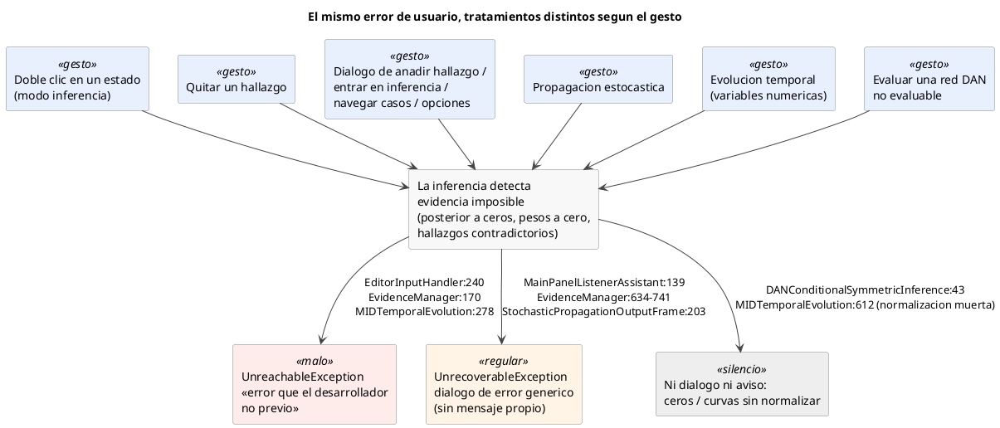

# Análisis: la evidencia imposible y los «imposibles declarados»

**Fecha:** 7 de agosto de 2026.
**Origen:** la revisión de la evidencia imposible hecha sobre el [plan de cambios](../plan-de-cambios/plan-de-cambios.md) destapó que hay puntos del código que capturan las excepciones de evidencia y las declaran «inalcanzables» o «irrecuperables». Este informe es el barrido acotado de esa familia: todos los `catch` de producción que capturan `IncompatibleEvidenceException` o `CannotNormalizePotentialException`.

**Alcance:** 56 sitios de captura en 30 ficheros (recuento por búsqueda multilínea: un `catch` cuenta si el nombre de la excepción aparece en la cláusula, aunque esté en la línea siguiente). Se han auditado los 56. Para cada uno se ha establecido: qué acción de usuario llega hasta él, si la excepción puede saltar de verdad, y qué ve el usuario cuando salta.

**Resultado en una frase:** la evidencia imposible —una situación normal de uso— no tiene un tratamiento en OpenMarkov: tiene nueve distintos, y en los dos gestos más comunes se presenta al usuario como un error interno del programa.

---

## 1. Cómo detecta OpenMarkov la evidencia imposible

Hay dos formas de evidencia imposible, con detectores distintos:

**Contradicción en la misma variable.** `EvidenceCase.addFinding` lanza `EvidenceIsIncompatibleWithOther` cuando el caso ya contiene un hallazgo para la misma variable con otro estado ([`EvidenceCase.java:107-115`](../../../core/src/main/java/org/openmarkov/core/model/network/EvidenceCase.java#L107-L115), [`isCompatible`, `:356-371`](../../../core/src/main/java/org/openmarkov/core/model/network/EvidenceCase.java#L356-L371)). Importante: «la misma variable» significa el mismo **objeto** `Variable` — la clase no redefine `equals` ni `hashCode`, así que dos variables con el mismo nombre son claves distintas. Muchos de los veredictos de este informe descansan en ese detalle (véase la [nota transversal](#identidad)).

**Imposibilidad de conjunto.** Cuando la evidencia completa tiene probabilidad cero en la red, la posterior de la eliminación de variables sale toda a ceros y `normalize` lanza `CannotNormalizePotentialException` ([`TablePotentialTransform.java:45-47`](../../../core/src/main/java/org/openmarkov/core/model/network/potential/operation/TablePotentialTransform.java#L45-L47), llamada desde [`VEPropagation.java:212`](../../../inference/src/main/java/org/openmarkov/inference/algorithm/variableElimination/tasks/VEPropagation.java#L212)). En la propagación estocástica el detector equivalente es `SamplesWeightIsZero`: todos los pesos de las muestras a cero ([`StochasticPropagation.java:179-181`](../../../inference/src/main/java/org/openmarkov/inference/algorithm/likelihoodWeighting/StochasticPropagation.java#L179-L181)).

El propio sistema de tipos dice lo que son: `IncompatibleEvidenceException` hereda de `UserInputException` ([`IncompatibleEvidenceException.java:17`](../../../core/src/main/java/org/openmarkov/core/exception/IncompatibleEvidenceException.java#L17)) — entrada del usuario, no fallo del programa. Y el propio código duda de lo que hace con ellas, por escrito: el TODO de la clase de excepción («se captura y se ignora en casi todos los catch, probablemente causando fallos inesperados», [`:23-25`](../../../core/src/main/java/org/openmarkov/core/exception/IncompatibleEvidenceException.java#L23-L25)), el TODO de `CannotNormalizePotentialException` («¿de verdad pasa esto en la interfaz?», [`:16`](../../../core/src/main/java/org/openmarkov/core/exception/CannotNormalizePotentialException.java#L16)), el «TODO: Maybe this can actually happen» de la evolución temporal ([`MIDTemporalEvolution.java:280`](../../../inference/src/main/java/org/openmarkov/inference/algorithm/temporalevaluation/tasks/MIDTemporalEvolution.java#L280)) y la anotación `@ToCheck` de la inferencia de las redes de análisis de decisiones («¿este try-catch está pensado para funcionar así?», [`DANConditionalSymmetricInference.java:36-38`](../../../inference/src/main/java/org/openmarkov/inference/algorithm/decompositionIntoSymmetricDANs/core/DANConditionalSymmetricInference.java#L36-L38)).

## 2. Qué hace la aplicación cuando saltan

Todo termina en el manejador global de excepciones no capturadas, instalado en [`OpenMarkov.java:123`](../../../full/src/main/java/org/openmarkov/full/OpenMarkov.java#L123). [`OMExceptionHandler`](../../../gui/src/main/java/org/openmarkov/gui/dialog/OMExceptionHandler.java#L17-L58) clasifica: lo envuelto en `UnreachableException` va al diálogo de «ocurrió algo que un desarrollador de OpenMarkov no previó» (`UnexpectedThrowableDialog`); lo envuelto en `UnrecoverableException` va a un diálogo de error normal (`ExceptionDialog`). La aplicación sigue viva en ambos casos; la diferencia es el mensaje.

Tres embudos genéricos convierten las excepciones marcadas en `UnrecoverableException` por el camino: los clics de menú ([`JMenuItemBuilder.java:178-189`](../../../gui/src/main/java/org/openmarkov/gui/componentBuilder/JMenuItemBuilder.java#L178-L189)), las acciones de la ventana ([`GUIUtils.executeUIAction`, `:113-121`](../../../gui/src/main/java/org/openmarkov/gui/util/GUIUtils.java#L113-L121)) y el botón OK de los diálogos ([`OkCancelDialog.java:72`](../../../gui/src/main/java/org/openmarkov/gui/dialog/common/OkCancelDialog.java#L72)).

La consecuencia práctica: **el mismo error de usuario produce diálogos distintos según el gesto**, y `CannotNormalizePotentialException` ni siquiera lleva mensaje (su constructor solo guarda el potencial), así que el diálogo «bueno» tampoco explica nada.

---

## 3. Hallazgos alcanzables

### E1 · La evidencia imposible en la propagación: nueve tratamientos, dos de ellos «error del programa»

**Severidad: alta. Alcanzable con el gesto más común de la inferencia.**

Introducir evidencia imposible y propagar (la propagación automática está activa por omisión) hace saltar `CannotNormalizePotentialException`. Lo que pasa después depende de por dónde entró el usuario:

| Gesto | Sitio | Envoltorio | Diálogo |
|---|---|---|---|
| Doble clic en un estado (modo inferencia) — **el gesto principal** | [`EditorInputHandler.java:240-245`](../../../gui/src/main/java/org/openmarkov/gui/window/edition/networkEditorPanel/EditorInputHandler.java#L240-L245) | `UnreachableException` | **«no previsto»** |
| Quitar un hallazgo dejando evidencia imposible | [`EvidenceManager.java:170-173`](../../../gui/src/main/java/org/openmarkov/gui/window/edition/networkEditorPanel/EvidenceManager.java#L170-L173) | `UnreachableException` | **«no previsto»** |
| Añadir hallazgo por el diálogo del menú contextual | [`EvidenceManager.java:503-514`](../../../gui/src/main/java/org/openmarkov/gui/window/edition/networkEditorPanel/EvidenceManager.java#L503-L514) y [`OkCancelDialog.java:72`](../../../gui/src/main/java/org/openmarkov/gui/dialog/common/OkCancelDialog.java#L72) | `UnrecoverableException` | error normal |
| Entrar en modo inferencia | [`MainPanelListenerAssistant.java:139-149`](../../../gui/src/main/java/org/openmarkov/gui/window/MainPanelListenerAssistant.java#L139-L149) | `UnrecoverableException` | error normal |
| Crear caso de evidencia / navegar entre casos | [`EvidenceManager.java:634-637`](../../../gui/src/main/java/org/openmarkov/gui/window/edition/networkEditorPanel/EvidenceManager.java#L634-L637), [`:657-660`](../../../gui/src/main/java/org/openmarkov/gui/window/edition/networkEditorPanel/EvidenceManager.java#L657-L660), [`:685-688`](../../../gui/src/main/java/org/openmarkov/gui/window/edition/networkEditorPanel/EvidenceManager.java#L685-L688), [`:713-716`](../../../gui/src/main/java/org/openmarkov/gui/window/edition/networkEditorPanel/EvidenceManager.java#L713-L716), [`:738-741`](../../../gui/src/main/java/org/openmarkov/gui/window/edition/networkEditorPanel/EvidenceManager.java#L738-L741) → [`GUIUtils`](../../../gui/src/main/java/org/openmarkov/gui/util/GUIUtils.java#L113-L121) | `UnrecoverableException` | error normal |
| Aceptar el diálogo de opciones de propagación | [`PropagationOptionsDialogListener.java:68-72`](../../../gui/src/main/java/org/openmarkov/gui/dialog/PropagationOptionsDialogListener.java#L68-L72) | `UnrecoverableException` | error normal |
| Propagación estocástica (vía `SamplesWeightIsZero`) | [`StochasticPropagationOutputFrame.java:203-207`](../../../stochasticPropagationOutput/src/main/java/org/openmarkov/stochasticPropagationOutput/StochasticPropagationOutputFrame.java#L203-L207) | `UnrecoverableException` | error normal |

Además del mensaje equivocado, varios de estos sitios apagan la propagación en silencio (`setPropagationActive(false)`) antes de relanzar, con lo que el estado de la ventana cambia sin que el usuario lo sepa.

**Un solo defecto de fondo:** no existe la respuesta «tu evidencia es imposible en esta red». Cada sitio improvisa la suya.

### E2 · Rehacer un «cambiar hallazgo» deshecho lanza siempre

**Severidad: media. Alcanzable con deshacer/rehacer en modo edición.**

`setNewFinding` quita el hallazgo viejo y pone el nuevo **antes** de ejecutar la edición ([`EvidenceManager.java:475`](../../../gui/src/main/java/org/openmarkov/gui/window/edition/networkEditorPanel/EvidenceManager.java#L475), [`:479`](../../../gui/src/main/java/org/openmarkov/gui/window/edition/networkEditorPanel/EvidenceManager.java#L479), [`:483`](../../../gui/src/main/java/org/openmarkov/gui/window/edition/networkEditorPanel/EvidenceManager.java#L483)), así que el `addFinding` de `AddFindingEdit.doEdit()` no hace nada la primera vez ([`AddFindingEdit.java:38-45`](../../../gui/src/main/java/org/openmarkov/gui/action/AddFindingEdit.java#L38-L45)). Pero deshacer restaura el hallazgo anterior ([`:53-59`](../../../gui/src/main/java/org/openmarkov/gui/action/AddFindingEdit.java#L53-L59)), y rehacer vuelve a ejecutar `doEdit()` ([`PNEdit.redo`, `:142-148`](../../../core/src/main/java/org/openmarkov/core/action/base/PNEdit.java#L142-L148)): ahora sí hay un hallazgo distinto para la misma variable, `addFinding` lanza, `doEdit` lo convierte en `DoEditException`… y `PNEdit.redo` lo envuelve en `UnreachableException`. Secuencia completa: cambiar el hallazgo de un nodo que ya tenía uno (modo edición) → deshacer → rehacer → diálogo de «no previsto».

### E3 · El análisis de sensibilidad choca consigo mismo

**Severidad: media. Alcanzable; reproducción por pasos verificada sobre el código, no ejecutada.**

El diálogo de análisis de sensibilidad no es modal y su botón OK no lo cierra: se le quitan los oyentes de `OkCancelDialog` y se sustituyen por uno que solo lanza el análisis ([`SensitivityAnalysisDialog.java:98`](../../../sensitivityAnalysis/src/main/java/org/openmarkov/sensitivityanalysis/dialog/SensitivityAnalysisDialog.java#L98), [`:105-118`](../../../sensitivityAnalysis/src/main/java/org/openmarkov/sensitivityanalysis/dialog/SensitivityAnalysisDialog.java#L105-L118)). Los desplegables del escenario se deshabilitan solo para las variables que tenían evidencia **cuando se abrió el diálogo** ([`ScopePanel.java:282-286`](../../../sensitivityAnalysis/src/main/java/org/openmarkov/sensitivityanalysis/dialog/ScopePanel.java#L282-L286)), pero el controlador refresca su copia de la evidencia desde la ventana **al final de cada análisis** ([`SensitivityAnalysisController.java:166-168`](../../../sensitivityAnalysis/src/main/java/org/openmarkov/sensitivityanalysis/model/SensitivityAnalysisController.java#L166-L168)). Si el usuario deja el diálogo abierto, pone evidencia en la red y vuelve a pulsar OK, la mezcla de escenario y evidencia ([`SensitivityAnalysisDialog.java:526-530`](../../../sensitivityAnalysis/src/main/java/org/openmarkov/sensitivityanalysis/dialog/SensitivityAnalysisDialog.java#L526-L530)) junta dos hallazgos contradictorios de la misma variable → `EvidenceIsIncompatibleWithOther` → error en bucle: cada OK lo reproduce, y desde el diálogo no hay forma de arreglarlo salvo cerrarlo.

### E4 · La discretización de variables numéricas pisa la evidencia del usuario

**Severidad: alta. Alcanzable desde la evolución temporal y desde cualquier evaluación con variables numéricas.**

`convertNumericalVariablesToFS` trabaja sobre una copia de la evidencia del usuario y, para cada padre de estados finitos de un nodo numérico sin evidencia, hace `configuration.addFinding(new Finding(parentVariable, 0))` **sin comprobar si ese padre ya tiene evidencia** ([`ProbNetOperations.java:477`](../../../core/src/main/java/org/openmarkov/core/model/network/ProbNetOperations.java#L477), dentro de [`:431`](../../../core/src/main/java/org/openmarkov/core/model/network/ProbNetOperations.java#L431)). Si el usuario puso a ese padre un estado distinto del primero, salta `EvidenceIsIncompatibleWithOther`.

Llega ahí cualquier tarea que discretice: la eliminación de variables ([`VariableElimination.java:96`](../../../inference/src/main/java/org/openmarkov/inference/algorithm/variableElimination/tasks/VariableElimination.java#L96)), la evaluación temporal ([`TemporalEvaluation.java:105`](../../../inference/src/main/java/org/openmarkov/inference/algorithm/temporalevaluation/tasks/TemporalEvaluation.java#L105)) y la evolución temporal ([`MIDTemporalEvolution.java:339`](../../../inference/src/main/java/org/openmarkov/inference/algorithm/temporalevaluation/tasks/MIDTemporalEvolution.java#L339)), todas vía [`TaskUtilities.java:88`](../../../core/src/main/java/org/openmarkov/core/inference/tasks/TaskUtilities.java#L88). En la evolución temporal el destino es el peor: `resolve()` la declara inalcanzable ([`MIDTemporalEvolution.java:278-282`](../../../inference/src/main/java/org/openmarkov/inference/algorithm/temporalevaluation/tasks/MIDTemporalEvolution.java#L278-L282), con su «TODO: Maybe this can actually happen») → diálogo de «no previsto», la ventana de la evolución no llega a abrirse, y el hilo del monitor de progreso queda esperando para siempre un `notify` que ya no llegará ([`TraceTemporalEvolutionDialog.java:369-386`](../../../gui/src/main/java/org/openmarkov/gui/dialog/inference/temporalevolution/TraceTemporalEvolutionDialog.java#L369-L386)).

### E5 · La normalización condicionada de la evolución temporal es código muerto

**Severidad: media. Alcanzable: afecta a toda evolución temporal con evidencia.**

La llamada a `normalize` de la evolución temporal está tras una guarda que exige variables condicionantes vacías ([`MIDTemporalEvolution.java:612-615`](../../../inference/src/main/java/org/openmarkov/inference/algorithm/temporalevaluation/tasks/MIDTemporalEvolution.java#L612-L615)), pero `commonPreprocessing` las fija siempre a una lista de un elemento ([`:294`](../../../inference/src/main/java/org/openmarkov/inference/algorithm/temporalevaluation/tasks/MIDTemporalEvolution.java#L294); `setConditioningVariables` guarda cualquier lista no nula, [`InferenceAlgorithm.java:200-204`](../../../core/src/main/java/org/openmarkov/core/inference/InferenceAlgorithm.java#L200-L204)). Consecuencia doble: las curvas de la evolución temporal **no se normalizan nunca** (con evidencia, los valores mostrados no son la probabilidad condicionada que el usuario cree ver), y con evidencia imposible saldrían todas a cero **sin ningún aviso**. Es también la razón de que el brazo `CannotNormalizePotentialException` del `catch` de `resolve()` sea hoy inalcanzable. Este hallazgo conecta con el matiz añadido a [F1-c del plan](../plan-de-cambios/plan-de-cambios.md#fase-1): cuando se implemente la normalización condicionada pendiente en el TODO de la línea [`612`](../../../inference/src/main/java/org/openmarkov/inference/algorithm/temporalevaluation/tasks/MIDTemporalEvolution.java#L612), una columna a cero significará «alternativa imposible» y no podrá tratarse como error.

### E6 · Las redes de análisis de decisiones convierten errores en ceros silenciosos

**Severidad: alta (resultados erróneos sin mensaje). Alcanzable al evaluar una red de análisis de decisiones (DAN).**

El constructor de la inferencia condicional simétrica captura tres excepciones y, para las tres, sustituye la evaluación por potenciales a cero y sigue ([`DANConditionalSymmetricInference.java:39-48`](../../../inference/src/main/java/org/openmarkov/inference/algorithm/decompositionIntoSymmetricDANs/core/DANConditionalSymmetricInference.java#L39-L48)). Para `FindingVariableIsMissingAState` eso es correcto por diseño (la rama del árbol es imposible y debe pesar cero). Pero el mismo `catch` traga `ConstraintViolatedException` — «esta red no se puede evaluar» — y la convierte en probabilidad cero y utilidad cero: **la evaluación entera devuelve números erróneos sin ningún mensaje**. La anotación `@ToCheck` de las líneas [`36-38`](../../../inference/src/main/java/org/openmarkov/inference/algorithm/decompositionIntoSymmetricDANs/core/DANConditionalSymmetricInference.java#L36-L38) ya se hacía la pregunta. En la misma familia, la instanciación de un DAN con restricciones de enlace puede lanzar `NonProjectablePotentialException` con potenciales de tipo funcional (exponencial, Weibull…) y ahí sí termina en diálogo ([`DANOperations.java:153-158`](../../../inference/src/main/java/org/openmarkov/inference/algorithm/decompositionIntoSymmetricDANs/core/DANOperations.java#L153-L158)): dos destinos distintos para fallos vecinos.

### E7 · La validación cruzada pierde columnas duplicadas en silencio

**Severidad: media. Alcanzable con una base de casos con dos columnas del mismo nombre.**

El constructor `EvidenceCase(List<Finding>)` **descarta en silencio** los hallazgos incompatibles ([`EvidenceCase.java:55-64`](../../../core/src/main/java/org/openmarkov/core/model/network/EvidenceCase.java#L55-L64)). Su único llamador de producción con riesgo real es la evaluación de redes: cada columna de la base de casos se resuelve **por nombre** contra la red ([`NetEvaluator.java:300`](../../../bnEvaluation/src/main/java/org/openmarkov/bnEvaluation/NetEvaluator.java#L300)) y los hallazgos van a ese constructor ([`:314-316`](../../../bnEvaluation/src/main/java/org/openmarkov/bnEvaluation/NetEvaluator.java#L314-L316)). Dos columnas con el mismo nombre resuelven al mismo objeto `Variable`; si discrepan en una fila, la segunda se tira sin aviso y el caso se evalúa con el valor de la primera. Nada aguas arriba rechaza columnas duplicadas (el lector de CSV — valores separados por comas — hace un `split` sin comprobar unicidad, [`CSVDataBaseIO.java:213-217`](../../../io/src/main/java/org/openmarkov/io/database/excel/CSVDataBaseIO.java#L213-L217)).

### E8 · El aprendizaje declara inalcanzable la excepción que F1-c quiere entregarle

**Severidad: media hoy; sube si se hace F1-c sin tocar esto.**

El plan ([F1-c](../plan-de-cambios/plan-de-cambios.md#fase-1)) propone que `normalize` lance `CannotNormalizePotentialException` con columnas a cero y que «el aprendizaje decida qué hacer al capturarla». Pues bien: el botón de aprender la envuelve hoy en `UnreachableException` ([`LearningDialog.java:938-941`](../../../learning.gui/src/main/java/org/openmarkov/learning/gui/LearningDialog.java#L938-L941)) — ya alcanzable hoy con una base de casos sin filas y suavizado cero, y alcanzable con cualquier configuración ausente el día que F1-c se implemente. El aprendizaje interactivo la envuelve en `UnrecoverableException` ([`InteractiveLearningDialog.java:210-218`](../../../learning.gui/src/main/java/org/openmarkov/learning/gui/interactive/InteractiveLearningDialog.java#L210-L218)). En el mismo bloque, el quedarse sin memoria también se declara inalcanzable ([`LearningDialog.java:936-937`](../../../learning.gui/src/main/java/org/openmarkov/learning/gui/LearningDialog.java#L936-L937)). **F1-c debe incluir estos `catch` en su alcance.**

### E9 · Editar propiedades de un nodo puede propagar en modo edición

**Severidad: baja-media. Alcanzable.**

Al aceptar el diálogo de propiedades de un nodo se borra su evidencia de todos los casos y, si la propagación automática está activa, **se propaga — sin comprobar el modo de trabajo** ([`EvidenceManager.java:405`](../../../gui/src/main/java/org/openmarkov/gui/window/edition/networkEditorPanel/EvidenceManager.java#L405)). Un fallo de esa propagación (evidencia restante imposible, red no evaluable, memoria) aflora desde un gesto de edición ([`EditorInputHandler.java:190-197`](../../../gui/src/main/java/org/openmarkov/gui/window/edition/networkEditorPanel/EditorInputHandler.java#L190-L197) y [`:212-217`](../../../gui/src/main/java/org/openmarkov/gui/window/edition/networkEditorPanel/EditorInputHandler.java#L212-L217)) → diálogo de error que el usuario no puede relacionar con nada que haya hecho.

### E10 · Coste-efectividad: dos tratamientos en el mismo método

**Severidad: baja. Alcanzabilidad plausible, no confirmada.**

En el análisis de coste-efectividad con ámbito global, la evaluación con evidencia envuelve `IncompatibleEvidenceException` en `UnreachableException` ([`CostEffectivenessPlugin.java:99-101`](../../../costEffectiveness/src/main/java/org/openmarkov/costEffectiveness/CostEffectivenessPlugin.java#L99-L101)); unas líneas más arriba, el ámbito por decisión deja subir la misma excepción al embudo de menús, que la convierte en error normal ([`:86-88`](../../../costEffectiveness/src/main/java/org/openmarkov/costEffectiveness/CostEffectivenessPlugin.java#L86-L88) → [`JMenuItemBuilder.java:186-188`](../../../gui/src/main/java/org/openmarkov/gui/componentBuilder/JMenuItemBuilder.java#L186-L188)). La vía plausible hacia la primera es la misma discretización de [E4](#e4); no se ha construido la red que lo confirme.

---

## 4. Envoltorios confirmados como seguros

Para no re-auditar: estos `catch` declaran bien. La excepción no puede saltar ahí, y el porqué está comprobado.

| Sitio | Por qué es seguro |
|---|---|
| [`EvidenceCase.changeFinding:121-128`](../../../core/src/main/java/org/openmarkov/core/model/network/EvidenceCase.java#L121-L128) | quita el hallazgo antes de añadir; el hueco queda libre |
| [`AddFindingEdit.undo:53-59`](../../../gui/src/main/java/org/openmarkov/gui/action/AddFindingEdit.java#L53-L59), [`RemoveFindingEdit.undo:38-47`](../../../gui/src/main/java/org/openmarkov/gui/action/RemoveFindingEdit.java#L38-L47) | mismo patrón: quitar antes de añadir |
| [`EvidenceManager:140-142`](../../../gui/src/main/java/org/openmarkov/gui/window/edition/networkEditorPanel/EvidenceManager.java#L140-L142), [`:508-511`](../../../gui/src/main/java/org/openmarkov/gui/window/edition/networkEditorPanel/EvidenceManager.java#L508-L511) | la reposición del hallazgo viejo ocurre sobre un hueco recién vaciado |
| [`TablePotentialPanel`](../../../gui/src/main/java/org/openmarkov/gui/dialog/common/TablePotentialPanel.java#L630-L662) (5 catch: 764, 771, 935, 995, 1020) | la «evidencia» es una configuración de columna: un hallazgo por padre, padres distintos por construcción |
| [`ICIOptionListenerAssistant:65-72`](../../../gui/src/main/java/org/openmarkov/gui/dialog/node/ICIOptionListenerAssistant.java#L65-L72) | mismo mecanismo de configuración de columna; los subpotenciales de un modelo canónico son tablas y siempre se proyectan |
| [`VariableEliminationCore:109-114`](../../../inference/src/main/java/org/openmarkov/inference/algorithm/variableElimination/VariableEliminationCore.java#L109-L114) | la proyección interna usa un caso nuevo con un solo hallazgo; las tablas siempre se proyectan |
| [`DecisionTreeManagerImpl:143-148`](../../../inference/src/main/java/org/openmarkov/inference/decisiontree/operation/DecisionTreeManagerImpl.java#L143-L148) | guarda explícita `!contains` sobre el mismo mapa y la misma clave |
| [`DecisionTreeBranch:89-94`](../../../core/src/main/java/org/openmarkov/core/model/decisiontree/DecisionTreeBranch.java#L89-L94) | sin llamadores de producción; y por camino, la variable de rama nunca está ya en la evidencia heredada |
| [`TablePotential.removeVariable:156-170`](../../../core/src/main/java/org/openmarkov/core/model/network/potential/TablePotential.java#L156-L170) | caso nuevo de un hallazgo; **frágil**: las dos subclases que siempre lanzan al proyectar no son hoy potenciales de nodo |
| [`InferenceHandler:218-228`](../../../gui/src/main/java/org/openmarkov/gui/window/InferenceHandler.java#L218-L228) | el brazo `IncompatibleEvidenceException` está muerto: `setPreResolutionEvidence` solo copia ([`InferenceAlgorithm.java:184-188`](../../../core/src/main/java/org/openmarkov/core/inference/InferenceAlgorithm.java#L184-L188)); los otros brazos sí viven y el diálogo elegido es razonable |
| [`MainPanelListenerAssistant:428-434`](../../../gui/src/main/java/org/openmarkov/gui/window/MainPanelListenerAssistant.java#L428-L434) (simulación de eventos discretos) | los papeles decisión/evento/azar son disjuntos por tipo; nunca dos hallazgos de la misma variable. El brazo vivo es `IOException` (ficheros de registro) |
| [`PGMXWriter_1_0:395-399`](../../../io/src/main/java/org/openmarkov/io/probmodel/writer/PGMXWriter_1_0.java#L395-L399) | el árbol de eventos escrito viene filtrado por tipo |
| [`TreeWithEventsPotential:174-178`](../../../core/src/main/java/org/openmarkov/core/model/network/potential/treeadd/TreeWithEventsPotential.java#L174-L178) | el filtro de la línea [`167`](../../../core/src/main/java/org/openmarkov/core/model/network/potential/treeadd/TreeWithEventsPotential.java#L167) hace imposible la excepción capturada; **pero** el tragar deja `eventTree` a nulo y el fallo real aflora como puntero nulo dos líneas después — captura la familia equivocada |
| [`EvidenceCase.shiftEvidenceBackwards:381-404`](../../../core/src/main/java/org/openmarkov/core/model/network/EvidenceCase.java#L381-L404) | **API muerta** (cero llamadores); su defecto real es otro: los hallazgos cuyo corte temporal sale negativo se descartan en silencio |
| [`SystematicSampling:435-461`](../../../core/src/main/java/org/openmarkov/core/model/network/modelUncertainty/SystematicSampling.java#L435-L461) | todo el método está dentro de un comentario de bloque; no compila |

**Nota transversal.** Casi todos estos «seguros» descansan en que `Variable` compara por identidad de objeto (no redefine `equals` ni `hashCode`). El día que alguien le dé un `equals` por nombre — cosa que el contrato roto de `Node` que señala el informe de arquitectura ([§7](../analisis-arquitectura/analisis-arquitectura.md)) podría sugerir —, varios pasan a estar vivos a la vez. Cualquier cambio ahí debe re-abrir esta tabla.

## 5. El contraste: el sitio que lo hace bien

El lector de ProbModelXML convierte la evidencia contradictoria de un fichero en una excepción de análisis **con contexto**: qué hallazgo, en qué elemento del fichero ([`PGMXReader_0_2.java:534-536`](../../../io/src/main/java/org/openmarkov/io/probmodel/reader/PGMXReader_0_2.java#L534-L536), `PGMXParserException.EvidenceIncompatibleInFile`). Es el único de los 56 sitios que trata la evidencia imposible como lo que es: un problema de los datos de entrada, con nombre y señas. Es el modelo a imitar.

## 6. Una causa, no diez parches

Los diez hallazgos comparten raíz: **la evidencia imposible no tiene una respuesta del dominio.** Los detectores existen (`normalize`, los pesos del muestreo, `addFinding`), pero lo que detectan no tiene a dónde ir, y cada capa improvisa: envolver en «inalcanzable», envolver en «irrecuperable», tragar y poner ceros, tragar y descartar.

El arreglo con mejor relación coste/efecto no es corregir los 56 `catch` uno a uno, sino darle a la situación un tipo con mensaje —«esta evidencia es imposible en esta red» / «estos dos hallazgos se contradicen»— y capturarlo una sola vez en los embudos que ya existen (`GUIUtils`, `JMenuItemBuilder`, `OkCancelDialog`, el manejador global). Con eso, los sitios de [E1](#e1) y [E2](#e2) dejan de necesitar envoltorio, y los mensajes salen iguales por cualquier gesto. Las piezas que requieren decisión propia del equipo son las silenciosas: los ceros de las redes de análisis de decisiones ([E6](#e6)), el descarte de columnas duplicadas ([E7](#e7)) y la normalización muerta de la evolución temporal ([E5](#e5)).

Este trabajo toca el plan de cambios en dos puntos ya escritos: el matiz de evidencia imposible añadido a [F1-c](../plan-de-cambios/plan-de-cambios.md#fase-1) (que ahora, por [E8](#e8), debe incluir los `catch` del aprendizaje en su alcance) y la unificación del tratamiento, que encaja en la fase del contrato de tareas ([F5-c](../plan-de-cambios/plan-de-cambios.md#fase-5)) o como punto propio si el equipo lo prefiere.

## 7. Método y fiabilidad

La población se obtuvo con una búsqueda multilínea sobre los módulos de producción (un `catch` cuenta si el nombre de la excepción aparece en la cláusula, hasta tres líneas después): 56 sitios en 30 ficheros, todos auditados. El rastreo de cadenas de llamada se repartió en cuatro pasadas (núcleo, ventana, diálogos, interior de la inferencia) y después **cada eslabón citado en los hallazgos E1-E9 se verificó de primera mano leyendo el fichero y la línea citados**; E10 queda marcado como plausible porque su red de confirmación no se construyó.

Todo es lectura dirigida del código: no se ha compilado ni ejecutado nada, y las reproducciones por pasos (E2, E3) no se han ejercitado en la aplicación — son cadenas completas leídas, no vistas fallar. Los veredictos «seguro» de la tabla del apartado 4 dependen del detalle de identidad de `Variable` señalado en la [nota transversal](#identidad).
