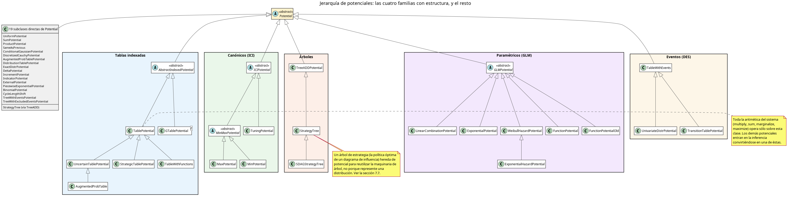
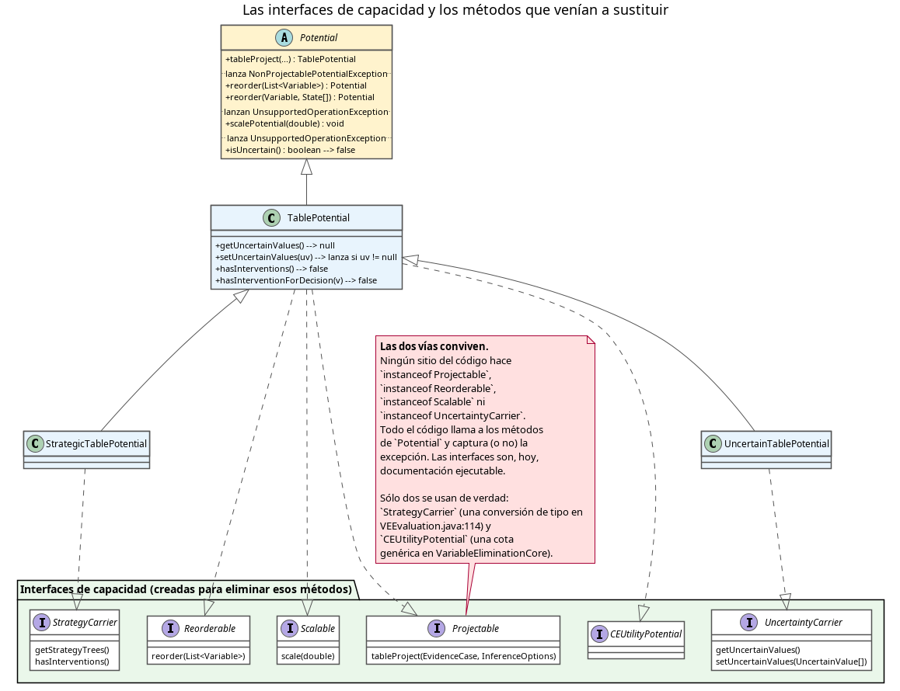
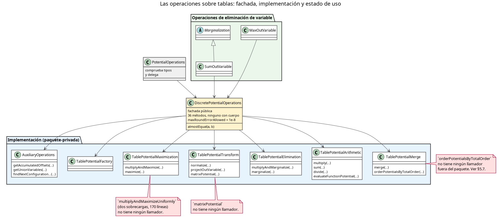
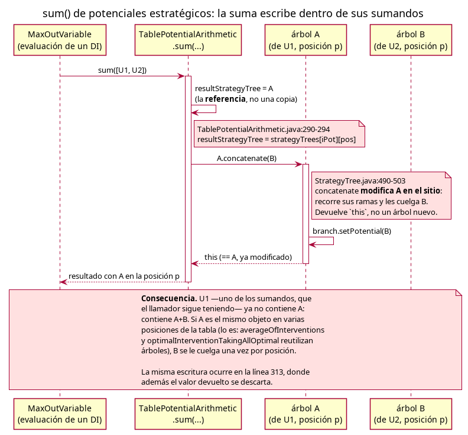
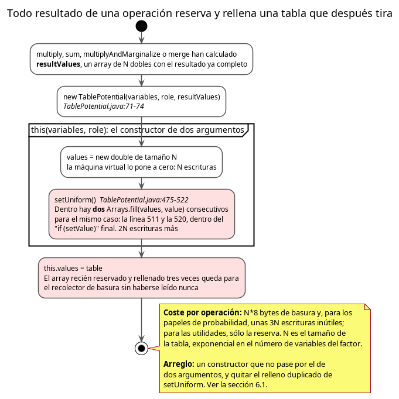

# Análisis de la jerarquía de potenciales y de sus operaciones

**Fecha:** 6 de agosto de 2026. **Estado del código:** rama `development`, commit `7fba539`.

Este informe examina el paquete `org.openmarkov.core.model.network.potential` — 45 clases de potencial, seis interfaces y el subpaquete `operation` con la aritmética sobre tablas — buscando tres cosas distintas: errores de corrección (el programa da un resultado equivocado), errores de rendimiento (el programa hace trabajo que no necesita) y errores de diseño (el programa es difícil de cambiar sin romperlo).

Los tres se tratan de forma diferente, siguiendo el criterio que el equipo ya fijó: **la aritmética sobre tablas está optimizada para ser rápida y la rapidez no se sacrifica**. Un fallo de diseño que existe para ganar velocidad — una tabla pública, una referencia compartida, un bucle escrito a mano en vez de un iterador — se registra y se deja. Un fallo de corrección, en cambio, hay que arreglarlo, y este informe separa con cuidado cuáles lo son.

Cada afirmación cita fichero y línea. Cuando un defecto está en código al que nadie llama, se dice explícitamente: un defecto inalcanzable es una nota, no una tarea.

Un aviso sobre vocabulario. Un **potencial** es la función numérica que un nodo de la red aporta al modelo: una tabla de probabilidad condicionada, una utilidad, una distribución paramétrica. Un **factor** es un potencial visto durante la inferencia, cuando ya no importa de qué nodo vino. **Proyectar** un potencial es fijar en él los valores observados (la evidencia) y quedarse con la función de las variables que siguen sin observarse. **Marginalizar** una variable es sumarla (o maximizarla) hasta hacerla desaparecer del factor.

---

## 1. El mapa: la jerarquía hoy



*Fuente: [jerarquia-potenciales.puml](jerarquia-potenciales.puml)*

De las 45 clases, sólo cuatro forman familias con estructura propia:

- **Tablas indexadas.** `AbstractIndexedPotential` guarda el cálculo de índices (dimensiones, desplazamientos, tamaño de tabla) y `TablePotential` añade el array de valores. De ella cuelgan las tres variantes que llevan datos adicionales en paralelo a los valores: `UncertainTablePotential` (distribuciones de incertidumbre para el análisis de sensibilidad), `StrategicTablePotential` (árboles de estrategia para resolver diagramas de influencia) y `TableWithFunctions`.
- **Canónicos.** `ICIPotential` (*Independent Causal Influence*, influencia causal independiente) y sus modelos OR/MAX, AND/MIN y *tuning*. Su valor está en que no construyen la tabla exponencial: la factorizan en una tabla pequeña por padre.
- **Árboles.** `TreeADDPotential` (árbol de decisión algebraico) y, heredando de él, `StrategyTree`.
- **Paramétricos.** `GLMPotential` (*Generalized Linear Model*, modelo lineal generalizado) y sus seis descendientes.

Las 19 restantes cuelgan directamente de `Potential` sin nada en común entre ellas más que el tipo base. La mayoría son potenciales de simulación de eventos discretos (DES, *Discrete Event Simulation*).

El punto importante del diagrama es el que señala la nota: **toda la aritmética del sistema opera exclusivamente sobre `TablePotential`**. Los demás potenciales participan en la inferencia convirtiéndose en una tabla (`tableProject`), o no participan. Esto explica dónde está concentrado el riesgo y dónde no.

---

## 2. Las interfaces de capacidad: un rediseño a medio camino

**Severidad: media (diseño).**



*Fuente: [capacidades.puml](capacidades.puml)*

Existen seis interfaces —`Projectable`, `Reorderable`, `Scalable`, `UncertaintyCarrier`, `StrategyCarrier`, `CEUtilityPotential`— cuya documentación dice, con todas las letras, para qué se crearon. [`Reorderable.java:24-26`](../../../core/src/main/java/org/openmarkov/core/model/network/potential/Reorderable.java#L24-L26): «declarar esta interfaz en lugar de forzar un método abstracto en cada subclase de `Potential` elimina el patrón de `return null`». [`UncertaintyCarrier.java:24-27`](../../../core/src/main/java/org/openmarkov/core/model/network/potential/UncertaintyCarrier.java#L24-L27): «esto elimina las guardas `if (uncertainValues != null)` que antes aparecían por todas las clases de operación».

No lo hicieron, porque los métodos que venían a sustituir siguen ahí:

- `Potential.tableProject` sigue existiendo y lanzando `NonProjectablePotentialException` ([`Potential.java:348-352`](../../../core/src/main/java/org/openmarkov/core/model/network/potential/Potential.java#L348-L352)).
- `Potential.reorder` en sus dos formas sigue lanzando `UnsupportedOperationException` ([`Potential.java:835-850`](../../../core/src/main/java/org/openmarkov/core/model/network/potential/Potential.java#L835-L850)).
- `Potential.scalePotential` sigue lanzando `UnsupportedOperationException` ([`Potential.java:784-786`](../../../core/src/main/java/org/openmarkov/core/model/network/potential/Potential.java#L784-L786)), y `Scalable.scale` es un segundo nombre para lo mismo que las tres implementaciones resuelven delegando una en otra.
- `TablePotential.getUncertainValues()` sigue devolviendo `null` y `hasInterventions()` sigue devolviendo `false` ([`TablePotential.java:307-309, 715-727`](../../../core/src/main/java/org/openmarkov/core/model/network/potential/TablePotential.java#L307-L309)).

Y el código que las consumiría no las usa: **no hay una sola expresión `instanceof Projectable`, `instanceof Reorderable`, `instanceof Scalable` ni `instanceof UncertaintyCarrier` en todo el repositorio**. Las operaciones siguen preguntando `instanceof StrategicTablePotential` y `instanceof UncertainTablePotential`, es decir, por la clase concreta ([`TablePotentialMerge.java:255-289`](../../../core/src/main/java/org/openmarkov/core/model/network/potential/operation/TablePotentialMerge.java#L255-L289), [`TablePotentialArithmetic.java:189-196`](../../../core/src/main/java/org/openmarkov/core/model/network/potential/operation/TablePotentialArithmetic.java#L189-L196)).

Sólo dos interfaces tienen un uso real: `StrategyCarrier`, en una conversión de tipo ([`VEEvaluation.java:114`](../../../inference/src/main/java/org/openmarkov/inference/algorithm/variableElimination/tasks/VEEvaluation.java#L114)), y `CEUtilityPotential`, como cota de un tipo genérico ([`VariableEliminationCore.java:255`](../../../inference/src/main/java/org/openmarkov/inference/algorithm/variableElimination/VariableEliminationCore.java#L255)).

Esto no produce ningún error, pero sí una trampa: quien lea las interfaces creerá que el sistema de tipos protege lo que en realidad no protege, y quien añada un potencial nuevo no sabrá si debe implementarlas (nadie las mira) o sobrescribir los métodos de la base (todo el mundo los llama).

---

## 3. Las operaciones: el mapa



*Fuente: [operaciones-mapa.puml](operaciones-mapa.puml)*

`DiscretePotentialOperations` es hoy una fachada pura: sus 36 métodos públicos no tienen cuerpo, delegan en siete clases de implementación paquete-privadas. Es una descomposición sana y reciente, y el informe anterior sobre esta refactorización ya la documenta.

Encima de ella hay dos capas más: `PotentialOperations`, que comprueba tipos y vuelve a delegar, y las clases de eliminación de variable (`SumOutVariable`, `MaxOutVariable`), que son las que la eliminación de variables llama de verdad.

Las cajas rojas del diagrama marcan tres métodos sin ningún llamador fuera del propio paquete, que se detallan en §7.8.

---

## 4. Cómo se proyecta un potencial

Antes de entrar en los defectos conviene fijar el mecanismo, porque tres de ellos ocurren aquí.

Un potencial entra en la inferencia por `tableProject(evidencia, opciones, yaProyectados)`. La lista `yaProyectados` no es un adorno: los potenciales de supervalor —`SumPotential` y `ProductPotential`, que dicen «mi utilidad es la suma (o el producto) de las de mis padres»— la recorren buscando la proyección de cada padre por su variable condicionada ([`SumPotential.java:328-335`](../../../core/src/main/java/org/openmarkov/core/model/network/potential/SumPotential.java#L328-L335), `Potential.findPotentialByVariable` en [`Potential.java:191-214`](../../../core/src/main/java/org/openmarkov/core/model/network/potential/Potential.java#L191-L214)).

Sobre esto se añadió `tableProjectToFactors` ([`Potential.java:380-384`](../../../core/src/main/java/org/openmarkov/core/model/network/potential/Potential.java#L380-L384)), que permite a un potencial entregar **varios** factores en vez de uno. Es la puerta por la que la factorización de un modelo canónico llega a la eliminación de variables sin multiplicarse antes: un OR ruidoso sobre *k* padres cuesta 4k+6 números factorizado y 2^(k+1) expandido. El propio javadoc advierte del riesgo que abre — un potencial que devuelva varios factores, ninguno condicionado sobre su propia variable, se vuelve invisible para un nodo de supervalor que esté por encima — y `findPotentialByVariable` ya lleva el remedio: si no encuentra el factor, pide la tabla a la red (`collapseOnDemand`, [`Potential.java:217-229`](../../../core/src/main/java/org/openmarkov/core/model/network/potential/Potential.java#L217-L229)). Es un diseño cuidadoso y bien documentado; se menciona aquí porque es la única parte del paquete donde la interacción entre dos mecanismos está escrita.

---

## 5. Errores de corrección

Estos son los que hay que arreglar.

### 5.1 La suma de potenciales estratégicos escribe dentro de sus sumandos

**Severidad: alta. Alcanzable desde la evaluación de cualquier diagrama de influencia con más de una utilidad.**



*Fuente: [sum-arboles-estrategia.puml](sum-arboles-estrategia.puml)*

`StrategyTree.concatenate` **modifica el árbol receptor en el sitio** y devuelve `this` ([`StrategyTree.java:490-503`](../../../core/src/main/java/org/openmarkov/core/model/network/potential/StrategyTree.java#L490-L503)): recorre sus ramas y les cuelga el árbol recibido. No construye nada nuevo.

`TablePotentialArithmetic.sum` lo llama sobre un árbol que no es suyo:

```java
StrategyTree auxIStrategyTree = strategyTrees[iPotential][potentialsPositions[iPotential]];
resultStrategyTree = (resultStrategyTree == null) ? auxIStrategyTree
        : resultStrategyTree.concatenate(auxIStrategyTree);
```
*([`TablePotentialArithmetic.java:290-294`](../../../core/src/main/java/org/openmarkov/core/model/network/potential/operation/TablePotentialArithmetic.java#L290-L294))*

En la primera vuelta del bucle interno, `resultStrategyTree` toma **la referencia** al árbol del primer sumando en esa posición. En la segunda, le concatena el del segundo sumando — es decir, escribe dentro del primer sumando, que el llamador sigue teniendo en sus manos.

Y no es una escritura aislada. `StrategyTree.averageOfInterventions` devuelve uno de sus argumentos sin copiarlo cuando sólo hay una intervención con probabilidad no nula o cuando todas son iguales ([`StrategyTree.java:205-211`](../../../core/src/main/java/org/openmarkov/core/model/network/potential/StrategyTree.java#L205-L211)), de modo que **el mismo objeto árbol ocupa varias posiciones de la tabla**. Cada una de esas posiciones concatena otra vez, sobre el mismo objeto.

La misma escritura ocurre con los potenciales constantes, en dos sitios más: [`TablePotentialArithmetic.java:229-236`](../../../core/src/main/java/org/openmarkov/core/model/network/potential/operation/TablePotentialArithmetic.java#L229-L236) y `:306-316`. En el segundo, además, el valor devuelto por `concatenate` se descarta —`resultStrategyTrees[i].concatenate(...)` sin asignación— mientras que veinte líneas antes sí se asigna. Los dos funcionan por la misma razón (la mutación en el sitio), pero uno de los dos está escrito como si `concatenate` devolviera un árbol nuevo.

Es alcanzable: [`MaxOutVariable.java:41`](../../../core/src/main/java/org/openmarkov/core/model/network/potential/operation/MaxOutVariable.java#L41) suma la lista de potenciales aditivos de entrada, y [`SumOutVariable.java:165`](../../../core/src/main/java/org/openmarkov/core/model/network/potential/operation/SumOutVariable.java#L165) suma los intermedios. Ambas están en el camino de la eliminación de variables con utilidades.

**Arreglo.** `concatenate` debe devolver un árbol nuevo, o `sum` debe copiar antes de concatenar. Lo primero es más limpio y no cuesta nada en el caso normal, porque los árboles de estrategia son pequeños comparados con las tablas.

### 5.2 `ICIPotential.replaceVariable` intercambia el padre y el hijo

**Severidad: alta. Alcanzable al pegar en la interfaz gráfica un nodo con un modelo canónico.**

El constructor construye la variable auxiliar *z* de cada padre así ([`ICIPotential.java:90-92`](../../../core/src/main/java/org/openmarkov/core/model/network/potential/canonical/ICIPotential.java#L90-L92)):

```java
zVariables.put(variables.get(i), createZVariable(variables.get(i), conditionedVariable));
```

y la firma es `createZVariable(Variable parent, Variable child)`, que devuelve una variable llamada `z_<padre>_<hijo>` **con los estados del hijo** ([`ICIPotential.java:503-505`](../../../core/src/main/java/org/openmarkov/core/model/network/potential/canonical/ICIPotential.java#L503-L505)).

`replaceVariable` la reconstruye con los argumentos al revés ([`ICIPotential.java:490`](../../../core/src/main/java/org/openmarkov/core/model/network/potential/canonical/ICIPotential.java#L490)):

```java
zVariables.put(variable, createZVariable(variables.getFirst(), variable));
```

Aquí `variables.getFirst()` es la variable condicionada y `variable` es el padre nuevo. La *z* resultante se llama `z_<hijo>_<padre>` y, lo que importa, **tiene los estados del padre, no los del hijo**.

La consecuencia se ve en `getNoisyPotentials` ([`ICIPotential.java:321-332`](../../../core/src/main/java/org/openmarkov/core/model/network/potential/canonical/ICIPotential.java#L321-L332)), que construye la tabla del enlace como `new TablePotential([z, padre], ..., noisyParameters[i])`. El tamaño que esa tabla declara pasa a ser `estados(padre) × estados(padre)`, mientras que el array de parámetros que recibe mide `estados(hijo) × estados(padre)`. Cuando el hijo y el padre tienen distinto número de estados —el caso corriente: un padre binario y un hijo con tres estados— la tabla y su array dejan de casar, y como el constructor no comprueba el tamaño (§5.6) el error no aparece hasta que la proyección lee fuera del array o lee números de otra celda.

Es alcanzable desde [`PasteEdit.java:124`](../../../gui/src/main/java/org/openmarkov/gui/action/PasteEdit.java#L124), que llama a `replaceVariable(i, variable)` para cada variable del potencial al pegar nodos copiados.

**Arreglo.** Un carácter: `createZVariable(variable, variables.getFirst())`.

### 5.3 `normalize` puede producir NaN

**Severidad: alta. Alcanzable desde el aprendizaje de parámetros.**

`TablePotentialTransform.normalize` comprueba que **todos** los valores no sean cero antes de dividir ([`TablePotentialTransform.java:45-47`](../../../core/src/main/java/org/openmarkov/core/model/network/potential/operation/TablePotentialTransform.java#L45-L47)), pero para el papel de probabilidad condicionada divide **columna a columna** (`:50-61`):

```java
for (int i = 0; i < values.length; i += numStates) {
    normalizationFactor = 0.0;
    for (int j = 0; j < numStates; j++) normalizationFactor += values[i + j];
    for (int j = 0; j < numStates; j++) values[i + j] /= normalizationFactor;
}
```

Si una sola columna suma cero y las demás no, la guarda no salta y esa columna se divide por cero: `0.0 / 0.0` es `NaN`. El potencial sigue su camino con NaN dentro, y un NaN envenena todo producto en el que entre.

Cómo se llega: `LearningAlgorithm.parametricLearning` normaliza las frecuencias absolutas leídas de una base de casos ([`LearningAlgorithm.java:172-182`](../../../learning.core/src/main/java/org/openmarkov/learning/core/algorithm/LearningAlgorithm.java#L172-L182)). Antes suma `alpha` a cada celda, el suavizado de Laplace — pero `alpha = 0` está permitido, es el estimador de máxima verosimilitud, y el diálogo de la interfaz lo acepta ([`AlgorithmParametersDialog.java:167-171`](../../../learning.gui/src/main/java/org/openmarkov/learning/gui/AlgorithmParametersDialog.java#L167-L171) valida sólo `0 ≤ alpha ≤ 1`). Con `alpha = 0` basta con que una configuración de los padres no aparezca ni una vez en la base de casos para que su columna quede a cero.

La división que precede al barrido de NaN de [`ChanceVariableElimination.java:59-64`](../../../inference/src/main/java/org/openmarkov/inference/algorithm/variableElimination/ChanceVariableElimination.java#L59-L64) no los produce: un denominador cero da cero por una convención deliberada (guarda en [`TablePotentialArithmetic.java:488-493`](../../../core/src/main/java/org/openmarkov/core/model/network/potential/operation/TablePotentialArithmetic.java#L488-L493), comentario en [`TablePotentialArithmetic.java:516-519`](../../../core/src/main/java/org/openmarkov/core/model/network/potential/operation/TablePotentialArithmetic.java#L516-L519)), de modo que las configuraciones con probabilidad cero bajo la evidencia se tratan en la división, no aquí. Ese barrido solo puede limpiar NaN que entren de fuera — por ejemplo, de un potencial aprendido con una columna a cero — y los convierte en ceros en silencio: no es señal de que la eliminación de variables los produzca, sino la máscara que los ocultaría al llegar.

**Arreglo.** Lanzar `CannotNormalizePotentialException` cuando una columna suma cero, o aplicar en ese caso la misma convención que ya existe en `imposeOtherDistributionWhenDistributionIsZero` (toda la masa al primer estado). Lo que no puede quedarse es la división silenciosa.

### 5.4 `multiplyAndMarginalize` pierde el criterio de decisión

**Severidad: media.**

`TablePotentialElimination.multiplyAndMarginalize` construye el resultado así ([`TablePotentialElimination.java:129`](../../../core/src/main/java/org/openmarkov/core/model/network/potential/operation/TablePotentialElimination.java#L129)):

```java
return new TablePotential(variablesToKeep, TablePotentialArithmetic.getRole(tablePotentials), resultValues);
```

Transmite el papel pero no el criterio. Es incoherente con las otras dos operaciones de la misma familia: `multiply` busca el primer criterio no nulo y lo pone en el resultado ([`TablePotentialArithmetic.java:80`](../../../core/src/main/java/org/openmarkov/core/model/network/potential/operation/TablePotentialArithmetic.java#L80) y `:682`), y la variante de dos potenciales `multiplyAndMarginalize(prob, util, var)` lo copia explícitamente ([`TablePotentialElimination.java:226`](../../../core/src/main/java/org/openmarkov/core/model/network/potential/operation/TablePotentialElimination.java#L226)).

Que esto importa lo dice el propio código: `getRole` devuelve `UNSPECIFIED` en cuanto uno de los potenciales es aditivo ([`TablePotentialArithmetic.java:405-421`](../../../core/src/main/java/org/openmarkov/core/model/network/potential/operation/TablePotentialArithmetic.java#L405-L421)), es decir, el método está preparado para recibir utilidades. Y «ser una utilidad» se decide, hoy, mirando si el criterio es nulo: `isAdditive()` es literalmente `criterion != null` ([`Potential.java:426-428`](../../../core/src/main/java/org/openmarkov/core/model/network/potential/Potential.java#L426-L428)) y `isThereAUtilityPotential` pregunta lo mismo ([`TablePotentialMaximization.java:289-299`](../../../core/src/main/java/org/openmarkov/core/model/network/potential/operation/TablePotentialMaximization.java#L289-L299)). Un potencial de utilidad que sale de esta operación deja de ser reconocido como utilidad.

La operación tampoco propaga los árboles de estrategia: si alguna entrada era un `StrategicTablePotential`, el resultado es un `TablePotential` corriente y las intervenciones desaparecen. `multiply` y `merge` sí los propagan.

**Arreglo.** Copiar el criterio como hace `multiply`, y decidir si esta operación debe propagar intervenciones o si debe rechazar entradas que las lleven. La segunda opción, si es la correcta, hay que escribirla: hoy no está en ningún sitio.

### 5.5 Los factores se identifican por su valor, no por su identidad

**Severidad: media.**

`TablePotential.equals` compara clase, variables, papel **y todos los valores** ([`TablePotential.java:587-600`](../../../core/src/main/java/org/openmarkov/core/model/network/potential/TablePotential.java#L587-L600)). Ni `StrategicTablePotential` ni `UncertainTablePotential` lo redefinen, de modo que **dos factores con los mismos números pero distintos árboles de estrategia son iguales**.

Dos operaciones usan métodos de lista que se apoyan en `equals`:

- [`TablePotentialArithmetic.java:142`](../../../core/src/main/java/org/openmarkov/core/model/network/potential/operation/TablePotentialArithmetic.java#L142): `potentials.indexOf(potentialWithInterventions)` localiza el potencial con intervenciones por igualdad. Si otro factor lleva los mismos números, `indexOf` puede devolver el índice equivocado y el bucle leerá los árboles de estrategia de la posición de otro factor.
- [`TablePotentialArithmetic.java:218`](../../../core/src/main/java/org/openmarkov/core/model/network/potential/operation/TablePotentialArithmetic.java#L218): `potentials.remove(auxPotential)` retira los potenciales constantes por igualdad.

Lo notable es que la decisión correcta ya está tomada en el mismo paquete y explicada con claridad. [`TablePotentialMerge.java:302-310`](../../../core/src/main/java/org/openmarkov/core/model/network/potential/operation/TablePotentialMerge.java#L302-L310):

> «Todo conjunto de potenciales aquí significa "estos factores", no "estos valores": dos factores que llevan los mismos números siguen siendo dos factores, y fundirlos pierde un término de la utilidad.»

y por eso usa `Collections.newSetFromMap(new IdentityHashMap<>())`. El mismo peligro, la misma casa, dos tratamientos opuestos.

**Arreglo.** En `multiply`, guardar el índice del potencial con intervenciones mientras se recorre la lista, en vez de buscarlo después. En `sum`, separar constantes y no constantes en dos listas en un solo recorrido, en vez de copiar y quitar. Ambos cambios además son más rápidos (§6.2).

### 5.6 El constructor con tabla no comprueba el tamaño

**Severidad: media.**

```java
public TablePotential(List<Variable> variables, PotentialRole role, double[] table) {
    this(variables, role);
    this.values = table;
}
```
*([`TablePotential.java:71-74`](../../../core/src/main/java/org/openmarkov/core/model/network/potential/TablePotential.java#L71-L74))*

Nada garantiza que `table.length` coincida con el tamaño que las variables implican. Todas las operaciones recorren la tabla con desplazamientos calculados a partir de las variables, así que un desajuste se manifiesta como una lectura fuera del array —o, peor, como una lectura dentro del array pero en la celda equivocada— en un punto del código que no tiene nada que ver con el sitio donde se construyó mal el potencial. El fallo de §5.2 llega hasta la inferencia precisamente por esta puerta.

**Arreglo.** Una comparación de dos enteros en el constructor. El coste es despreciable —se paga una vez por potencial, no una vez por celda— y convierte un fallo lejano en un fallo inmediato con el nombre del culpable.

### 5.7 `almostEqual` no es simétrico y no tolera nada cerca del cero

**Severidad: media.**

```java
public static boolean almostEqual(double a, double b) {
    return (Math.abs(b - a) <= maxRoundErrorAllowed * Math.abs(a));
}
```
*([`DiscretePotentialOperations.java:384-386`](../../../core/src/main/java/org/openmarkov/core/model/network/potential/operation/DiscretePotentialOperations.java#L384-L386))*

La tolerancia es **relativa al primer argumento**. De ahí salen dos consecuencias que los llamadores no parecen esperar:

1. `almostEqual(a, b)` y `almostEqual(b, a)` pueden dar respuestas distintas.
2. Si el primer argumento es cero, la condición se reduce a igualdad exacta. El equipo lo sabe: hay un test que lo fija, `almostEqualWithZeroBaseIsStrictlyEqual`.

El problema no es la función, es cómo se usa. Los dos sitios que la emplean para preguntar «¿esto es cero?» lo hacen con los argumentos en orden contrario el uno del otro:

- [`DiscretePotentialOperations.java:355`](../../../core/src/main/java/org/openmarkov/core/model/network/potential/operation/DiscretePotentialOperations.java#L355): `!almostEqual(valor, 0.0)` — se reduce a `valor != 0.0`.
- [`TablePotentialTransform.java:114`](../../../core/src/main/java/org/openmarkov/core/model/network/potential/operation/TablePotentialTransform.java#L114): `almostEqual(0.0, valor)` — se reduce a `valor == 0.0`.

Los dos creen estar poniendo una tolerancia de 10⁻⁸ y ninguno la tiene. En una tabla de utilidades acumuladas por eliminación de variables, un valor de 10⁻¹⁷ que debería contar como cero cuenta como distinto de cero, y `thereAreRelevantUtilities` devuelve `true` donde no debería.

Y la misma constante significa otra cosa en el fichero de al lado: `TablePotentialMaximization` usa `maxRoundErrorAllowed` como tolerancia **absoluta** para decidir empates entre alternativas ([`TablePotentialMaximization.java:126, 130-131, 252, 260`](../../../core/src/main/java/org/openmarkov/core/model/network/potential/operation/TablePotentialMaximization.java#L126)). Una constante, dos significados.

**Arreglo.** Separar las dos preguntas en dos funciones con nombre: una comparación relativa (`almostEqual`) y una prueba de cero con tolerancia absoluta (`isNegligible(double)`), y usar cada una donde corresponde. No cambia el rendimiento: son comparaciones de dobles.

### 5.8 Una precondición que sólo el llamador conoce

**Severidad: baja hoy, alta si aparece un segundo llamador.**

`multiplyAndMarginalize(probPotential, utilityPotential, variableToEliminate)` ([`TablePotentialElimination.java:141-228`](../../../core/src/main/java/org/openmarkov/core/model/network/potential/operation/TablePotentialElimination.java#L141-L228)) recorre los estados de la variable a eliminar con el avance genérico de configuración sobre la lista `allVariables`, que empieza por las variables de `probPotential`. Ese avance incrementa siempre la primera variable de la lista. Es decir: **la operación sólo es correcta si la variable a eliminar es la primera del potencial de probabilidad**, y no lo dice ni lo comprueba.

Su único llamador cumple la condición, y lo hace a mano: [`ChanceVariableElimination.java:66-75`](../../../inference/src/main/java/org/openmarkov/inference/algorithm/variableElimination/ChanceVariableElimination.java#L66-L75) construye una lista con la variable a eliminar delante y reordena la probabilidad condicionada antes de llamar. Es decir, hoy el resultado es correcto. Pero la condición vive en el llamador y el método que depende de ella no la menciona.

**Arreglo.** Escribirla en el javadoc y comprobarla con una comparación al entrar. Una comparación por llamada, no por celda.

---

## 6. Rendimiento

Aquí el criterio se invierte: se busca trabajo inútil, no elegancia.

### 6.1 Cada resultado reserva y rellena una tabla que después tira

**Severidad: alta. Es el camino más caliente del sistema.**



*Fuente: [constructor-derroche.puml](constructor-derroche.puml)*

Todas las operaciones que producen una tabla nueva —`multiply`, `sum`, `multiplyAndMarginalize`, `merge`, `evaluateFunctionPotential`— calculan el array de resultados y después construyen el potencial con `new TablePotential(variables, role, resultValues)`.

Ese constructor delega en el de dos argumentos, que reserva `new double[tableSize]` y llama a `setUniform()`; y sólo después tira ese array y se queda con el que recibió ([`TablePotential.java:71-74`](../../../core/src/main/java/org/openmarkov/core/model/network/potential/TablePotential.java#L71-L74)).

Y `setUniform` rellena **dos veces**. En el caso de un potencial con variables y papel de probabilidad hay un `Arrays.fill(values, value)` en la línea 511 y otro, para el mismo array y el mismo valor, en la línea 520 dentro del `if (setValue)` final:

```java
                } // When role = UTILITY -> value = 0.0 (default)
                Arrays.fill(values, value);          // línea 511
            } else if (numVariables == 0) {
                ...
            }
            if (setValue) Arrays.fill(values, value);   // línea 520
```
*([`TablePotential.java:511`](../../../core/src/main/java/org/openmarkov/core/model/network/potential/TablePotential.java#L511) y `:520`)*

El coste por operación es de N·8 bytes de basura y, cuando el papel es de probabilidad, unas 3N escrituras de memoria inútiles: N ceros que pone la máquina virtual al reservar más 2N del doble relleno. Para los resultados de utilidad el relleno no llega a ejecutarse y sólo se pagan la reserva y los N ceros. N es el tamaño del resultado. En redes como las CPCS que el proyecto ya resuelve, con factores de cientos de miles de celdas, esto se paga en cada una de las miles de operaciones de una eliminación de variables.

**Arreglo.** Dos cambios independientes, ambos pequeños:

1. Quitar el `Arrays.fill` duplicado. Beneficia también a la construcción legítima de tablas uniformes.
2. Que el constructor de tres argumentos no pase por el de dos: puede llamar directamente a `super(variables, role)` y asignar `this.values = table`, sin reservar ni rellenar nada. Es aquí donde encaja además la comprobación de tamaño de §5.6.

### 6.2 `sum` compara tablas enteras para separar las constantes

**Severidad: media.**

```java
for (TablePotential auxPotential : tablePotentials) {
    if (auxPotential.getVariables().isEmpty()) {
        potentials.remove(auxPotential);
        constantPotentials.add(auxPotential);
    }
}
```
*([`TablePotentialArithmetic.java:216-221`](../../../core/src/main/java/org/openmarkov/core/model/network/potential/operation/TablePotentialArithmetic.java#L216-L221))*

Dos derroches en cuatro líneas:

- `getVariables()` **construye una lista nueva** en cada llamada ([`Potential.java:283-285`](../../../core/src/main/java/org/openmarkov/core/model/network/potential/Potential.java#L283-L285)) sólo para preguntar si está vacía. `getNumVariables()` responde lo mismo sin reservar nada ([`Potential.java:433-435`](../../../core/src/main/java/org/openmarkov/core/model/network/potential/Potential.java#L433-L435)).
- `List.remove(Object)` recorre la lista comparando con `equals`, y `TablePotential.equals` compara **el array de valores entero**. Separar *k* constantes de una lista de *n* potenciales cuesta, en el peor caso, *k·n* comparaciones de tablas completas. Para una suma de utilidades con factores grandes, esto puede costar más que la suma.

**Arreglo.** Un solo recorrido que reparta en dos listas mirando `getNumVariables() == 0`. Es más rápido, más corto y de paso elimina la dependencia de `equals` que §5.5 señala como riesgo de corrección.

### 6.3 El derroche menor: `getVariables()` en los bucles

`getVariables()` copia la lista cada vez. Aparece dentro de bucles sobre potenciales en varios sitios ([`TablePotentialElimination.java:80`](../../../core/src/main/java/org/openmarkov/core/model/network/potential/operation/TablePotentialElimination.java#L80), [`TablePotentialMaximization.java:92`](../../../core/src/main/java/org/openmarkov/core/model/network/potential/operation/TablePotentialMaximization.java#L92), [`AuxiliaryOperations.java:174`](../../../core/src/main/java/org/openmarkov/core/model/network/potential/operation/AuxiliaryOperations.java#L174), `:191`). En esos casos es una copia por potencial, no por celda, así que el coste es acotado y no justifica tocar código que funciona. Se registra por completitud: si alguna vez se busca una vuelta de tuerca al rendimiento, dar acceso de sólo lectura a la lista interna (`List.copyOf` una vez, o un getter sin copia con contrato documentado como el de `getValues()`) es una vía barata.

### 6.4 `expandedPotential` no es seguro entre hilos

`ICIPotential.getProbability` construye la tabla completa la primera vez y la guarda ([`ICIPotential.java:564-569`](../../../core/src/main/java/org/openmarkov/core/model/network/potential/canonical/ICIPotential.java#L564-L569)). El campo no es `volatile` ni está sincronizado. Con un solo hilo —que es como corre hoy la inferencia— no hay problema; se anota porque es exactamente el tipo de campo que rompe cuando alguien paraleliza el muestreo. Nótese también que expandir la tabla anula, para ese potencial, la ventaja de la factorización; es una decisión consciente y correcta (quien no puede usar los factores paga la tabla), pero conviene saber que el camino de `getProbability` la paga siempre.

---

## 7. Diseño

Ninguno de estos produce un resultado equivocado hoy. Se listan porque son las aristas con las que tropezará el próximo cambio.

### 7.1 `addVariable` y `removeVariable`: unas veces mutan, otras devuelven

`Potential.addVariable` devuelve un potencial **nuevo** y deja intacto el receptor ([`Potential.java:694-711`](../../../core/src/main/java/org/openmarkov/core/model/network/potential/Potential.java#L694-L711)). `SumPotential.addVariable` **muta** el receptor y devuelve `this` ([`SumPotential.java:360-363`](../../../core/src/main/java/org/openmarkov/core/model/network/potential/SumPotential.java#L360-L363)). `TreeADDPotential.addVariable` también muta y devuelve `this` ([`TreeADDPotential.java:322-331`](../../../core/src/main/java/org/openmarkov/core/model/network/potential/treeadd/TreeADDPotential.java#L322-L331)). `TablePotential.addVariable` devuelve uno nuevo ([`TablePotential.java:638-653`](../../../core/src/main/java/org/openmarkov/core/model/network/potential/TablePotential.java#L638-L653)).

El llamador que escribe `potential = potential.addVariable(v)` funciona en los cuatro casos; el que escribe `potential.addVariable(v)` y sigue usando el original funciona en dos y falla en los otros dos, sin aviso. Lo mismo pasa con `removeVariable`.

Hay además un `FIXME` reconocido en la base ([`Potential.java:701-708`](../../../core/src/main/java/org/openmarkov/core/model/network/potential/Potential.java#L701-L708)): en las redes de simulación de eventos discretos, un lazo sobre sí mismo hace que la variable condicionada pueda repetirse, y el método tiene una rama especial para ese caso.

**Recomendación:** fijar el contrato en el javadoc de `Potential` —«devuelve un potencial, que puede ser este mismo»— y hacer que todas las implementaciones lo cumplan devolviendo siempre uno nuevo. El coste es una copia por edición de estructura, que no está en ningún camino caliente.

### 7.2 Referencias compartidas: `tableProject` devuelve `this`, `normalize` muta

`TablePotential.tableProject` devuelve **el propio potencial** cuando la evidencia no toca ninguna de sus variables ([`TablePotential.java:188-190`](../../../core/src/main/java/org/openmarkov/core/model/network/potential/TablePotential.java#L188-L190)). `multiply` con un solo elemento devuelve ese elemento ([`TablePotentialArithmetic.java:72-75`](../../../core/src/main/java/org/openmarkov/core/model/network/potential/operation/TablePotentialArithmetic.java#L72-L75)). `multiplyAndMarginalize(prob, util, var)` devuelve el potencial de utilidad tal cual cuando la probabilidad es la constante 1 ([`TablePotentialElimination.java:143-147`](../../../core/src/main/java/org/openmarkov/core/model/network/potential/operation/TablePotentialElimination.java#L143-L147)). Y `normalize` modifica el potencial recibido y lo devuelve, pese a que su javadoc dice «el potencial normalizado», como si fuera otro ([`TablePotentialTransform.java:43-76`](../../../core/src/main/java/org/openmarkov/core/model/network/potential/operation/TablePotentialTransform.java#L43-L76)).

Todas estas decisiones son de velocidad, y son las correctas: copiar una tabla de un millón de celdas para no proyectarla sería absurdo. Lo que falta es que estén escritas. Hoy un potencial de la red puede acabar siendo el mismo objeto que un factor de la inferencia, y quien escriba en el factor escribe en la red.

**Recomendación:** documentarlo en el javadoc de cada método —«puede devolver este mismo objeto»— y, en el caso de `normalize`, cambiar el javadoc para que diga lo que hace («normaliza el potencial recibido y lo devuelve»). Cero coste en ejecución.

### 7.3 `initialPosition` y `tableSize`: un concepto abandonado a medias

`AbstractIndexedPotential` documenta que un potencial proyectado puede compartir el array de otro, empezando en `initialPosition` y con `tableSize` menor que la longitud del array ([`AbstractIndexedPotential.java:39-49`](../../../core/src/main/java/org/openmarkov/core/model/network/potential/AbstractIndexedPotential.java#L39-L49)).

Ese diseño ya no se usa: **ningún `TablePotential` recibe nunca un `initialPosition` distinto de cero**. El único sitio donde se asigna algo distinto de cero es el constructor privado de `TableWithFunctions` y el de `AugmentedProbTable`. `TablePotential.tableProject` construye siempre un potencial nuevo con posición inicial cero.

Pero las operaciones siguen leyéndolo, y **no todas lo leen**. `TablePotentialElimination` y `TablePotentialMaximization` inicializan las posiciones con `potential.getInitialPosition()` ([`TablePotentialElimination.java:78-79`](../../../core/src/main/java/org/openmarkov/core/model/network/potential/operation/TablePotentialElimination.java#L78-L79), [`TablePotentialMaximization.java:90-91, 211-212`](../../../core/src/main/java/org/openmarkov/core/model/network/potential/operation/TablePotentialMaximization.java#L90-L91)), mientras que `multiply` y `sum` empiezan en cero sin más ([`TablePotentialArithmetic.java:119, 263`](../../../core/src/main/java/org/openmarkov/core/model/network/potential/operation/TablePotentialArithmetic.java#L119)). Si alguien reviviera el concepto, la mitad de la aritmética daría resultados equivocados.

Lo mismo con `tableSize` frente a `values.length`: `getNonConstantPotentials` decide qué es constante con `values.length > 1` ([`AuxiliaryOperations.java:51`](../../../core/src/main/java/org/openmarkov/core/model/network/potential/operation/AuxiliaryOperations.java#L51)), `multiplyAndMarginalize` con `getNumVariables() != 0` ([`TablePotentialElimination.java:48`](../../../core/src/main/java/org/openmarkov/core/model/network/potential/operation/TablePotentialElimination.java#L48)). Son criterios distintos: un potencial cuyas variables tengan todas un solo estado tiene longitud 1 y variables no vacías, y las dos operaciones lo clasificarían al revés. Es un caso raro pero no imposible.

**Recomendación:** decidir. O se retira `initialPosition` de `TablePotential` (dejándolo donde de verdad se usa) y se unifica el criterio de «constante» en un solo método, o se documenta que el concepto está vivo y se completa su lectura en las cuatro operaciones. Lo que no debe quedarse es a medias.

### 7.4 Dos definiciones de «tiene intervenciones»

`StrategicTablePotential.hasInterventions()` mira **sólo la posición 0** del array ([`StrategicTablePotential.java:72-73`](../../../core/src/main/java/org/openmarkov/core/model/network/potential/StrategicTablePotential.java#L72-L73)). `MaxOutVariable.thereAreInterventionsInOutputUtilityPotential` recorre el array entero ([`MaxOutVariable.java:170-177`](../../../core/src/main/java/org/openmarkov/core/model/network/potential/operation/MaxOutVariable.java#L170-L177)). La misma pregunta, dos respuestas posibles para el mismo potencial.

### 7.5 El orden de eliminación depende del `hashCode` de la máquina virtual

`Variable` no redefine `equals` ni `hashCode`, de modo que se comparan y se dispersan por identidad. Tres sitios construyen conjuntos o mapas sobre esa base y después recorren el resultado:

- `Potential.getCPT` usa un `HashSet<Variable>` para las variables a eliminar ([`Potential.java:242-249`](../../../core/src/main/java/org/openmarkov/core/model/network/potential/Potential.java#L242-L249)).
- `ICIPotential.tableProject` hace lo mismo y elimina las variables en el orden en que salen del conjunto ([`ICIPotential.java:203-228`](../../../core/src/main/java/org/openmarkov/core/model/network/potential/canonical/ICIPotential.java#L203-L228)).
- `TreeADDPotential.blendPotentials` recorre las claves de un `HashMap<TreeADDBranch, TablePotential>` ([`TreeADDPotential.java:623-634`](../../../core/src/main/java/org/openmarkov/core/model/network/potential/treeadd/TreeADDPotential.java#L623-L634)).

El resultado es correcto en aritmética exacta, pero el orden de las multiplicaciones cambia entre ejecuciones y con él los últimos bits del resultado en coma flotante. En `blendPotentials` hay un efecto adicional visible: el orden determina el orden de las variables del potencial resultante, y el criterio que se conserva es el de la última rama aditiva vista ([`TreeADDPotential.java:626-628`](../../../core/src/main/java/org/openmarkov/core/model/network/potential/treeadd/TreeADDPotential.java#L626-L628)), es decir, uno cualquiera si las ramas llevan criterios distintos.

El proyecto ya tiene un test que se apoya en la estabilidad de este camino (*«CataractNet answers the same whichever path its canonical models take»*, commit `a27bfab`). Cambiar los tres `HashSet`/`HashMap` por `LinkedHashSet`/`LinkedHashMap` cuesta una palabra por sitio y no cambia el rendimiento de forma apreciable.

### 7.6 `evaluateFunctionPotential` da por hecho los nombres `U1`, `U2`…

`TablePotentialArithmetic.evaluateFunctionPotential` recibe una lista `utilityVariables`, calcula sus nombres en `utilityVariablesNames` (`:617-619`) y **no usa la lista para nada**: la línea que lo haría está comentada justo debajo y lo que se ejecuta es un nombre construido a mano, `"U" + (iPotential + 1)` (`:632-633`). Después busca ese nombre entre las variables del potencial y llama a `.get()` sobre el `Optional` sin comprobar (`:639`): si la expresión del usuario no nombra sus argumentos exactamente `U1`, `U2`…, el fallo es un `NoSuchElementException` sin mensaje.

Además evalúa la expresión y convierte el texto a número **por cada celda** de la tabla (`:650`). Para un potencial de función sobre varias variables, eso es una evaluación de expresión y un `Double.parseDouble` por configuración.

### 7.7 `StrategyTree` hereda de `TreeADDPotential`

Un árbol de estrategia es la política óptima que la resolución de un diagrama de influencia produce: «si observas esto, decide aquello». No es una función numérica sobre configuraciones de variables, que es lo que un potencial es. Hereda de `TreeADDPotential` para reutilizar la maquinaria de ramas y umbrales.

La herencia trae equipaje: un `StrategyTree` responde a `tableProject`, a `sample`, a `getCPT` y a `scalePotential`, preguntas que no significan nada para él. Y trae al menos una consecuencia real, la de §5.1: `concatenate`, una operación propia de los árboles de estrategia, muta el receptor —cosa razonable en una estructura de política— y esa mutación se cuela en `sum`, una operación de potenciales, porque el tipo permite mezclarlas.

**Recomendación:** no tocarlo por ahora. Es una decisión estructural antigua, con muchas ramificaciones, y arreglar §5.1 no la requiere. Se anota para que quede escrito de dónde viene la fricción.

### 7.8 Código muerto

Tres bloques sin ningún llamador en todo el repositorio, tests incluidos:

- `TablePotentialMerge.orderPotentialsByTotalOrder` (`:189-215`). Además **contiene un defecto**: después de haber añadido al resultado los potenciales clasificados por decisión y los que no tienen intervención, añade otra vez la lista de entrada completa (`:210`, `orderedListOfPotentials.addAll(inputPotentialsList)`, donde por la simetría del código se esperaría `inputPotentialsSet`). El resultado contiene cada potencial al menos dos veces. Si esa lista se multiplicara, los valores saldrían al cuadrado. Como nadie la llama, esto es una nota, no una tarea: o se borra el método o se arregla la línea antes de darle uso.
- `TablePotentialMaximization.multiplyAndMaximizeUniformly`, dos sobrecargas, unas 170 líneas (`:162-283` y `:320-329`). Dentro hay un array `positionTies` que se escribe y nunca se lee, con su propio `TODO` reconociéndolo (`:232-235`).
- `TablePotentialTransform.matrixPotential` (`:135-149`).

Y dos defectos menores dentro de ese código muerto o cerca de él:

- `TablePotentialMaximization.maximize(Collection)` (`:346-382`) termina con `if (result.isAdditive()) result.setCriterion(...)`. Como `result` acaba de construirse con criterio nulo e `isAdditive()` es exactamente `criterion != null`, la condición **nunca es cierta** y el criterio nunca se copia. Este método tampoco tiene llamadores: las dos llamadas a `DiscretePotentialOperations.maximize` del repositorio ([`Strategy.java:60`](../../../core/src/main/java/org/openmarkov/core/inference/Strategy.java#L60), [`NodeAbsorptionHandler.java:99`](../../../core/src/main/java/org/openmarkov/core/model/network/NodeAbsorptionHandler.java#L99)) son a la otra sobrecarga.
- `UniformPotential.discreteValue` guarda el descuento de los análisis de coste-efectividad y tiene *getter*, *setter*, copia y copia profunda que lo preservan, además de dos tests que lo defienden. Ningún código de producción lo lee: `getDiscreteValue()` sólo aparece en tests. La proyección del potencial ([`UniformPotential.java:90-110`](../../../core/src/main/java/org/openmarkov/core/model/network/potential/UniformPotential.java#L90-L110)) lo ignora por completo.

---

## 8. Lo que está bien

Conviene decirlo, porque un informe de defectos da una impresión sesgada.

- La descomposición de `DiscretePotentialOperations` en siete clases de implementación, con la fachada intacta, es limpia y no ha costado rendimiento: el algoritmo de desplazamientos acumulados está donde estaba.
- Los caminos delicados llevan comentarios que explican **la decisión**, no el código: por qué el hash deja fuera los valores ([`Potential.java:631-646`](../../../core/src/main/java/org/openmarkov/core/model/network/potential/Potential.java#L631-L646)), por qué un denominador cero da cero y no infinito ([`TablePotentialArithmetic.java:513-516`](../../../core/src/main/java/org/openmarkov/core/model/network/potential/operation/TablePotentialArithmetic.java#L513-L516)), por qué el conjunto de factores compara por identidad ([`TablePotentialMerge.java:302-307`](../../../core/src/main/java/org/openmarkov/core/model/network/potential/operation/TablePotentialMerge.java#L302-L307)), por qué la variable condicionada tiene que quedar primera al proyectar un modelo canónico ([`ICIPotential.java:232-245`](../../../core/src/main/java/org/openmarkov/core/model/network/potential/canonical/ICIPotential.java#L232-L245)). Es exactamente el nivel de comentario que el proyecto pide.
- La factorización de los modelos canónicos y la puerta `tableProjectToFactors` están bien pensadas y bien documentadas, incluido el riesgo que abren.
- La copia y la copia profunda de los potenciales están cubiertas por tests dedicados, y varios de los comentarios del código registran fallos concretos que esos tests destaparon.
- Las operaciones tienen ya una batería de tests de invariantes algebraicas (`DiscretePotentialOperationsAlgebraicInvariantsTest`, `TablePotentialArithmeticTest`, `PotentialOperationsMaximizeContractTest`) que cubren la aritmética básica, la división por cero, los papeles y las constantes.

---

## 9. Recomendaciones

Ordenadas por lo que aportan frente a lo que cuestan. Las cinco primeras son de corrección; las tres siguientes, de rendimiento; el resto, de diseño.

**Corrección — hay que hacerlas.**

1. **`concatenate` debe devolver un árbol nuevo** en vez de modificar el receptor, o `sum` debe copiar antes de concatenar. Arregla §5.1, que corrompe potenciales de entrada en la evaluación de diagramas de influencia. Añadir un test que sume dos potenciales estratégicos y compruebe que los sumandos siguen intactos.
2. **Invertir los argumentos de `createZVariable` en `ICIPotential.replaceVariable`** ([`ICIPotential.java:490`](../../../core/src/main/java/org/openmarkov/core/model/network/potential/canonical/ICIPotential.java#L490)). Un carácter. Añadir un test que pegue un nodo con un modelo canónico cuyo padre tenga distinto número de estados que el hijo.
3. **Hacer que `normalize` no divida por cero**: lanzar la excepción que ya existe, o repartir la masa como hace `imposeOtherDistributionWhenDistributionIsZero`. Decidir cuál con quien conozca el uso en aprendizaje de parámetros.
4. **Propagar el criterio en `multiplyAndMarginalize`**, igual que hace `multiply`, y decidir qué debe pasar con los árboles de estrategia por ese camino.
5. **Comprobar el tamaño del array en el constructor de tres argumentos de `TablePotential`.** Una comparación por potencial. Convierte fallos lejanos en fallos inmediatos, y es la red que hace visible el fallo 2 si vuelve a aparecer.

**Rendimiento — el camino caliente.**

6. **Quitar el `Arrays.fill` duplicado de `setUniform`** ([`TablePotential.java:511`](../../../core/src/main/java/org/openmarkov/core/model/network/potential/TablePotential.java#L511) y `:520`).
7. **Que el constructor de tres argumentos no reserve la tabla que va a tirar.** Junto con el punto 6, ahorra unas 3N escrituras y N·8 bytes de basura por cada resultado de cada operación.
8. **Reescribir la separación de constantes en `sum`** como un solo recorrido con `getNumVariables()`, eliminando `List.remove(Object)` y la copia de lista. Mismo cambio en `multiply` para localizar el potencial con intervenciones (punto 9).

**Diseño — cuando toque.**

9. En `multiply`, **guardar el índice del potencial con intervenciones mientras se recorre**, en vez de buscarlo con `indexOf` (§5.5).
10. **Separar `almostEqual` en dos funciones** —comparación relativa y prueba de cero con tolerancia absoluta— y revisar los sitios que la usan: [`DiscretePotentialOperations.java:355`](../../../core/src/main/java/org/openmarkov/core/model/network/potential/operation/DiscretePotentialOperations.java#L355), [`SumOutVariable.java:161`](../../../core/src/main/java/org/openmarkov/core/model/network/potential/operation/SumOutVariable.java#L161), [`TablePotentialTransform.java:114`](../../../core/src/main/java/org/openmarkov/core/model/network/potential/operation/TablePotentialTransform.java#L114) y [`CEBaseOperations.java:245, 246, 416`](../../../inference/src/main/java/org/openmarkov/inference/algorithm/variableElimination/operation/CEBaseOperations.java#L245) (§5.7).
11. **Cambiar los tres `HashSet`/`HashMap` sobre variables y ramas por sus versiones ordenadas** (§7.5). Una palabra por sitio; da resultados reproducibles entre ejecuciones.
12. **Documentar las referencias compartidas**: los cuatro métodos que pueden devolver su argumento, y `normalize`, que muta (§7.2).
13. **Fijar el contrato de `addVariable`/`removeVariable`** y hacer que las cuatro implementaciones lo cumplan (§7.1).
14. **Escribir en el javadoc de `multiplyAndMarginalize(prob, util, var)` la precondición que su único llamador satisface a mano**, y comprobarla (§5.8).
15. **Decidir qué pasa con las interfaces de capacidad** (§2): o se usan —y entonces desaparecen de `Potential` los métodos que lanzan excepción— o se retiran. Mantener las dos vías es lo peor de las dos.
16. **Decidir qué pasa con `initialPosition`** (§7.3): retirarlo de `TablePotential` o completar su lectura en las cuatro operaciones. Y unificar el criterio de «potencial constante».
17. **Borrar el código muerto** (§7.8): `orderPotentialsByTotalOrder` —que además está mal—, las dos sobrecargas de `multiplyAndMaximizeUniformly`, `matrixPotential` y `maximize(Collection)`. Todo es recuperable desde git. Antes de borrar, confirmar con el equipo que no son puntos de extensión previstos.
18. **Arreglar `evaluateFunctionPotential`** (§7.6): usar la lista `utilityVariables` que ya recibe en vez de los nombres `U1`, `U2`… construidos a mano, y dar un mensaje cuando la variable no aparece en lugar de un `NoSuchElementException`.
