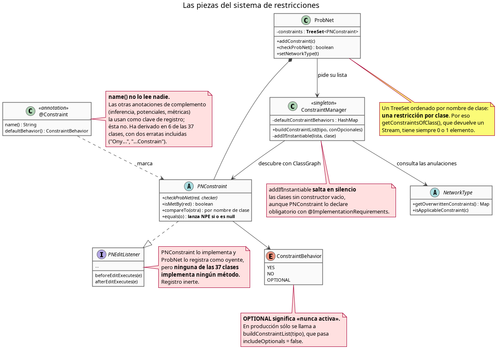
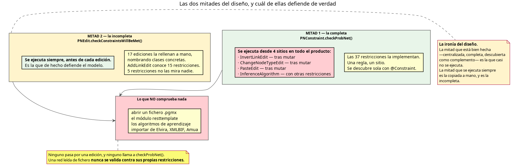
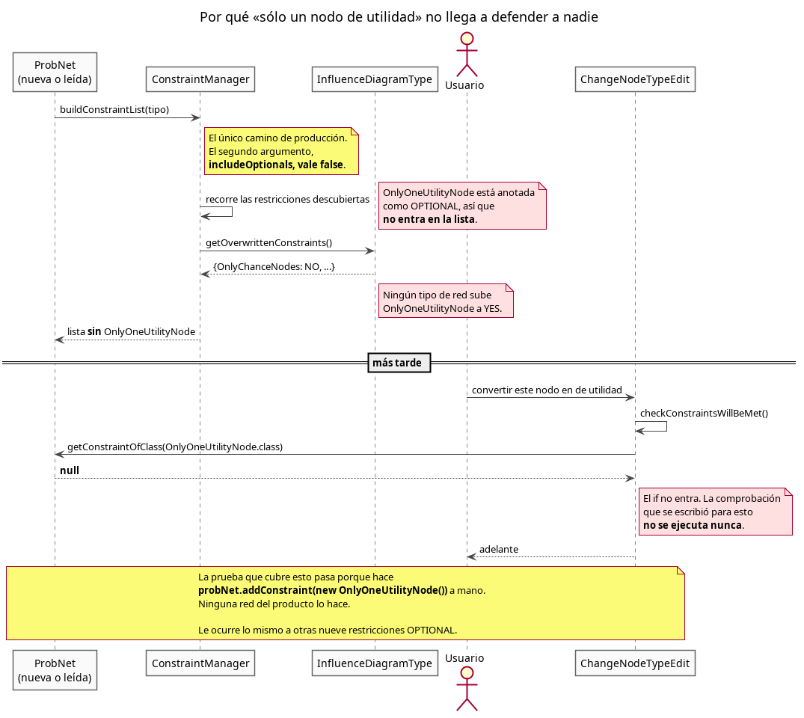
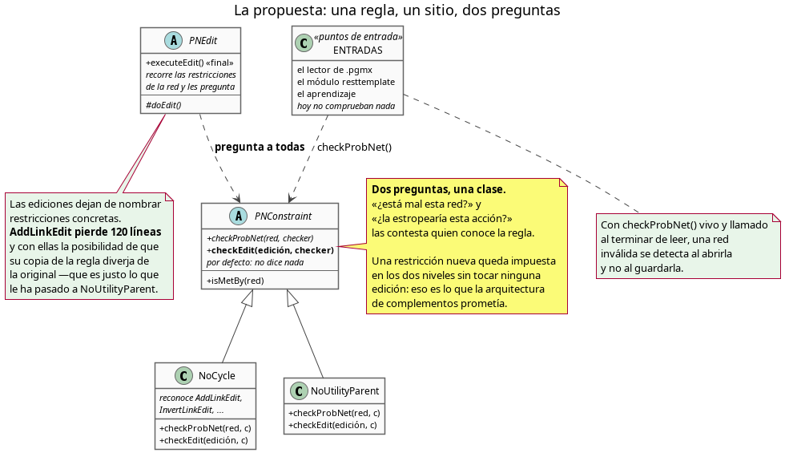
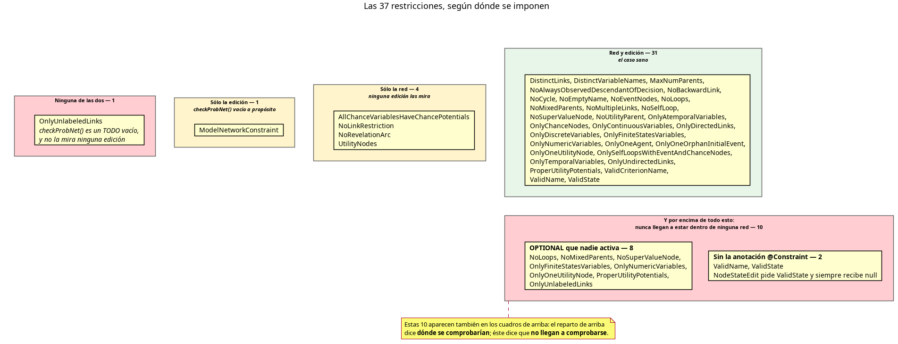

# Análisis de las restricciones (la jerarquía de `PNConstraint`)

**Fecha:** 5 de agosto de 2026 · **Rama:** `development` · **Revisión de partida:** `7fba539`

**Documentos hermanos:** [análisis de las ediciones](../analisis-ediciones/analisis-ediciones.md) ·
[análisis de arquitectura](../analisis-arquitectura/analisis-arquitectura.md)

---

## 1. Qué he mirado, y cómo

He revisado las **37 restricciones** que descienden de `PNConstraint`, más las cuatro piezas que
las gobiernan: la clase base, `ConstraintManager`, la anotación `@Constraint`, el enumerado
`ConstraintBehavior`, y el trozo de `ProbNet` y de `NetworkType` que las guarda y las activa.

Para cada restricción he comprobado tres cosas: **si su `checkProbNet` hace algo**, **si alguna
edición la consulta**, y —la pregunta que resultó ser la decisiva— **si llega a estar dentro de
alguna red real**.

> **La misma limitación que en el informe anterior.** El proyecto exige JDK 25 (*Java Development
> Kit*) y en esta máquina sólo hay JDK 21, así que no he compilado ni ejecutado nada. Todo está
> leído del código. Cada afirmación sobre lo que ocurre o no ocurre en el producto la he seguido
> hasta la línea que la decide, y digo cuál es; conviene confirmarla con una prueba antes de tocar
> nada.

---

## 2. Cómo funciona hoy



El recorrido previsto es limpio. Una restricción se anota con `@Constraint`, el `ConstraintManager`
la descubre en el classpath con ClassGraph, el tipo de red dice si la quiere, y `ProbNet` la guarda
en un conjunto ordenado. Después, dos preguntas la interrogan: «¿está mal esta red?»
(`checkProbNet`) y «¿la estropearía esta acción?» (a través de `PNEdit`).

Es un buen diseño. El problema es que **de las dos preguntas, la que está bien implementada casi
nunca se hace**.

---

## 3. Los problemas de diseño

### R1 — La mitad centralizada del diseño casi no se ejecuta



`checkProbNet` es el método que las 37 restricciones implementan. Es la parte buena del diseño: una
regla, un sitio, descubierta sola. Busqué quién la ejecuta. En todo el producto, fuera de las
pruebas, hay **cuatro llamadas**:

| Dónde | Cuándo |
|---|---|
| [`InvertLinkEdit.java:131`](../../../core/src/main/java/org/openmarkov/core/action/base/linkEdits/InvertLinkEdit.java#L131) | dentro de `doEdit()`, **después** de haber invertido el enlace |
| [`ChangeNodeTypeEdit.java:80`](../../../gui/src/main/java/org/openmarkov/gui/action/ChangeNodeTypeEdit.java#L80) | dentro de `doEdit()`, **después** de haber cambiado el tipo |
| [`PasteEdit.java:154`](../../../gui/src/main/java/org/openmarkov/gui/action/PasteEdit.java#L154) | en una edición «verificadora», **después** de haber pegado |
| [`InferenceAlgorithm.java:163`](../../../core/src/main/java/org/openmarkov/core/inference/InferenceAlgorithm.java#L163) | con las restricciones *del algoritmo*, no con las de la red |

Y `ProbNet.setNetworkType` la usa para validar el cambio de tipo. Eso es todo.

La consecuencia concreta: **abrir un fichero no comprueba ninguna restricción.** Busqué en el
módulo `io` y no hay una sola llamada. Una red `.pgmx` con un ciclo, con dos nodos de utilidad en un
tipo que admite uno, o con restricciones de enlace en una red bayesiana, se carga sin una palabra.
Lo mismo para `resttemplate` y para los algoritmos de aprendizaje.

Así que la defensa real del modelo recae entera sobre la otra mitad: el
`checkConstraintsWillBeMet` de las ediciones. Que es la copiada a mano, y la incompleta.

> Esto refina el apartado 5 del [análisis de arquitectura](../analisis-arquitectura/analisis-arquitectura.md),
> que decía que cada regla vive escrita dos veces. El matiz que faltaba: **de las dos copias, la
> buena está prácticamente apagada**.

### R2 — Las dos copias ya han divergido, y se puede señalar dónde

No es un riesgo teórico. Encontré dos divergencias concretas:

**`NoUtilityParent`.** La excepción se declara así:

```java
public CannotHaveUtilityParent(NoUtilityParent constraint, Node child, Node utilityNode)
```

`NoUtilityParent.checkProbNet` la construye bien: `(this, child, utilityNode)`. `AddLinkEdit` la
construye con los dos nodos **cambiados de sitio**:

```java
// AddLinkEdit.java:133-138 — node1 es el padre de utilidad, node2 el hijo
if (node1.getNodeType() == NodeType.UTILITY && node2.getNodeType() != NodeType.UTILITY) {
    constraintChecker.addException(new ConstraintViolatedException.CannotHaveUtilityParent(constraint, node1, node2));
}
```

El mensaje de rechazo nombra al revés a los dos nodos.

**`ValidState`.** Las dos copias de «no puede haber dos estados con el mismo nombre» no coinciden en
las mayúsculas: `existState` (la vía de la edición) compara con `equalsIgnoreCase`, y `checkProbNet`
(la vía de la red) compara con igualdad exacta a través de las claves de un `HashMap`. Añadir «Yes»
donde ya hay «yes» se rechaza por una vía y pasa por la otra.

### R3 — `OPTIONAL` significa, en la práctica, «nunca activa»

Éste es el hallazgo con más consecuencias, y no es evidente leyendo ninguna clase por separado.

`ConstraintManager.buildConstraintList` tiene dos versiones: una con `includeOptionals` y otra sin
él. **La versión con opcionales sólo la llaman las pruebas.** En producción, `ProbNet` llama siempre
a `buildConstraintList(tipo)`, que pasa `includeOptionals = false`.

Así que una restricción marcada `OPTIONAL` sólo entra en una red si un tipo de red la sube a `YES`,
o si alguien la añade a mano con `addConstraint`. Fui a comprobar cuáles:

| Restricción `OPTIONAL` | ¿Cómo entra? |
|---|---|
| `AllChanceVariablesHaveChancePotentials` | `MDPType` la sube a `YES` |
| `UtilityNodes` | `MDPType` la sube a `YES` |
| `MaxNumParents` | la añaden cinco algoritmos de aprendizaje |
| `ModelNetworkConstraint` | la añade `LearningManager` |
| `OnlyDiscreteVariables` | la añade el diálogo de propiedades de la red |
| `OnlyContinuousVariables` | la añade el diálogo de propiedades de la red |
| `NoLoops` | **nadie** |
| `NoMixedParents` | **nadie** |
| `NoSuperValueNode` | **nadie** |
| `OnlyFiniteStatesVariables` | **nadie** |
| `OnlyNumericVariables` | **nadie** |
| `OnlyOneUtilityNode` | **nadie** |
| `ProperUtilityPotentials` | **nadie** |
| `OnlyUnlabeledLinks` | **nadie** |

**Ocho de las catorce `OPTIONAL` no están dentro de ninguna red del producto.** Y varias de ellas sí
las consultan las ediciones, que reciben `null` y siguen adelante.

(Súmense las dos del apartado 4.1 que no llevan la anotación `@Constraint` —`ValidName` y
`ValidState`— y son **diez** las restricciones que no llegan a estar en ninguna red. Es la cifra que
usa el anexo.)

El caso más claro es `OnlyOneUtilityNode`:



El commit `e9341ec` del 30 de julio hizo bien un trabajo necesario —`AddNodeEdit` y
`ChangeNodeTypeEdit` rechazan ahora el segundo nodo de utilidad—, y su prueba pasa. Pasa porque la
prueba hace `probNet.addConstraint(new OnlyOneUtilityNode())` en su preparación. Ninguna red del
producto lo hace, así que `getConstraintOfClass(OnlyOneUtilityNode.class)` devuelve `null` y el `if`
no llega a entrar.

No es un defecto de aquel trabajo: es la capa de debajo la que no entrega la restricción. Pero
significa que **una prueba verde sobre una restricción no dice que la restricción defienda a nadie**,
y que hoy no hay forma de notarlo.

### R4 — Cada restricción se registra como oyente de ediciones, y ninguna escucha

`PNConstraint implements PNEditListener`, y `ProbNet.addConstraint` la da de alta:

```java
public void addConstraint(PNConstraint constraint) {
    constraints.add(constraint);
    pNESupport.addListener(constraint);
}
```

Busqué si alguna de las 37 implementa alguno de los seis métodos del oyente. **Ninguna.** Es un
registro inerte, resto de un diseño anterior, tal como ya apuntaba el análisis de arquitectura. El
coste vivo es pequeño pero real: `PNEdit.executeEdit()` recorre la lista de oyentes tres veces por
edición, y esa lista lleva una decena larga de restricciones que no hacen nada.

Y hay una fuga. Tres sitios sacan constraints del conjunto **sin** pasar por `removeConstraint`, que
es quien desregistra el oyente:

```java
// ProbNet.setNetworkType, última línea
this.constraints.removeIf(constraint -> !newNetworkType.isApplicableConstraint(constraint));
```

```java
// ProbNet.removeAllConstraints
constraintsToRemove.forEach(constraints::remove);
```

Después de cambiar el tipo de una red varias veces, `PNESupport` conserva oyentes de restricciones
que ya no están en la red.

### R5 — La anotación lleva un nombre que nadie lee, y ya ha derivado

```java
public @interface Constraint {
    String name();
    ConstraintBehavior defaultBehavior();
}
```

`ConstraintManager` lee `defaultBehavior()`. **`name()` no lo lee nadie.** Las otras anotaciones de
complemento del proyecto sí usan su `name()` como clave de registro: `InferenceManager`,
`ProbDensFunctionManager`, `MetricManager`. Ésta no.

Como nadie lo lee, ha derivado en 6 de las 37 clases, con dos erratas incluidas:

| Clase | `name` declarado |
|---|---|
| `NoBackwardLink` | `"NoBackwardLinks"` |
| `NoSelfLoop` | `"NoSelfLoops"` |
| `NoSuperValueNode` | `"NoSuperValueNodes"` |
| `OnlyUnlabeledLinks` | `"UnlabeledLinks"` |
| `OnlyOneOrphanInitialEvent` | `"InitialNodeConstrain"` ← errata |
| `OnlySelfLoopsWithEventAndChanceNodes` | `"OnySelfLoopsWithEventAndChanceNodes"` ← errata |

### R6 — La firma promete más de lo que tres implementaciones aceptan

```java
public abstract void checkProbNet(GraphNetwork probNet, ConstraintChecker constraintChecker);
```

`GraphNetwork` es una interfaz. Tres implementaciones hacen un molde a algo más concreto sin
comprobarlo:

- `ProperUtilityPotentials`: `(ProbNet) probNet`
- `UtilityNodes`: `(ProbNet) probNet` y `((PotentialNetwork) probNet).getPotentials()`
- `OnlyOneAgent`: `(ProbNet) probNet`

`ValidCriterionName` lo hace bien, y merece citarse como el modelo a seguir:

```java
if (!(probNet instanceof ProbNet net)) {
    return;
}
```

**No es un defecto vivo:** hoy `ProbNet` es la única clase que implementa `GraphNetwork`, así que el
molde nunca falla. Es una promesa de generalidad que el día que alguien añada una segunda
implementación se rompe en tres sitios a la vez.

### R7 — El mecanismo genérico del fichero no funciona, y por eso hay un caso especial

El formato `.pgmx` tiene una sección `<AdditionalConstraints>` para guardar las restricciones que no
vienen del tipo de red. Sus tres piezas no encajan:

- **El escritor** ([`PGMXWriter_0_2:324`](../../../io/src/main/java/org/openmarkov/io/probmodel/writer/PGMXWriter_0_2.java#L324)) recorre desde `i = 1`, saltándose la primera; sólo escribe
  las restricciones que el tipo de red **no** admite —que son justo las que `setNetworkType` acaba
  de quitar—; y escribe `constraint.toString()`, que en `PNConstraint` devuelve `this.localize()`,
  es decir una frase para el usuario: `"No cycles paths are allowed."`.
- **El lector** ([`PGMXReader_0_2:572`](../../../io/src/main/java/org/openmarkov/io/probmodel/reader/PGMXReader_0_2.java#L572)) hace `Class.forName(nombre)` con ese atributo. Una frase no es
  un nombre de clase.
- **El otro lector** ([`PGMXReader_0_2:544`](../../../io/src/main/java/org/openmarkov/io/probmodel/reader/PGMXReader_0_2.java#L544)) tiene el cuerpo muerto: la condición que lo guarda,
  `parseXMLElement`, devuelve `false` siempre, y dentro sólo hay `// TODO`.

**Tampoco es un defecto vivo**, y merece la pena decir por qué: el filtro del escritor hace que no
se escriba nada, así que el lector nunca recibe la frase que no sabría leer. Las dos mitades están
rotas de forma que se cancelan.

Y hay una consecuencia visible: como el mecanismo general no sirve, las dos únicas restricciones que
de verdad hacía falta guardar tienen **un camino propio escrito a mano** —`writeVariableType`, que
inventa un elemento `<VariableType>` sólo para `OnlyDiscreteVariables` y `OnlyContinuousVariables`—.
Ese camino sí funciona; escribe, eso sí, una cadena localizada dentro del fichero, con lo que el
formato depende del idioma de la interfaz.

---

## 4. Defectos concretos

### 4.1 Restricciones que no imponen nada

| # | Clase | Qué pasa |
|---|---|---|
| C1 | `OnlyUnlabeledLinks` | `checkProbNet` es `// TODO Auto-generated method stub` con el cuerpo vacío, y ninguna edición la consulta. No impone nada por ninguna de las dos vías. |
| C2 | `ValidState` | No tiene `@Constraint`, y nadie hace `new ValidState()`. Nunca está en una red. Por tanto **todo el `checkConstraintsWillBeMet` de `NodeStateEdit` es código muerto**: es su único contenido. El equipo ya lo detectó para el renombrado (commit `284cd46`, que movió la regla a `Variable`), pero la clase y la consulta siguen ahí, y las otras acciones sobre estados no tienen sustituto. |
| C3 | `ValidName` | Igual: sin anotación y sin instanciar. Las líneas 60–67 de `NodeBaseNameEdit` son código muerto. **No abre un hueco**, porque las líneas 50–54 hacen la misma comprobación a través de `DistinctVariableNames`, que sí está. Es redundancia, no agujero. |
| C4 | `ModelNetworkConstraint` | El espejo de C1: `checkProbNet` vacío a propósito, porque sólo trabaja por la vía de la edición (`canEditBeDone`). Funciona, pero es la única restricción del sistema que sólo vive en media jerarquía. |

### 4.2 Fallos que pueden lanzar

| # | Dónde | Qué pasa |
|---|---|---|
| C5 | `UtilityNodes` | `potential.getVariable(0)` sobre cada potencial de la red. Una red puede tener potenciales constantes, sin variables (el `CLAUDE.md` los menciona explícitamente). Con uno de ésos, excepción. Sólo la lleva `MDPType`. |
| C6 | `AllChanceVariablesHaveChancePotentials` | `potential.getVariables().getFirst()` con el mismo problema, y también sólo en `MDPType`. |
| C7 | `PNConstraint.equals` | `this.getClass() != paramObject.getClass()` lanza `NullPointerException` con `null`. El contrato de `equals` obliga a devolver `false`. Hoy no se alcanza porque el conjunto de `ProbNet` es un `TreeSet`, que usa `compareTo`. |
| C8 | `OnlyOneAgent` | Molde sin comprobar (R6), y la regla es «viola si `getAgents()` no es `null`»: una lista de agentes vacía pero no nula la viola. Es `YES` por defecto, así que la lleva casi toda red. |

### 4.3 Ruido, duplicidad y código muerto

- **`NoCycle` y `NoMultipleLinks` informan cada violación dos veces.** `NoCycle` recorre cada nodo y
  cada hijo, así que un ciclo A→B→A se denuncia desde A y desde B; `NoMultipleLinks` recorre cada
  enlace desde sus dos extremos. `ConstraintChecker` las guarda en un `HashSet`, que parece pensado
  para fundirlas, pero las excepciones no definen `equals` ni `hashCode`, así que **no las funde**.
  El usuario ve el mismo error repetido. (Es el mismo defecto que el punto **M15** del
  [análisis de las ediciones](../analisis-ediciones/analisis-ediciones.md).)
- **`NoEmptyName.checkProbNet` y `ValidName.checkProbNet` son el mismo código**, línea por línea.
- **`ProperUtilityPotentials` y `UtilityNodes` se solapan**: las dos denuncian «la red no tiene
  nodos de utilidad», con excepciones distintas.
- **`NoBackwardLink.allowedLink`**: el comentario dice *«si la primera es temporal y la segunda no,
  la primera debe pertenecer al corte cero»*. El código devuelve `true` en cuanto la segunda es
  atemporal, sin mirar el corte. El comentario describe una regla que no está implementada.
- **`NoMixedParents.parentNodeIsNotMixed`** es público, estático, y no lo llama nadie.
- **`ProbNet.removeAllConstraints(Class<PNConstraint>)`** tiene una firma que no admite ninguna clase
  real: `NoCycle.class` es `Class<NoCycle>`, no `Class<PNConstraint>`. No compila con ningún
  argumento útil. Tampoco tiene llamantes, igual que `removeConstraints`.
- **`ConstraintManager.addIfInstantiable` salta en silencio** las restricciones sin constructor sin
  argumentos, mientras `PNConstraint` declara ese constructor obligatorio con
  `@ImplementationRequirements`. La clase dice una cosa y el gestor tolera la contraria. Hoy afecta a
  `MaxNumParents` y `ModelNetworkConstraint`, que en efecto se construyen a mano — pero el silencio
  es el mismo que tendría una restricción mal escrita.
- **`ConstraintManager.buildConstraintList` ignora `OPTIONAL`** en las anulaciones del tipo de red:
  sólo trata `YES` y `NO`. Un tipo que declarase una restricción `OPTIONAL` no conseguiría nada.
  Latente: hoy ningún tipo lo declara.
- **[`PGMXReader_0_2:581`](../../../io/src/main/java/org/openmarkov/io/probmodel/reader/PGMXReader_0_2.java#L581)** instancia por reflexión una clase cuyo nombre viene del fichero, y el
  molde a `PNConstraint` ocurre **después** de que su constructor se haya ejecutado. Hoy es
  inalcanzable porque el escritor no produce esa sección (R7), pero si se arregla el formato conviene
  comprobar el nombre contra la lista de restricciones conocidas antes de cargar la clase, y no
  después.

---

## 5. Relación con los otros dos análisis

Los tres informes están mirando el mismo problema desde tres distancias.

**El [análisis de arquitectura](../analisis-arquitectura/analisis-arquitectura.md)** lo vio desde
arriba (apartado 5): *cada restricción vive escrita dos veces*. Y en el apartado 3: *el sistema de
complementos promete una extensibilidad que ningún eslabón cumple*.

**El [análisis de las ediciones](../analisis-ediciones/analisis-ediciones.md)** lo vio desde la otra
orilla (problema **D2**): las ediciones conocen restricciones concretas, `AddLinkEdit` nombra quince
clases a mano, y hay una tercera copia de algunas reglas en los validadores de la ventana.

**Este informe cierra el triángulo con el dato que faltaba:** de las dos copias, la centralizada
—`checkProbNet`, la que las 37 restricciones implementan bien— **se ejecuta desde cuatro sitios en
todo el producto**, tres de ellos dentro de una edición y después de haber mutado la red. La copia
dispersa es la única que defiende de verdad.

Y añade un segundo dato que ninguno de los dos anteriores podía ver, porque sólo aparece al cruzar
el gestor con los tipos de red: **diez restricciones no llegan a estar dentro de ninguna red**, así
que parte del trabajo que las ediciones sí hacen bien tampoco llega a ejecutarse.

Las tres propuestas convergen en la misma. El análisis de arquitectura la formuló primero:

> Añadir a `PNConstraint` un método incremental opcional `checkEdit(PNEdit)` (…) y que
> `PNEdit.executeEdit` recorra `probNet.getConstraints()` invocándolo.

Este informe la sostiene y le añade dos condiciones sin las cuales no basta.

---

## 6. Propuesta



### P1 — `checkEdit` en la restricción (la propuesta común a los tres informes)

```java
public abstract class PNConstraint {
    public abstract void checkProbNet(GraphNetwork probNet, ConstraintChecker c);
    public void checkEdit(PNEdit edit, ConstraintChecker c) { }   // nuevo, vacío por defecto
}
```

`PNEdit.tryConstraintsWillBeMet()` recorre las restricciones de la red y le pasa la edición a cada
una. Las ediciones dejan de nombrar clases de restricción; `AddLinkEdit` pierde 120 líneas y, con
ellas, la posibilidad de que su copia diverja —que es exactamente lo que le ha pasado a
`NoUtilityParent` (R2)—.

### P2 — Encender la mitad apagada

`checkEdit` no sirve de nada si la red puede entrar inválida por la puerta de atrás. Hay que llamar a
`checkProbNet` al terminar de leer un fichero, y decidir qué hacer con una red que no lo pasa:
rechazarla, o abrirla avisando. Es una decisión de producto, no técnica, y no la tomo yo. Pero hoy
no se toma en absoluto: se abre en silencio.

Con eso, `resttemplate` y el aprendizaje quedan cubiertos por el mismo camino.

### P3 — Decidir qué significa `OPTIONAL`

Ahora mismo significa «nunca activa», que casi con seguridad no era la intención. Tres salidas
posibles, y la elección es del equipo:

1. **Las restricciones opcionales las activa el tipo de red.** Entonces hay que repasar las ocho
   huérfanas y decidir en qué tipos van; las que no vayan a ninguno, se borran.
2. **Las activa el usuario**, desde las propiedades de la red, como ya ocurre con
   `OnlyDiscreteVariables` y `OnlyContinuousVariables`. Entonces hace falta la interfaz para las
   demás, y que el formato de fichero las guarde (R7).
3. **`OPTIONAL` desaparece** y cada restricción es `YES` o `NO` por tipo.

Sea cual sea, hace falta una prueba que recorra todos los tipos de red y afirme que cada restricción
está en alguno. Es corta, y es la que habría avisado de que `OnlyOneUtilityNode` no llegaba a nadie.

### P4 — Limpieza que no depende de nada de lo anterior

Borrar `implements PNEditListener` de `PNConstraint` y el `addListener` de `addConstraint` (R4);
arreglar las dos fugas de oyentes; borrar `name()` de la anotación o empezar a usarlo (R5); guardar
los tres moldes de R6; borrar `ValidName`, `ValidState`, `OnlyUnlabeledLinks`, `removeAllConstraints`
y `removeConstraints`, o darles un uso.

---

## 7. Orden de trabajo que propongo

El orden es mío; qué se hace y quién lo hace es decisión del equipo.

**Primero, lo que engaña.** P3, o al menos la prueba que lo destapa. Mientras `OPTIONAL` signifique
«nunca activa», cualquier trabajo que se haga sobre una restricción opcional —incluido el que ya se
hizo en julio— parece hecho y no lo está. Esto es más urgente que cualquier defecto de esta lista,
porque afecta a la fiabilidad de las pruebas.

**Segundo, las divergencias ya visibles.** R2: los argumentos cambiados de `NoUtilityParent` y las
mayúsculas de `ValidState`. Dos arreglos de una línea cada uno.

**Tercero, P2.** Comprobar la red al leerla. Es una llamada y una decisión de producto, y cierra el
agujero por el que hoy entra cualquier cosa.

**Cuarto, P1**, que es el cambio de fondo y el que los tres informes piden. Nótese que **P1 y la
propuesta P3 del análisis de las ediciones son el mismo trabajo**: si se hace una vez, sirve para las
dos.

**En cualquier momento y aparte:** los defectos de 4.2 y la limpieza de 4.3 y P4.

---

## 8. Anexo — las 37 restricciones



Leyenda: **Comport.** = `defaultBehavior` · **Red** = su `checkProbNet` hace algo ·
**Edición** = número de ediciones que la consultan · **Activa** = está dentro de alguna red del
producto

| Restricción | Comport. | Red | Edición | Activa | Nota |
|---|---|:-:|:-:|:-:|---|
| `AllChanceVariablesHaveChancePotentials` | OPTIONAL | ✓ | 0 | MDP | **C6** |
| `DistinctLinks` | YES | ✓ | 2 | ✓ | |
| `DistinctVariableNames` | YES | ✓ | 3 | ✓ | |
| `MaxNumParents` | OPTIONAL | ✓ | 1 | aprendizaje | anula `compareTo`, así que caben varias |
| `ModelNetworkConstraint` | OPTIONAL | ✗ | 4 | aprendizaje | **C4** |
| `NoAlwaysObservedDescendantOfDecision` | YES | ✓ | 2 | ✓ | |
| `NoBackwardLink` | YES | ✓ | 1 | ✓ | comentario ≠ código (4.3) |
| `NoCycle` | YES | ✓ | 2 | ✓ | denuncia dos veces (4.3) |
| `NoEmptyName` | YES | ✓ | 2 | ✓ | igual que `ValidName` (4.3) |
| `NoEventNodes` | YES | ✓ | 1 | ✓ | |
| `NoLinkRestriction` | YES | ✓ | **0** | ✓ | sólo la impone un validador de la ventana |
| `NoLoops` | OPTIONAL | ✓ | 1 | **✗** | |
| `NoMixedParents` | OPTIONAL | ✓ | 2 | **✗** | método estático muerto (4.3) |
| `NoMultipleLinks` | YES | ✓ | 2 | ✓ | denuncia dos veces (4.3) |
| `NoRevelationArc` | YES | ✓ | **0** | ✓ | |
| `NoSelfLoop` | YES | ✓ | 2 | ✓ | `name` derivado (R5) |
| `NoSuperValueNode` | OPTIONAL | ✓ | 1 | **✗** | `name` derivado (R5) |
| `NoUtilityParent` | YES | ✓ | 1 | ✓ | **R2 — argumentos cambiados** |
| `OnlyAtemporalVariables` | YES | ✓ | 1 | ✓ | |
| `OnlyChanceNodes` | NO | ✓ | 1 | bayesiana, Markov, DBN | |
| `OnlyContinuousVariables` | OPTIONAL | ✓ | 1 | diálogo | |
| `OnlyDirectedLinks` | YES | ✓ | 1 | ✓ | |
| `OnlyDiscreteVariables` | OPTIONAL | ✓ | 2 | diálogo | |
| `OnlyFiniteStatesVariables` | OPTIONAL | ✓ | 2 | **✗** | |
| `OnlyNumericVariables` | OPTIONAL | ✓ | 2 | **✗** | |
| `OnlyOneAgent` | YES | ✓ | 1 | ✓ | **C8** |
| `OnlyOneOrphanInitialEvent` | NO | ✓ | 2 | DES | `name` derivado, errata (R5) |
| `OnlyOneUtilityNode` | OPTIONAL | ✓ | 2 | **✗** | **R3 — el caso del diagrama** |
| `OnlySelfLoopsWithEventAndChanceNodes` | NO | ✓ | 1 | DES | `name` derivado, errata (R5) |
| `OnlyTemporalVariables` | NO | ✓ | 1 | DBN, DynamicLimid, POMDP | |
| `OnlyUndirectedLinks` | NO | ✓ | 1 | Markov | |
| `OnlyUnlabeledLinks` | OPTIONAL | ✗ | 0 | **✗** | **C1 — no impone nada por ninguna vía** |
| `ProperUtilityPotentials` | OPTIONAL | ✓ | 2 | **✗** | se solapa con `UtilityNodes` (4.3) |
| `UtilityNodes` | OPTIONAL | ✓ | **0** | MDP | **C5** |
| `ValidCriterionName` | YES | ✓ | 1 | ✓ | el único que comprueba el molde bien (R6) |
| `ValidName` | sin anotar | ✓ | 1 | **✗** | **C3** |
| `ValidState` | sin anotar | ✓ | 1 | **✗** | **C2** |
