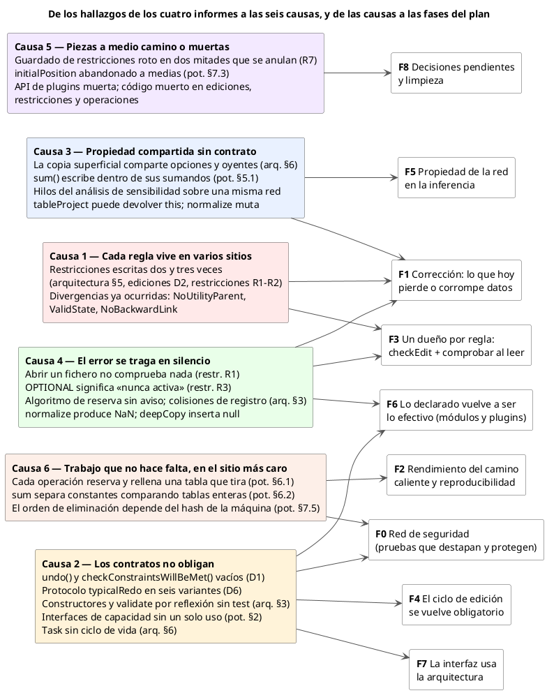
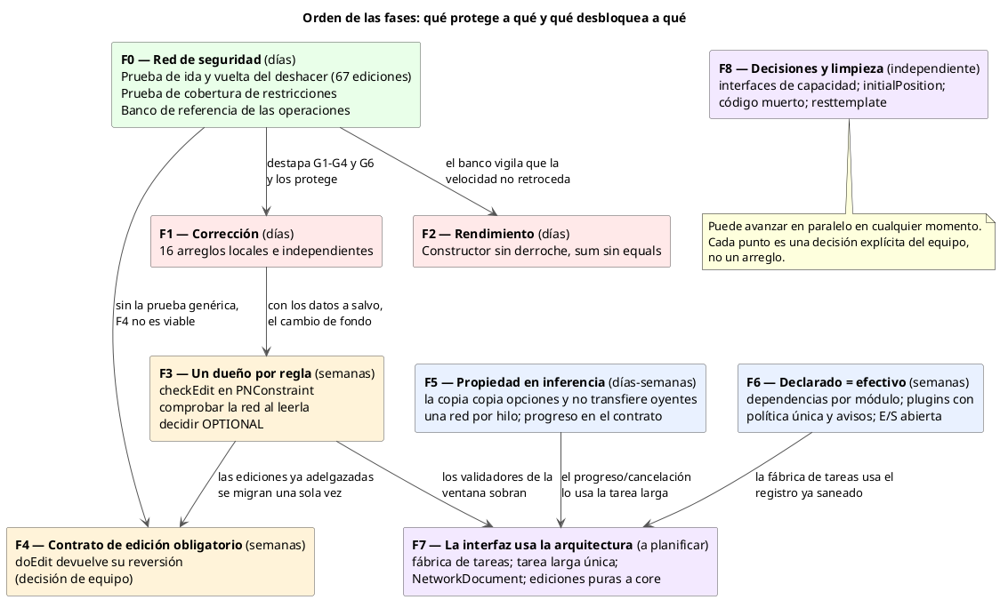
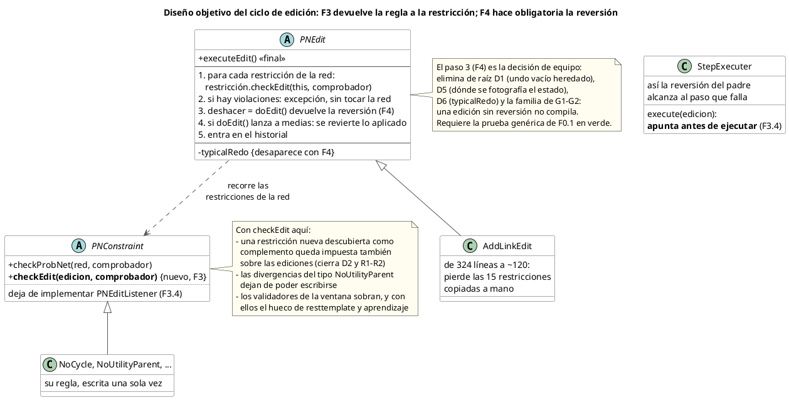
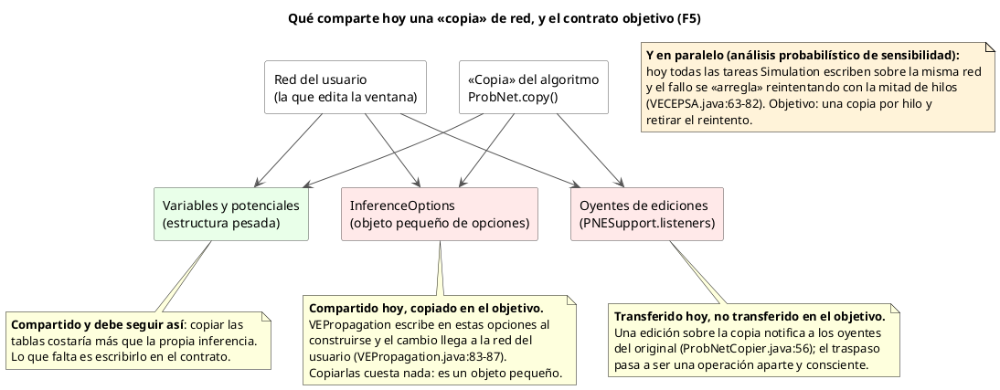

# Plan de cambios sobre OpenMarkov

**Rama:** `development`. **Última actualización:** 4 de septiembre de 2026.

Este documento es la lista única de lo que hay que cambiar en OpenMarkov y de lo que ya se ha cambiado.
Reúne dos clases de trabajo que nacieron por separado:

| Origen | Fecha | Qué aportó |
|---|---|---|
| Cinco informes de análisis, leídos y verificados | 4 al 7 de agosto de 2026 | El diagnóstico de fondo y el plan por fases |
| Dos revisiones de código del paquete de potenciales | 3 de septiembre de 2026 | Treinta fallos concretos, comprobados ejecutándolos |

**Informes de partida:**
[arquitectura](../analisis-arquitectura/analisis-arquitectura.md) ·
[ediciones](../analisis-ediciones/analisis-ediciones.md) ·
[restricciones](../analisis-restricciones/analisis-restricciones.md) ·
[potenciales](../analisis-potenciales/analisis-potenciales.md) ·
[evidencia imposible](../analisis-evidencia-imposible/analisis-evidencia-imposible.md)

## Cómo leerlo

**Cada punto de trabajo lleva una casilla.** Marcada quiere decir entregado, y debajo lleva la fecha, el
commit y lo que quedó fuera. Sin marcar quiere decir pendiente, y lo que dice el punto es lo que hay que
hacer, no lo que está mal: eso está en el apéndice.

**Cada hallazgo tiene un identificador** y su texto completo en el apéndice, al final. Los de los informes
de agosto llevan las letras de su informe: `D`, `G` y `M` de ediciones, `R` y `C` de restricciones, `E` de
evidencia imposible, y `§` de arquitectura o de potenciales. Los de la revisión de código de septiembre
llevan un prefijo de dos letras: `R` de revisión más la inicial del paquete. Los de la revisión de los
potenciales son `RP1` a `RP31`.

**No hay enlaces internos.** Los identificadores se citan en texto, no como enlace, porque el editor con
el que se trabaja este documento muestra en crudo las anclas que harían falta. Para ir de un
identificador a su entrada, se busca por él.

El orden de las fases es una propuesta. Qué se hace, cuándo y quién lo hace es decisión del equipo; los
puntos que son decisiones de producto, y no técnicas, están marcados como tales.

---

## 1. De dónde sale cada cosa


### 1.1 Cómo se verificaron los informes de agosto

Para cada informe se han abierto los ficheros y líneas citados en sus hallazgos y se han re-ejecutado sus recuentos (número de clases, de llamadas, de líneas). La verificación del apartado 1 es **lectura dirigida del código, no ejecución**: las afirmaciones sobre comportamiento en ejecución siguen la cadena de llamadas en el código fuente.

**Corrección del 6 de agosto de 2026, por la tarde.** Este apartado decía que Maven (la herramienta que construye el proyecto) no estaba disponible en la máquina. Sí lo está —Maven 3.9.9 sobre el JDK 25 que el proyecto exige—, y la suite entera, sin excluir las pruebas lentas, pasa en siete minutos y medio. Así que la limitación era del método de verificación, no de la máquina, y desde la fase 0 ya no rige: las pruebas escritas allí **ejecutan** parte de lo que este apartado sólo había leído, y confirman G1, G2, G4 y la tabla de R3 corriendo el programa, no leyéndolo. Lo que sigue sin ejecutarse queda dicho en cada punto.

El informe de los potenciales se escribió hoy mismo leyendo directamente el código, así que su verificación y su redacción son el mismo acto; aun así, sus afirmaciones centrales (la suma que modifica sus sumandos, el intercambio de argumentos en los modelos canónicos, la normalización que divide por cero, el doble relleno del constructor) se han vuelto a abrir al preparar este plan.

### 1.2 Resultado global

**Los cuatro informes salen bien parados.** De todas las afirmaciones re-abiertas, ninguna resultó inventada y solo una necesita un matiz que cambia su urgencia (G8, abajo). Varios recuentos comprobados al número exacto dan idea de la fiabilidad general: 73 clases de edición y 19 de 67 mencionadas en pruebas (ediciones); 37 restricciones y las 15 clases nombradas a mano en `AddLinkEdit` (restricciones); 1.308, 1.385 y 1.770 líneas de las tres clases grandes, 47 paquetes exportados por `core`, 17 ficheros y 1.243 líneas de la biblioteca interna (arquitectura); las dos erratas de los nombres de anotación, letra por letra.

| Informe | Hallazgos re-abiertos | Confirmados | Con matiz | Corregidos |
|---|---|---:|---:|---:|
| Arquitectura (§1-§9) | todos los apartados, muestreando cada afirmación citada | casi todos | 3 | 2 recuentos menores |
| Ediciones (D1-D7, G1-G8, M1-M15, limpieza) | todos salvo trivialidades listadas en 1.4 | todos menos uno | 1 (G8) | 0 |
| Restricciones (R1-R7, C1-C8, limpieza) | todos | todos | 0 | 0 |
| Potenciales (§5-§7) | los centrales, re-abiertos hoy | todos | 0 | 0 |

### 1.3 Las correcciones y matices encontrados

**El matiz que importa — G8 (ediciones).** La afirmación «invertir un enlace actualizando potenciales puede crear un ciclo» es cierta a medias. La edición `InvertLinkAndUpdatePotentialsEdit` no comprueba, en efecto, ninguna restricción (verificado: cero apariciones de comprobación en la clase). Pero el único sitio que la dispara es el menú contextual del enlace, y ese menú **deshabilita la opción** tras pasar un validador ([`LinkContextualMenu.java:100`](../../../gui/src/main/java/org/openmarkov/gui/menutoolbar/menu/LinkContextualMenu.java#L100) → `LinkInversionWithPotentialsUpdateValidator.validNewLinks`, que ejecuta la comprobación previa de `InvertLinkEdit`, la cual sí incluye el ciclo). Es decir: desde la ventana, hoy, el ciclo se bloquea — **por una tercera copia de la regla**, que es exactamente la enfermedad que el informe describe (D2). El defecto de diseño queda íntegro; la pérdida de datos inmediata desde la ventana, no. Para cualquier llamador que no pase por ese menú (otro módulo, código futuro), el agujero es real.

**Correcciones menores al informe de arquitectura:**

- §4 dice «21 ediciones viven en `gui` junto a las 39 de `core`». El recuento correcto es el del informe de ediciones: 52 ficheros en `core` (5 de andamiaje + 7 de enlaces + 40 del grueso) y 21 en `gui`, 73 en total.
- §2 cuenta tres restos de escritorio en `core`; son cuatro: `PurposeEdit` importa `JOptionPane` sin usarlo (borrar el import es trivial). Los otros tres, confirmados en sus líneas exactas.
- §8c: los ficheros de producción que usan `OpenMarkovLogger` son hoy 12, no 13 (los otros dos conteos, 47 con `System.out` y 36 con `printStackTrace`, exactos).
- §7: los accesos externos a `strategyTrees` son hoy 39 en 12 ficheros (el informe decía 38 en 11); misma foto.
- §8b, un matiz favorable: `checkStructure(URL)` —la validación del camino de apertura— tiene el cuerpo comentado, confirmado; pero existe una sobrecarga con flujo de entrada (`checkStructure(String, InputStream)`) que sí valida contra el esquema. Reactivar el camino principal es apoyarse en ella, no escribirla de cero.

**Corrección al informe de potenciales** (7 de agosto de 2026, al revisar qué hace la evidencia imposible; corregida ya en el propio informe):

- §5.3 citaba el barrido de NaN de `ChanceVariableElimination` como segunda señal de que los NaN de `normalize` circulan. La división que lo precede no produce NaN — un denominador cero da cero, por convención deliberada y comentada — así que el barrido solo puede limpiar NaN que entren de fuera, y los convierte en ceros en silencio. El defecto de `normalize` queda íntegro; la «señal» era en realidad la máscara que ocultaría sus NaN al llegar a la inferencia.

**Verificaciones que merecen mención por lo que confirman:**

- La cadena completa de G1 (editar una celda de la tabla de probabilidad no se deshace): el `undo()` vacío en [`PNEdit.java:155`](../../../core/src/main/java/org/openmarkov/core/action/base/PNEdit.java#L155), `PotentialChangeEdit` sin anularlo y con su `doEdit()` empezando por quitar el potencial viejo ([`PotentialChangeEdit.java:41-46`](../../../core/src/main/java/org/openmarkov/core/action/core/PotentialChangeEdit.java#L41-L46)), [`ValuesTable:193`](../../../gui/src/main/java/org/openmarkov/gui/component/ValuesTable.java#L193) ejecutando la edición, y `executeEdit()` metiéndola en el historial. Todos los eslabones, confirmados.
- Los tres campos de `AbsorbNodeEdit` que `undo()`/`redo()` leen y nadie asigna (G2): confirmado; `Node.setPotentials(null)` limpia la lista, así que deshacer deja al hijo sin potenciales.
- La mitad apagada de las restricciones (R1): fuera de la propia jerarquía, las llamadas de producción a la comprobación de red completa son las cuatro que dice el informe, tres de ellas *después* de mutar la red; en el módulo de entrada/salida, ninguna.
- `OPTIONAL` = «nunca activa» (R3): la versión de `buildConstraintList` que incluye opcionales solo la llaman las pruebas; `ProbNet` llama siempre a la que las excluye.
- La proyección a red de Markov copiada tres veces (arquitectura §6): los tres métodos son literalmente el mismo, línea a línea.
- La copia superficial comparte las opciones de inferencia y los oyentes (arquitectura §6): confirmado en [`ProbNetCopier.java:56`](../../../core/src/main/java/org/openmarkov/core/model/network/ProbNetCopier.java#L56) y [`ProbNetCopier.java:64-65`](../../../core/src/main/java/org/openmarkov/core/model/network/ProbNetCopier.java#L64-L65), donde además un comentario propio lo reconoce.

### 1.4 Lo que no se ha vuelto a verificar

Trivialidades de los informes originales que se dan por buenas sin re-abrir: en ediciones, M14 (el coste de comprobar restricciones en cada movimiento del ratón), la mutación del array vivo en `EventTablePotentialValueEdit`, las nueve anulaciones de `toString()` y los imports sin uso; en arquitectura, el detalle interno del ciclo de vida de `StochasticPropagation` y `DANEvaluation`, y el campo de progreso sin lector de `VECEPSA`. Ninguna de ellas sostiene por sí sola un punto del plan.

---

### 1.5 Cómo añadir una revisión de código nueva

Este documento está pensado para crecer. Cada revisión de código de un paquete —el siguiente será
`treeadd`— se incorpora así, y en este orden:

1. **Elegir su prefijo**, que es `R` de revisión más la inicial del paquete: `RP` para los potenciales,
   `RT` para `treeadd`. Las letras sueltas están tomadas por los informes de agosto —`D`, `G` y `M` de
   ediciones, `R` y `C` de restricciones, `E` de evidencia imposible, y `P`, que dos de esos informes usan
   para sus propuestas de rediseño—, así que las revisiones de código no usan letras sueltas.
2. **Añadir su apartado al apéndice**, después del último. Un apartado por revisión, con la fecha, el
   commit del código revisado y cómo se comprobó cada hallazgo.
3. **Escribir cada hallazgo** con las cinco cosas que hacen que sirva: qué es, en qué fichero y línea, qué
   se midió al ejecutarlo, quién llega hasta ahí, y cuál sería el arreglo. Un hallazgo que nadie alcanza se
   marca como **nota** y no lleva punto de trabajo, según la regla del proyecto: un defecto inalcanzable es
   una nota, no una tarea.
4. **Repartir sus hallazgos entre las fases** que ya existen, según **lo que ve el usuario**, que es el
   criterio con el que están hechas: dan un número equivocado sin decirlo, estropean lo guardado, contestan
   distinto en cada ejecución, revientan, la interfaz pública ofrece lo que no cumple, o convenciones del
   proyecto. Cada hallazgo se convierte en un punto con casilla, sin marcar.
5. **Añadir su línea a la trazabilidad**, en el apartado 5, para que ningún hallazgo se quede sin destino.
6. **Anotar en el apartado 2 las causas de fondo** que la revisión descubra, si varios de sus hallazgos se
   juntan en una sola decisión mal tomada. Es lo que convierte treinta arreglos en seis.


---

## 2. Las causas, no los síntomas


Los cuatro informes suman más de sesenta hallazgos. Tratarlos como sesenta tareas sueltas repetiría el error que los propios informes señalan: arreglar quince defectos de las ediciones sin tocar el diseño garantiza otros quince el año que viene. Leídos juntos, casi todos los hallazgos son síntomas de seis causas:



*Fuente: [causas-y-fases.puml](causas-y-fases.puml)*

1. **Cada regla vive en varios sitios.** Una restricción de red está escrita en la clase de la restricción, otra vez dentro de cada edición que podría violarla, y a veces una tercera en un validador de la ventana. Las copias ya han divergido (los argumentos cambiados de `NoUtilityParent`, las mayúsculas de `ValidState`).
2. **Los contratos no obligan.** Deshacer tiene el cuerpo vacío y olvidarse no da error; el protocolo de rehacer hay que recordarlo en tres pasos y existe en seis variantes; los constructores que la reflexión exige no los comprueba nadie (la prueba que lo haría está desactivada con 58 incumplimientos); las interfaces de capacidad de los potenciales no las consulta ni una línea.
3. **La propiedad compartida no tiene contrato.** La «copia» de red comparte las opciones y los oyentes del original; la suma de potenciales estratégicos escribe dentro de sus sumandos; los hilos del análisis de sensibilidad comparten una misma red.
4. **El error se traga en silencio.** Abrir un fichero no comprueba ninguna restricción; una restricción `OPTIONAL` no entra nunca en ninguna red; si el algoritmo preferido no aparece, se usa otro sin aviso; una columna de ceros se normaliza a NaN (*not a number*, el valor con que la máquina marca una operación inválida, y que envenena todo producto en el que entra).
5. **Piezas a medio camino o muertas.** El guardado de restricciones en fichero está roto en dos mitades que se cancelan; `initialPosition` es un concepto abandonado que la mitad de las operaciones lee y la otra mitad no; hay una API de complementos muerta junto a la viva, y código sin llamadores en ediciones, restricciones y operaciones.
6. **Trabajo que no hace falta, en el sitio más caro.** Cada resultado de cada operación aritmética reserva y rellena una tabla que tira sin leer; la suma separa los potenciales constantes comparando tablas enteras.

El quinto informe, el de la [evidencia imposible](../analisis-evidencia-imposible/analisis-evidencia-imposible.md), no añade causas nuevas: sus diez hallazgos son síntomas de la 4 —el error se traga en silencio o, peor, se disfraza de fallo del programa— y, en un caso, de la 2 (un rehacer que re-ejecuta sin contrato).

El plan ataca causas: cada fase cierra una (o la parte de una que ya se puede cerrar), y los síntomas de esa causa caen en lote.

---

### Las seis causas que descubrió la revisión de código de septiembre

Los treinta fallos del paquete de potenciales se juntan en seis decisiones que se tomaron muchas veces y
cada vez distinto. Arreglar la causa se lleva por delante varios hallazgos a la vez.

1. **Preguntar por la clase en vez de preguntar por los árboles.** `instanceof StrategicTablePotential` se
   usa como sinónimo de «lleva intervenciones» en catorce sitios con cuatro redacciones distintas, cuando
   `TablePotential.hasInterventions()` ya contesta esa pregunta. **RP26** y **RP27** son los dos sitios donde
   además falta la comprobación de nulo. Es la misma raíz que el §7.4 del informe de los potenciales.
2. **El criterio de decisión se decide en cinco rutinas con cinco respuestas.** **RP6** y **RP10** son dos de
   ellas; el §5.4, que **F1-d** ya arregló, era una tercera.
3. **El atajo de «todos los operandos son constantes» está escrito tres veces**, y las tres rellenan solo
   la primera casilla. Es **RP9**.
4. **La factorización de los modelos canónicos se apaga en cuanto la red tiene una utilidad.**
   `MinMaxPotential.factorizationApplies`, línea 187, la desactiva para **toda la red**, aunque
   `Potential.collapseOnDemand` ya cubre ese caso y la situación que la protección evita no puede darse. El
   resultado es que todo diagrama de influencia, todo diagrama con memoria y toda red de análisis de
   decisiones pierde la factorización. **Decisión de equipo**, y con peso: afecta al rendimiento de la
   inferencia en los modelos que más se usan.
5. **Una operación de eliminación descarta el orden que le dan.**
   `TablePotentialElimination.multiplyAndMarginalize(potentials, variablesOfInterest)`, línea 367, tira el
   orden del llamador. Por eso existe `withConditionedVariableFirst` en dos sitios del paquete, y una
   tercera copia escrita de otra manera en `TreeADDPotential` —que es, además, el próximo paquete a
   revisar—.
6. **Siete métodos están escritos tres veces.** `addVariable`, `removeVariable`, `validate`,
   `isUncertain`, `scalePotential`, `project` y `deepCopy` se repiten en las tres clases concretas de los
   modelos canónicos, unas 110 líneas duplicadas. Es así como el papel del factor delta llegó a discrepar
   entre el MAX y el MIN, que es **RP3**.


---

## 3. El plan, por fases


Convenciones: **coste** S = horas, M = días, L = semanas. Cada punto cita el hallazgo que resuelve con el identificador de su informe (D/G/M de ediciones, R/C de restricciones, E de evidencia imposible, § de arquitectura o potenciales); cada identificador lleva a su entrada en el apéndice. Las fases están pensadas para poderse entregar por separado: ninguna deja el proyecto a medias.

La casilla de cada punto dice si está entregado. Un punto hecho lleva debajo la fecha, el commit y lo que quedó fuera.



*Fuente: [orden-fases.puml](orden-fases.puml)*

### Fase 0 — Red de seguridad (coste M; sin riesgo; desbloquea todo lo demás)


Tres pruebas que hoy no existen y que, además de proteger las fases siguientes, destapan solas varios de los defectos graves.

- [x] **F0-a · Prueba de ida y vuelta del deshacer.** Una sola prueba parametrizada sobre las ediciones concretas: construir una red pequeña, ejecutar la edición, deshacer, y comparar el estado con el de partida (la comparación práctica es escribir la red a formato `.pgmx` antes y después y comparar los textos, que ya sabe hacerlo el módulo de entrada/salida). Esta prueba, por sí sola, encuentra G1, G2, G3, G4 y G6 sin leerse el código, y es el requisito para plantearse la fase 4. Coste honesto: preparar la precondición de cada edición es trabajo real, y las 21 ediciones de `gui` necesitan objetos visuales (`VisualNetwork`), así que la primera entrega puede cubrir las 46 de `core` y crecer desde ahí. Vive en `integrationTests` si necesita las clases de la ventana.

    **Hecho** el 6 de agosto de 2026, commit `292b029`: [`UndoRestoresTheNetworkTest`](../../../integrationTests/src/test/java/org/openmarkov/integrationTests/action/UndoRestoresTheNetworkTest.java) con su catálogo [`EditUndoCases`](../../../integrationTests/src/test/java/org/openmarkov/integrationTests/action/EditUndoCases.java) — 40 casos sobre 38 de las 47 ediciones concretas de `core`, más un censo que falla si aparece una edición nueva sin caso ni motivo escrito. Confirma G1, G2 y G4; G3 y G6 no salen, porque la vara de medir es el fichero escrito y las redes de prueba no tienen agentes. Añade dos cosas que no estaban en los informes: al deshacer, `NodeStateEdit` cuelga del nodo los potenciales de sus vecinos (guarda lo que devuelve `getPotentials(variable)`, que incluye los de alrededor), y `RemoveNodeEdit` por su cuenta repone el nodo sin sus enlaces —hoy sin daño, porque su único llamador es `CRemoveNodeEdit`, que los quita y los restaura en pasos aparte—. Quedan sin caso las 21 ediciones de `gui`, que necesitan objetos visuales, y nueve de `core`, cada una con su motivo escrito en el catálogo.

- [x] **F0-b · Prueba de cobertura de restricciones.** Para cada clase anotada con `@Constraint`: o algún tipo de red la incluye, o está en la lista declarada de las que se registran a mano (`MaxNumParents`, `ModelNetworkConstraint`, las dos del diálogo). Falla hoy para las ocho huérfanas de R3 — que es exactamente su función: convertir «trabajo que parece hecho y no defiende a nadie» en una prueba roja que obliga a la decisión F3-c. Es la prueba que habría avisado de que `OnlyOneUtilityNode` no llegaba a ninguna red.

    **Hecho** el 6 de agosto de 2026, commit `e2158e7`: [`EveryConstraintReachesANetworkTest`](../../../core/src/test/java/org/openmarkov/core/model/network/constraint/EveryConstraintReachesANetworkTest.java). De las 35 clases anotadas, 23 las lleva algún tipo de red, 4 las añade un llamador a mano y 8 no llegan a ninguna: la tabla de R3, confirmada al número. Con el criterio de dejar la construcción verde, esas ocho no salen en rojo, sino comprobadas al revés: si alguna entra en una red, la prueba pide que se borre su entrada. La decisión F3-c sigue pendiente igual.

- [x] **F0-c · Banco de referencia de las operaciones.** Un arnés (etiquetado como prueba lenta) que mida multiplicar y marginalizar sobre factores del tamaño de las redes CPCS que ya están en las pruebas de integración, y deje los tiempos escritos. No es una prueba con umbral —los umbrales de tiempo son frágiles—: es la referencia contra la que se compara a mano antes y después de las fases 2 y 4. El criterio del proyecto es que la velocidad no se sacrifica; sin medida, ese criterio no se puede vigilar.

    **Hecho** el 6 de agosto de 2026, commit `c9fa646`: [`OperationsReferenceTimesTest`](../../../integrationTests/src/test/java/org/openmarkov/integrationTests/inference/OperationsReferenceTimesTest.java), etiquetada como lenta, así que el gancho de pre-commit no la corre. Para cada variable de cada red CPCS multiplica los potenciales que la contienen y la suma fuera, e imprime la mediana de cinco vueltas. Un aviso sobre lo que la medida abarca: deja fuera, y cuenta en la tabla, las 86 variables (de 233) cuyo producto pasaría del millón de casillas; con nodos de hasta 17 padres, multiplicar todas sus familias de golpe agota la memoria. La referencia en la máquina de desarrollo, en milisegundos: cpcs54 29,4 y 36,1; cpcs179 18,4 y 13,0; cpcs360b 13,7 y 10,5; cpcs422b 260,9 y 245,6 (multiplicar, y multiplicar sumando fuera).

### Fase 1 — Corrección: lo que hoy da un número equivocado, pierde datos o revienta (coste M-L; arreglos locales e independientes)


Cada punto es pequeño, no depende de los demás y lleva su prueba. Orden interno por impacto en el usuario.

**Del informe de potenciales (todos en el camino de la inferencia):**

- [x] **F1-a (§5.1)** `StrategyTree.concatenate` devuelve un árbol nuevo en vez de modificar el receptor — o, si se prefiere el cambio mínimo, `sum` copia antes de concatenar. Hoy la suma de utilidades escribe dentro de sus sumandos en la evaluación de cualquier diagrama de influencia con más de una utilidad. Prueba: sumar dos potenciales estratégicos y comprobar que los sumandos quedan intactos.

    **Hecho** el 6 de agosto de 2026, commit `99d158d`, por la vía del cambio mínimo: las tres concatenaciones de la suma clonan el receptor antes de concatenar. `concatenate` conserva su contrato, así que la versión con coalescencia de `SDAGStrategyTree` queda sin tocar. Hizo falta una pieza previa: `StrategyTree` no anulaba `copy()`, con lo que copiar un árbol degradaba sus hijos a `TreeADDPotential` y la conversión de tipos de `concatenate` habría reventado; ahora `copy()` devuelve un `StrategyTree`, lo que además deja correcto el `clone()` que ya existía. La prueba pedida está en [`SumLeavesItsSummandsIntactTest`](../../../core/src/test/java/org/openmarkov/core/model/network/potential/operation/SumLeavesItsSummandsIntactTest.java) y, contra la suma sin arreglar, falla. Coste que vigilar: la suma con árboles copia donde antes ensuciaba; el banco F0-c no cubre árboles estratégicos, así que la fase 2 debería añadirlos si se toca este camino.
- [x] **F1-b (§5.2)** Invertir los argumentos de `createZVariable` en `ICIPotential.replaceVariable` (un carácter). Al pegar un nodo con modelo canónico, la variable auxiliar se reconstruye con los estados del padre en vez de los del hijo. Prueba: pegar un modelo canónico cuyo padre e hijo tengan distinto número de estados.

    **Hecho** el 6 de agosto de 2026, commit `5dfe24f`. La prueba, [`ICIReplaceVariableTest`](../../../core/src/test/java/org/openmarkov/core/model/network/potential/canonical/ICIReplaceVariableTest.java), sustituye el padre de un modelo MAX con hijo de 2 estados y padre de 3, y comprueba estados y nombre de la variable auxiliar; ejercita la sustitución directamente, no el pegado entero desde la ventana.
- [x] **F1-c (§5.3)** `normalize` deja de dividir por cero columna a columna: lanza la excepción que ya existe (`CannotNormalizePotentialException`) cuando una columna suma cero. Recomendación frente a la alternativa (repartir la masa): la excepción no inventa datos; el aprendizaje de parámetros, que es quien la alcanza con suavizado cero, decide qué hacer al capturarla. Elegirlo con quien conozca ese uso.

    **Aplazado** el 6 de agosto de 2026, por decisión: se tomará con el equipo cuando se toque el aprendizaje. Hasta entonces la división silenciosa sigue ahí.

    **Hecho** el 8 de agosto de 2026, commit `87129d6`, por decisión del usuario y por la vía recomendada (la excepción). `normalize` comprueba todas las columnas **antes** de dividir ninguna, así que al lanzar el potencial queda intacto; el caso columna a cero es una subclase anidada (`AllValuesForAParentsConfigurationAreZero`) con su propio mensaje localizado, porque el de la clase base («todos los valores son cero») sería falso aquí. De los dos `catch` del matiz: el botón de aprender ([`LearningDialog.java`](../../../learning.gui/src/main/java/org/openmarkov/learning/gui/LearningDialog.java)) saca la excepción de la cesta de «inalcanzable» y muestra un diálogo con el mensaje más el consejo pedido por el usuario (aprender con alfa mayor que cero, texto en `Learning_en.xml`); el aprendizaje interactivo ya la trataba por la ruta de error esperado y queda como estaba. La normalización condicionada pendiente de `MIDTemporalEvolution` sigue inalcanzable y no se toca (véase el matiz). Prueba: [`DiscretePotentialOperationsRegressionTest`](../../../core/src/test/java/org/openmarkov/core/model/network/potential/operation/DiscretePotentialOperationsRegressionTest.java), caso `normalizeThrowsWhenOneColumnSumsZeroAndLeavesThePotentialUntouched`, que comprueba también que el mensaje localizado de la subclase se resuelve.

    **Matiz sobre la evidencia imposible** (7 de agosto de 2026). No cambia la recomendación, pero delimita a quién puede alcanzar la excepción. La evidencia imposible en conjunto ya termina hoy en excepción: la posterior sale toda a ceros y la guarda existente lanza ([`TablePotentialTransform.java:45-47`](../../../core/src/main/java/org/openmarkov/core/model/network/potential/operation/TablePotentialTransform.java#L45-L47)); la tabla que normaliza la propagación tiene una sola variable ([`VEPropagation.java:212`](../../../inference/src/main/java/org/openmarkov/inference/algorithm/variableElimination/tasks/VEPropagation.java#L212)), así que su única columna es la tabla entera y este punto no toca ese camino. Las configuraciones imposibles por columna las trata la eliminación de variables en la división, con la convención de que un denominador cero da cero ([`TablePotentialArithmetic.java:488-493`](../../../core/src/main/java/org/openmarkov/core/model/network/potential/operation/TablePotentialArithmetic.java#L488-L493)). Queda un caso donde una columna a cero es legítima y lanzar sería el tratamiento equivocado: una condicionada a una decisión, P(V | D), cuando la evidencia es imposible bajo una alternativa pero no bajo las demás. Hoy ningún camino de inferencia normaliza una tabla así — la única llamada candidata se salta porque sus variables condicionantes nunca están vacías ([`MIDTemporalEvolution.java:612-615`](../../../inference/src/main/java/org/openmarkov/inference/algorithm/temporalevaluation/tasks/MIDTemporalEvolution.java#L612-L615), con la normalización condicionada pendiente en un TODO) —, así que la excepción por columna solo la puede alcanzar el aprendizaje con suavizado cero, que es justo lo que este punto quiere. El día que se implemente esa normalización condicionada, el tratamiento de su columna a cero se decide entonces, y no puede ser lanzar. El barrido de la evidencia imposible añade el destinatario concreto (E8): el botón de aprender envuelve hoy esta excepción en «inalcanzable» ([`LearningDialog.java:938-941`](../../../learning.gui/src/main/java/org/openmarkov/learning/gui/LearningDialog.java#L938-L941)) y el aprendizaje interactivo en «irrecuperable» ([`InteractiveLearningDialog.java:210-218`](../../../learning.gui/src/main/java/org/openmarkov/learning/gui/interactive/InteractiveLearningDialog.java#L210-L218)); esos dos `catch` entran en el alcance de este punto.

- [x] **F1-d (§5.4)** `multiplyAndMarginalize` propaga el criterio de decisión como ya hace `multiply`, y se decide por escrito qué hace con los árboles de estrategia (propagarlos o rechazar entradas que los lleven).

    **Hecho** el 6 de agosto de 2026, commit `1447755`, con la decisión de **propagar** los árboles. La variante general toma el primer criterio no nulo, como `multiply`, y combina los árboles con la misma regla que la variante de probabilidad y utilidad ya aplicaba: sumar fuera una variable de azar construye un árbol enraizado en ella con una rama por estado posible (la puerta de posibilidad es el producto de los factores sin árbol), varios portadores se concatenan sobre copia y varias variables se eliminan de una en una. Prueba: [`MarginalizingKeepsCriterionAndTreesTest`](../../../core/src/test/java/org/openmarkov/core/model/network/potential/operation/MarginalizingKeepsCriterionAndTreesTest.java), seis casos. El camino sin árboles ejecuta el bucle de siempre y el banco F0-c no se mueve (240,5 y 231,4 ms en cpcs422b, frente a 260,9 y 245,6 de referencia).

**Guardas baratas que convierten fallos lejanos en fallos inmediatos con nombre:**

- [x] **F1-e (§5.6, §5.8 de potenciales; §7 de arquitectura)** El constructor de `TablePotential` con tabla comprueba que la longitud casa con las variables; la precondición de `multiplyAndMarginalize(probabilidad, utilidad, variable)` —la variable a eliminar debe ser la primera del potencial de probabilidad— se escribe en su javadoc y se comprueba al entrar; `computeTableSize` multiplica con `Math.multiplyExact` y lanza una excepción del dominio en vez de disfrazar el desbordamiento de falta de memoria.

    **Hecho** el 8 de agosto de 2026, commit `2dc9c51`, con una decisión distinta de la redactada para la precondición: en vez de documentarla y comprobarla, se eliminó. El método ordena él mismo su recorrido poniendo la variable a eliminar en primer lugar —el patrón que su hermana de coste-efectividad ya usaba ([`CEAlgebra.java:157-159`](../../../inference/src/main/java/org/openmarkov/inference/algorithm/variableElimination/operation/CEAlgebra.java#L157-L159))— y la eliminación de variables ya no reordena ni copia la probabilidad condicionada antes de cada llamada. Las otras dos guardas, según lo previsto, con `InvalidArgumentException` en ambas; la falta de memoria real sigue dando el `OutOfMemoryError` auténtico. La guarda del constructor cazó al momento una tabla de 4 valores donde hacían falta 6 en una prueba existente ([`VariableModifyStateTest.java:266`](../../../core/src/test/java/org/openmarkov/core/model/network/VariableModifyStateTest.java#L266)). Pruebas nuevas: tres guardas en [`TablePotentialTest`](../../../core/src/test/java/org/openmarkov/core/model/network/potential/TablePotentialTest.java) y dos casos de la variable en posición no primera en [`DiscretePotentialOperationsRegressionTest`](../../../core/src/test/java/org/openmarkov/core/model/network/potential/operation/DiscretePotentialOperationsRegressionTest.java). El banco F0-c no se mueve: con nueve ejecuciones alternadas (3×3) en cpcs422b, las medias con el cambio quedan en 212/222 ms frente a 251/238 sin él; la varianza entre ejecuciones idénticas del mismo código llegó al ±30 %, así que ninguna diferencia es atribuible al cambio.
- [x] **F1-f (C5, C6, C7, C8 de restricciones)** `UtilityNodes` y `AllChanceVariablesHaveChancePotentials` toleran potenciales sin variables; `PNConstraint.equals` devuelve `false` ante `null` en vez de lanzar; `OnlyOneAgent` no denuncia una lista de agentes vacía.

    **Hecho** el 8 de agosto de 2026, commit `e185a14`, los cuatro, por decisión del usuario tras comprobar quién alcanza cada uno. **Alcanzables:** C5, porque [`ProbNet.getPotentials()`](../../../core/src/main/java/org/openmarkov/core/model/network/ProbNet.java#L498) incluye a propósito los potenciales constantes y [`addPotential`](../../../core/src/main/java/org/openmarkov/core/model/network/ProbNet.java#L949) manda ahí todo potencial sin variables, y su portador (el tipo MDP) llega al usuario en la lista de tipos de red ([`NetworkDefinitionPanel.java:174`](../../../gui/src/main/java/org/openmarkov/gui/dialog/network/NetworkDefinitionPanel.java#L174)); y C8, porque al borrar un agente [`ProbNetAgentManager`](../../../core/src/main/java/org/openmarkov/core/model/network/ProbNetAgentManager.java#L76) vuelve a guardar la lista, que nunca pasa a nula, de modo que una red sin agentes quedaba denunciada por tenerlos. **No alcanzables hoy**, arreglados igualmente por ser una condición cada uno: C6 (los potenciales constantes no se cuelgan de un nodo, así que no llegan a esa restricción) y C7 (el conjunto de restricciones de la red es un `TreeSet`, que compara con `compareTo` y nunca llama a `equals`; es el contrato de `equals` lo que se restaura). Las tres pruebas nuevas están en [`ConstraintsToleratePotentialsWithoutVariablesTest`](../../../core/src/test/java/org/openmarkov/core/model/network/constraint/ConstraintsToleratePotentialsWithoutVariablesTest.java), [`OnlyOneAgentTest`](../../../core/src/test/java/org/openmarkov/core/model/network/constraint/OnlyOneAgentTest.java) y [`PNConstraintEqualsTest`](../../../core/src/test/java/org/openmarkov/core/model/network/constraint/PNConstraintEqualsTest.java), y las cuatro comprobaciones fallan contra el código sin arreglar. Fuera de alcance a propósito: los moldes sin comprobar de `UtilityNodes` y `OnlyOneAgent`, que son R6 y viven en F3-e.

    **Encontrado de paso, sin tocar:** al montar la prueba con una red de tipo MDP salta una `ConstraintViolatedException` cuyo `toString()` lanza a su vez `NullPointerException` ([`ConstraintViolatedException.java:60-64`](../../../core/src/main/java/org/openmarkov/core/exception/ConstraintViolatedException.java#L60-L64)), porque su patrón de mensaje pide el tipo de una red que aún no lo tiene. Una excepción que no puede imprimirse esconde el error real y estalla en otro sitio. No es de este punto; queda anotado para quien decida dónde encaja.

**Del informe de ediciones (los ocho graves):**

- [x] **F1-g (G1)** Escribir `undo()` en `PotentialChangeEdit` (quitar el potencial nuevo, reponer el viejo). Arregla de una vez las once vías, incluida la acción más frecuente del programa: teclear un valor en la tabla de probabilidad.

    **Hecho** el 6 de agosto de 2026, commit `b81524f`: el `undo()` es el espejo de `doEdit()`, siete líneas en [`PotentialChangeEdit`](../../../core/src/main/java/org/openmarkov/core/action/core/PotentialChangeEdit.java). Vale para las once vías porque las dos subclases de la ventana no anulan `undo()` y dejan bien los dos campos que el espejo usa. Su caso de ida y vuelta salió de la lista de defectos conocidos y se comprueba ya en la dirección normal.
- [x] **F1-h (G2)** `AbsorbNodeEdit` asigna en `doEdit()` los tres campos que hoy quedan a `null`, y `mergeUtilityChildren` trabaja sobre una copia del potencial. Si resultara mayor de lo que parece, la alternativa honrada del informe original sigue en pie: deshabilitar la opción del menú hasta arreglarla.

    **Hecho** el 8 de agosto de 2026, commit `ca779d4`. No hizo falta la alternativa: los tres valores ya los calculaba [`NodeAbsorptionHandler.absorbNodeConsistently`](../../../core/src/main/java/org/openmarkov/core/model/network/NodeAbsorptionHandler.java#L43) como variables locales con esos mismos nombres, y los tiraba al terminar; ahora los devuelve en un registro y la edición los guarda. La copia del punto 3 era necesaria de verdad: `getCPT()` sobre un potencial de tabla sin evidencia devuelve el propio potencial del hijo, así que `replaceVariable` escribía en el dato original. Pruebas: [`AbsorbNodeEditTest`](../../../core/src/test/java/org/openmarkov/core/action/core/AbsorbNodeEditTest.java) (tres casos; dos fallan contra el código sin arreglar) y un caso nuevo de ida y vuelta con dos nodos de utilidad, que es el único que ejercita la fusión y ya pasa.

    **Lo que no arregla, y por qué su caso sigue en el libro de pendientes:** el caso de ida y vuelta de la red bayesiana sigue fallando, pero por otra causa —`undo()` devuelve el nodo absorbido al final de la red, así que el fichero escrito lista las variables en otro orden—. Su entrada ya no dice «G2»: describe esa causa y remite a la prueba directa. Es el mismo asunto del orden al reponer un nodo que afecta a [`RemoveNodeEdit`](../../../core/src/main/java/org/openmarkov/core/action/core/RemoveNodeEdit.java); no es de este punto.
- [x] **F1-i (G3)** La mutación suelta de [`VariableTypeEdit:130`](../../../core/src/main/java/org/openmarkov/core/action/core/VariableTypeEdit.java#L130) pasa por el ejecutor de pasos, como la línea de al lado.

    **Hecho** el 8 de agosto de 2026, commit `63b0367`, con el cambio de una línea que pedía el punto: la sustitución del potencial es ahora un `RawSetPotentialEdit` ejecutado por el ejecutor de pasos.

    **Matiz sobre el alcance, comprobado con pruebas:** de las dos consecuencias que describe el informe, solo se sostiene la primera. La segunda —que el paso de la línea siguiente fotografíe el estado ya modificado y su `undo()` reponga el potencial uniforme recién puesto— no llega a ocurrir, porque un paso **anterior**, el de [`VariableTypeEdit:97`](../../../core/src/main/java/org/openmarkov/core/action/core/VariableTypeEdit.java#L97), ya había guardado el potencial original, y deshacer recorre los pasos al revés: ese paso anterior es el último en ejecutarse y repone el bueno. Esa vía (`updatePotential` a cierto, la del panel de dominio del nodo) funcionaba ya. La que perdía datos es la otra: con `updatePotential` a falso, el paso de la línea 97 no toca el potencial del nodo —lo salta su propia condición en [la línea 159](../../../core/src/main/java/org/openmarkov/core/action/core/VariableTypeEdit.java#L159)— y la línea 132 no se ejecuta, así que la mutación suelta era el único cambio y nadie lo apuntaba. Se llega desde [`ChangeNodeTypeEdit:53`](../../../gui/src/main/java/org/openmarkov/gui/action/ChangeNodeTypeEdit.java#L53), que es quien pasa ese falso: cambiar el tipo de un nodo numérico obliga a cambiar el de su variable, y al deshacer el nodo se quedaba con un potencial uniforme en vez del suyo.

    Prueba: [`VariableTypeEditTest`](../../../core/src/test/java/org/openmarkov/core/action/core/VariableTypeEditTest.java), con un caso por vía; el de `updatePotential` a falso falla contra el código sin arreglar. Se añadió además un caso de ida y vuelta que va **desde** numérica, dirección que no tenía ninguno —el que había va hacia numérica y por eso nunca entraba en este bloque—; pasa antes y después del arreglo, porque los dos potenciales que se pisan son uniformes y el fichero escrito sale igual, así que cubre la dirección pero no es lo que sujeta este arreglo.
- [x] **F1-j (G4)** `NodeStateEdit`: llamar a `resetLink` desde `doEdit()` o borrar el método y los dos mapas que solo él llenaría. Lo que no puede quedarse es un `undo()` que aparenta restaurar restricciones de enlace y recorre mapas vacíos.

    **Hecho** el 8 de agosto de 2026, commit `f7081df`, con la primera de las dos opciones, por decisión del usuario.

    **Lo que el informe no vio, y cambia la forma del arreglo:** hay un **segundo** `resetLink`, en [`VariableStateOperations.java:274`](../../../core/src/main/java/org/openmarkov/core/model/network/VariableStateOperations.java#L274), y ese **sí se llama**, desde las cuatro ramas de `modifyState` (alta, baja, subir y bajar un estado). Es decir, las restricciones de enlace se destruyen de verdad en cada cambio de estados, y ese método guarda los valores antiguos en dos mapas **locales** que no devuelve a nadie. El dato se destruía, se guardaba por duplicado en dos sitios muertos y no se reponía en ninguno: la misma forma que F1-h. Por eso el método de la edición ya no borra nada, solo **guarda**, antes de modificar; del borrado sigue encargándose `modifyState`. Así no hubo que cambiar firmas en toda la cadena `Variable.modifyState` → `VariableStateOperations` → ramas.

    Prueba: [`NodeStateEditLinkRestrictionTest`](../../../core/src/test/java/org/openmarkov/core/action/core/NodeStateEditLinkRestrictionTest.java), tres casos; los dos de restauración fallan contra el código sin arreglar. **No** se añadió caso de ida y vuelta: esa edición falla en cualquier red por otro motivo —su `undo()` entrega al nodo los potenciales de sus vecinos—, así que el caso fallaría igual y no probaría nada de esto. Sí se corrigieron los rótulos de los dos casos que citaban este hallazgo entre sus causas: su red no tiene restricciones de enlace, así que nunca fue lo que los hacía fallar.

    **Queda vecino, sin tocar:** los dos mapas locales muertos de `VariableStateOperations.resetLink`, que siguen guardando valores que nadie recoge. Ese método hace ya lo que debe —borrar—; lo que sobra es el guardado inútil.
- [x] **F1-k (G6)** `ChangeNetworkTypeEdit` guarda la lista de agentes en `doEdit()` y la restaura en `undo()`.

    **Hecho** el 8 de agosto de 2026, commit `9bbdf6a`, y con una pieza que el informe no pedía: en `undo()` los agentes se reponen **antes** de restaurar el tipo, no después.

    **El defecto real no es el que describe el hallazgo.** G6 dice que deshacer borra los agentes que la red tenía; para eso una red no multiagente tendría que llevar agentes, y ese estado lo rechaza el propio modelo (`OnlyOneAgent` lo prohíbe y `setNetworkType` comprueba las restricciones nuevas antes de aceptar el cambio). Se intentó montar ese caso y el modelo lo paró. Lo que sí ocurre es lo contrario, y **revienta**: una red de variables temporales sin agentes se convierte a DEC-POMDP —el único tipo multiagente, [`DECPOMDPType.java:21`](../../../core/src/main/java/org/openmarkov/core/model/network/type/DECPOMDPType.java#L21)—, `doEdit()` le pone dos agentes propios, y al deshacer se restauraba el tipo antiguo con esos dos agentes todavía puestos. Ese tipo no admite ninguno, así que saltaba la restricción y el usuario recibía el diálogo de «error que el desarrollador no previó». Es anterior a F1-f: la restricción se quejaba igual cuando solo miraba si la lista era nula.

    Pruebas: [`ChangeNetworkTypeEditAgentsTest`](../../../core/src/test/java/org/openmarkov/core/action/core/ChangeNetworkTypeEditAgentsTest.java) y un caso nuevo de ida y vuelta, «turning a temporal network into a multiagent one»; los dos fallan contra el código sin arreglar, con la excepción de la restricción. El caso que había («convertir una red bayesiana en un diagrama de influencia») pasaba porque ni la red tiene agentes ni el diagrama de influencia es multiagente, así que no entraba en ninguna de las dos ramas.
- [x] **F1-l (G5)** `SetNodeTypeEdit.doEdit()` restaura el tipo anterior antes de lanzar. (Su segunda mitad —que el ejecutor de pasos apunte la edición antes de ejecutarla— está en F3-d, porque toca la maquinaria común.)

    **Hecho** el 8 de agosto de 2026, commit `f2c1520`, dos líneas y tal como lo describe el hallazgo: esta vez la consecuencia descrita se reprodujo exacta. La prueba se escribió antes del arreglo y falló con `expected: <chance> but was: <decision>`.

    El camino: en una **red bayesiana**, que lleva `OnlyChanceNodes`, convertir un nodo de azar en uno de decisión desde el panel de definición del nodo ([`NodeDefinitionPanel:337`](../../../gui/src/main/java/org/openmarkov/gui/dialog/node/NodeDefinitionPanel.java#L337)). Nada lo comprueba antes de ejecutar —`SetNodeTypeEdit` no redefine `checkConstraintsWillBeMet` y la de la clase base está vacía, y `OnlyChanceNodes` solo implementa la comprobación de red entera—, así que el fallo salta dentro de `doEdit()`, con el tipo nuevo ya puesto. Prueba: [`ChangeNodeTypeEditLeavesTheNodeAloneWhenRefusedTest`](../../../gui/src/test/java/org/openmarkov/gui/action/ChangeNodeTypeEditLeavesTheNodeAloneWhenRefusedTest.java).

    Sigue en pie la segunda mitad, en F3-d: mientras el ejecutor de pasos apunte la edición **después** de ejecutarla, cualquier paso que falle quedará fuera de la reversión del padre. Este arreglo protege a este paso; no a los demás.
- [x] **F1-m (G7)** `RemoveSelectedEdit` genera borrados solo para los enlaces cuyos dos extremos sobreviven; el resto lo hace ya `CRemoveNodeEdit`. De paso se va el `System.out.println()` del constructor.

    **Hecho** el 8 de agosto de 2026, commit `94fbb27`, tal como lo pedía el punto, incluido el `System.out.println()`.

    **El daño no es el que describe el hallazgo.** G7 dice que la segunda eliminación «vuelve a reescribir los potenciales del nodo destino, quitándole otra vez la variable»; eso no ocurre, porque [`Potential.removeVariable`](../../../core/src/main/java/org/openmarkov/core/model/network/potential/Potential.java#L726) devuelve el potencial tal cual cuando la variable ya no está. Lo que sí ocurre está **al deshacer**: cada una de las dos eliminaciones repone su enlace, y añadir un enlace que ya existe deja dos objetos enlace entre el mismo par de nodos —comportamiento deliberado, documentado en [`Graph.java:189-191`](../../../core/src/main/java/org/openmarkov/core/model/graph/Graph.java#L189)—, así que la red acaba con enlaces duplicados, justo lo que `NoMultipleLinks` existe para impedir. La prueba lo dijo contra el código sin arreglar: `expected: <1> but was: <2>`.

    Detalle de por qué las dos eliminaciones llegan a generarse sobre el mismo grafo: la comprobación previa de restricciones recorre las subediciones ([`MultiEdit.java:50-54`](../../../core/src/main/java/org/openmarkov/core/action/base/MultiEdit.java#L50)) y eso fuerza a generarlas antes de borrar nada, de modo que `CRemoveNodeEdit` todavía ve a sus padres e hijos.

    Prueba: [`RemoveSelectedEditTest`](../../../gui/src/test/java/org/openmarkov/gui/action/RemoveSelectedEditTest.java), tres casos. El de la duplicación falla contra el código sin arreglar; los otros dos —que el borrado sí se lleva el enlace del nodo, y que un enlace seleccionado entre dos nodos que sobreviven se borra y vuelve al deshacer— pasan en ambos lados y están para que el filtro no borre de menos.
- [ ] **F1-n (G8, con el matiz de §1.3)** `InvertLinkAndUpdatePotentialsEdit` comprueba lo mismo que su hermana `InvertLinkEdit`. No hay pérdida de datos hoy desde la ventana (la bloquea el validador), así que puede esperar a caer gratis con la fase 3; se lista aquí para que la decisión sea consciente.

    **Aplazado** el 8 de agosto de 2026, por decisión del usuario, a la fase 3. El motivo: nadie alcanza hoy el agujero, y cualquier arreglo a corto plazo sería andamiaje que la propia fase 3 retira.

    Lo comprobado al tomar la decisión. La clase, en efecto, no comprueba nada: ni redefine `checkConstraintsWillBeMet` ni llama a `checkProbNet()`. Su hermana hace las dos cosas —comprobación previa del ciclo con `existsPath`, y una revisión posterior que además se deshace a sí misma antes de lanzar ([`InvertLinkEdit.java:131-134`](../../../core/src/main/java/org/openmarkov/core/action/base/linkEdits/InvertLinkEdit.java#L131-L134))—. En código de producción **solo hay un sitio** que construya y ejecute esta edición, la opción del menú contextual del enlace desde [`MainPanelListenerAssistant:223`](../../../gui/src/main/java/org/openmarkov/gui/window/MainPanelListenerAssistant.java#L223); el `getUndoEdit()` de la propia clase construye otra, pero solo alimenta una caché del aprendizaje ([`Metric.java:289`](../../../learning.metric/src/main/java/org/openmarkov/learning/metric/Metric.java#L289)) y nunca se ejecuta. Y ese menú deshabilita la opción de antemano, con un validador que pide prestada la comprobación de la hermana ([`LinkInversionWithPotentialsUpdateValidator.java:70-72`](../../../gui/src/main/java/org/openmarkov/gui/validator/LinkInversionWithPotentialsUpdateValidator.java#L70-L72)).

    Se descartó expresamente copiar la comprobación dentro de la clase, que es lo que propone el hallazgo al pie de la letra: sería la cuarta copia de una regla que ya vive en tres sitios, y agrava justo lo que la fase 3 viene a arreglar. La alternativa considerada y no elegida era delegar en la hermana, como hace el validador; queda dicha por si en la fase 3 conviene como paso intermedio, con el matiz de que esa comprobación cubre la inversión del enlace pero no los enlaces que se crean al repartir los padres entre los dos nodos.

**Divergencias de restricciones ya visibles:**

- [x] **F1-o (R2)** Los argumentos cambiados de `NoUtilityParent` en [`AddLinkEdit:137`](../../../core/src/main/java/org/openmarkov/core/action/base/linkEdits/AddLinkEdit.java#L137). (La otra divergencia, `ValidState`, se resuelve en F3-e porque la clase entera está inactiva.)

    **Hecho** el 9 de agosto de 2026, commit `c5a6091`, intercambiando los dos argumentos. El hallazgo describía el defecto con exactitud, y la prueba lo confirmó antes de tocar nada.

    Los dos mensajes, con la misma red (un nodo de utilidad «cost» y uno de azar «Disease», enlace de cost a Disease). Al trazar el enlace, que es lo que ve el usuario: «Node **cost** cannot be a child of utility parent: **Disease**» — justo al revés de lo que ocurre. Al comprobar la red entera: «Node **Disease** cannot be a child of utility parent: **cost**», que es el correcto. Es decir, de las dos copias de la regla, la que se equivocaba era la de la edición, y es la que llega al usuario.

    Prueba: [`NoUtilityParentNamesTheNodesRightTest`](../../../core/src/test/java/org/openmarkov/core/model/network/constraint/NoUtilityParentNamesTheNodesRightTest.java), un caso por vía. Comprueba de qué lado del texto cae cada nombre, no la frase literal, porque cada nodo se imprime con toda su descripción. Contra el código sin arreglar falla el de la edición y pasa el de la red entera.

- [ ] **El lote de medios (M1-M12):** doce arreglos locales de una a diez líneas cada uno, listados en el informe de ediciones con su línea exacta. Tres anotaciones: M8 y M9 (los rehacer que aplican el cambio dos veces) desaparecen de raíz si se hace la fase 4 — arreglarlos ahora es barato y no estorba; M13 y M15 son parte de F3-d y F3-e; M14 (comprobar restricciones en cada movimiento del ratón) es un coste de la ventana que conviene medir tras la fase 3, no antes.

**Del [informe de la evidencia imposible](../analisis-evidencia-imposible/analisis-evidencia-imposible.md) (lo que corrompe resultados o los pierde en silencio):**

- [x] **F1-p (E4)** La discretización de variables numéricas deja de pisar la evidencia del usuario: `convertNumericalVariablesToFS` no añade un hallazgo a un padre que ya lo tiene ([`ProbNetOperations.java:477`](../../../core/src/main/java/org/openmarkov/core/model/network/ProbNetOperations.java#L477)). Llega ahí toda evaluación que discretiza (eliminación de variables, evaluación y evolución temporales). Decisión menor aneja: con evidencia en el padre, si se enumeran todos sus estados o solo el observado. Coste S.

    **Hecho** el 9 de agosto de 2026, commit `66d32ab`, con la decisión del usuario de **enumerar todos los estados del padre**: el recorrido coloca el primer estado de cada padre cambiando el hallazgo en vez de añadirlo, con lo que el nodo numérico recibe los mismos estados con evidencia y sin ella, y la red convertida no depende de lo que el usuario haya observado. Son dos líneas, la 477 y su equivalente de la 475 para un padre numérico ya convertido. Se descartó la otra opción —fijar el padre en su estado observado y no recorrerlo— porque la tabla que se construye al final sigue teniendo a ese padre con todos sus estados, así que habría que decidir además qué se escribe en las casillas de las configuraciones no recorridas.

    **El matiz que explica por qué había sobrevivido:** el defecto sólo salta cuando el estado observado **no es el primero**. Con el primero, añadir el hallazgo es compatible y no hace nada, y el recorrido arranca bien. Comprobado también que los otros dos sitios del mismo fichero que construyen configuraciones parten de un caso de evidencia vacío, así que no pueden sufrirlo.

    Prueba: [`DiscretisingKeepsTheEvidenceOfTheUserTest`](../../../core/src/test/java/org/openmarkov/core/model/network/DiscretisingKeepsTheEvidenceOfTheUserTest.java), dos casos —sin evidencia y con el segundo estado del padre observado—; el segundo falla contra el código sin arreglar con la excepción de evidencia incompatible.

    **Fuera de alcance, a propósito:** el destino del error en la evolución temporal (el diálogo de «no previsto» y el hilo del monitor de progreso esperando para siempre un aviso que ya no llega) es la respuesta única a la evidencia imposible, F7-g.
- [x] **F1-q (E6)** El `catch` de la inferencia de las redes de análisis de decisiones separa la rama imposible por diseño (`FindingVariableIsMissingAState`, que sí debe pesar cero) de los errores reales: `ConstraintViolatedException` deja de convertirse en ceros silenciosos ([`DANConditionalSymmetricInference.java:39-48`](../../../inference/src/main/java/org/openmarkov/inference/algorithm/decompositionIntoSymmetricDANs/core/DANConditionalSymmetricInference.java#L39-L48)). El propio código lo pregunta en su anotación `@ToCheck`. Coste S.

    **Hecho** el 9 de agosto de 2026, commit `098cf85`, con las tres decisiones del usuario: **las dos excepciones de evidencia siguen pesando cero** (tanto el estado que falta como la contradicción entre dos hallazgos significan lo mismo aquí: esa rama es imposible), la violación de restricciones se informa **como red no evaluable** —la excepción del dominio que ya existe, con la restricción incumplida dentro— y la anotación `@ToCheck` se va, porque este punto responde a su pregunta. Sólo cambia una firma: los tres sitios que construyen esta inferencia ya declaraban `NotEvaluableNetworkException`.

    **Comprobado que es alcanzable, y por dónde.** La restricción que la eliminación de variables exige es `NoMixedParents`: los padres de un nodo de utilidad han de ser todos de utilidad, o todos de azar y decisión. Con una red de análisis de decisiones cuyo nodo de utilidad tiene por padres otro de utilidad y uno de azar, `VEEvaluation` lanza `MixedParentContainsMoreThanOneSet`, el `catch` se la tragaba y la evaluación completa —el camino del usuario— devolvía **utilidad 0 sin un mensaje**. Y no se notaba porque la red no lleva esa restricción: `NoMixedParents` es opcional y no llega a ninguna red, que es R3; preguntarle a la red por sus restricciones incumplidas devuelve una lista vacía y sólo el algoritmo la exige.

    **Aviso para quien mida esto:** una red de análisis de decisiones correcta pero sin potenciales también evalúa a cero, así que el valor por sí solo no distingue el defecto. La prueba afirma sobre la excepción y sobre la restricción que nombra.

    Prueba: [`EvaluatingADanTellsWhenItCannotBeEvaluatedTest`](../../../inference/src/test/java/org/openmarkov/inference/algorithm/decompositionIntoSymmetricDANs/core/EvaluatingADanTellsWhenItCannotBeEvaluatedTest.java), dos casos; el de la red con padres mezclados falla contra el código sin arreglar, y el segundo vigila que una red que el algoritmo sí acepta se siga evaluando.

    **Fuera de alcance, a propósito:** el otro destino que el hallazgo menciona —la excepción vecina que sí termina en diálogo— y la unificación de los mensajes de evidencia imposible son F7-g.
- [x] **F1-r (E7)** `EvidenceCase(List<Finding>)` deja de descartar hallazgos en silencio, y la carga de bases de casos deja de aceptar columnas con nombre duplicado sin decir nada. **Decisión de producto:** rechazar la base o avisar y seguir. Coste S-M.

    **Hecho** el 9 de agosto de 2026, commit `c5f5014`, con las dos decisiones del usuario: el constructor **deja de tragarse el choque** y lanza, propagando el cambio a donde haga falta; y la carga de una base de casos **rechaza el fichero** con un mensaje que nombra el fichero y la columna repetida.

    **Lo que costó propagar el constructor:** una sola línea de producción por sitio. Sus dos llamadores eran la evaluación contra una base de casos —cuya cadena de métodos ya declaraba esa familia de excepciones, así que sólo cambió la firma del método que arma el caso— y el diálogo de la evolución temporal, que copiaba los hallazgos de otro caso de evidencia: allí no se puede perder nada, así que pasa a usar el constructor de copia, que hace lo mismo sin excepción. El resto fueron firmas de pruebas: dos ayudantes compartidos y cuatro clases más.

    **El rechazo del fichero** vive en un solo sitio, una comprobación compartida en el contrato de los lectores, y la usan los cuatro lectores registrados (valores separados por comas, Excel moderno y antiguo, y Weka). El lector de Elvira queda fuera: su anotación de formato está comentada, así que no es un formato vivo. La excepción es una nueva variante de las de análisis del origen, con su texto en el catálogo en inglés: «Dataset from {source} has more than one column named {variableName}…».

    **Comprobado que se pierde el dato, y por qué.** Dos columnas del mismo nombre se resuelven contra la red **por nombre**, así que dan el mismo objeto variable y sus dos hallazgos comparten clave: si discrepan, el segundo se descartaba y la fila se puntuaba con el valor de la primera. Con un fichero de dos columnas `A` que discrepan en una fila, la carga lo devolvía sin una queja: tres variables, dos llamadas `A`. Precisión sobre el alcance: si la columna repetida trae un valor que no es un estado de la variable de la red, eso **ya** se denunciaba; el silencio ocurría cuando los dos valores eran válidos y distintos.

    Pruebas: [`BuildingAnEvidenceCaseSaysWhenTwoFindingsContradictTest`](../../../core/src/test/java/org/openmarkov/core/model/network/BuildingAnEvidenceCaseSaysWhenTwoFindingsContradictTest.java) (tres casos), [`RepeatedColumnNamesAreRefusedTest`](../../../io/src/test/java/org/openmarkov/io/database/RepeatedColumnNamesAreRefusedTest.java) (tres casos, uno por formato y uno que vigila que un fichero correcto se siga leyendo) y un caso nuevo en [`NetEvaluatorTest`](../../../bnEvaluation/src/test/java/org/openmarkov/bnEvaluation/NetEvaluatorTest.java). Las tres comprobaciones fallan contra el código sin arreglar; se verificó desactivando cada mitad por separado.
- [ ] **F1-s (E5)** La evolución temporal: decidir si sus curvas deben normalizarse —implementar la normalización condicionada pendiente, con el tratamiento de columna a cero escrito en el matiz de F1-c— o documentar que muestra valores sin normalizar. Hoy la guarda hace la normalización inalcanzable y, con evidencia, lo que se pinta no es la probabilidad condicionada que el usuario cree ver. **Decisión de equipo.** Coste M.
- [x] **El lote de la evidencia imposible (E2, E3, E9):** tres arreglos locales: el rehacer de `AddFindingEdit` deja de re-ejecutarse contra el hallazgo restaurado (E2; desaparece también de raíz con la fase 4, como M8 y M9); el diálogo del análisis de sensibilidad se cierra al aceptar o refresca sus desplegables contra la evidencia viva (E3); `removeNodeEvidenceInAllCases` comprueba el modo de trabajo antes de propagar (E9).

    **Hecho** el 10 de agosto de 2026, un commit por arreglo, por decisión del usuario.

    - **E2**, commit `3eb7e71`. La edición **cambia** el hallazgo en vez de añadirlo, que es el espejo de lo que su propio deshacer ya hacía. Prueba: [`RedoingAChangeOfFindingPutsTheNewFindingBackTest`](../../../gui/src/test/java/org/openmarkov/gui/action/RedoingAChangeOfFindingPutsTheNewFindingBackTest.java), dos casos; contra el código sin arreglar el de rehacer falla con la excepción de «no previsto», exactamente la que describe el hallazgo.
    - **E9**, commit `f7490c3`. Una guarda: sólo se propaga en modo inferencia, con el mismo giro que ya usa el método vecino. **Sin prueba automática**: `EvidenceManager` sólo se construye con el panel de la ventana entero, así que se comprueba a mano en la aplicación, con la red y los pasos de [`redes-de-prueba`](redes-de-prueba/README.md).
    - **E3**, commit `dce0e1b`, por la vía de **refrescar los desplegables**, no la de cerrar el diálogo, para conservar el uso no modal. Al aceptar, antes de mezclar nada, se vuelve a leer la evidencia de la ventana y se reconstruye el escenario sobre ella: una variable que haya ganado evidencia aparece con su estado y su desplegable deshabilitado, de modo que el escenario ya no puede contradecir a la evidencia. Tres piezas pequeñas: el controlador expone el refresco de la evidencia que ya hacía al terminar cada análisis, el panel del escenario expone el suyo —que ya existía, reconstruyendo contra la evidencia viva— y el diálogo conserva el panel que tiene en pantalla en vez de fabricar uno nuevo en cada consulta. **Sin prueba automática**: el módulo no tiene ninguna y su controlador se agarra a la instancia global de la ventana; se comprueba a mano con la red y los pasos de [`redes-de-prueba`](redes-de-prueba/README.md).

        El refresco sólo actualiza el escenario cuando lo hay: el mapa de los desplegables sólo existe con ámbito de decisión, y con el ámbito global —el que sale seleccionado al abrir— aceptar habría reventado. La guarda va en la primera versión del commit, enmendado antes de empujarlo.

**De la revisión de código de septiembre — dan un número equivocado y no lo dicen:**

- [x] **RP1** `ICIPotential.reorder(Variable, State[])` deja de permutar los parámetros como si el modelo fuera una tabla corriente. Reordenar los estados del hijo tiene que renombrar, no cambiar la distribución.

    **Hecho** el 3 de septiembre de 2026, commit `4b95526`, **negándose**, porque arreglar el cálculo no era posible: la acumulada de un MAX ruidoso es el producto de las de sus padres tomadas en el orden de los estados, y una permutación que no respete ese orden destruye la factorización, así que la distribución renombrada **no es, en general, un MAX ruidoso**. Con dos estados sí lo es, porque cualquier distribución cabe; con tres y dos padres, no.

    Un potencial dice ahora **por qué** no se pueden reordenar los estados de una de sus variables, o nada cuando sí se puede. El motivo está escrito una sola vez y lo usan tres sitios: el `reorder` que se niega, la comprobación previa y el diálogo. La primera versión lo tenía duplicado, con un mensaje bueno en el potencial y otro flojo en la comprobación previa —que es la que salta antes—, y lo cazó la propia prueba.

    Reordenar los estados de un **padre** sigue funcionando, y hay prueba: ahí la permutación es un renombrado de verdad, porque los estados del padre indexan la fila de parámetros y no entran en la función que combina.

    **Dos cosas entraron que no estaban en el punto.** La operación que reordena los estados de un nodo **no era transaccional**: reordenaba el potencial del nodo, luego el de cada hijo, y solo al final cambiaba los estados, así que una negativa a mitad habría dejado la red a medias. Ahora pregunta por el nodo y por todos sus hijos antes de instalar nada. Y `NodeStateEdit` traduce la negativa a `CannotDoEditException`, que es la que el diálogo de propiedades del nodo ya sabe mostrar, así que el motivo llega al usuario en vez de quedarse en que no pasa nada.

    **Comprobado que no rompe ningún algoritmo**, que era la condición: ningún algoritmo reordena los estados de una variable —la inferencia reordena variables, que es otro método—, `NodeReplaceStatesEdit` no llama a `reorder`, y ninguna prueba existente reordena los estados de un modelo canónico. El único camino es el editor de estados del diálogo de propiedades del nodo.

    Prueba de regresión: `TheStatesOfANoisyModelKeepTheirOrderTest`, tres casos. Sin el arreglo fallan dos.
- [x] **RP2** La maximización compara con una tolerancia **relativa**, no absoluta.

    **Hecho** el 3 de septiembre de 2026, commit `8072f88`. **Eran dos sitios, no uno**: la misma tolerancia absoluta estaba en `multiplyAndMaximize` y en `multiplyAndMaximizeUniformly`. Los dos preguntan ahora a un método privado que calcula el error admisible como una fracción de lo que se compara, así que la regla está escrita una vez y las dos variantes no pueden separarse.

    Medido antes de arreglarlo, sobre una utilidad de `[1e-12, 1e-9, 1e-11]`: la maximización devolvía `1e-12` y archivaba los tres estados como empatados. Sin el arreglo fallan tres de los cuatro casos de la prueba.

    **La decisión sobre `maxRoundErrorAllowed` se resuelve solo a medias**, y el resto queda en **RP8**: la constante ya significa lo mismo —una fracción— en todos los sitios donde se usa, pero `almostEqual` sigue juntando dos preguntas en una, y las dos pruebas de cero que la usan siguen comparando por igualdad exacta.

    Prueba de regresión: `MaximizingSmallNumbersFindsTheMaximumTest`, cuatro casos, uno de ellos sobre la variante uniforme.
- [ ] **RP3** El MAX ruidoso y el MIN ruidoso etiquetan igual sus dos factores internos. Hay que decidir cuál de las dos etiquetas es la correcta: el factor delta lleva valores negativos, así que ninguna lo es del todo. **Decisión de equipo.**

    **Aplazado** el 3 de septiembre de 2026, por decisión: Manuel quiere leer la bibliografía antes de elegir. Hasta entonces la normalización sigue estropeando la tabla del MAX ruidoso. Lo medido y lo comprobado, para no repetirlo cuando se retome:

    - **Los papeles, ejecutado.** La tabla de un MAX ruidoso vuelve como `jointProbability` y la de un MIN ruidoso como `conditionalProbability`. Los dos construyen los mismos dos factores, el delta y el acumulado, en `MaxPotential` líneas 88 y 130 y en `MinPotential` líneas 87 y 131.
    - **La consecuencia, ejecutada.** El papel decide la aritmética de la normalización: por columnas si es condicionada, global si es conjunta. La tabla `[1.0, 0.0, 0.3, 0.7, 0.4, 0.6, 0.12, 0.88]` de un MAX ruidoso tiene las cuatro columnas sumando uno, y al normalizarla cada columna pasa a sumar 0,25. La del MIN ruidoso no se toca.
    - **Quién llega.** La evolución temporal de un diagrama con memoria divide la curva de cada decisión por la suma global, así que suma uno partido por el número de decisiones en vez de uno.
    - **Lo que hace que sea una decisión y no un arreglo.** El factor delta **no es una tabla de probabilidades**: vale uno en la diagonal y **menos uno** en la subdiagonal —la de abajo en el MAX, la de arriba en el MIN—, porque es una diferencia entre acumuladas. Con valores negativos no es una probabilidad, así que ninguno de los dos papeles le corresponde.
    - **Las tres salidas.** Poner los dos como condicionada, que es el cambio pequeño y deja de estropear la tabla del MAX; poner los dos como conjunta, que rompe el MIN igual que hoy está roto el MAX; o dar a ese factor un papel que diga la verdad, del tipo «sin especificar», que es lo correcto de fondo pero obliga a mirar qué hace la aritmética con ese papel en cada operación.
    - **Probado y descartado por ahora.** Se llegó a implementar la primera salida y a escribir su prueba; con ella la batería de `core` pasaba y la prueba, sin el arreglo, fallaba en sus tres casos con `expected: <conditionalProbability> but was: <jointProbability>` y `expected: <1.0> but was: <0.25>`. Todo ello se revirtió al aplazar la decisión.
- [x] **RP4** `initializeNoisyParameters` deja de escribir una correspondencia identidad, y la validación del potencial compara los números de estados del hijo y del padre.

    **Hecho** el 4 de septiembre de 2026, commit `e88f0cd`, **la primera mitad; la segunda se descarta con motivo**, abajo.

    **Medido antes de arreglarlo.** Con hijo de dos estados y padre de tres, la fila por omisión es `[1, 0, 0, 1, 0, 0]`: la tercera columna suma cero. La tabla expandida hereda la columna vacía. Pasa igual en el MAX ruidoso y en el MIN ruidoso, porque los dos usan la misma rutina.

    **El arreglo.** Los estados del padre que se salen del hijo dan toda la probabilidad al **último** estado del hijo. La identidad se conserva letra por letra cuando el padre tiene tantos estados como el hijo o menos, así que **ningún modelo válido de hoy cambia de números**: de los cinco casos de la prueba, los dos que comprueban esa conservación pasan también contra el código sin arreglar.

    Se eligió llevar el sobrante al último estado, y no repartirlo por igual, porque el orden de los estados es justo aquello de lo que depende el significado de estos modelos —es lo que dice RP1—. Llevarlo al último estado respeta ese orden en las dos familias: en el MAX el estado más alto es el más intenso y un padre más intenso no puede producir un efecto menor; en el MIN el estado más alto es el neutro y un padre fuera del rango del hijo deja de influir. Repartir por igual metería azar en unos parámetros por omisión que son deterministas y no respetaría ningún orden.

    **La segunda mitad del punto no se hizo, y no por descuido.** Que la validación rechace un padre con más estados que el hijo retiraría un modelo que funciona. La clase acepta esa combinación por diseño: `setNoisyParameters` documenta y exige que la fila mida los estados del hijo por los del padre, y la acumulada trabaja por columnas del tamaño del hijo. Comprobado ejecutándolo, con dos padres y parámetros no triviales sobre un hijo de dos estados: las seis columnas de la tabla suman uno y los dos valores calculados a mano coinciden al dígito. Con la primera mitad arreglada no queda nada que rechazar.

    **Lo que esto no arregla.** RP20 citaba esta columna de ceros como la entrada fácil a sus dos bucles de muestreo. Esa entrada queda cerrada, pero RP20 sigue en pie: los métodos de asignación siguen sin comprobar que una columna sume uno, así que el usuario puede escribir a mano lo que el valor por omisión ya no escribe.

    Prueba de regresión: `DefaultNoisyParametersAreADistributionTest`, cinco casos. Sin el arreglo fallan tres.
- [x] **RP5** `setNoisyPotentials` limpia la tabla en caché, clona y comprueba la longitud, como ya hacen sus dos hermanos.

    **Hecho** el 4 de septiembre de 2026, commit `c4deea4`.

    **Medido antes de arreglarlo**, sobre un MAX ruidoso de hijo y padre de dos estados. Se le pregunta una probabilidad, que contesta 0,9 y de paso llena la caché. Se le asignan después unos parámetros que dicen 0,2. Los parámetros quedan cambiados, pero la misma pregunta sigue contestando **0,9**. Y escribir en la tabla del llamador después de asignarla cambia los parámetros del modelo: un 99 puesto fuera aparece dentro.

    **El arreglo.** La asignación pasa ahora por el método que fija los parámetros de un solo padre, que ya limpiaba la caché y ya exigía que la fila midiera los estados del hijo por los del padre. La fila se clona al entrar. Así la regla vive en un sitio y no en dos, que era lo que había permitido que las dos versiones se separaran.

    Se mantiene la comprobación propia de que la variable sea un padre, que va antes y da un mensaje mejor: el método de un solo padre no distingue la variable condicionada de una ajena.

    **Quién lo alcanzaba.** El único llamador es el algoritmo de esperanza-maximización del aprendizaje de parámetros, confirmado buscando en todos los módulos. La batería de `learning.algorithm` pasa con el cambio.

    Prueba de regresión: `LearnedNoisyParametersAreTheOnesAnsweredTest`, cuatro casos. Sin el arreglo fallan tres; el cuarto, el rechazo de un potencial sobre una variable ajena, ya funcionaba y sigue.
- [x] **RP6** `sum` toma el criterio como lo toma `multiply`: el primero no nulo de la lista entera, contando las constantes. Es el mismo arreglo que **F1-d** hizo en la marginalización.

    **Hecho** el 4 de septiembre de 2026, commit `112ea43`.

    **Medido antes de arreglarlo.** Sumar una utilidad sin criterio y otra con criterio `cost` devolvía criterio nulo, mientras que multiplicar esas dos mismas devolvía `cost`. Sumar dos constantes que las dos llevaban `cost` devolvía 3,8 sin criterio ninguno, que es la forma que sale al terminar de evaluar un diagrama de influencia, cuando lo aditivo que queda ya son escalares.

    **El arreglo**, de una línea: la suma llama al mismo buscador que ya usaba el producto, que recorre la lista entera —constantes incluidas— y se queda con el primer criterio que no sea nulo. Desaparece de paso la guarda que no ponía nada cuando todos los sumandos eran constantes, porque la lista entera nunca está vacía.

    Prueba de regresión: `SumKeepsTheCriterionTest`, cinco casos, uno de ellos comprobando que sumar y multiplicar contestan lo mismo. Sin el arreglo fallan cuatro; el quinto, que no haya criterio cuando ningún sumando lo lleva, pasa igual y está para que el arreglo no invente uno.

    La suite entera pasa con el cambio, que era la duda: la suma la usa toda la inferencia.
- [x] **RP7** `multiplyAndMarginalize(prob, util, var)` marginaliza también cuando la probabilidad es una constante. Si se prefiere conservar el atajo, su javadoc deja de prometer lo que no hace y el llamador se protege.

    **Hecho** el 4 de septiembre de 2026, commit `fa82797`, **conservando el atajo donde es correcto**.

    **Medido antes de arreglarlo.** Eliminar `B` de una utilidad `[4, 6]` contra la probabilidad unidad devolvía un potencial que seguía teniendo `B` y seguía valiendo `[4, 6]`, y era además el mismo objeto que se había pasado. La misma cuenta por el camino general, con una probabilidad de unos sobre `B`, da el escalar 10.

    **El arreglo.** El atajo se toma ahora solo cuando la utilidad **no** lleva la variable que se elimina. En ese caso no hay nada que sumar y escalar por la constante es la respuesta, que es para lo que estaba escrito y lo que fijan sus dos pruebas de siempre. Cuando la utilidad sí la lleva, se pasa por el camino de siempre, que la suma y escala. El javadoc ya dice lo que hace.

    **La alternativa era quitar el atajo entero**, que es lo que el punto pedía a la letra. No se tomó porque una constante no es una distribución sobre la variable: el camino general multiplicaría por el número de estados una utilidad que no depende de ella, y eso rompe las dos pruebas que fijan ese caso y cambia resultados donde hoy son correctos.

    Prueba de regresión: `MarginalizingAgainstAConstantRemovesTheVariableTest`, cuatro casos. Sin el arreglo fallan tres; el cuarto es el atajo conservado, que pasa igual de las dos maneras y está para que no se pierda.

    La suite entera pasa, incluidas las dos pruebas de siempre.
- [x] **RP8** Se separan las dos preguntas que hoy comparte `almostEqual`: una comparación relativa y una prueba de cero con tolerancia absoluta. Ya era la recomendación del §5.7 de agosto, y **F2-d** la tiene pendiente.

    **Hecho** el 4 de septiembre de 2026, commit `e3c7eca`. Con esto se cierra la mitad de **F2-d** que trataba de la comparación; la otra mitad, la de los conjuntos y mapas sin orden, sigue pendiente en la fase 2.

    **Medido antes de arreglarlo.** Comparar `1e-30` con `0,0` daba falso en los dos órdenes, porque la tolerancia era una fracción del primer argumento y una fracción de cero es cero: contra el cero la prueba era exacta por mucho que el número fuera pequeño. Comparar `1e6` con `1e6 + 0,001` daba verdadero, que es lo que una tolerancia relativa tiene que dar, pero el comentario de la constante prometía una diferencia absoluta de una cienmillonésima.

    Sobre la asimetría, un matiz que conviene dejar dicho: es real en la fórmula, pero con una tolerancia de una cienmillonésima los dos lados solo se separan justo en el filo, así que no se encontró ningún par de números de los que aparecen en la práctica en que el orden cambiara la respuesta.

    **El arreglo.** La comparación mide ahora contra el mayor de los dos números, así que los dos valen igual de referencia. Y la pregunta del cero tiene método propio, con umbral propio, que por fuerza es absoluto. Sus dos llamadores —la búsqueda de una utilidad que no sea cero y la búsqueda de una columna de ceros— preguntan ya por él. El comentario de la constante dice ahora que es una fracción.

    **El umbral, que era la decisión.** Se puso en `1e-15`: por debajo de lo que la maximización de **RP2** midió como valor real (una utilidad de `1e-12`) y por encima de lo que el error de redondeo del `double` deja detrás al sumar. La alternativa era reutilizar la constante de siempre, que vale `1e-8`, y eso archivaría como cero justamente la utilidad que RP2 acaba de rescatar. **Si el equipo prefiere otro número, se cambia en un sitio**, que es para lo que tiene nombre.

    Prueba de regresión: `ComparingNumbersAsksOneQuestionAtATimeTest`, cinco casos. No puede fallar contra el código sin arreglar porque nombra un método que allí no existe; lo que sostiene el cambio es lo medido arriba y que la suite entera pasa.
- [x] **RP9** La rama de «todo son constantes» rellena todas las casillas, en los tres sitios donde está escrita.

    **Hecho** el 4 de septiembre de 2026, commit `f091e01`, en los tres sitios.

    **Medido antes de arreglarlo**, en los tres: marginalizar la constante 0,5 conservando una variable de tres estados devolvía `[0,5; 0,333; 0,333]`. Maximizar y maximizar uniformemente, con los mismos operandos, lo mismo. El 0,333 es el relleno uniforme que el constructor deja y que la rama solo pisaba en la primera casilla.

    **El arreglo**, de una línea por sitio: se rellena la tabla entera con la constante.

    Prueba de regresión: `AllConstantOperandsFillTheWholeTableTest`, un caso por sitio. Sin el arreglo fallan los tres.
- [x] **RP10** `maximize` sobre una colección pregunta el criterio al primer potencial y no al resultado recién construido, y recorre la colección una sola vez.

    **Hecho** el 4 de septiembre de 2026, commit `db078d7`, **y en los tres caminos, no en uno**.

    **Medido antes de arreglarlo.** Los tres pierden el criterio: la maximización sobre una colección, la que elimina una variable y la uniforme. La guarda de la primera preguntaba `isAdditive()` al potencial recién construido, y ese método contesta si el criterio no es nulo, así que la respuesta era siempre no. Las otras dos no lo ponían nunca.

    **Por qué entraron las otras dos, que el punto no pedía.** La regla es que el máximo de utilidades es una utilidad, y tiene que valer en todos los sitios donde se maximiza. Además el propio hallazgo dice que la de la colección no la llama nadie, mientras que las otras dos son las que usan la absorción de un nodo y el cálculo de una política: arreglar solo la que nadie alcanza habría dejado fuera lo único que llega al usuario. Es el mismo criterio que en **RP2**.

    De dónde sale el criterio: la de la colección lo toma del primer potencial, y las otras dos del primero que no sea nulo, que es como ya lo toman multiplicar y sumar tras **RP6**.

    **El segundo iterador** también se fue: el primer potencial se leía dos veces, una en crudo y otra reordenado.

    Prueba de regresión: `MaximizingKeepsTheCriterionTest`, cuatro casos. Sin el arreglo fallan tres.

**De la revisión de septiembre — estropean lo que el usuario tenía guardado:**

- [x] **RP11** `redistributeProbabilities` usa la rutina general que ya existe en el paquete, que arregla una columna a cero de cualquier número de estados.

    **Hecho** el 4 de septiembre de 2026, commit `fd17916`, **sin usar la rutina general**, por el motivo de abajo.

    **Medido antes de arreglarlo**, por el camino del usuario: hijo de azar de tres estados con la columna `[1, 0, 0]`, restricción registrada sobre el estado 0, y la columna queda en `[0, 0, 0]`. Con dos estados el mismo escenario da `[0, 1]`, que es correcto: por eso solo se veía con tres o más.

    **El arreglo.** Los estados que la restricción sigue permitiendo se reparten la probabilidad a partes iguales, sean los que sean. Con un solo estado permitido eso da uno, que es exactamente lo que hacía la rama de dos estados cuando acertaba. Si no queda ningún estado permitido, la columna se queda a cero, que es lo honesto: la restricción ha dejado esa combinación de padres sin salida y quien normalice después tiene que quejarse.

    **Por qué no se usó `imposeOtherDistributionWhenDistributionIsZero`**, que es lo que el punto proponía: esa rutina da toda la probabilidad al **primer** estado, y el primer estado puede ser justo uno de los que la restricción prohíbe. En el escenario medido lo es, así que habría dejado `[1, 0, 0]`: probabilidad uno en el estado prohibido, que es peor que el fallo que se venía a arreglar. Además recorre la tabla entera, y aquí se repara una columna cada vez.

    Prueba de regresión: `RestrictingALinkLeavesADistributionTest`, cinco casos, incluidos el hijo de dos estados y el reparto en proporción, que están para que el arreglo no los cambie. Sin él fallan los dos del hijo con más de dos estados.
- [x] **RP12** `addVariable` y `removeVariable` de las tres clases canónicas clonan los parámetros y conservan comentario, criterio y propiedades. Lo segundo se arregla llamando al constructor de copia de la clase madre.

    **Hecho** el 4 de septiembre de 2026, commit `eda303b`.

    **Medido antes de arreglarlo**, en las tres familias y en los dos métodos, seis sitios con los dos defectos: el potencial devuelto salía con el comentario vacío, sin criterio y sin propiedades, y compartía con el original la fila de parámetros de cada padre. El `copy` de esas mismas clases conserva las tres cosas, así que la diferencia no era intencionada.

    **Quién llega.** Las tres ediciones de enlace —añadir, quitar e invertir— son las que llaman a estos métodos. Como el escritor guarda el comentario y el lector lo restaura, abrir una red, dibujar un enlace hacia un nodo con modelo canónico y guardar **borraba el comentario para siempre**.

    **El arreglo.** Los seis sitios clonan la fila de cada padre y la de la fuga. Y las tres líneas que copian comentario, criterio y propiedades salieron del constructor de copia de `Potential` a un método propio al que llaman los seis, así que la regla vive en un sitio.

    **Dos decisiones.** El punto proponía llamar al constructor de copia de la clase madre, y no sirve: ese constructor toma la lista de variables del original, y la lista es justo lo que cambia aquí. Por eso el método extraído. Y quedó **público**, no protegido, porque quitar el último padre devuelve un potencial uniforme, que no es subclase de las canónicas y perdía el comentario por ese camino igual.

    De paso se quitó, del comentario que se movió, una frase que contaba lo que el código hacía antes de una corrección anterior.

    Prueba de regresión: `AddingAndRemovingAVariableKeepWhatIsNotNumbersTest`, cuatro casos, uno por familia más uno de escritura cruzada; va en el mismo commit. Retirando el arreglo fallan los cuatro. La batería entera, lanzada a mano: 2602 pruebas, cero fallos.
- [ ] **RP13** Los métodos que devuelven los parámetros como tabla entregan una copia, o el aprendizaje deja de escribir dentro de ellos. Elegirlo con quien conozca el aprendizaje: copiar cuesta memoria en el camino caliente.
- [ ] **RP14** Se documenta —o se elimina— que multiplicar o sumar una lista de un elemento devuelve el objeto del llamador. Era la recomendación del §7.2 de agosto, que **F8-f** recoge; lo que añade la revisión es que componerlo con `normalize` ya no es una posibilidad teórica.

**De la revisión de septiembre — revientan en casos concretos:**

- [ ] **RP16** El potencial de ajuste comprueba en su constructor que las variables tengan tres estados, o deja de suponerlo en la función de combinación y en la fuga por omisión.
- [ ] **RP17** El mismo potencial acepta arrays del tamaño que fabrica su clase madre, estados del hijo por estados del padre, y no solo de cuatro o nueve.
- [ ] **RP18** `replaceVariable` reconstruye las variables auxiliares también en la posición cero, limpia la caché y redimensiona la fila de parámetros. Completa lo que **F1-b** arregló para las demás posiciones.
- [ ] **RP19** Se redefine `replaceNumericVariable` para mantener el mapa de variables auxiliares al día, o se documenta por qué no hace falta.
- [ ] **RP20** Los dos bucles del muestreo se quedan dentro de la fila, y los métodos de asignación comprueban que una columna sume uno, no solo su longitud.
- [ ] **RP21** El índice de los parámetros comprueba que la variable sea un padre, y `equals` compara el tipo de modelo. Lo segundo obliga además a decidir si el escritor de ficheros debe guardar el tipo de modelo, que hoy se pierde; eso es del módulo `io` y no de este paquete.
- [ ] **RP22** `checkObjectsCollectionType` pregunta por compatibilidad y no por identidad de clase.
- [ ] **RP23** La salida rápida de la maximización de constantes rellena también la tabla de elecciones.
- [ ] **RP24** `createZeroUtilityPotential` comprueba que la red tenga algún criterio.
- [ ] **RP25** `evaluateFunctionPotential` usa la lista de nombres que recibe en vez de inventarlos, y falla con la excepción declarada. Es el §7.6 de agosto, que **F8-d** tenía pendiente.
- [ ] **RP26** `multiply` pregunta por los árboles de estrategia y no por la clase del potencial.
- [ ] **RP27** Lo mismo en la marginalización y en `SumOutVariable`. Los dos caen con la causa 1 del apartado 2.

### Fase 2 — Rendimiento del camino caliente y reproducibilidad (coste S-M; se vigila con F0-c)


El criterio del proyecto —la rapidez no se sacrifica— juega aquí a favor: todo esto es quitar trabajo, no añadirlo.

- [ ] **F2-a (potenciales §6.1)** Quitar el `Arrays.fill` duplicado de `setUniform` ([`TablePotential.java:511`](../../../core/src/main/java/org/openmarkov/core/model/network/potential/TablePotential.java#L511) y [`TablePotential.java:520`](../../../core/src/main/java/org/openmarkov/core/model/network/potential/TablePotential.java#L520)).
- [ ] **F2-b (potenciales §6.1)** El constructor de tres argumentos deja de pasar por el de dos: no reserva ni rellena la tabla que va a tirar. Junto con F2-a ahorra unas 3N escrituras y N·8 bytes de basura por cada resultado de cada operación, con N exponencial en el número de variables. Aquí encaja la guarda de F1-e.
- [ ] **F2-c (potenciales §6.2, §5.5)** `sum` separa constantes y no constantes en un solo recorrido preguntando por el número de variables, eliminando el `List.remove` que compara tablas enteras por `equals`; `multiply` guarda el índice del potencial con intervenciones mientras recorre, en vez de buscarlo después con `indexOf`. Además de más rápido, elimina el riesgo de corrección de identificar factores por su valor.
- [ ] **F2-d (potenciales §5.7, §7.5)** Separar `almostEqual` en dos funciones con nombre —comparación relativa y prueba de cero con tolerancia absoluta— y revisar sus cuatro usos; cambiar los tres `HashSet`/`HashMap` sobre variables y ramas por sus versiones con orden de inserción, para que el orden de eliminación (y los últimos decimales del resultado) no dependa del azar de la máquina virtual. Coste: una palabra por sitio.

**De la revisión de código de septiembre:**

- [ ] **RP15** `tableProject` de los modelos canónicos recorre las variables a eliminar en el orden fijo que la clase ya guarda, en vez de en un conjunto de dispersión. Es el quinto caso del mismo patrón, y los cuatro anteriores ya están corregidos en la campaña del porte.
- [ ] **RP31** Las dos llamadas que construyen un `TablePotential` sobre la unión de las variables solo para pedir desplazamientos acumulados usan la versión estática del método, que no reserva la tabla conjunta. Se vigila con el banco **F0-c**.

### Fase 3 — Un dueño para cada regla (coste L; la propuesta en la que convergen tres informes)




*Fuente: [ciclo-edicion-objetivo.puml](ciclo-edicion-objetivo.puml)*

- [ ] **F3-a · `checkEdit` en la restricción (D2, R1, R2, arquitectura §5).** `PNConstraint` gana un método `checkEdit(edición, comprobador)`, vacío por defecto, y `PNEdit.executeEdit()` recorre las restricciones de la red pasándole la edición a cada una. La migración es por restricción, no de golpe: la lógica que hoy vive en las 17 ediciones se muda a la restricción correspondiente, y cada mudanza borra más líneas de las que escribe (`AddLinkEdit` baja de 324 a unas 120). Qué compra: una restricción nueva descubierta como complemento queda impuesta también sobre las ediciones, que era la promesa de la arquitectura; las divergencias del tipo `NoUtilityParent` dejan de poder escribirse; los validadores de la ventana sobran, y con ellos el hueco de que `resttemplate` y el aprendizaje no aplicaban las mismas reglas.
- [ ] **F3-b · Encender la mitad apagada (R1).** Llamar a la comprobación de red completa al terminar de leer un fichero. **Decisión de producto:** rechazar la red inválida o abrirla avisando. Recomendación: abrir avisando, para no dejar fuera ficheros históricos; pero es una decisión del equipo, hoy tomada por omisión (se abre en silencio).
- [ ] **F3-c · Decidir qué significa `OPTIONAL` (R3).** Las tres salidas del informe de restricciones (la activa el tipo de red; la activa el usuario y el formato la guarda; desaparece el nivel). La prueba F0-b sostiene la decisión y evita la recaída. Hasta que se tome, ocho restricciones son trabajo que parece hecho y no defiende a nadie.
- [ ] **F3-d · La maquinaria común deja de mentir (D3, D4, R4, M13, G5-segunda-mitad).** `MultiStepEdit` deja de anular la comprobación a vacío y se borra la edición «verificadora» de `PasteEdit`; el ejecutor de pasos apunta cada edición antes de ejecutarla, para que la reversión del padre alcance al paso que falla; `executeEdit()` revierte lo aplicado si `doEdit()` lanza, en vez de dejarlo a la buena memoria de cada implementación; `PNConstraint` deja de implementar la interfaz de oyente que ninguna restricción usa, y se cierran las dos fugas de oyentes al cambiar el tipo de red.
- [ ] **F3-e · Divergencias imposibles de mantener (C1-C3, R2, M15, limpieza de restricciones).** Borrar (o dotar de anotación y regla única) `ValidState`, `ValidName` y `OnlyUnlabeledLinks`; unificar `NoEmptyName`/`ValidName`; el comprobador guarda las violaciones en una lista y deduplica por contenido, con lo que `NoCycle` y `NoMultipleLinks` dejan de mostrar cada error dos veces; decidir cuál de las dos versiones de `NoBackwardLink` (el comentario o el código) es la regla querida.
- [ ] **F3-f · El fichero y las restricciones (R7).** O se borra la sección `AdditionalConstraints` del escritor y el lector —hoy son dos mitades rotas que se cancelan— o se arregla: escribir el nombre estable de la clase, leer contra una lista blanca de restricciones conocidas antes de instanciar nada, y guardar `OnlyDiscreteVariables`/`OnlyContinuousVariables` por el mecanismo general en vez del camino especial con texto localizado. Depende en parte de F3-c (qué restricciones merecen guardarse).

### Fase 4 — El contrato de edición se vuelve obligatorio (coste L; decisión de equipo; requiere F0-a en verde)


- [ ] **F4 · El contrato de edición se vuelve obligatorio.** La propuesta P1/P2/P5 del informe de ediciones: `doEdit()` devuelve su propia reversión (un objeto `Undo`), `undo()` y `redo()` pasan a ser finales en la base, y desaparece el interruptor `typicalRedo`. Las mutaciones de `ProbNet` van devolviendo su reversión para que la mayoría de ediciones queden en una línea de trabajo más un `Undo` compuesto. `executeEdit()` se niega a ejecutarse dentro del `doEdit()` de otra edición que no sea compuesta.

- **Qué compra:** D1, D5, D6 y D7 desaparecen del lenguaje — una edición sin reversión no compila, la foto del estado se toma donde se construye la reversión, hay un solo camino de rehacer, y el historial no vuelve a partirse en dos entradas por una acción. La familia entera de G1/G2 no puede volver a escribirse.
- **Qué cuesta:** tocar las 67 ediciones concretas. Es mecánico (convertir el cuerpo de cada `undo()` en el objeto que `doEdit()` devuelve) y el compilador señala una a una las que faltan, pero es la razón de que F0-a sea requisito: solo 19 de las 67 aparecen hoy en alguna prueba.
- **Cuándo:** después de la fase 3, no antes. Con las reglas ya mudadas a las restricciones, las ediciones que hay que migrar son más pequeñas, y cada clase se toca una sola vez. Si el equipo decide además mover las ediciones puras a `core` (F7-d), conviene mover primero y migrar después, por la misma razón.

### Fase 5 — Propiedad de la red en la inferencia (coste M-L)




*Fuente: [propiedad-inferencia.puml](propiedad-inferencia.puml)*

- [ ] **F5-a (arquitectura §6).** La copia superficial **copia** `InferenceOptions` (es un objeto pequeño; compartir las tablas sigue igual, eso es lo que la hace barata) y **no transfiere** los oyentes; el traspaso de oyentes pasa a ser una llamada aparte para quien lo quiera. Con esto, `VEPropagation` deja de escribir en las opciones de la red del usuario al construirse, y una edición sobre la copia deja de notificar a la ventana. Es el arreglo pequeño con más efecto silencioso de los cuatro informes.
- [ ] **F5-b (arquitectura §6).** El análisis probabilístico de sensibilidad da a cada hilo su propia copia de la red y retira el reintento con la mitad de hilos, que hoy enmascara la condición de carrera en lugar de eliminarla. (Anotación relacionada de potenciales §6.4: la caché `expandedPotential` de los modelos canónicos no es segura entre hilos; con una red por hilo deja de importar.)
- [ ] **F5-c (arquitectura §6, §4).** El contrato de `Task` (las tareas de inferencia) se documenta con un ciclo de vida único —una consulta por objeto, o invalidación de la caché al cambiar la evidencia, pero uno solo— y gana un oyente de progreso y cancelación (una interfaz pequeña en `core`). Sustituye a los cuatro mecanismos que conviven hoy, y permite que `DESInference` deje de exigir un `ProgressMonitor` de Swing en su constructor: el motor vuelve a poder correr sin pantalla.
- [ ] **F5-d (arquitectura §6).** El preprocesamiento común (expansión temporal, políticas, descuentos) sube al marco para que la misma tarea signifique lo mismo con cualquier algoritmo, y la proyección a red de Markov queda en una sola copia en `TaskUtilities` (hoy está tres veces, línea por línea).

### Fase 6 — Lo declarado vuelve a ser lo efectivo (coste L, mecánico en su mayoría)


- [ ] **F6-a (arquitectura §2).** Versiones de terceros a `<dependencyManagement>` en el `pom.xml` raíz (el fichero de Maven que configura la construcción) y cada módulo declara exactamente lo que usa; `mvn dependency:analyze` como verificación repetible.
- [ ] **F6-b (arquitectura §2).** Podar los `requires` fantasma de los descriptores de módulo; sacar de `core` los cuatro restos de escritorio (los dos diálogos de los potenciales de eventos pasan a propagar excepción, la edición declara una excepción propia, y el import muerto se borra); retirar entonces `requires java.desktop` de `core`, con lo que cualquier regresión futura es error de compilación.
- [ ] **F6-c (arquitectura §3).** Una sola política de instanciación de complementos (la de `InferenceManager`: aislar el fallo, registrarlo, continuar), usada por los cuatro gestores y fuera de los inicializadores estáticos; aviso ante claves duplicadas y ante clases anotadas descartadas; descubrimiento por anotación en todo el classpath (el prefijo `org.openmarkov` queda como optimización); la preferencia de algoritmo la declara el propio complemento (un atributo en su anotación) o la inyecta `full`, y `core` deja de nombrar por texto clases que no puede ver.
- [ ] **F6-d (arquitectura §3, R5).** Borrar la API de complementos muerta (`Filter`, `PluginManager`); reactivar la prueba de requisitos de implementación congelando la lista de los 58 incumplimientos actuales para que no crezca; el `name()` de `@Constraint`: borrarlo o empezar a leerlo, pero no mantener un nombre que ha derivado en seis clases con dos erratas.
- [ ] **F6-e (arquitectura §8b).** Abrir el punto de extensión de formatos: el reconocimiento pasa al contrato del complemento (extensión y versión declaradas en la anotación, o un método «¿puedes leer esto?»); reactivar la validación del camino de apertura apoyándose en la sobrecarga con flujo que ya funciona; XMLBIF recupera su anotación; el contrato de entrada/salida (anotación, interfaces de lector/escritor, excepciones) se muda de `io` a `core` para que un formato nuevo no dependa de los cuatro existentes; variante sobre flujos para consumidores sin sistema de ficheros.
- [ ] **F6-f (arquitectura §8a, §8c, §8d).** Cada excepción construye su mensaje en inglés en su constructor y la búsqueda reflexiva de textos queda para la interfaz; la lista de paquetes de módulos superiores sale de `core`; norma de un logger por clase con regla de análisis estático que impida `System.out`/`printStackTrace` nuevos en producción; `StringDatabase` avisa cuando dos módulos aportan la misma clave.
- [ ] **F6-g (arquitectura §8f).** Renombrar el módulo `inference.DES` a la convención y partirlo: el motor de simulación abajo, sin escritorio; sus ventanas, gráficas y exportación a Excel arriba, como los otros cinco módulos de análisis.

**De la revisión de código de septiembre:**

- [ ] **RP28** La clase abstracta de los modelos canónicos deja de anunciarse como tipo de potencial, o la protección que hoy vive en un único llamador se mueve a donde se decide qué tipos se ofrecen.
- [ ] **RP29** La validación del potencial de ajuste corrige la «y» que anula su propio requisito y aplica las mismas comprobaciones de red, papel y tipo de variable que sus dos hermanos.

### Fase 7 — La interfaz usa la arquitectura (a planificar; por capas, cada paso útil por sí solo)


- [ ] **F7-a (arquitectura §4).** Fábrica de tareas: la ventana pide «propagación» al registro y deja de construir `new VEPropagation(...)` en cinco sitios (más los de `sensitivityAnalysis` y `costEffectiveness`). A partir de aquí, registrar un algoritmo nuevo como complemento cambia de verdad lo que la aplicación ejecuta.
- [ ] **F7-b (arquitectura §4).** Un único servicio de «tarea larga» sobre `SwingWorker` con progreso y cancelación (usa el oyente de F5-c), por el que pasan propagar evidencia, entrar en modo inferencia y abrir/guardar ficheros. Con las redes CPCS de 422 nodos ya en uso, la congelación de la ventana no es teórica. Aquí se decide también el destino del mecanismo `freeze()/unfreeze()` desactivado con `if (true) return;`.
- [ ] **F7-c (arquitectura §4, §7).** Extraer un `NetworkDocument` sin Swing —red, fichero, lector/escritor, indicador de modificado, evidencia— que el panel observa; `NetsIO` recibe el documento en lugar del panel; el estado modificado/guardado sale de `PNESupport` (donde hoy viaja con el objeto de dominio a inferencia, aprendizaje y entrada/salida) a ese documento.
- [ ] **F7-d (arquitectura §4).** Mover a `core/action` las ~16 ediciones de `gui` que no tocan Swing, con la redistribución de probabilidades de `PotentialsTablePanelOperations`; adaptar las 5 que dependen de clases visuales. Si la fase 4 va a hacerse, mover antes de migrar.
- [ ] **F7-e (arquitectura §4).** Desmontar `MainGUI.INSTANCE` por capas, pasando colaboradores por constructor, empezando por los usos desde `learning.gui`.
- [ ] **F7-f (arquitectura §7).** El dominio recupera la propiedad de sus invariantes: la mutación de identidad pasa por `ProbNet` (`renameVariable`, `changeNodeType`), los setters de `Node` que exigen reindexado externo reducen visibilidad, y se resuelve el contrato roto de `equals`/`hashCode` de `Node` (el hash se congela en el constructor pero la igualdad compara el tipo, que muta); `Potential.deepCopy` falla con excepción cuando una variable no se resuelve, y se apoya en `copy()` —que el compilador sí exige— en lugar de la reflexión.
- [ ] **F7-g (E1 del informe de la evidencia imposible).** Una sola respuesta a la evidencia imposible: una excepción del dominio con mensaje —«esta evidencia es imposible en esta red», «estos dos hallazgos se contradicen»— lanzada donde hoy ya se detecta (la normalización, los pesos del muestreo, `addFinding`) y capturada una sola vez en los embudos que ya existen (`GUIUtils`, el constructor de menús, `OkCancelDialog`, el manejador global). Con ella, los nueve tratamientos distintos que hoy recibe el mismo error de usuario quedan en uno, los envoltorios «inalcanzable» de los gestos de evidencia sobran, y el mensaje sale igual por cualquier gesto. El modelo a imitar ya existe en el propio código: el lector de PGMX convierte la evidencia contradictoria de un fichero en una excepción de análisis con contexto ([`PGMXReader_0_2.java:534-536`](../../../io/src/main/java/org/openmarkov/io/probmodel/reader/PGMXReader_0_2.java#L534-L536)). Coste M; independiente del resto de la fase.

### Fase 8 — Decisiones pendientes y limpieza (independiente; cada punto es una decisión explícita, no un arreglo)


- [ ] **F8-a (potenciales §2).** Las seis interfaces de capacidad: o se usan (y los métodos que lanzan excepción salen de `Potential`) o se retiran. Mantener las dos vías es lo peor de ambas.
- [ ] **F8-b (potenciales §7.3).** `initialPosition`/`tableSize`: retirar el concepto de `TablePotential` o completar su lectura en las cuatro operaciones; y un único criterio de «potencial constante».
- [ ] **F8-c (código muerto de los cuatro informes).** Operaciones: `orderPotentialsByTotalOrder` (que además contiene un defecto), las dos sobrecargas de `multiplyAndMaximizeUniformly`, `matrixPotential`, `maximize(Collection)`. Ediciones: `RemovePotentialsEdit`, los tres campos muertos de `CRemoveNodeEdit`, `PNEdit.setProbNet`. Restricciones: `removeAllConstraints` (cuya firma no admite ningún argumento útil), `removeConstraints`, el estático muerto de `NoMixedParents`. Potenciales: el `discreteValue` de `UniformPotential` que solo leen las pruebas. Todo recuperable desde git; antes de borrar, confirmar con el equipo que no son puntos de extensión previstos.
- [ ] **F8-d (potenciales §7.6).** `evaluateFunctionPotential` usa la lista de variables que ya recibe en vez de los nombres `U1`, `U2`… construidos a mano, y da un mensaje claro cuando la variable no aparece.
- [ ] **F8-e (arquitectura §1, §8b).** Decidir qué es `resttemplate`: hoy es un andamiaje de ejemplo («Hello, World!»). Si va en serio, depende de F6-b (un `core` sin escritorio) y F6-e (lectura sobre flujos).
- [ ] **F8-f (potenciales §7.1, §7.2, §7.4; arquitectura §8e).** Contratos por escrito: los cuatro métodos de operaciones que pueden devolver su argumento, `normalize` que muta, el contrato único de `addVariable`/`removeVariable`, y una sola definición de «tiene intervenciones». Congelar el crecimiento de la biblioteca interna `org.openmarkov.java` (regla: mirar JDK y Commons antes de añadir) y estudiar qué parte de los 47 paquetes exportados por `core` es de verdad API.
- [ ] **F8-g (arquitectura §3, nota).** Si algún día se quiere encapsulación real en ejecución, el camino es `ServiceLoader`; mientras tanto, dejar escrito que el sistema de módulos de Java se usa como declaración de dependencias.

**Se deja fuera a propósito** (con conocimiento de causa, no por olvido): la herencia de `StrategyTree` sobre `TreeADDPotential` (potenciales §7.7) — es una decisión estructural antigua cuyo arreglo no lo exige nada de lo anterior una vez que F1-a elimina la mutación; y cualquier rediseño grande de la jerarquía de potenciales más allá de F8-a/F8-b, porque el criterio de rendimiento del proyecto pide tocar ese código con guantes y con el banco F0-c delante.

---

**De la revisión de código de septiembre:**

- [ ] **RP30** Se quitan las cien líneas de código comentado de `LinkRestrictionPotentialOperations`, las setenta de los modelos canónicos y los comentarios en castellano de los cuatro ficheros que los llevan. Va con **F8-c**, que ya recoge la limpieza de los informes de agosto.

---

## 4. Riesgos y cómo se controlan


- **La velocidad no se sacrifica.** Las fases 1, 2 y 4 tocan código del camino caliente. El banco F0-c se corre antes y después de cada una; una regresión detiene la entrega. Las fases 1 y 2 deberían *mejorar* los tiempos (quitan trabajo).
- **El gancho de pre-commit sigue mandando.** Toda prueba nueva se etiqueta por velocidad para que el gancho (que excluye las lentas) siga bajando del minuto; el banco F0-c es lento y corre solo en integración continua o a mano.
- **Cada fase es entregable.** Ninguna deja una migración a medias en `development`: F3-a migra restricción a restricción (cada una completa), F4 no empieza sin F0-a en verde, F6-a va módulo a módulo.
- **Las decisiones están señaladas.** F1-c, F3-b, F3-c, F3-f, F4 entera, F8 entera: son del equipo (o de producto). El plan las deja preparadas —con recomendación donde procede— pero no las da por tomadas.
- **Dos defectos conocidos quedan sin cerrar hasta su fase.** Hasta F3-b, un fichero inválido sigue abriéndose en silencio; hasta F5-b, el análisis de sensibilidad sigue reintentando con menos hilos. Si cualquiera de los dos duele antes, ambos admiten un parche local adelantado.

---

---

## 5. Trazabilidad: cada hallazgo, a su sitio


Todo hallazgo de los cinco informes tiene destino. «Nota» significa: registrado, sin acción propuesta (normalmente porque no hay quien lo alcance o porque es información, no defecto).

**Ediciones:** D1→F4 · D2→F3-a · D3→F3-d · D4→F3-d (y F1-l) · D5→F4 · D6→F4 · D7→F4 · G1→F1-g · G2→F1-h · G3→F1-i · G4→F1-j · G5→F1-l+F3-d · G6→F1-k · G7→F1-m · G8→F1-n/F3-a (matiz en §1.3) · M1-M12→lote F1 (M8, M9 caen también con F4) · M13→F3-d · M14→nota, medir tras F3 (posible caché en la ventana) · M15→F3-e · limpieza 4.3→F8-c (el caso `RemoveMarkovNetNodeEdit` queda como nota, como pedía el informe) · P1/P2/P5→F4 · P3→F3-a · P4→F3-d.

**Restricciones:** R1→F3-b · R2→F1-o y F3-e · R3→F3-c+F0-b · R4→F3-d · R5→F6-d · R6→F3-e (tres guardas de una línea) · R7→F3-f · C1-C3→F3-e · C4→nota (funciona; se unifica con F3-a) · C5-C8→F1-f · limpieza 4.3→F3-e, F3-c (solape `ProperUtilityPotentials`/`UtilityNodes`), F8-c, F6-c (silencio de `addIfInstantiable`, hoy documentado a propósito) · P1→F3-a · P2→F3-b · P3→F3-c · P4→F3-d/F3-e/F8-c.

**Arquitectura:** §1 `resttemplate`→F8-e; utillaje en `integrationTests`→nota · §2→F6-a, F6-b · §3→F6-c, F6-d (nota JPMS→F8-g) · §4→F7-a…F7-e (ediciones puras→F7-d) · §5→F3-a · §6→F5-a…F5-d · §7→F7-f (desbordamiento de tamaño→F1-e; potenciales→F8-a) · §8a→F6-f · §8b→F6-e · §8c→F6-f · §8d→F6-f · §8e→F8-f · §8f→F6-g · sus prioridades 1-15 quedan todas cubiertas por los puntos anteriores.

**Potenciales:** §5.1→F1-a · §5.2→F1-b · §5.3→F1-c · §5.4→F1-d · §5.5→F2-c · §5.6→F1-e · §5.7→F2-d · §5.8→F1-e · §6.1→F2-a, F2-b · §6.2→F2-c · §6.3→nota (coste acotado, medido) · §6.4→nota junto a F5-b · §7.1, §7.2, §7.4→F8-f · §7.3→F8-b · §7.5→F2-d · §7.6→F8-d · §7.7→fuera a propósito (§3, fase 8) · §7.8→F8-c · §2 (interfaces)→F8-a · recomendaciones 1-18: 1-5→F1, 6-9→F2, 10-11→F2-d, 12-14→F8-f/F1-e, 15→F8-a, 16→F8-b, 17→F8-c, 18→F8-d.

**Evidencia imposible:** E1→F7-g · E2→lote de la evidencia imposible en F1 (cae también con F4) · E3→lote F1 · E4→F1-p · E5→F1-s · E6→F1-q · E7→F1-r · E8→F1-c (ampliado con los `catch` del aprendizaje) · E9→lote F1 · E10→nota, pendiente de confirmar su alcanzabilidad · los quince envoltorios seguros de su apartado 4→nota: esa tabla descansa en que `Variable` compara por identidad; re-abrirla si `Variable` gana un `equals` por nombre (asunto vecino del contrato de `equals` de `Node` en F7-f).

---

**Revisión de código de los potenciales (septiembre):** RP1→fase 1 · RP2→fase 1 (con RP8) · RP3→fase 1, decisión de equipo · RP4→fase 1 · RP5→fase 1 · RP6→fase 1 · RP7→fase 1 · RP8→fase 1 (y F2-d) · RP9→fase 1 · RP10→fase 1 · RP11→fase 1 · RP12→fase 1 · RP13→fase 1, a decidir con quien conozca el aprendizaje · RP14→fase 1 (y F8-f) · RP15→fase 2 · RP16 a RP27→fase 1 · RP28→fase 6 · RP29→fase 6 · RP30→fase 8 (con F8-c) · RP31→fase 2 · las cuatro **notas** del apartado F del apéndice→sin acción, registradas · la pérdida del tipo de modelo al escribir el fichero, que sale en RP21→fuera de alcance: es del módulo `io`.


---

## 6. Por dónde empezar


Si hubiera que elegir una semana de trabajo y nada más: **F0-a más F1-g** (la prueba de ida y vuelta del deshacer y el `undo()` de `PotentialChangeEdit`). Es la combinación con mejor relación entre esfuerzo y efecto de todo el plan: protege la acción más frecuente del programa, destapa por sí sola cuatro defectos graves más, y es el requisito del único rediseño de fondo que elimina familias enteras de defectos futuros.

Y una advertencia final que los cuatro informes comparten: los mecanismos correctos ya existen —el registro de complementos, las tareas, las ediciones, las restricciones descubiertas, los descriptores de módulo—. Casi todo este plan no construye arquitectura nueva: hace que la que hay sea la que de verdad se ejecuta.

---

---

## Apéndice — los hallazgos, en su propio texto


Este apéndice existe para que el plan se pueda leer entero sin abrir ningún otro fichero. Cada identificador que el plan cita —`§4`, `R2`, `G1`, `E8`…— tiene aquí su entrada, con lo esencial del hallazgo y, cuando el hallazgo *es* un trozo de código, ese trozo.

Tres advertencias de uso:

- **La fuente sigue siendo el informe.** Estas entradas son un resumen; el argumento completo, con todas sus citas de fichero y línea, está en el informe que cada apartado nombra. Si un informe se corrige, hay que corregir también su entrada aquí.
- **El código citado es el de la revisión `7fba539`** (4-6 de agosto de 2026), que es sobre la que se escribieron los informes. Los puntos ya entregados han cambiado ese código: el extracto muestra cómo estaba **antes** del arreglo, y el párrafo «Hecho» del punto correspondiente dice cómo quedó.
- **Sólo están los hallazgos que el plan cita.** Los informes contienen más.

Cada entrada termina con los puntos del plan que la nombran, para volver de un salto.

---

### A · Informe de arquitectura

*4 de agosto de 2026. Revisa la estructura: dependencias entre módulos, reparto de responsabilidades, puntos de extensión y estado global. Nueve apartados.*

**§1 · El mapa de los módulos.** El grafo general es sano —`core` en la base sin dependencias internas, el motor encima, `gui` como presentación, seis módulos de análisis como complementos que `full` ensambla— con tres asimetrías. `full` declara once dependencias internas en su `pom.xml` (el fichero que configura la construcción con Maven) pero su descriptor de módulo sólo exige cuatro: los módulos de análisis están en el camino de clases sólo para que el escáner los descubra en ejecución. `resttemplate` es el único módulo sin descriptor y hoy es un andamiaje de ejemplo: su único controlador sirve «Hello, World!» y dos puntos de entrada de juguete; no expone ninguna funcionalidad de OpenMarkov. Y `integrationTests` depende de los catorce módulos internos y guarda bajo `src/main` unas 25 clases de utillaje de desarrollador.

*Citado en:* §1.2 · F8-e · trazabilidad.

**§2 · Las capas sólo existen por convención.** La regla «`core` sin interfaz gráfica, el motor sin Swing» no está escrita en ningún sitio que una herramienta compruebe. El `pom.xml` raíz declara unas 30 bibliotecas de terceros en `<dependencies>` y **todos** los módulos las heredan: el modelo de dominio compila con JFreeChart, FlatLaf, SwingX, JNA y Apache POI en su camino de clases. Los descriptores de módulo, único sitio donde la arquitectura está escrita, mienten por deriva: `core` exige `org.apache.poi.poi` sin un solo uso, `inference` exige `java.desktop` y `jeval` sin usarlos, `learning.algorithm` impone el escritorio a todos sus consumidores. Y `core` exige `java.desktop` por tres restos reales: dos potenciales que abren un diálogo Swing al fallar el muestreo (en un servidor sin pantalla, eso es un proceso bloqueado esperando un clic) y una edición cuyo `undo()` declara una excepción de Swing. Publicar `core` arrastra el escritorio entero.

*Citado en:* §1.3 · F6-a · F6-b · trazabilidad.

**§3 · El sistema de complementos promete una extensibilidad que ningún eslabón cumple.** El argumento central de la arquitectura —«escribe una clase anotada y aparece sola»— falla en cuatro eslabones seguidos. (1) El descubrimiento filtra por prefijo de paquete: sólo son complementos las clases cuyo nombre empieza por `org.openmarkov`, así que uno de terceros con su propio paquete compila, se anota, está en el camino de clases… y no aparece, sin aviso. (2) `core` elige algoritmos por cadena de texto: `InferenceManager` cablea `"VariableElimination"` y `"LikelihoodWeighting"`, nombres de un módulo que no puede ver; si no casan, cae en silencio al primer algoritmo por orden alfabético. (3) Cada gestor improvisa su política de error: dos instancian dentro de un inicializador estático y un solo complemento defectuoso tumba toda la entrada/salida o el menú; `ConstraintManager` omite en silencio; sólo `InferenceManager` hace lo correcto (aísla, registra, continúa). (4) El registro es silencioso ante colisiones: dos complementos con el mismo nombre se resuelven con un `put` que sobrescribe según el orden de escaneo. Además, los contratos reflexivos (constructores concretos, métodos estáticos) no los puede expresar el sistema de tipos, y la prueba que los supliría está desactivada con 58 clases incumpliendo.

*Citado en:* F6-c · F6-d · F8-g · trazabilidad.

**§4 · La interfaz gráfica puentea la arquitectura que las otras capas ofrecen.** Los mecanismos existen —registro de complementos, tareas de inferencia, sistema de ediciones—, pero la capa que decide qué se ejecuta no los usa. Cinco clases construyen a mano `new VEPropagation(...)` y sus hermanas; el detalle revelador es que `EvidenceManager` **sí** consulta el registro, pero sólo para comprobar que hay algún algoritmo disponible: el que el registro elige nunca se ejecuta. Todo el cómputo pesado corre en el hilo de eventos de Swing (el único que pinta la interfaz): propagar evidencia, entrar en modo inferencia y abrir o guardar un fichero son llamadas síncronas, y con las redes CPCS de 422 nodos que el proyecto ya maneja la ventana se congela sin progreso ni cancelación. Conviven cuatro mecanismos de progreso distintos, incluido un `ProgressMonitor` de Swing exigido en el constructor de un algoritmo. Y el estado global: `MainGUI.INSTANCE` es un singleton público que los componentes navegan con cadenas de cuatro llamadas, incluso desde otro módulo; `NetworkEditorPanel` (1.308 líneas) es a la vez documento, vista y controlador, hasta el punto de que guardar una red exige pasarle **el panel Swing** al escritor. 21 ediciones viven en `gui`, y unas 16 no tocan Swing.

*Citado en:* §1.3 · F5-c · F7-a · F7-b · F7-c · F7-d · F7-e · trazabilidad.

**§5 · Cada restricción de red vive escrita dos veces.** Una restricción se impone en dos momentos: sobre la red completa (`checkProbNet`) y sobre cada edición que podría violarla (`PNEdit.checkConstraintsWillBeMet`). El problema es que **las dos versiones son código independiente**. `PNConstraint` sólo define la primera; no existe gancho para validar una edición. La segunda está vacía por defecto y **17 subclases** la rellenan enumerando clases concretas de restricción y reescribiendo sus reglas en línea: `AddLinkEdit` conoce quince restricciones y duplica la lógica de `NoCycle`. Y el descubrimiento por anotación sólo alimenta la comprobación de red completa: una restricción nueva **no se impone sobre las ediciones** aunque el sistema la descubra. La propuesta —un método `checkEdit(PNEdit)` en la restricción, invocado desde `PNEdit.executeEdit`— es la que este plan recoge en F3-a, y en ella convergen los tres primeros informes.

*Citado en:* F3-a · trazabilidad.

**§6 · Nadie sabe quién es dueño de la red durante la inferencia.** `InferenceAlgorithm` documenta su campo como «una copia de la red recibida» y llama a `copy()`. Pero esa copia es explícitamente superficial: comparte variables y potenciales —lo cual es deliberado y barato— y también **el mismo objeto** de opciones de inferencia y **los oyentes** del original. Consecuencia directa: el constructor de `VEPropagation` escribe en las opciones de la red *del llamante*, y una edición sobre la copia notifica a los oyentes del original mientras la copia pierde su propio indicador de modificación. Cada algoritmo se defiende por su cuenta (uno vuelve a copiar después de que su padre ya copió; la familia de redes de análisis de decisiones hace la suya). Llevado a hilos, el análisis probabilístico de sensibilidad comparte una sola red entre todas las tareas y, cuando la carrera estalla, el bucle exterior **reintenta con la mitad de hilos** hasta que deja de fallar: enmascara la condición de carrera en vez de eliminarla. A esto se suma que el contrato de las tareas no define ciclo de vida (uno cachea para siempre, otro degrada su estado entre llamadas, otro lanza «no soportado» en dos métodos de su interfaz) y que el preprocesamiento común no está en el marco, sino dentro de un algoritmo: la misma tarea significa cosas distintas según quién la ejecute. La proyección a red de Markov está copiada literalmente tres veces.

*Citado en:* §1.3 · F5-a · F5-b · F5-c · F5-d · trazabilidad.

**§7 · El modelo de dominio: una clase-dios y un ciclo mantenido a mano.** `ProbNet` tiene 1.385 líneas y unos 119 métodos públicos: grafo, depósito de nodos, restricciones, potenciales, metadatos, criterios **y** la maquinaria de sesión de edición (pilas de deshacer/rehacer e indicador de modificado, es decir estado de documento de la ventana viajando con el objeto de dominio hasta inferencia, aprendizaje y entrada/salida). La consistencia entre el grafo, el depósito y la variable de cada nodo se mantiene por convención de llamada: `Node.setVariable` debe acordarse de avisar a la red. Ninguna clase posee el invariante. `Node.hashCode` se congela en el constructor pero `equals` compara el tipo de nodo, que sí muta: igualdad y hash divergen tras cambiar el tipo. `Potential.deepCopy` resuelve variables por nombre y, si el nombre no está, **inserta `null` sin queja**, y construye la subclase por reflexión sobre un constructor que el compilador no exige. Y el tamaño de una tabla se calcula multiplicando estados en un `int` sin control de desbordamiento, capturando después la excepción resultante para lanzar un `OutOfMemoryError` **fabricado a mano**: el fallo real se disfraza de falta de memoria.

*Citado en:* §1.3 · F1-e · F7-c · F7-f · trazabilidad.

**§8a · Las excepciones de dominio están fusionadas con la localización.** Imprimir cualquier excepción dispara un singleton de textos, un escaneo del camino de clases y una resolución de plantillas por reflexión sobre campos privados. El texto se busca por el nombre cualificado de la clase en un XML: renombrar o mover una excepción rompe su mensaje sin aviso del compilador. Además, una clase de `core` codifica literalmente los paquetes de dos módulos que dependen de `core` —dependencia dirigida hacia arriba, por nombre—, y la ventana duplica línea a línea el algoritmo de búsqueda de claves. Con la decisión del equipo de «sólo inglés», esta indirección no compra internacionalización: sólo fragilidad.

*Citado en:* F6-f · trazabilidad.

**§8b · El punto de extensión de formatos de fichero está cerrado en la práctica.** El gestor de formatos trata la extensión `elv` como caso especial y **asume que todo lo demás es XML** con un atributo de versión: un formato no XML sería descubierto como complemento y aun así inalcanzable. La prueba empírica es que XMLBIF, el último formato incorporado, entró heredando del lector nativo y con su anotación comentada. Además `checkStructure`, la validación del camino principal de apertura, tiene el cuerpo entero comentado: aparenta validar y no hace nada. (Matiz añadido al verificar: existe una sobrecarga con flujo de entrada que **sí** valida contra el esquema, así que reactivar el camino principal es apoyarse en ella, no escribirla de cero.) El contrato es asimétrico —el lector recibe una URL, el escritor una cadena— y no hay variante sobre flujos para quien no tenga sistema de ficheros.

*Citado en:* §1.3 · F6-e · F8-e · trazabilidad.

**§8c · Diagnóstico fragmentado.** Cuatro mecanismos conviven en el código de producción: unos ficheros usan un registrador único para toda la aplicación —lo que anula el filtrado por paquete—, otros crean el suyo por clase, 47 escriben por `System.out` y 36 usan `printStackTrace`. En una aplicación de escritorio sin consola visible, esos dos últimos canales simplemente se pierden. (Recuento corregido al verificar: los ficheros que usan el registrador único son 12, no 13.)

*Citado en:* §1.3 · F6-f · trazabilidad.

**§8d · Espacio de claves de localización global y plano.** La base de textos funde los catálogos de todos los módulos y aplana todas las claves en un único mapa: dos módulos con la misma clave se pisan, y gana el último según un orden de escaneo no declarado. Como los módulos son complementos, ninguna compilación lo detecta.

*Citado en:* F6-f · trazabilidad.

**§8e · La biblioteca interna `org.openmarkov.java`.** Medida, resultó mucho más pequeña de lo que sugiere su fama: 17 ficheros y 1.243 líneas, con duplicaciones puntuales del JDK y solapes con las Apache Commons que `core` ya requiere. No merece reubicación; sí congelar su crecimiento. El problema de fondo es más ancho: `core` exporta 47 paquetes, así que para quien use OpenMarkov como biblioteca la interfaz pública es en la práctica toda la implementación, y cualquier cambio interno es potencialmente incompatible.

*Citado en:* F8-f · trazabilidad.

**§8f · `inference.des` es la excepción a la regla de capas.** Todos los demás análisis son complementos por encima de `gui`; este módulo mezcla el motor de simulación de eventos discretos, diálogos Swing completos, gráficas y exportación a Excel **por debajo** de la capa gráfica. El motor no puede usarse sin pantalla, y sus ventanas no pueden reutilizar los componentes de `gui` porque crearía un ciclo. Su nombre de módulo, `inference.DES`, es además el único fuera de la convención.

*Citado en:* F6-g · trazabilidad.

**§9 · Prioridades.** El apartado final del informe ordena sus quince propuestas por relación entre beneficio y esfuerzo, en tres grupos: baratas y direccionales (días), estructurales de alcance medio (semanas) y rediseños de fondo (a planificar). El patrón que las une: *la arquitectura declarada y la arquitectura efectiva divergen, y ninguna herramienta mide la distancia*. Las quince quedan cubiertas por los puntos de este plan.

*Citado en:* §1.2.

---

### B · Informe de las ediciones

*5 de agosto de 2026. Revisa las 73 clases que descienden de `PNEdit` —el mecanismo con el que toda modificación de una red se ejecuta, se deshace y se rehace— y la maquinaria que las gobierna.*

#### Problemas de diseño (D1-D7)

**D1 · `undo()` tiene el cuerpo vacío, así que olvidarse de deshacer no da ningún error.** La clase base trae:

```java
public void undo() {
}
```

Ésta es la raíz de casi todo lo demás. Una edición nueva compila, se ejecuta, entra en el historial y aparece en el menú «Deshacer» **sin que nadie haya escrito cómo se deshace**. El usuario pulsa Ctrl+Z, el programa dice que ha deshecho, y no ha deshecho nada. Cuatro clases no lo anulan en absoluto y seis lo anulan mal. Lo mismo vale, en menor grado, para `checkConstraintsWillBeMet()`: también está vacío, así que una edición nueva no comprueba ninguna regla y nadie se entera.

*Citado en:* F4 · trazabilidad.

**D2 · La misma regla está escrita en tres sitios, y ninguno la aplica entera.** Una restricción sabe decir si una red *está* mal; para saber si una acción *la dejaría* mal, cada edición vuelve a escribir la regla por su cuenta. `AddLinkEdit` nombra a mano **quince** clases de restricción en 120 líneas de condicionales:

```java
if (probNet.getConstraintOfClass(NoCycle.class) instanceof NoCycle constraint) {
    if (probNet.existsPath(node2, node1, true, Collections.emptyList())) {
        constraintChecker.addException(new ConstraintViolatedException.ThereIsACycle(...));
    }
}
```

Esto choca de frente con lo que la arquitectura de complementos promete: una restricción nueva que deba impedir acciones obliga a repasar las 73 clases de edición. Nadie va a hacer eso, y de hecho no se ha hecho: **de las 37 restricciones, 5 no las comprueba ninguna edición**. Y hay un tercer sitio: `NoLinkRestriction` sí se respeta, pero desde un validador de la ventana, lo que deja fuera a todo el que no pase por ella —`resttemplate`, el aprendizaje y los lectores de fichero—.

*Citado en:* §1.3 · F3-a · trazabilidad.

**D3 · Conviven dos estrategias opuestas: «comprobar antes» y «probar y revertir».** La comprobación previa se documenta como un contrato que promete que ninguna restricción quedará violada. Pero `MultiStepEdit` la anula a un cuerpo vacío, así que sus tres descendientes —pegar, cambiar el tipo de una variable y cambiar el tipo de un nodo— **no pueden comprobar nada por adelantado**: aplican los pasos y revierten si algo falla. Se nota en que `PasteEdit` tuvo que inventarse un apaño, una edición anónima al final que no hace nada, sólo para poder comprobar la red *después* de haberla modificado. Y en un detalle que engaña al lector: dos clases terminan su comprobación con una llamada a la del padre que **parece** delegar en el recorrido de sub-ediciones, pero resuelve al cuerpo vacío. La línea no hace nada. Las dos estrategias son defendibles; tener las dos a la vez, sin decir cuál rige, no.

*Citado en:* F3-d · trazabilidad.

**D4 · `doEdit()` no es atómico, y nadie lo exige.** Toda la maquinaria de reversión supone que una edición o hace todo su trabajo o no toca nada. Varias implementaciones reales mutan la red y **luego** lanzan. `InvertLinkEdit` es la única que se ha dado cuenta: llama a su propio `undo()` antes de lanzar — un parche correcto y solitario que además rompe la simetría, porque una edición ya deshecha no debería poder deshacerse otra vez.

*Citado en:* F3-d · trazabilidad.

**D5 · No está decidido dónde se fotografía el estado anterior.** Tres costumbres conviven: en el constructor (`NodeStateEdit` fotografía los potenciales del nodo y de **todos sus vecinos**; `TablePotentialValueEdit` hace ahí todo el cálculo de redistribución), en `doEdit()` (`AddLinkEdit`, `RemoveLinkEdit`) y en ninguno (`AbsorbNodeEdit`, que declara tres campos y no asigna ninguno). La diferencia importa: una foto tomada en el constructor caduca si la edición se ejecuta más tarde, y hacer el trabajo en el constructor significa que **construir una edición ya modifica cosas**, justo lo que la ventana supone que no pasa cuando construye una para pintar la flecha de un enlace en verde o en rojo.

*Citado en:* F4 · trazabilidad.

**D6 · El protocolo de rehacer es frágil y cada clase lo escribe distinto.** Rehacer se apoya en un interruptor:

```java
public void redo() {
    if (typicalRedo) { doEdit(); } else { typicalRedo = true; }
}
```

Quien quiera rehacer de otra manera tiene que hacer tres cosas en el orden correcto: apagar el interruptor, llamar al padre, y luego su trabajo. El informe cuenta **seis variantes** en el código: la correcta, sin apagar el interruptor (aplica el cambio dos veces), sin llamar al padre, sólo llamando al padre, llamando al padre y repitiendo el trabajo, y anulación completa sin llamar a nada. Un protocolo que hay que recordar en tres pasos es un protocolo que se va a escribir mal.

*Citado en:* F4 · trazabilidad.

**D7 · Hay ediciones que ejecutan otras ediciones por fuera del mecanismo.** `ICITablePotentialValueEdit.doEdit()` construye y ejecuta otra edición sin marcarla como parte de una compuesta: **una sola acción del usuario deja dos entradas en el historial** y hacen falta dos Ctrl+Z para deshacerla. Para eso existen `CompoundPNEdit` y `MultiStepEdit`. En la misma línea, el `equals()` de una edición compuesta dispara la generación perezosa de sus sub-ediciones: comparar dos ediciones **cambia su estado**.

*Citado en:* F4 · trazabilidad.

#### Defectos graves: llegan al usuario y pierden o corrompen datos (G1-G8)

**G1 · Editar una celda de una tabla de probabilidad no se puede deshacer, y rehacer revienta.** `PotentialChangeEdit` no anula `undo()`, y sus dos descendientes tampoco. Deshacer no hace nada: la entrada pasa a la pila de deshechas y el potencial nuevo sigue puesto. Rehacer lanza: vuelve a llamar a `doEdit()`, que empieza quitando el potencial viejo; ese potencial ya no está, la retirada devuelve `false`, se lanza `CannotRemovePotential` y se envuelve en la excepción de «no previsto». Se llega al teclear un valor en una celda de la tabla de probabilidad condicionada —la acción más frecuente del programa— y desde otros ocho paneles de potenciales: once vías en total.

*Citado en:* §1.1 · §1.3 · F0-a · F1-g · F4 · trazabilidad.

**G2 · Deshacer una absorción de nodo borra los potenciales del hijo.** Tres campos se leen y **nunca se asignan**:

| Campo | Se lee en | Vale siempre |
|---|---|---|
| `oldUtilityPotentials` | `undo()` | `null` |
| `newPotentials` | `redo()` | `null` |
| `newParentLinks` | `undo()` y `redo()` | lista vacía |

Como `Node.setPotentials(null)` limpia la lista, deshacer deja al hijo de utilidad **sin ningún potencial**, y rehacer hace lo mismo; los dos bucles sobre los enlaces no se ejecutan nunca. Hay un cuarto problema en el mismo sitio: la fusión de hijos de utilidad llama a `replaceVariable` sobre el potencial del propio hijo, destruyendo el dato que deshacer necesitaría. Se llega desde la opción «absorber nodo» del menú contextual.

*Citado en:* §1.1 · §1.3 · F0-a · F1-h · F4 · trazabilidad.

**G3 · Cambiar el tipo de una variable deja un potencial que no se deshace.** En medio de una secuencia de pasos que sí van por el ejecutor, hay una mutación suelta:

```java
node.setPotentials(new ArrayList<>(List.of(uniformPotential)));   // línea 130 — sin stepExecuter
if (this.updatePotential) {
    VariableTypeEdit.setUniformPotentialToNode(node, stepExecuter);   // línea 132 — con stepExecuter
}
```

Ese cambio no está en la lista de pasos ejecutados, así que **no se deshace**. (El informe añadía una segunda consecuencia —que el paso siguiente fotografiara el estado ya modificado— que la verificación con pruebas descartó; el matiz está en el párrafo «Hecho» de F1-i.)

*Citado en:* F0-a · F1-i · trazabilidad.

**G4 · Deshacer un cambio de estados pierde las restricciones de enlace.** El método `resetLink(Node)` de `NodeStateEdit` es privado y **nadie lo llama**. Es el único sitio donde se llenan los dos mapas de restricciones de enlace y condiciones de revelación, así que en `undo()` los dos bucles que las restauran recorren mapas siempre vacíos. Y modificar los estados **sí** puede invalidar esas restricciones, porque su tamaño depende del número de estados: deshacer devuelve los estados pero no las restricciones. Se llega desde cualquier alta, baja o reordenación de estados en el diálogo de propiedades de un nodo que tenga restricciones de enlace.

*Citado en:* §1.1 · F0-a · F1-j · trazabilidad.

**G5 · Un cambio de tipo de nodo que falla deja el nodo con el tipo nuevo.** `SetNodeTypeEdit.doEdit()` cambia el tipo, comprueba la red entera y lanza si no cuadra — sin revertir el cambio. Y como el ejecutor de pasos apunta la edición en su lista **después** de que la ejecución vuelva, la edición que ha fallado no entra en la lista y la reversión del padre no la alcanza. Son dos arreglos: que la edición restaure el tipo antes de lanzar, y que el ejecutor apunte antes de ejecutar.

*Citado en:* F1-l · trazabilidad.

**G6 · Deshacer un cambio de tipo de red borra los agentes.**

```java
@Override public void undo() {
    probNet.setNetworkType(currentNetworkType);
    if (!probNet.isMultiagent()) {
        probNet.setAgents(null);        // los agentes originales se pierden
    }
}
```

Si la red ya tenía agentes y el tipo al que se vuelve no es multiagente, se pierden. Además `doEdit()` sobrescribe los agentes existentes con dos inventados sin guardar los anteriores. (Al arreglarlo se comprobó que el defecto real es el contrario del descrito; el matiz está en el párrafo «Hecho» de F1-k.)

*Citado en:* F0-a · F1-k · trazabilidad.

**G7 · Borrar una selección opera dos veces sobre los mismos enlaces.** La generación de sub-ediciones añade un borrado por cada enlace de la selección —incluidos los enlaces *de los nodos seleccionados*— y además un borrado de nodo por cada nodo, que a su vez genera sus propios borrados de enlace para todos sus padres e hijos. Los dos conjuntos se solapan. (El informe describía el daño como una segunda reescritura de los potenciales del destino; la verificación mostró que el daño real está al deshacer, y queda contado en el párrafo «Hecho» de F1-m.)

*Citado en:* F1-m · trazabilidad.

**G8 · Invertir un enlace actualizando potenciales no comprueba ninguna restricción.** `InvertLinkAndUpdatePotentialsEdit` no anula la comprobación previa y tampoco llama a la comprobación de red completa, como sí hace su hermana `InvertLinkEdit`. Puede crear un ciclo en una red bayesiana, que por definición es acíclica. Se llega desde la opción «invertir enlace y actualizar potenciales» del menú contextual. **Éste es el único hallazgo de los cinco informes que necesitó un matiz que cambia su urgencia**, recogido en §1.3: ese menú deshabilita la opción de antemano mediante un validador que pide prestada la comprobación de la hermana, así que desde la ventana el ciclo se bloquea hoy — por una tercera copia de la regla, que es exactamente la enfermedad que D2 describe. El defecto de diseño queda íntegro; la pérdida de datos inmediata desde la ventana, no.

*Citado en:* §1.2 · §1.3 · F1-n · trazabilidad.

#### Defectos medios: fallan en casos concretos, o hacen trabajo de más (M1-M15)

Los doce primeros son el «lote de medios» de la fase 1; el informe original da la línea exacta de cada uno.

| # | Dónde | Qué pasa |
|---|---|---|
| M1 | `AddNodeEdit` | La excepción se construye con un campo que en el momento de comprobar vale `null` (se asigna en `doEdit()`). El mensaje de error saldrá vacío o lanzará. |
| M2 | `AddNodeEdit` | `doEdit()` añade el nodo «de forma consistente» y `redo()` con el método simple. Rehacer no reconstruye lo que la versión consistente añade. |
| M3 | `AddLinkEdit.undo()` | No restaura el potencial de restricción ni los estados reveladores del enlace; `RemoveLinkEdit.undo()` sí lo hace. Deshacer un enlace añadido sobre uno que ya tenía restricciones las pierde. |
| M4 | `OrientLinkEdit.getUndoEdit()` | Devuelve `this`: el inverso de orientar no es orientar. La caché del aprendizaje lo usa y se actualiza en el sentido equivocado. |
| M5 | `DecisionCriteriaEdit` | Subir el primer criterio o bajar el último accede fuera de la lista, sin guarda. |
| M6 | `PasteEdit` | Calcular el máximo sobre una lista vacía lanza. Se llega pegando una selección de sólo enlaces. |
| M7 | `ICITablePotentialValueEdit` | Deja dos entradas en el historial por una acción (D7); y su `undo()` sólo llama al del padre, que está vacío: aparenta deshacer y no deshace. |
| M8 | `RemoveFindingEdit.redo()` | Llama al padre (que ya reejecuta la edición) y luego repite el trabajo. |
| M9 | `SetPotentialEdit.redo()` | Llama al padre sin apagar el interruptor de rehacer: aplica el cambio dos veces. |
| M10 | `SetPotentialEdit(Node)` | Toma el primer potencial sin guarda, mientras el constructor de dos argumentos sí comprueba la lista vacía. |
| M11 | `VariableTypeEdit` | Toma el primer potencial sin guarda. |
| M12 | `MultiAddLinkEdit` | Descarta en silencio los pares que ya tienen enlace o que violarían la prohibición de lazos. El usuario selecciona diez nodos, pide enlazarlos y no se entera de cuáles se han quedado fuera. |
| M13 | `PNESupport` | El javadoc promete un conjunto concurrente y el campo es un conjunto sincronizado: recorrerlo sin tomar su cerrojo no es seguro, y la ejecución de cada edición lo recorre. `setListeners` promete ser atómico y son dos operaciones. |
| M14 | `VisualNetwork` | La comprobación de restricciones se ejecuta en **cada movimiento del ratón** mientras se dibuja un enlace, sólo para colorear la flecha; eso recorre la búsqueda de caminos entera. Con las redes CPCS de 422 nodos se va a notar. |
| M15 | `ConstraintChecker` | Guarda las violaciones en un conjunto de dispersión, pero las excepciones no definen igualdad ni dispersión, así que la deduplicación que el conjunto sugiere **no ocurre nunca**. Una lista diría la verdad. |

*Citado en:* §1.2 · lote de medios · trazabilidad.
*Citados uno a uno en el plan:* M8 y M9, desde el lote de medios; M13, desde F3-d; M14, desde §1.4; M15, desde F3-e.

#### Limpieza (apartado 4.3 del informe)

Un `System.out.println()` de depuración en `RemoveSelectedEdit`; tres campos declarados y nunca usados en `CRemoveNodeEdit`; `RemovePotentialsEdit`, que no la construye nadie; un registrador cuyo resultado se descarta y un `new Variable(...)` sobre algo que ya es texto, en `AbsorbNodeEdit`; el comentario `// fallback: broken but doesn't crash` en `SetPotentialVariablesEdit`, que admite en el código que la rama está mal; un comentario copiado que dice lo contrario de lo que hace el método en `EditsHistory`; `PNEdit.setProbNet()`, público y sin llamadores, que permite cambiar la red de una edición ya registrada en el historial; nueve clases que anulan `toString()` saltándose la localización, de modo que el menú «Deshacer» mezcla textos del fichero de idioma con textos escritos a mano; e imports sin uso en dos clases. El informe señala además un caso que **no** es defecto y pide que no se «arregle» por confusión: `RemoveMarkovNetNodeEdit` no anula `undo()`, pero sólo se usa sobre una red de Markov auxiliar de la inferencia, donde no hay historial.

#### Propuesta de rediseño (P1-P5)

- **P1 — Que `doEdit()` devuelva cómo deshacerse.** En vez de un `undo()` vacío que se puede olvidar, la ejecución devuelve un objeto de reversión. Una edición sin reversión no compila.
- **P2 — Que la red devuelva la reversión de cada mutación.** Las operaciones de `ProbNet` devuelven su propio deshacer, con lo que la mayoría de ediciones quedan en una línea de trabajo más una reversión compuesta.
- **P3 — Devolver la regla a la restricción.** La misma propuesta que §5 de arquitectura y P1 de restricciones.
- **P4 — Una sola estrategia para las ediciones de varios pasos**, en vez de las dos opuestas de D3.
- **P5 — Prohibir que una edición ejecute otra por fuera** del mecanismo de composición (D7).

---

### C · Informe de las restricciones

*5 de agosto de 2026. Revisa las 37 restricciones que descienden de `PNConstraint` —las reglas que dicen qué permite cada tipo de red— y las cuatro piezas que las gobiernan. Para cada una comprobó tres cosas: si su comprobación hace algo, si alguna edición la consulta, y si llega a estar dentro de alguna red real.*

#### Problemas de diseño (R1-R7)

**R1 · La mitad centralizada del diseño casi no se ejecuta.** `checkProbNet` es el método que las 37 restricciones implementan, y es la parte buena del diseño: una regla, un sitio, descubierta sola. En todo el producto, fuera de las pruebas, hay **cuatro llamadas**: tres dentro de una edición y **después** de haber mutado la red (invertir un enlace, cambiar el tipo de un nodo, pegar), y una cuarta con las restricciones *del algoritmo*, no con las de la red. Más el cambio de tipo de red. Eso es todo. La consecuencia concreta: **abrir un fichero no comprueba ninguna restricción** — en el módulo de entrada/salida no hay una sola llamada, y lo mismo vale para `resttemplate` y para el aprendizaje. Una red con un ciclo, o con dos nodos de utilidad en un tipo que admite uno, se carga sin una palabra. Así que la defensa real recae entera sobre la otra mitad: la copiada a mano dentro de cada edición, que es la incompleta. Esto refina §5 de arquitectura con el matiz que faltaba: **de las dos copias, la buena está prácticamente apagada**.

*Citado en:* §1.3 · F3-a · F3-b · trazabilidad.

**R2 · Las dos copias ya han divergido, y se puede señalar dónde.** No es un riesgo teórico; hay dos divergencias concretas.

**`NoUtilityParent`.** La excepción se declara así:

```java
public CannotHaveUtilityParent(NoUtilityParent constraint, Node child, Node utilityNode)
```

La comprobación de red entera la construye bien —`(this, child, utilityNode)`—. `AddLinkEdit` la construye con los dos nodos **cambiados de sitio**:

```java
// AddLinkEdit.java:133-138 — node1 es el padre de utilidad, node2 el hijo
if (node1.getNodeType() == NodeType.UTILITY && node2.getNodeType() != NodeType.UTILITY) {
    constraintChecker.addException(new ConstraintViolatedException.CannotHaveUtilityParent(constraint, node1, node2));
}
```

El mensaje de rechazo nombra al revés a los dos nodos, y es el que llega al usuario, porque la vía de la edición es la que se ejecuta al trazar el enlace.

**`ValidState`.** Las dos copias de «no puede haber dos estados con el mismo nombre» no coinciden en las mayúsculas: la vía de la edición compara ignorándolas y la vía de la red compara con igualdad exacta. Añadir «Yes» donde ya hay «yes» se rechaza por una vía y pasa por la otra.

*Citado en:* F1-o · F3-a · F3-e · trazabilidad.

**R3 · `OPTIONAL` significa, en la práctica, «nunca activa».** Es el hallazgo con más consecuencias, y no es evidente leyendo ninguna clase por separado. El constructor de la lista de restricciones tiene dos versiones, con y sin las opcionales, y **la versión con opcionales sólo la llaman las pruebas**: en producción `ProbNet` llama siempre a la que las excluye. Así que una restricción marcada `OPTIONAL` sólo entra en una red si un tipo la sube a obligatoria o si alguien la añade a mano. De las catorce opcionales, seis entran por alguna de esas dos vías (dos las sube el tipo MDP, dos las añade el aprendizaje, dos el diálogo de propiedades de la red) y **ocho no están dentro de ninguna red del producto**: `NoLoops`, `NoMixedParents`, `NoSuperValueNode`, `OnlyFiniteStatesVariables`, `OnlyNumericVariables`, `OnlyOneUtilityNode`, `ProperUtilityPotentials` y `OnlyUnlabeledLinks`. Varias de ellas sí las consultan las ediciones, que reciben `null` y siguen adelante.

El caso más claro es `OnlyOneUtilityNode`. Un trabajo reciente y necesario hizo que dos ediciones rechacen el segundo nodo de utilidad, y su prueba pasa — pasa porque la prueba añade la restricción a mano en su preparación. Ninguna red del producto lo hace, así que la consulta devuelve `null` y el rechazo no llega a ejecutarse. No es un defecto de aquel trabajo: es la capa de debajo la que no entrega la restricción. Pero significa que **una prueba verde sobre una restricción no dice que la restricción defienda a nadie**, y que hoy no hay forma de notarlo — que es justo lo que F0-b viene a arreglar.

*Citado en:* §1.1 · §1.3 · F0-b · F3-c · trazabilidad.

**R4 · Cada restricción se registra como oyente de ediciones, y ninguna escucha.** `PNConstraint` implementa la interfaz de oyente y `ProbNet.addConstraint` la da de alta. Ninguna de las 37 implementa ninguno de los seis métodos: es un registro inerte, resto de un diseño anterior. El coste vivo es pequeño pero real, porque la ejecución de cada edición recorre la lista de oyentes tres veces. Y hay una fuga: tres sitios sacan restricciones del conjunto **sin** pasar por el método que desregistra el oyente, de modo que tras cambiar el tipo de una red varias veces quedan oyentes de restricciones que ya no están en la red.

*Citado en:* F3-d · trazabilidad.

**R5 · La anotación lleva un nombre que nadie lee, y ya ha derivado.** La anotación `@Constraint` declara `name()` y `defaultBehavior()`; el gestor lee el segundo y **el primero no lo lee nadie**, a diferencia de las otras anotaciones de complemento del proyecto, que sí usan el nombre como clave de registro. Como nadie lo lee, ha derivado en 6 de las 37 clases, con dos erratas incluidas: `NoBackwardLink` se declara `"NoBackwardLinks"`, `OnlyUnlabeledLinks` se declara `"UnlabeledLinks"`, `OnlyOneOrphanInitialEvent` se declara `"InitialNodeConstrain"` y `OnlySelfLoopsWithEventAndChanceNodes` se declara `"OnySelfLoopsWithEventAndChanceNodes"`.

*Citado en:* F6-d · trazabilidad.

**R6 · La firma promete más de lo que tres implementaciones aceptan.** La comprobación recibe una interfaz, `GraphNetwork`, y tres implementaciones hacen un molde a algo más concreto sin comprobarlo: `ProperUtilityPotentials`, `UtilityNodes` y `OnlyOneAgent`. `ValidCriterionName` lo hace bien y merece citarse como modelo:

```java
if (!(probNet instanceof ProbNet net)) {
    return;
}
```

**No es un defecto vivo:** hoy `ProbNet` es la única clase que implementa esa interfaz, así que el molde nunca falla. Es una promesa de generalidad que se rompe en tres sitios a la vez el día que aparezca una segunda implementación.

*Citado en:* F1-f · trazabilidad.

**R7 · El mecanismo genérico del fichero no funciona, y por eso hay un caso especial.** El formato nativo `.pgmx` tiene una sección para guardar las restricciones que no vienen del tipo de red. Sus tres piezas no encajan: **el escritor** recorre la lista empezando por el segundo elemento, sólo escribe las restricciones que el tipo de red **no** admite —que son justo las que el cambio de tipo acaba de quitar— y escribe el resultado de `toString()`, que es una frase para el usuario («No cycles paths are allowed.»); **el lector** intenta cargar una clase con ese texto como nombre, y una frase no es un nombre de clase; **el otro lector** tiene el cuerpo muerto tras una condición que devuelve siempre falso. **Tampoco es un defecto vivo**, y merece la pena decir por qué: el filtro del escritor hace que no se escriba nada, así que el lector nunca recibe la frase que no sabría leer. Las dos mitades están rotas de forma que se cancelan. La consecuencia visible es que las dos únicas restricciones que de verdad hacía falta guardar tienen un camino propio escrito a mano, que sí funciona pero escribe una cadena localizada dentro del fichero: el formato depende del idioma de la interfaz.

*Citado en:* F3-f · trazabilidad.

#### Defectos concretos (C1-C8)

**Restricciones que no imponen nada:**

| # | Clase | Qué pasa |
|---|---|---|
| C1 | `OnlyUnlabeledLinks` | Su comprobación es un cuerpo vacío generado automáticamente, y ninguna edición la consulta. No impone nada por ninguna de las dos vías. |
| C2 | `ValidState` | No lleva la anotación `@Constraint` y nadie la instancia: nunca está en una red. Por tanto **toda la comprobación previa de `NodeStateEdit` es código muerto**, porque es su único contenido. |
| C3 | `ValidName` | Igual: sin anotación y sin instanciar, con lo que unas líneas de `NodeBaseNameEdit` son código muerto. **No abre un hueco**, porque unas líneas más arriba se hace la misma comprobación con una restricción que sí está. Es redundancia, no agujero. |
| C4 | `ModelNetworkConstraint` | El espejo de C1: su comprobación de red está vacía **a propósito**, porque sólo trabaja por la vía de la edición. Funciona, pero es la única restricción que vive en media jerarquía. |

**Fallos que pueden lanzar:**

| # | Dónde | Qué pasa |
|---|---|---|
| C5 | `UtilityNodes` | Pide la primera variable de cada potencial de la red. Una red puede tener potenciales constantes, sin variables; con uno de ésos, excepción. |
| C6 | `AllChanceVariablesHaveChancePotentials` | El mismo problema, con la misma causa. |
| C7 | `PNConstraint.equals` | Compara las clases sin comprobar el `null` primero, así que lanza con `null`. El contrato de `equals` obliga a devolver `false`. |
| C8 | `OnlyOneAgent` | La regla es «viola si la lista de agentes no es nula», de modo que una lista **vacía pero no nula** la viola. Es obligatoria por omisión, así que la lleva casi toda red. |

*Citado en:* F3-e · trazabilidad.

*Citado en:* trazabilidad.

*Citado en:* F1-f · trazabilidad.

#### Limpieza (apartado 4.3 del informe)

`NoCycle` y `NoMultipleLinks` informan cada violación **dos veces** (una por cada extremo del ciclo o del enlace) y el comprobador las guarda en un conjunto de dispersión que parece pensado para fundirlas pero no las funde, porque las excepciones no definen igualdad: es el mismo defecto que M15. Las comprobaciones de `NoEmptyName` y `ValidName` son el mismo código línea por línea. `ProperUtilityPotentials` y `UtilityNodes` se solapan: las dos denuncian «la red no tiene nodos de utilidad», con excepciones distintas. En `NoBackwardLink`, el comentario describe una regla que el código no implementa. Un método público y estático de `NoMixedParents` no lo llama nadie. `ProbNet.removeAllConstraints` tiene una firma que no admite ningún argumento útil y tampoco tiene llamadores, igual que `removeConstraints`. El gestor salta en silencio las restricciones sin constructor sin argumentos, mientras la clase base declara ese constructor obligatorio. Y el constructor de la lista ignora el valor `OPTIONAL` en las anulaciones del tipo de red: un tipo que declarase una restricción como opcional no conseguiría nada (latente: hoy ninguno lo declara).

#### Propuesta (P1-P4)

- **P1 — `checkEdit` en la restricción.** La propuesta común a los tres primeros informes: `PNConstraint` gana un método que recibe la edición, vacío por defecto, y la ejecución de cada edición recorre las restricciones de la red pasándoselo. Las ediciones dejan de nombrar clases de restricción y `AddLinkEdit` pierde unas 120 líneas y, con ellas, la posibilidad de que su copia diverja — que es exactamente lo que le ha pasado a `NoUtilityParent` (R2).
- **P2 — Encender la mitad apagada.** Lo anterior no sirve de nada si la red puede entrar inválida por la puerta de atrás: hay que comprobar la red al terminar de leer un fichero y decidir qué hacer con la que no pasa. Es una decisión de producto, y hoy se toma por omisión: se abre en silencio.
- **P3 — Decidir qué significa `OPTIONAL`.** Tres salidas: que las active el tipo de red, que las active el usuario (y entonces el formato tiene que guardarlas, R7), o que el nivel desaparezca. Sea cual sea, hace falta la prueba que recorra todos los tipos y afirme que cada restricción está en alguno.
- **P4 — Limpieza que no depende de nada de lo anterior:** el registro inerte de oyentes y sus dos fugas (R4), el nombre de la anotación (R5), los tres moldes (R6) y las clases sin uso.

---

### D · Informe de los potenciales

*6 de agosto de 2026. Revisa la jerarquía de `Potential` —las tablas de probabilidad y utilidad, los árboles, los modelos canónicos— y las operaciones aritméticas sobre ellas, que son el camino caliente de la inferencia.*

**§2 · Las interfaces de capacidad: un rediseño a medio camino.** Existen seis interfaces —`Projectable`, `Reorderable`, `Scalable`, `UncertaintyCarrier`, `StrategyCarrier`, `CEUtilityPotential`— cuya documentación dice con todas las letras para qué se crearon: sustituir los métodos de la clase base que devuelven `null` o lanzan «no soportado». No lo hicieron, porque esos métodos siguen ahí: `tableProject` sigue lanzando, `reorder` en sus dos formas sigue lanzando, `scalePotential` sigue lanzando, y los accesores de incertidumbre e intervenciones siguen devolviendo `null` y `false`. Y el código que las consumiría no las usa: **no hay una sola expresión `instanceof Projectable`, `instanceof Reorderable`, `instanceof Scalable` ni `instanceof UncertaintyCarrier` en todo el repositorio**; las operaciones siguen preguntando por la clase concreta. Sólo dos interfaces tienen un uso real. Esto no produce ningún error, pero sí una trampa: quien las lea creerá que el sistema de tipos protege lo que no protege.

*Citado en:* F8-a · trazabilidad.

**§3 · El mapa de las operaciones.** Apartado descriptivo: enumera las clases de operación sobre tablas (aritmética, eliminación, maximización, fusión, transformación, operaciones auxiliares) y qué hace cada una. No contiene hallazgos; el plan lo cita sólo como referencia del terreno.

*Citado en:* trazabilidad.

#### Errores de corrección (§5)

**§5.1 · La suma de potenciales estratégicos escribe dentro de sus sumandos.** *Severidad alta; alcanzable desde la evaluación de cualquier diagrama de influencia con más de una utilidad.* `StrategyTree.concatenate` **modifica el árbol receptor en el sitio** y devuelve `this`: recorre sus ramas y les cuelga el árbol recibido, sin construir nada nuevo. La suma lo llama sobre un árbol que no es suyo:

```java
StrategyTree auxIStrategyTree = strategyTrees[iPotential][potentialsPositions[iPotential]];
resultStrategyTree = (resultStrategyTree == null) ? auxIStrategyTree
        : resultStrategyTree.concatenate(auxIStrategyTree);
```

En la primera vuelta, la variable de resultado toma **la referencia** al árbol del primer sumando; en la segunda le concatena el del segundo, es decir, escribe dentro del primer sumando, que el llamador sigue teniendo en sus manos. Y no es una escritura aislada: el promedio de intervenciones devuelve uno de sus argumentos sin copiarlo en dos casos, de modo que el mismo objeto árbol ocupa varias posiciones de la tabla y cada una concatena otra vez sobre él. La misma escritura ocurre en dos sitios más con los potenciales constantes, y en uno de ellos el valor devuelto por `concatenate` se descarta —está escrito como si devolviera un árbol nuevo—.

*Citado en:* F1-a · trazabilidad.

**§5.2 · `ICIPotential.replaceVariable` intercambia el padre y el hijo.** *Severidad alta; alcanzable al pegar en la ventana un nodo con un modelo canónico.* El constructor crea la variable auxiliar *z* de cada padre pasando `(padre, hijo)`, y la firma es `createZVariable(Variable parent, Variable child)`, que devuelve una variable **con los estados del hijo**. La sustitución la reconstruye con los argumentos al revés:

```java
zVariables.put(variable, createZVariable(variables.getFirst(), variable));
```

Aquí el primer argumento es la variable condicionada y el segundo el padre nuevo, así que la *z* resultante **tiene los estados del padre, no los del hijo**. La consecuencia se ve al construir la tabla del enlace: su tamaño declarado pasa a ser estados(padre) × estados(padre) mientras que el array de parámetros mide estados(hijo) × estados(padre). Cuando padre e hijo tienen distinto número de estados —el caso corriente— la tabla y su array dejan de casar, y como el constructor no comprueba el tamaño (§5.6) el error no aparece hasta que la proyección lee fuera del array, o dentro pero en la celda equivocada. El arreglo es un carácter.

*Citado en:* F1-b · trazabilidad.

**§5.3 · `normalize` puede producir NaN.** *Severidad alta; alcanzable desde el aprendizaje de parámetros.* La normalización comprueba que **todos** los valores no sean cero antes de dividir, pero para el papel de probabilidad condicionada divide **columna a columna**:

```java
for (int i = 0; i < values.length; i += numStates) {
    normalizationFactor = 0.0;
    for (int j = 0; j < numStates; j++) normalizationFactor += values[i + j];
    for (int j = 0; j < numStates; j++) values[i + j] /= normalizationFactor;
}
```

Si una sola columna suma cero y las demás no, la guarda no salta y esa columna se divide por cero: `0.0 / 0.0` es NaN (*not a number*, el valor con que la máquina marca una operación inválida), y un NaN envenena todo producto en el que entre. Cómo se llega: el aprendizaje de parámetros normaliza las frecuencias leídas de una base de casos, y antes suma a cada celda el suavizado de Laplace — pero un suavizado de cero está permitido (es el estimador de máxima verosimilitud) y el diálogo lo acepta. Con suavizado cero basta con que una configuración de los padres no aparezca ni una vez en la base para que su columna quede a cero.

*Corrección del 7 de agosto, ya aplicada al informe:* el barrido de NaN que hace la eliminación de variables **no** es una segunda señal de que estos NaN circulen. La división que lo precede no los produce, porque un denominador cero da cero por convención deliberada y comentada. Ese barrido sólo puede limpiar NaN que entren de fuera, y los convierte en ceros en silencio: no es la señal, es la máscara.

*Citado en:* §1.3 · F1-c · trazabilidad.

**§5.4 · `multiplyAndMarginalize` pierde el criterio de decisión.** *Severidad media.* La operación construye su resultado transmitiendo el papel del potencial pero **no el criterio**, cosa incoherente con las otras dos de su familia: `multiply` busca el primer criterio no nulo y lo pone en el resultado, y la variante de dos potenciales lo copia explícitamente. Que esto importa lo dice el propio código: «ser una utilidad» se decide hoy mirando si el criterio es nulo, así que un potencial de utilidad que sale de esta operación **deja de ser reconocido como utilidad**. Tampoco propaga los árboles de estrategia: si alguna entrada los llevaba, el resultado es una tabla corriente y las intervenciones desaparecen, mientras que `multiply` y `merge` sí los propagan.

*Citado en:* F1-d · trazabilidad.

**§5.5 · Los factores se identifican por su valor, no por su identidad.** *Severidad media.* La igualdad de tablas compara clase, variables, papel **y todos los valores**, y ni la variante estratégica ni la de incertidumbre la redefinen: **dos factores con los mismos números pero distintos árboles de estrategia son iguales**. Dos operaciones se apoyan en eso: `multiply` localiza el potencial con intervenciones con `indexOf` —si otro factor lleva los mismos números, puede devolver el índice equivocado y el bucle leerá los árboles de otro factor— y `sum` retira los potenciales constantes con `remove`. Lo notable es que la decisión correcta ya está tomada en el mismo paquete y explicada con claridad: la fusión usa un conjunto por identidad, con el comentario de que «dos factores que llevan los mismos números siguen siendo dos factores». El mismo peligro, la misma casa, dos tratamientos opuestos.

*Citado en:* F2-c · trazabilidad.

**§5.6 · El constructor con tabla no comprueba el tamaño.** *Severidad media.*

```java
public TablePotential(List<Variable> variables, PotentialRole role, double[] table) {
    this(variables, role);
    this.values = table;
}
```

Nada garantiza que la longitud de la tabla coincida con el tamaño que las variables implican. Todas las operaciones la recorren con desplazamientos calculados a partir de las variables, así que un desajuste se manifiesta como una lectura fuera del array —o, peor, dentro del array pero en la celda equivocada— en un punto que no tiene nada que ver con el sitio donde se construyó mal el potencial. El fallo de §5.2 llega hasta la inferencia precisamente por esta puerta. El arreglo es una comparación de dos enteros, que se paga una vez por potencial y no una vez por celda.

*Citado en:* F1-e · trazabilidad.

**§5.7 · `almostEqual` no es simétrico y no tolera nada cerca del cero.** *Severidad media.*

```java
public static boolean almostEqual(double a, double b) {
    return (Math.abs(b - a) <= maxRoundErrorAllowed * Math.abs(a));
}
```

La tolerancia es **relativa al primer argumento**, de donde salen dos consecuencias: la comparación no es simétrica, y si el primer argumento es cero se reduce a igualdad exacta. El problema no es la función, es cómo se usa: los dos sitios que la emplean para preguntar «¿esto es cero?» lo hacen con los argumentos en orden contrario el uno del otro, de modo que uno se reduce a «distinto de cero» y el otro a «igual a cero». Los dos creen estar poniendo una tolerancia de 10⁻⁸ y ninguno la tiene: en una tabla de utilidades acumuladas, un valor de 10⁻¹⁷ que debería contar como cero cuenta como distinto de cero. Y la misma constante significa otra cosa en el fichero de al lado, donde se usa como tolerancia **absoluta** para decidir empates entre alternativas.

*Citado en:* F2-d · trazabilidad.

**§5.8 · Una precondición que sólo el llamador conoce.** *Severidad baja hoy, alta si aparece un segundo llamador.* `multiplyAndMarginalize(probabilidad, utilidad, variable)` recorre los estados de la variable a eliminar con el avance genérico de configuración, que incrementa siempre la primera variable de la lista. Es decir: **la operación sólo es correcta si la variable a eliminar es la primera del potencial de probabilidad**, y no lo dice ni lo comprueba. Su único llamador cumple la condición, y lo hace a mano: construye una lista con esa variable delante y reordena la probabilidad condicionada antes de llamar. Hoy el resultado es correcto, pero la condición vive en el llamador y el método que depende de ella no la menciona.

*Citado en:* F1-e · trazabilidad.

#### Rendimiento (§6)

**§6.1 · Cada resultado reserva y rellena una tabla que después tira.** *Severidad alta: es el camino más caliente del sistema.* Todas las operaciones que producen una tabla nueva la construyen con el constructor de tres argumentos, que delega en el de dos: éste reserva el array, lo rellena con `setUniform()`, y sólo después tira ese array y se queda con el que recibió. Y el relleno se hace **dos veces**:

```java
                } // When role = UTILITY -> value = 0.0 (default)
                Arrays.fill(values, value);          // línea 511
            } else if (numVariables == 0) {
                ...
            }
            if (setValue) Arrays.fill(values, value);   // línea 520
```

El coste por operación es de N·8 bytes de basura y, con papel de probabilidad, unas 3N escrituras de memoria inútiles, donde N es el tamaño del resultado. En redes como las CPCS que el proyecto ya resuelve, con factores de cientos de miles de celdas, esto se paga en cada una de las miles de operaciones de una eliminación de variables. Son dos arreglos independientes y pequeños: quitar el relleno duplicado, y que el constructor de tres argumentos no pase por el de dos.

*Citado en:* F2-a · F2-b · trazabilidad.

**§6.2 · `sum` compara tablas enteras para separar las constantes.** *Severidad media.*

```java
for (TablePotential auxPotential : tablePotentials) {
    if (auxPotential.getVariables().isEmpty()) {
        potentials.remove(auxPotential);
        constantPotentials.add(auxPotential);
    }
}
```

Dos derroches en cuatro líneas. `getVariables()` **construye una lista nueva** en cada llamada sólo para preguntar si está vacía, cuando `getNumVariables()` responde lo mismo sin reservar nada. Y `List.remove(Object)` recorre la lista comparando con la igualdad de tablas, que compara **el array de valores entero**: separar *k* constantes de una lista de *n* potenciales cuesta, en el peor caso, *k·n* comparaciones de tablas completas. Para una suma de utilidades con factores grandes, esto puede costar más que la suma. Un solo recorrido que reparta en dos listas es más rápido, más corto y de paso elimina la dependencia de la igualdad que §5.5 señala como riesgo de corrección.

*Citado en:* F2-c · trazabilidad.

**§6.3 · El derroche menor: `getVariables()` en los bucles.** La misma copia de lista aparece dentro de bucles sobre potenciales en cuatro sitios más. Ahí es una copia por potencial, no por celda, así que el coste es acotado y **no justifica tocar código que funciona**. Se registra por completitud: si alguna vez se busca una vuelta de tuerca al rendimiento, dar acceso de sólo lectura a la lista interna es una vía barata.

*Citado en:* trazabilidad.

**§6.4 · `expandedPotential` no es seguro entre hilos.** Los modelos canónicos construyen la tabla completa la primera vez que se les pide una probabilidad y la guardan en un campo que no es `volatile` ni está sincronizado. Con un solo hilo —que es como corre hoy la inferencia— no hay problema; se anota porque es exactamente el tipo de campo que rompe cuando alguien paraleliza el muestreo. Nótese también que expandir la tabla anula, para ese potencial, la ventaja de la factorización: es una decisión consciente y correcta, pero ese camino la paga siempre.

*Citado en:* F5-b · trazabilidad.

#### Diseño (§7)

*Ninguno de estos produce un resultado equivocado hoy. Se listan porque son las aristas con las que tropezará el próximo cambio.*

**§7.1 · `addVariable` y `removeVariable`: unas veces mutan, otras devuelven.** La clase base devuelve un potencial **nuevo** y deja intacto el receptor; `SumPotential` y `TreeADDPotential` **mutan** el receptor y devuelven `this`; `TablePotential` devuelve uno nuevo. El llamador que escribe `potential = potential.addVariable(v)` funciona en los cuatro casos; el que escribe `potential.addVariable(v)` y sigue usando el original funciona en dos y falla en los otros dos, sin aviso. Hay además un `FIXME` reconocido en la base para las redes de simulación de eventos discretos, donde un lazo sobre sí mismo hace que la variable condicionada pueda repetirse.

*Citado en:* F8-f · trazabilidad.

**§7.2 · Referencias compartidas: `tableProject` devuelve `this`, `normalize` muta.** La proyección devuelve **el propio potencial** cuando la evidencia no toca ninguna de sus variables; `multiply` con un solo elemento devuelve ese elemento; la multiplicación con marginalización devuelve la utilidad tal cual cuando la probabilidad es la constante 1; y `normalize` modifica el potencial recibido y lo devuelve, pese a que su javadoc dice «el potencial normalizado», como si fuera otro. Todas estas decisiones son de velocidad y son las correctas —copiar una tabla de un millón de celdas para no proyectarla sería absurdo—. Lo que falta es que estén escritas: hoy un potencial de la red puede acabar siendo el mismo objeto que un factor de la inferencia, y quien escriba en el factor escribe en la red.

*Citado en:* F8-f · trazabilidad.

**§7.3 · `initialPosition` y `tableSize`: un concepto abandonado a medias.** La clase base documenta que un potencial proyectado puede compartir el array de otro, empezando en una posición inicial y con un tamaño menor que la longitud del array. Ese diseño ya no se usa: **ningún `TablePotential` recibe nunca una posición inicial distinta de cero**. Pero las operaciones siguen leyéndola, y **no todas**: dos familias la leen y `multiply` y `sum` empiezan en cero sin más. Si alguien reviviera el concepto, la mitad de la aritmética daría resultados equivocados. Lo mismo pasa con «qué es un potencial constante»: una operación lo decide por la longitud del array y otra por el número de variables, y son criterios distintos para un potencial cuyas variables tengan todas un solo estado.

*Citado en:* F8-b · trazabilidad.

**§7.4 · Dos definiciones de «tiene intervenciones».** `StrategicTablePotential.hasInterventions()` mira **sólo la posición 0** del array; el método equivalente de la maximización recorre el array entero. La misma pregunta, dos respuestas posibles para el mismo potencial.

*Citado en:* F8-f · trazabilidad.

**§7.5 · El orden de eliminación depende del `hashCode` de la máquina virtual.** `Variable` no redefine igualdad ni dispersión, así que se compara por identidad. Tres sitios construyen conjuntos o mapas sobre esa base y después recorren el resultado. El resultado es correcto en aritmética exacta, pero el orden de las multiplicaciones cambia entre ejecuciones y con él los últimos bits del resultado en coma flotante. En uno de los tres hay un efecto adicional visible: el orden determina el orden de las variables del potencial resultante, y el criterio que se conserva es el de la última rama vista, es decir uno cualquiera si las ramas llevan criterios distintos. El proyecto ya tiene una prueba que se apoya en la estabilidad de este camino. Cambiar los tres por sus versiones con orden de inserción cuesta una palabra por sitio.

*Citado en:* F2-d · trazabilidad.

**§7.6 · `evaluateFunctionPotential` da por hecho los nombres `U1`, `U2`…** El método recibe una lista de variables de utilidad, calcula sus nombres y **no usa la lista para nada**: la línea que lo haría está comentada justo debajo, y lo que se ejecuta es un nombre construido a mano, `"U" + (i + 1)`. Después busca ese nombre entre las variables del potencial y toma el resultado sin comprobar que exista: si la expresión del usuario no nombra sus argumentos exactamente `U1`, `U2`…, el fallo es una excepción sin mensaje. Además evalúa la expresión y convierte el texto a número **por cada celda** de la tabla.

*Citado en:* F8-d · trazabilidad.

**§7.7 · `StrategyTree` hereda de `TreeADDPotential`.** Un árbol de estrategia es la política óptima que produce la resolución de un diagrama de influencia —«si observas esto, decide aquello»—, no una función numérica sobre configuraciones de variables, que es lo que un potencial es. Hereda para reutilizar la maquinaria de ramas y umbrales, y la herencia trae equipaje: un árbol de estrategia responde a `tableProject`, `sample`, `getCPT` y `scalePotential`, preguntas que no significan nada para él. Y trae una consecuencia real, la de §5.1: `concatenate` muta el receptor —cosa razonable en una estructura de política— y esa mutación se cuela en la suma de potenciales porque el tipo permite mezclarlas. **El propio informe recomienda no tocarlo por ahora**: es una decisión estructural antigua y arreglar §5.1 no la requiere.

*Citado en:* lo que se deja fuera a propósito · trazabilidad.

**§7.8 · Código muerto.** Tres bloques sin ningún llamador en todo el repositorio, pruebas incluidas: `orderPotentialsByTotalOrder` —que además **contiene un defecto**: vuelve a añadir la lista de entrada completa al resultado, de modo que cada potencial aparece al menos dos veces, y si esa lista se multiplicara los valores saldrían al cuadrado—; las dos sobrecargas de `multiplyAndMaximizeUniformly`, unas 170 líneas con un array que se escribe y nunca se lee; y `matrixPotential`. Cerca de ellos, dos defectos menores: `maximize(Collection)` termina con una condición que **nunca es cierta**, así que el criterio nunca se copia; y el `discreteValue` de `UniformPotential` tiene accesores, copia, copia profunda y dos pruebas que lo defienden, pero ningún código de producción lo lee.

*Citado en:* trazabilidad.

---

### E · Informe de la evidencia imposible

*7 de agosto de 2026; nació de la revisión de este plan. Barrido acotado de los 56 puntos de producción que capturan las dos excepciones de evidencia, en 30 ficheros: para cada uno se estableció qué acción de usuario llega hasta él, si la excepción puede saltar de verdad, y qué ve el usuario cuando salta.*

**Resultado en una frase:** la evidencia imposible —una situación normal de uso— no tiene un tratamiento en OpenMarkov: tiene nueve distintos, y en los dos gestos más comunes se presenta al usuario como un error interno del programa.

Conviene saber cómo se detecta. Hay dos formas de evidencia imposible: la **contradicción en la misma variable**, que detecta `addFinding` al añadir un hallazgo cuando ya hay otro para la misma variable con otro estado; y la **imposibilidad de conjunto**, cuando la evidencia completa tiene probabilidad cero en la red, la posterior sale toda a ceros y la normalización lanza. El propio sistema de tipos dice lo que son: la excepción de evidencia incompatible hereda de «excepción de entrada del usuario», no de fallo del programa. Y todo termina en el manejador global, que reparte según el envoltorio: lo envuelto como «inalcanzable» va al diálogo de «ocurrió algo que un desarrollador no previó»; lo envuelto como «irrecuperable» va a un diálogo de error normal.

**E1 · Nueve tratamientos para la evidencia imposible en la propagación, dos de ellos «error del programa».** *Severidad alta; alcanzable con el gesto más común de la inferencia.* Introducir evidencia imposible y propagar (la propagación automática está activa por omisión) hace saltar la excepción de normalización, y lo que pasa después depende de por dónde entró el usuario: **doble clic en un estado** —el gesto principal— y **quitar un hallazgo** acaban en el diálogo de «no previsto»; añadir un hallazgo por el diálogo del menú contextual, entrar en modo inferencia, crear o navegar casos de evidencia, aceptar el diálogo de opciones de propagación y la propagación estocástica acaban en un error normal. Además del mensaje equivocado, varios de estos sitios **apagan la propagación en silencio** antes de relanzar, con lo que el estado de la ventana cambia sin que el usuario lo sepa. Un solo defecto de fondo: no existe la respuesta «tu evidencia es imposible en esta red», y cada sitio improvisa la suya.

*Citado en:* F7-g · trazabilidad.

**E2 · Rehacer un «cambiar hallazgo» deshecho lanza siempre.** *Severidad media; alcanzable con deshacer y rehacer en modo edición.* El gestor de evidencia quita el hallazgo viejo y pone el nuevo **antes** de ejecutar la edición, así que el añadido que hace la edición no hace nada la primera vez. Pero deshacer restaura el hallazgo anterior, y rehacer vuelve a ejecutar la edición: ahora sí hay un hallazgo distinto para la misma variable, el añadido lanza, y el mecanismo de rehacer lo envuelve en «inalcanzable». Secuencia completa: cambiar el hallazgo de un nodo que ya tenía uno → deshacer → rehacer → diálogo de «no previsto».

*Citado en:* lote de la evidencia imposible · trazabilidad.

**E3 · El análisis de sensibilidad choca consigo mismo.** *Severidad media; reproducción por pasos verificada sobre el código, no ejecutada.* Su diálogo no es modal y su botón de aceptar no lo cierra. Los desplegables del escenario se deshabilitan sólo para las variables que tenían evidencia **cuando se abrió el diálogo**, pero el controlador refresca su copia de la evidencia al final de cada análisis. Si el usuario deja el diálogo abierto, pone evidencia en la red y vuelve a aceptar, la mezcla de escenario y evidencia junta dos hallazgos contradictorios de la misma variable: error en bucle, que cada aceptación reproduce y que desde el diálogo no hay forma de arreglar salvo cerrarlo.

*Citado en:* lote de la evidencia imposible · trazabilidad.

**E4 · La discretización de variables numéricas pisa la evidencia del usuario.** *Severidad alta; alcanzable desde la evolución temporal y desde cualquier evaluación con variables numéricas.* La conversión de variables numéricas a estados finitos trabaja sobre una copia de la evidencia y, para cada padre de un nodo numérico, añade un hallazgo con el estado 0 **sin comprobar si ese padre ya tiene evidencia**. Si el usuario le puso un estado distinto del primero, salta la excepción de evidencia incompatible. Llega ahí cualquier tarea que discretice: la eliminación de variables, la evaluación temporal y la evolución temporal. En la evolución temporal el destino es el peor: se declara inalcanzable —con un «TODO: quizá esto sí puede pasar» al lado—, así que el usuario ve el diálogo de «no previsto», la ventana no llega a abrirse, y el hilo del monitor de progreso queda esperando para siempre un aviso que ya no llegará.

*Citado en:* F1-p · trazabilidad.

**E5 · La normalización condicionada de la evolución temporal es código muerto.** *Severidad media; afecta a toda evolución temporal con evidencia.* La llamada a normalizar está tras una guarda que exige que la lista de variables condicionantes esté vacía, pero el preprocesamiento común la fija siempre a una lista de un elemento. Consecuencia doble: las curvas de la evolución temporal **no se normalizan nunca** —con evidencia, los valores mostrados no son la probabilidad condicionada que el usuario cree ver— y, con evidencia imposible, saldrían todas a cero **sin ningún aviso**. Es también la razón de que uno de los brazos del `catch` de esa tarea sea hoy inalcanzable. Y conecta con el matiz de F1-c: cuando se implemente la normalización condicionada pendiente, una columna a cero significará «alternativa imposible» y no podrá tratarse como error.

*Citado en:* F1-s · trazabilidad.

**E6 · Las redes de análisis de decisiones convierten errores en ceros silenciosos.** *Severidad alta (resultados erróneos sin mensaje); alcanzable al evaluar una red de análisis de decisiones.* El constructor de la inferencia condicional simétrica captura tres excepciones y, para las tres, sustituye la evaluación por potenciales a cero y sigue. Para una de ellas eso es correcto por diseño: la rama del árbol es imposible y debe pesar cero. Pero el mismo `catch` traga también «esta red no se puede evaluar» y la convierte en probabilidad cero y utilidad cero: **la evaluación entera devuelve números erróneos sin ningún mensaje**. Una anotación `@ToCheck` del propio código ya se hacía la pregunta. En la misma familia, un fallo vecino sí termina en diálogo: dos destinos distintos para problemas parecidos.

*Citado en:* F1-q · trazabilidad.

**E7 · La validación cruzada pierde columnas duplicadas en silencio.** *Severidad media; alcanzable con una base de casos con dos columnas del mismo nombre.* El constructor de un caso de evidencia a partir de una lista de hallazgos **descarta en silencio** los incompatibles. Su único llamador de producción con riesgo real es la evaluación de redes: cada columna de la base de casos se resuelve **por nombre** contra la red, así que dos columnas con el mismo nombre resuelven a la misma variable; si discrepan en una fila, la segunda se tira sin aviso y el caso se evalúa con el valor de la primera. Nada aguas arriba rechaza columnas duplicadas: el lector de ficheros de valores separados por comas parte la línea sin comprobar unicidad.

*Citado en:* F1-r · trazabilidad.

**E8 · El aprendizaje declara inalcanzable la excepción que F1-c quiere entregarle.** *Severidad media hoy; sube si se hace F1-c sin tocar esto.* El punto F1-c propone que la normalización lance con columnas a cero y que «el aprendizaje decida qué hacer al capturarla». Pues bien: el botón de aprender la envuelve hoy en «inalcanzable» —y ya es alcanzable hoy con una base de casos sin filas y suavizado cero—, y el aprendizaje interactivo la envuelve en «irrecuperable». En el mismo bloque, quedarse sin memoria también se declara inalcanzable. **F1-c debe incluir estos dos `catch` en su alcance.**

*Citado en:* F1-c · trazabilidad.

**E9 · Editar propiedades de un nodo puede propagar en modo edición.** *Severidad baja-media; alcanzable.* Al aceptar el diálogo de propiedades de un nodo se borra su evidencia de todos los casos y, si la propagación automática está activa, **se propaga sin comprobar el modo de trabajo**. Un fallo de esa propagación —evidencia restante imposible, red no evaluable, memoria— aflora desde un gesto de edición, con un diálogo de error que el usuario no puede relacionar con nada que haya hecho.

*Citado en:* lote de la evidencia imposible · trazabilidad.

**E10 · Coste-efectividad: dos tratamientos en el mismo método.** *Severidad baja; alcanzabilidad plausible, no confirmada.* En el análisis de coste-efectividad con ámbito global, la evaluación con evidencia envuelve la excepción en «inalcanzable»; unas líneas más arriba, el ámbito por decisión deja subir la misma excepción al embudo de menús, que la convierte en error normal. La vía plausible hacia la primera es la misma discretización de E4; no se construyó la red que lo confirme.

*Citado en:* trazabilidad.

**Los quince envoltorios confirmados como seguros.** El apartado 4 del informe lista, para no re-auditarlos, los `catch` que declaran bien: la excepción no puede saltar ahí y el porqué está comprobado (casi siempre, porque el hallazgo se quita antes de añadir, o porque la «evidencia» es una configuración de columna con un hallazgo por padre). Dos merecen mención aparte: uno traga la familia equivocada, de modo que el fallo real aflora como puntero nulo dos líneas después; y otro está sobre una API muerta cuyo defecto real es otro (descarta en silencio los hallazgos cuyo corte temporal sale negativo).

**Nota transversal, importante para todo el apartado.** Casi todos esos veredictos de «seguro» descansan en que `Variable` compara por **identidad de objeto**: la clase no redefine igualdad ni dispersión, así que dos variables con el mismo nombre son claves distintas. El día que alguien le dé una igualdad por nombre —cosa que el contrato roto de `Node` que señala §7 de arquitectura podría sugerir—, varios de esos `catch` pasan a estar vivos a la vez. Cualquier cambio ahí obliga a re-abrir esa tabla.

---

### F · Revisión de código de los potenciales (3 de septiembre de 2026)


Dos revisiones a máximo esfuerzo sobre los subpaquetes `operation` —la aritmética sobre tablas, 15
ficheros y 4194 líneas— y `canonical` —los modelos canónicos, 7 ficheros y 1743 líneas—, sobre el commit
`1180a36`.

**Todos los hallazgos se comprobaron ejecutándolos** contra las clases compiladas, no leyéndolos. Donde
dice «medido» hay una ejecución detrás. La revisión de los modelos canónicos se contradijo a sí misma
antes de entregar: un hallazgo que había dado por bueno quedó **refutado** al verificarlo —decía que
añadir o quitar una variable degrada el papel de una política, y un potencial de esa familia no puede
llevar ese papel nunca— y no figura aquí.

Las entradas van agrupadas por **lo que ve el usuario**, que es el orden en que conviene arreglarlas, y
son los puntos RP1 a RP31 del plan. Su destino está en la trazabilidad del apartado 5; no se repite en cada
entrada.

Tres piezas del vocabulario, porque salen en casi todas las entradas de los modelos canónicos: los
**parámetros ruidosos** son, por cada padre, la tabla pequeña que dice cómo influye ese padre solo; la
**fuga** es la parte de la probabilidad que no viene de ningún padre; y las **variables auxiliares**, que
el código llama variables z, son las variables intermedias que el modelo inventa para combinar las
influencias una a una.


#### Dan un número equivocado y no lo dicen

**RP1 · Reordenar los estados cambia la distribución en vez de renombrarla.**


`ICIPotential.reorder(Variable, State[])` permuta los parámetros como si el modelo fuera una tabla
corriente
([`ICIPotential.java:624`](../../../core/src/main/java/org/openmarkov/core/model/network/potential/canonical/ICIPotential.java#L624)).
Pero la función que combina las influencias es un máximo o un mínimo **sobre los índices de los estados**,
y eso no sobrevive a una permutación.

**Medido.** MAX ruidoso, hijo de dos estados, padre de dos estados, con la tabla actual dando 0,8 al
segundo estado del hijo. El usuario sube ese estado en el editor de estados. El renombrado de los
parámetros es correcto, pero el máximo se sigue tomando sobre los índices nuevos, así que el resultado
pasa a ser 1,0 y 0,0 en vez de 0,2 y 0,8.

**Quién llega.** El editor de estados, por `VariableStateOperations.moveStateUp`.

**Por qué es grave.** Para cualquier otro tipo de nodo, esa misma operación conserva los números exactos.
El usuario mueve un estado para verlo en otro orden y le cambia el modelo.

**RP2 · La maximización usa una tolerancia absoluta y elige mal.**


`TablePotentialMaximization.multiplyAndMaximize` compara cada candidato con el máximo que lleva usando
una tolerancia **absoluta** de una cienmillonésima
([`TablePotentialMaximization.java:126`](../../../core/src/main/java/org/openmarkov/core/model/network/potential/operation/TablePotentialMaximization.java#L126)):

```java
if (multiplicationResult > (maxValue + DiscretePotentialOperations.maxRoundErrorAllowed)) {
```

Cuando todos los productos de una columna quedan por debajo de esa cifra, ninguno supera nunca al
primero, y sale el valor del estado 0.

**Medido.** Maximizar una utilidad sobre una decisión de valores `[1e-12, 1e-9, 1e-11]` devuelve
`1.0E-12` en vez de `1.0E-9`: mil veces menos. Y como `1e-9` también pasa la prueba de empate, el estado
1 se archiva como **empatado** con el 0, así que la política elegida es la equivocada.

**Quién llega.** La absorción de un nodo de decisión (`NodeAbsorptionHandler:111`) y el cálculo de una
política (`Strategy:60`). Un producto de muchas probabilidades baja de una cienmillonésima con facilidad.

**Arreglo.** La misma constante se usa como tolerancia **relativa** en el resto del paquete. Hay que
decidir cuál de las dos cosas significa y separarlas, que es lo que ya recomendaba el apartado 5.7 de
agosto.

**RP3 · El MAX ruidoso etiqueta sus factores como conjuntos y el MIN como condicionados.**


`MaxPotential` construye sus dos factores internos con papel de probabilidad **conjunta**
([`MaxPotential.java:88`](../../../core/src/main/java/org/openmarkov/core/model/network/potential/canonical/MaxPotential.java#L88)
y `:130`) y `MinPotential` construye los mismos dos con papel de probabilidad **condicionada**
([`MinPotential.java:87`](../../../core/src/main/java/org/openmarkov/core/model/network/potential/canonical/MinPotential.java#L87)
y `:131`). La etiqueta se propaga después a todos los productos.

**Por qué importa.** La aritmética devuelve el papel conjunto en cuanto uno de los operandos lo lleva, y la
eliminación lo estampa en todos sus resultados. Y el papel cambia la aritmética de la normalización: por
columnas frente a global.

**Medido.** Normalizar la tabla de un MAX ruidoso cuyas columnas ya suman uno deja cada columna sumando un
cuarto. La tabla del MIN ruidoso no se toca.

**Quién llega.** La evolución temporal de un diagrama de influencia con memoria divide la curva de cada
decisión por la suma global, así que suma uno partido por el número de decisiones en vez de uno.

**Un matiz honrado.** El factor delta lleva valores negativos, así que ninguna de las dos etiquetas es
estrictamente correcta. El defecto es que el MAX y el MIN discrepen y que la del MAX se escape hacia
fuera.

**RP4 · Los parámetros por omisión dejan una columna de ceros.**


`initializeNoisyParameters` escribe una correspondencia identidad, así que todas las columnas que pasen del
número de estados del hijo se quedan a cero cuando un padre tiene más estados que el hijo
([`ICIPotential.java:162`](../../../core/src/main/java/org/openmarkov/core/model/network/potential/canonical/ICIPotential.java#L162)).
Los parámetros por omisión no son, entonces, una distribución.

**Medido.** Con hijo de dos estados y padre de tres, la fila por omisión deja la tercera columna en cero y
cero. La tabla resultante tiene una columna que suma cero, así que normalizarla como condicionada lanza
excepción.

**No hace falta ninguna entrada rara.** Basta con dibujar un enlace desde un padre de tres estados hasta un
hijo de dos que lleve un MAX ruidoso. La validación de ese potencial no compara nunca los números de
estados.

**RP5 · Al asignar los parámetros no se limpia la tabla en caché.**


`setNoisyPotentials` asigna la fila sin borrar la tabla expandida que hay guardada, sin clonar y sin la
comprobación de longitud que sí hacen sus dos hermanos
([`ICIPotential.java:362`](../../../core/src/main/java/org/openmarkov/core/model/network/potential/canonical/ICIPotential.java#L362)).

**Quién llega.** Propagar una vez por muestreo llena la caché. Aprender parámetros después termina
llamando a este método. A partir de ahí, toda consulta de probabilidad contesta con la tabla de **antes**
del aprendizaje: el potencial informa de probabilidades que contradicen sus propios parámetros durante el
resto de la sesión.

Además, una fila de longitud equivocada entra sin comprobar y se manifiesta mucho después, lejos de la
causa.

**RP6 · Sumar utilidades pierde el criterio.**


`TablePotentialArithmetic.sum` toma el criterio del primer sumando **no constante**, porque las
constantes se apartan antes
([`TablePotentialArithmetic.java:330`](../../../core/src/main/java/org/openmarkov/core/model/network/potential/operation/TablePotentialArithmetic.java#L330)).
Así que toma nulo cuando ese sumando no lo lleva, y no pone nada cuando todos los sumandos son
constantes. `multiply` busca el primer criterio no nulo de la lista entera.

**Medido.** Sumar una utilidad sin criterio y otra con criterio `cost` devuelve nulo, mientras que
multiplicarlas devuelve `cost`. Sumar dos constantes que las dos llevan `cost` devuelve 3,8 sin criterio.

**Quién llega.** Esa segunda forma es la que sale al terminar de evaluar un diagrama de influencia, en
`VariableEliminationCore.getUtility` y en `DANInference:107`, cuando todo lo aditivo que queda ya son
escalares.

**Consecuencia.** Ser aditivo es exactamente llevar criterio, así que el resultado deja de ser una
utilidad: la clasificación siguiente lo archiva con las probabilidades y la operación siguiente lo
multiplica dentro de la probabilidad conjunta.

**RP7 · Marginalizar no marginaliza cuando la probabilidad es una constante.**


`TablePotentialElimination.multiplyAndMarginalize(prob, util, var)` se salta el trabajo cuando la
probabilidad es constante: devuelve el potencial de utilidad del propio llamador, o una copia escalada
([`TablePotentialElimination.java:267`](../../../core/src/main/java/org/openmarkov/core/model/network/potential/operation/TablePotentialElimination.java#L267)).
Su javadoc promete que la variable queda marginalizada.

**Medido.** Marginalizar `B` de una utilidad `[4, 6]` contra la probabilidad unidad devuelve un potencial
que **sigue teniendo `B`** y sigue valiendo `[4, 6]`, donde se esperaba el escalar 10. Y el objeto
devuelto es el mismo que se pasó.

**Quién llega.** `ChanceVariableElimination:74`, siempre que los factores de probabilidad de la variable
eliminada degeneren en un escalar. El potencial devuelto nombra una variable cuyo nodo se acaba de
borrar, y se vuelve a meter en la red de Markov.

**Por qué no se vio.** La prueba de regresión que hay fija solo el caso en que la variable eliminada no
está en la utilidad.

**RP8 · `almostEqual` es relativa, asimétrica y exacta contra el cero.**


Ya está en el apartado 5.7 del análisis de agosto
([`DiscretePotentialOperations.java:384`](../../../core/src/main/java/org/openmarkov/core/model/network/potential/operation/DiscretePotentialOperations.java#L384)).
Se repite aquí porque ahora está medido.

**Medido.** Comparar `1e-30` con `0.0` da falso en los dos órdenes. Y `1e6` con `1e6 + 0.001` da
verdadero, cien mil veces la tolerancia documentada, que es la que el análisis de coste-efectividad usa
para decidir si dos valores son la misma intervención (`CEBaseOperations:416`).

**RP9 · La rama de «todo son constantes» rellena solo la primera casilla.**


`TablePotentialElimination`, cuando todos los operandos son constantes, escribe únicamente la casilla 0
([`TablePotentialElimination.java:92`](../../../core/src/main/java/org/openmarkov/core/model/network/potential/operation/TablePotentialElimination.java#L92)),
aunque el potencial recién construido tiene una casilla por configuración de las variables conservadas.
El constructor las ha rellenado con una distribución uniforme, así que las demás valen uno partido por el
número de estados. La misma forma aparece dos veces más, en
[`TablePotentialMaximization.java:70`](../../../core/src/main/java/org/openmarkov/core/model/network/potential/operation/TablePotentialMaximization.java#L70)
y `:191`.

**Medido.** Marginalizar con la constante 0,5 conservando una variable de tres estados devuelve
`[0,5; 0,333; 0,333]` en vez de `[0,5; 0,5; 0,5]`.

**Quién llega.** `Potential.getCPT(evidenceCase)` pasa las variables del propio potencial como lista a
conservar: con evidencia sobre todas ellas, la tabla de probabilidad condicionada vuelve mitad valor real
y mitad relleno uniforme, una columna que no suma uno. Hoy todos los llamadores del repositorio pasan
evidencia vacía, así que es un defecto de la interfaz pública y no un fallo observado por un usuario.

**Lo que delata la intención.** Tres líneas más arriba, los árboles de estrategia sí se rellenan en todas
las casillas.

**RP10 · En `maximize` sobre una colección, el criterio no se copia nunca.**


La condición que decide si copiar el criterio se le pregunta al resultado **recién construido**, que
todavía no tiene ninguno, así que siempre es falsa
([`TablePotentialMaximization.java:368`](../../../core/src/main/java/org/openmarkov/core/model/network/potential/operation/TablePotentialMaximization.java#L368)).
Dos líneas más arriba se crea un segundo iterador sobre la misma colección, así que el primer potencial se
procesa dos veces.

**Medido.** Maximizar dos utilidades que las dos llevan criterio `cost` devuelve los valores correctos y
ningún criterio.

**Alcance.** Este método no lo llama nadie del repositorio. Pero el criterio tampoco se pone en los dos
caminos que sí se usan, `multiplyAndMaximize` y `multiplyAndMaximizeUniformly`, y una utilidad sin
criterio la archiva como probabilidad todo lo que venga después.


#### Estropean lo que el usuario tenía guardado

**RP11 · La restricción de enlaces solo repara columnas de dos estados.**


`LinkRestrictionPotentialOperations.redistributeProbabilities` arregla una columna cuyos estados
permitidos suman cero solo si la variable tiene exactamente dos estados
([`LinkRestrictionPotentialOperations.java:191`](../../../core/src/main/java/org/openmarkov/core/model/network/potential/operation/LinkRestrictionPotentialOperations.java#L191)).
Con tres o más, la rama `else` no escribe nada.

**Quién llega.** El diálogo de restricciones de enlace, que el usuario abre desde la interfaz. Para un
hijo de azar de tres estados cuya columna era `[1, 0, 0]`, restringir el estado 0 la deja en `[0, 0, 0]`.

**Consecuencia.** El potencial deja de ser una distribución. Se guarda en el fichero sin una queja, y
más tarde la inferencia divide por un marginal que vale cero.

**Arreglo.** El paquete ya tiene la rutina general:
`TablePotentialTransform.imposeOtherDistributionWhenDistributionIsZero`, que arregla una columna de
cualquier número de estados.

**RP12 · Añadir una variable comparte los arrays y borra el comentario.**


`addVariable` y `removeVariable` pasan los arrays del original **sin clonar** y construyen el resultado con
un constructor corriente
([`MaxPotential.java:167`](../../../core/src/main/java/org/openmarkov/core/model/network/potential/canonical/MaxPotential.java#L167)
y `:191`; lo mismo en `MinPotential` y en `TuningPotential`).

Son dos defectos en la misma línea.

**El primero: se comparten los parámetros.** Tras añadir un enlace, el potencial nuevo del nodo y el que la
edición guarda para poder deshacer apuntan a los mismos arrays. Es exactamente la compartición que el
comentario de `deepCopy` llama una trampa y que el constructor de copia evita clonando.

**El segundo: se pierde lo que no son números.** El constructor corriente se salta el constructor de copia
de la clase madre. Medido sobre un potencial con comentario, criterio y propiedades: los dos métodos los
devuelven vacíos, mientras que `copy` los conserva. Y como el escritor guarda el comentario y el lector lo
restaura, abrir una red, dibujar un enlace hacia ese nodo y guardar **borra el comentario para siempre**.

**RP13 · Los métodos de consulta entregan los arrays vivos.**


`getNoisyPotentials` y `getLeakyPotential` construyen tablas **sobre los arrays internos**
([`ICIPotential.java:327`](../../../core/src/main/java/org/openmarkov/core/model/network/potential/canonical/ICIPotential.java#L327)
y `:400`), y una tabla guarda el array que le dan sin copiarlo. Quien escriba en la tabla devuelta
reescribe los parámetros del modelo, sin llamar a ningún método de asignación y sin invalidar la caché.

**Quién llega.** El aprendizaje de parámetros arranca de una copia **superficial** de la red, que comparte
los objetos de potencial con la red del usuario. Mete estas tablas en su conjunto de aprendibles y acumula
los recuentos dentro. Es decir: aprender parámetros sobre cualquier red que tenga un O ruidoso reescribe
los parámetros guardados de esa red con recuentos sin normalizar mientras itera.

**Y si algo falla a mitad**, el modelo se queda con los recuentos dentro, porque la asignación que los
habría sustituido no llega a ejecutarse.

**RP14 · Multiplicar o sumar una lista de uno devuelve el objeto del llamador.**


`multiply` y `sum` devuelven el propio potencial recibido cuando la lista tiene un elemento, compartiendo
su tabla de números
([`TablePotentialArithmetic.java:74`](../../../core/src/main/java/org/openmarkov/core/model/network/potential/operation/TablePotentialArithmetic.java#L74)
y `:208`). Al mismo tiempo, `TablePotentialTransform.normalize` reescribe la tabla del potencial que
recibe. Componer dos llamadas documentadas del mismo paquete edita, por tanto, una entrada.

**Quién llega.** La eliminación de variables recoge los potenciales de probabilidad que quedan, que
normalmente es uno solo, así que `multiply` devuelve el potencial que sigue registrado en la red, y la
propagación lo normaliza encima, reescribiendo la tabla guardada. Hoy la propagación trabaja sobre una
copia de la red por consulta, y eso contiene el daño. Pero la misma forma llega al modelo:
`SumPotential.tableProject` y `ProductPotential.tableProject` devuelven el resultado de sumar o
multiplicar los potenciales de los padres, así que un nodo de utilidad con exactamente un padre devuelve
el potencial del padre.

Es el apartado 7.2 de agosto, que recomendaba documentarlo. Lo que añade esta revisión es que la
composición con `normalize` ya no es una posibilidad teórica.


#### La misma pregunta contesta distinto en cada ejecución

**RP15 · El orden de eliminación de la proyección cambia entre ejecuciones.**


`tableProject` reúne las variables a eliminar en un conjunto de dispersión
([`ICIPotential.java:203`](../../../core/src/main/java/org/openmarkov/core/model/network/potential/canonical/ICIPotential.java#L203)),
y `Variable` no redefine ni la igualdad ni el código de dispersión, así que el recorrido sigue las señas de
memoria.

**Consecuencia.** Dos ejecuciones de la misma propagación sobre el mismo modelo construyen productos
intermedios de tamaños distintos y dan posteriores que difieren en las últimas cifras. Una prueba fijada a
valores de referencia parpadea, y un número publicado no es reproducible.

**Lo que hace innecesario el problema.** La clase ya guarda esas variables en un orden fijo, en el mapa que
construyen sus constructores. Es el cuarto caso del mismo patrón que ya salió en los fallos 4, 18, 20 y 22
del registro del porte.


#### Revientan

**RP16 · El potencial de ajuste da por hecho que hay tres estados.**


La rutina que construye la función de combinación avanza de tres en tres y escribe tres casillas cada vez,
sobre una tabla dimensionada con el número real de estados
([`TuningPotential.java:145`](../../../core/src/main/java/org/openmarkov/core/model/network/potential/canonical/TuningPotential.java#L145)).
Nada en el camino de construcción comprueba que ese número sea tres.

**Medido.** Un potencial de ajuste sobre hijo y padre de dos estados se construye sin una queja, porque el
constructor no comprueba nada y el lector de ficheros construye el potencial antes de que se valide nada.
La primera consulta de probabilidad muere con un error de índice: la tabla tiene ocho valores y el bucle
escribe en las posiciones seis, siete y ocho.

La misma suposición está en la fuga por omisión, línea 152: el estado neutro es el de en medio solo cuando
el número de estados es impar.

**RP17 · El potencial de ajuste solo acepta cuatro o nueve parámetros.**


`TuningPotential.setNoisyParameters` acepta arrays de longitud cuatro o nueve
([`TuningPotential.java:92`](../../../core/src/main/java/org/openmarkov/core/model/network/potential/canonical/TuningPotential.java#L92)),
mientras que la clase madre y la rutina que fabrica los parámetros por omisión hablan en estados del hijo
por estados del padre.

**Medido, las dos mitades.** Dibujar un enlace desde un nodo de dos estados hacia un hijo de tres que lleve
un potencial de ajuste fabrica seis valores, la redefinición los rechaza, y el enlace se rechaza con un
mensaje sobre tamaños de parámetros. Y un potencial de ajuste sobre un padre de cuatro estados se
construye sin problema, porque el constructor escribe los valores por omisión directamente en el campo y
se salta el método de asignación, pero copiarlo devuelve esos doce valores por la redefinición y entonces
sí revienta.

**RP18 · Sustituir la variable condicionada deja las auxiliares de la anterior.**


`replaceVariable` reconstruye las variables auxiliares **solo cuando la posición no es la primera**, nunca
borra la caché y nunca redimensiona la fila de parámetros
([`ICIPotential.java:488`](../../../core/src/main/java/org/openmarkov/core/model/network/potential/canonical/ICIPotential.java#L488)).

**Quién llega.** Pegar un nodo recorre las posiciones desde la primera, así que esa rama es la que se pisa
antes: un MAX ruidoso pegado conserva una fuga y una pseudovariable con el nombre del hijo **viejo**, y el
aprendizaje mete después dos objetos distintos con el mismo nombre en un almacén indexado por nombre.

**Medido.** Tras sustituir la variable condicionada, la tabla en caché sobrevive y la consulta siguiente
lanza `NullPointerException`.

**Historia.** El commit `5dfe24f` arregló este método para las demás posiciones y dejó esta rama y la caché
sin tocar. La prueba que hay cubre solo un padre.

**RP19 · El otro método que cambia una variable no está redefinido.**


La clase redefine `replaceVariable` para mantener el mapa de variables auxiliares al día, pero **no**
`replaceNumericVariable`, que es el otro método que sustituye una entrada de la lista de variables
([`ICIPotential.java:482`](../../../core/src/main/java/org/openmarkov/core/model/network/potential/canonical/ICIPotential.java#L482)).

**Quién llega.** Convertir un padre numérico en uno de estados finitos llama a ese método en todos los
potenciales del nodo. Después, el mapa sigue teniendo como clave al padre numérico, y como una variable se
compara por identidad, la búsqueda falla: la fila de parámetros se indexa con menos uno y la consulta muere
con un error de índice.

**Es la avería que el código ya recuerda.** El comentario de `deepCopy`, líneas 690 a 695, registra ese
mismo fallo como algo que ya pasó una vez.

**RP20 · Los bucles del muestreo se salen de la fila.**


Los dos bucles acumulativos del muestreo no tienen tope: el de los estados del padre
([`ICIPotential.java:534`](../../../core/src/main/java/org/openmarkov/core/model/network/potential/canonical/ICIPotential.java#L534))
y el de la fuga (`:545`). Y en toda la clase no hay una sola comprobación de que una columna sume uno.

**Por dónde entra.** Los métodos de asignación comprueban la **longitud** del array, nunca la suma, y el
lector de ficheros les pasa los valores del fichero sin filtrar.

**Las dos formas de fallar.** Con una fuga que sume nueve décimas, el bucle lee una posición más allá del
final y lanza un error de índice dentro del muestreo lógico. El bucle de los padres es peor: al pasarse de
una columna que no es la última, **lee dentro de la columna siguiente** y devuelve una muestra verosímil y
equivocada, sin excepción ninguna.

Y la columna de ceros del fallo RP4 lo dispara sin necesidad de ninguna entrada rara.

**RP21 · El índice de los parámetros no comprueba que la variable sea un padre.**


La fila de parámetros se localiza restando uno a la posición de la variable, sin comprobar que sea un
padre, tanto al leerlos como al asignarlos
([`ICIPotential.java:286`](../../../core/src/main/java/org/openmarkov/core/model/network/potential/canonical/ICIPotential.java#L286)
y `:270`).

**Medido.** El método de asignación protege preguntando si la variable está entre **todas** las variables,
no entre los padres, así que la variable condicionada pasa las dos comprobaciones y después lanza un error
de índice menos uno, en vez de la queja sobre el argumento que la protección existe para dar.

**Quién llega.** El lector de ficheros pasa la variable que el fichero liste en segundo lugar, así que un
`.pgmx` que nombre al hijo dos veces da un error de índice en bruto en lugar de una queja de análisis.

**Y la igualdad tiene el defecto simétrico.** Busca una contrapartida que solo puede salir nula, y además
**no compara el tipo de modelo**: un O y un MAX causal con los mismos parámetros son iguales. Como el
escritor guarda el nombre de la clase y no el tipo de modelo, todos los ficheros de O se reconstruyen como
MAX general, y ninguna prueba de ida y vuelta puede detectar la pérdida.

**RP22 · La comprobación de tipo rechaza toda subclase.**


`AuxiliaryOperations.checkObjectsCollectionType` compara clases por identidad en vez de por
compatibilidad
([`AuxiliaryOperations.java:67`](../../../core/src/main/java/org/openmarkov/core/model/network/potential/operation/AuxiliaryOperations.java#L67)):

```java
if (object.getClass() != classObject) {
```

Así, cualquier subclase de `TablePotential` se rechaza por no ser un `TablePotential`. La comprobación
guarda cuatro entradas públicas de `PotentialOperations`.

**Medido.** Multiplicar un `StrategicTablePotential` y un `TablePotential` se rechaza con «can only manage
variables of type TablePotential», cuando la operación a la que delega tiene un camino entero para esa
clase.

**Quién llega.** Proyectar una tabla incierta devuelve un `UncertainTablePotential`; la propagación de
Hugin lo mete tal cual en un grupo y luego lo multiplica. Es decir, la propagación se aborta en cualquier
red con parámetros inciertos.

**Arreglo.** `classObject.isInstance(object)`.

**RP23 · La maximización de constantes devuelve una tabla de elecciones vacía.**


La salida rápida para operandos todos constantes devuelve una tabla de elecciones vacía junto a una tabla
de valores con casillas, porque se salta el bucle que añade una elección por configuración
([`TablePotentialMaximization.java:71`](../../../core/src/main/java/org/openmarkov/core/model/network/potential/operation/TablePotentialMaximization.java#L71)).

**Medido.** Maximizar una sola constante devuelve una tabla de valores de longitud 1 y una tabla de
elecciones de tamaño 0.

**Quién llega.** `Strategy.Policy`, en cuanto se han eliminado las demás variables y la utilidad ya es un
escalar, que es la forma normal. Cualquier lectura de esa política lanza `IndexOutOfBoundsException` en
vez de devolver el estado elegido.

**RP24 · La utilidad cero da por hecho que hay un criterio.**


`TablePotentialFactory.createZeroUtilityPotential` comprueba que la red no sea nula, pero no que tenga
criterios, y toma el primero
([`TablePotentialFactory.java:44`](../../../core/src/main/java/org/openmarkov/core/model/network/potential/operation/TablePotentialFactory.java#L44)).

**Quién llega.** Abrir una red cuyo elemento de criterios de decisión no liste ninguno, o quitarlos todos
desde la interfaz. Evaluarla lanza `IndexOutOfBoundsException` desde cinco sitios que le pasan la red
viva.

**RP25 · Los potenciales de función atan sus operandos a un nombre inventado.**


Ya está en el apartado 7.6 del análisis de agosto
([`TablePotentialArithmetic.java:641`](../../../core/src/main/java/org/openmarkov/core/model/network/potential/operation/TablePotentialArithmetic.java#L641)).
Lo que añade esta revisión: la excepción que sale es `NoSuchElementException`, que no es comprobada,
mientras que el modo de fallo declarado sí lo es. Quien llama solo captura las dos comprobadas, así que
la excepción se escapa de la edición.


**RP26 · Multiplicar un potencial estratégico sin árboles.**


`multiply` deduce que un potencial lleva intervenciones mirando **solo su clase**, y después usa el array
de árboles de estrategia sin comprobar si es nulo
([`TablePotentialArithmetic.java:155`](../../../core/src/main/java/org/openmarkov/core/model/network/potential/operation/TablePotentialArithmetic.java#L155)).
Ese campo es público y empieza valiendo nulo.

**Medido.** Multiplicar un `StrategicTablePotential` con el array nulo por una probabilidad corriente
lanza `NullPointerException`. Ningún constructor de esa clase rellena el campo, y su constructor de copia
y su `reorder` propagan el nulo.

**Lo que delata el descuido.** Todos los hermanos del paquete sí lo comprueban:
`TablePotentialElimination:242`, `TablePotentialMerge:284` y `initializeFromStrategyTrees` en este mismo
fichero. La misma omisión se repite en `evaluateFunctionPotential`, líneas 614 y 646.

**RP27 · Marginalizar un potencial estratégico sin árboles.**


El mismo descuido, en otros dos sitios
([`TablePotentialElimination.java:293`](../../../core/src/main/java/org/openmarkov/core/model/network/potential/operation/TablePotentialElimination.java#L293)
y `SumOutVariable.java:55`, que lo usa en su línea 115).

**Medido.** Los dos lanzan `NullPointerException` con una utilidad estratégica de array nulo. Y ese
objeto es exactamente lo que produce `StrategicTablePotential.reorder` a partir de un potencial sin
árboles.


#### La interfaz pública ofrece lo que no puede funcionar

**RP28 · La clase abstracta se ofrece como tipo de potencial.**


La clase abstracta `ICIPotential` lleva ella misma la anotación de tipo de potencial
([`ICIPotential.java:45`](../../../core/src/main/java/org/openmarkov/core/model/network/potential/canonical/ICIPotential.java#L45))
y su validación pide solo que haya más de una variable, así que el registro ofrece una clase que no se
puede construir.

**Medido.** La rutina que lista los tipos aplicables devuelve la clase abstracta para cualquier nodo con al
menos un padre, y dársela a la fábrica lanza excepción, porque no tiene ninguno de los dos constructores
que la fábrica busca.

**Por qué no se nota hoy.** Un único llamador quita de la lista las clases no instanciables. La protección
vive en ese llamador y no en la clase anotada, así que el próximo que use esta interfaz pública se lleva el
fallo.


**RP29 · La validación del potencial de ajuste une dos condiciones con una «y».**


([`TuningPotential.java:69`](../../../core/src/main/java/org/openmarkov/core/model/network/potential/canonical/TuningPotential.java#L69))

```java
if (!ICIPotential.validate(...) && role == PotentialRole.CONDITIONAL_PROBABILITY) return false;
```

Esa «y» hace que el requisito sobre el número de estados se aplique **solo** a las probabilidades
condicionadas. Y la validación se deja además las comprobaciones de tipo de red, de papel y de tipo de
variable que sí hacen el MAX ruidoso y el MIN ruidoso.

**Quién llega.** El diálogo construye su lista de tipos llamando por reflexión a la validación de cada
clase anotada. Para una decisión de tres estados sin padres a la que se le va a poner una política, la
primera condición es falsa pero la segunda también, así que la protección se salta y el tipo aparece en el
desplegable. Elegirlo construye un potencial **sin ningún padre**: sin parámetros, sin variables auxiliares
y con una función de combinación que es solo la fuga.

En una red de simulación de sucesos discretos, esa misma rutina ofrece el ajuste mientras oculta
correctamente el O y el Y.


#### Convenciones del proyecto

**RP30 · Cien líneas comentadas y comentarios en castellano.**


`LinkRestrictionPotentialOperations` tiene alrededor de cien de sus 526 líneas en forma de código
comentado: dos métodos superados con su javadoc también comentado
([líneas 338-386](../../../core/src/main/java/org/openmarkov/core/model/network/potential/operation/LinkRestrictionPotentialOperations.java#L338)
y 423-456) y una sentencia entre marcas de cambio en la línea 79. El bloque muerto ni siquiera se puede
descomentar: llama a un método con otra lista de argumentos.

Y dos ficheros llevan comentarios en castellano, cuando el acuerdo del equipo es que la aplicación entera
está en inglés: `DiscretePotentialOperations.java:239-240` y `MaxOutVariable.java:512-514`.


#### Un derroche que no es un fallo


**RP31 · Dos tablas conjuntas que se construyen y se tiran.** `TablePotentialMaximization`, en sus líneas 86 y 207, construye un `TablePotential` sobre la unión de las variables con el único fin de llamar a un método de instancia que calcula desplazamientos acumulados. Ese constructor reserva un array del tamaño de la tabla conjunta —justamente la tabla que el algoritmo de desplazamientos existe para no construir— y lo rellena, dos veces, antes de tirarlo.  `TablePotentialElimination:113` ya usa la versión estática del mismo método, que no necesita objeto.


#### Cuatro notas que no son tareas
Son defectos confirmados, pero nadie del repositorio los alcanza, o no producen todavía ningún resultado
equivocado. Se anotan y se dejan.

- **`TablePotentialMerge.java:210`.** `orderPotentialsByTotalOrder` añade la lista de entrada entera
  *después* de haber añadido los subconjuntos clasificados. Medido: entran dos potenciales y salen cuatro.
  Lo que la línea quería añadir es el resto calculado dos líneas antes. No lo llama nadie.
- **`TablePotentialTransform.java:161`.** `matrixPotential` protege con el potencial unidad el lado de las
  probabilidades vacías, pero no el de las utilidades vacías, y sumar una lista vacía devuelve la constante
  cero, que anula el producto. Medido: una lista de solo probabilidades devuelve todo ceros. No lo llama
  nadie.
- **`operation/Util.java`.** Es una copia vieja de `org.openmarkov.core.model.network.Util`, que sí usan
  dieciséis ficheros. A esta no la usa nadie salvo su propia prueba. `printInteger(-1510000)` devuelve
  `"0"`, y `roundedString(3.4, "0.001")` devuelve `"3,400"`, con coma decimal, contra su propio javadoc y
  contra la regla del inglés.
- **`ICIPotential.reorder(List)`, línea 590.** Entrega a la copia reordenada las variables auxiliares **del
  original**, deshaciendo lo que el constructor de copia acababa de construir. Hoy es latente, porque el
  MIN y el MAX no usan variables auxiliares en el camino de la proyección, pero es exactamente la
  compartición que `deepCopy` se cambió dos veces para evitar.

---
