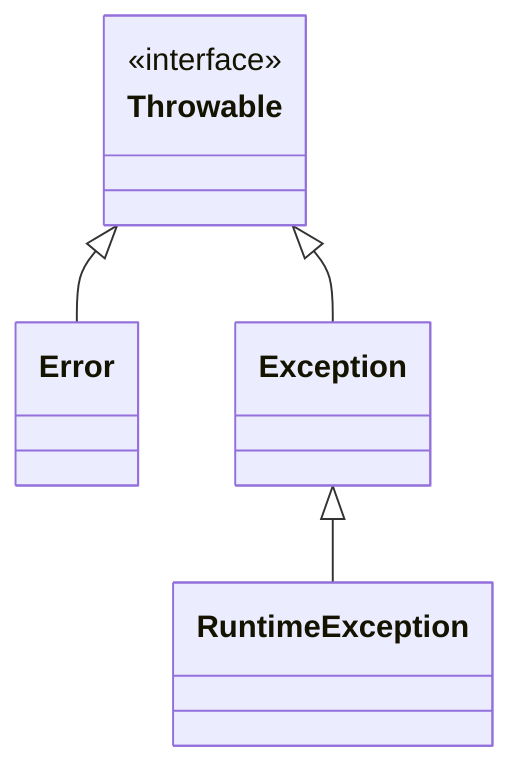
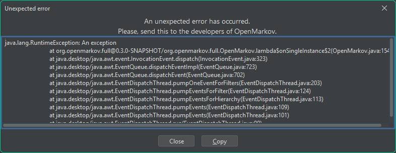
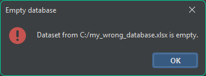

<!-- TOC -->

* [Error handling](#error-handling)
    * [Logging](#logging)
    * [Validation](#validation)
    * [Exception handling](#exception-handling)
        * [Exception handling in Java](#exception-handling-in-java)
    * [Good practices for error handling](#good-practices-for-error-handling)
    * [Error handling in OpenMarkov](#error-handling-in-openmarkov)
        * [Logging in OpenMarkov](#logging-in-openmarkov)
        * [Exception handling in OpenMarkov](#exception-handling-in-openmarkov)
            * [Special RuntimeExceptions of OpenMarkov](#special-runtimeexceptions-of-openmarkov)
            * [OpenMarkov's default uncaught exception handler](#openmarkovs-default-uncaught-exception-handler)

<!-- TOC -->

# Error handling

Error handling is the practice of anticipating, detecting, and react failures (errors) in the
software, such as the software reaching undefined states (which usually leads to more failures),
leaking sensitive data, losing or corrupting user's work and/or progress...

Errors are mainly divided in two categories:

- Recoverable errors: in these, the program can react to in some way, such as showing a message to
  the users and request a different input, using some value, or breaking the flow of the program and
  undoing the operation.
- Unrecoverable errors: in these, the program cannot continue in the standard flow, and (in most of
  the cases) they come from unintentional bugs, such as accessing an index a list beyond the size of
  the list.

A software that handles errors properly benefit from the following:

- The software will be reliable and stable, as it will always act as expected.
- The user experience is improved, as the program helps the user to navigate through unexpected
  circumstances and recover gracefully.
- The user's trust is increased, as they know the program won't result in negative comebacks such
  as losing or corrupting data.
- Debugging and maintenance is easier, as error handling gathers important details about the issues
  to solve, helping to identify the causes.
- The security is improved, as it prevents information from leaking and reduces vulnerabilities.

This wiki page covers a series practices and good habits for error handling, and including the
special mechanisms that OpenMarkov uses.

## Logging

It traces the execution of a program by recording and showing information on what the program
performs. Error handling uses this to solve bugs that are discovered during the program's execution.

Logging started first as just printing messages on the standard output (the terminal for most of
non-GUI apps) that allowed developers to see how their program was being executed step by step
without the friction of a debugger (but also without the advantages of using a debugger).

> Comment: While logs are commonly seen in terminals, they can be (and usually are) saved into files
> that can be recovered later on, especially for developers to further investigate and trace the
> actions taken by the program in order to understand how it works or how it reached a certain
> scenario.
>
> This makes it easier to share information about issue between development members, and are also
> a powerful tool if a user reports an issue and the log is shared.

Logging has evolved along the years and has taken a series of good practices:

- Do not produce noise: logging messages should be kept to a minimum, be concise, but to show enough
  relevant information to trace the app. If this guide is not followed, then the resulting log will
  have too many messages, and it will be hard to read and follow.
  <br><br>

- Use standards when showing messages: having standards or formats might make it easier to write and
  read logging messages, such as having good practices shared among the development team, or using a
  format for messages. Many frameworks allow you to generically change the format of the messages,
  for example, to show in what piece of code the logging message is being produced, which makes it
  easier for you to go to the code where you think the issue is.
  <br><br>

- Categorize messages: the messages will be easier to follow if they come in categories, as you can
  easily recognize them, such as following messages from the ``File`` or ``Network`` categories.
  <br>
  It might also come handy if these categories show something that makes them easy to recognize when
  looking at the log, such as having different colors for the messages of certain categories.

  > Comment: Many logging frameworks use levels such as ``Debug``, ``Warning``, or ``Error``, and
  > then allow you to only output the messages that match a certain level.
  >
  > For example, activating ``Warning`` usually makes so it shows ``Debug`` and ``Warning``
  messages,
  > but not ``Error`` messages.
  >
  > Take this with a grain of salt, as these are generic loggers. Your logger might have other
  > requirements, for example, you might want your logger to only show messages that are related to
  > certain functionality or modules, meaning having the ``levels`` that many of loggers use might
  not
  > be what you require here.

## Validation

It ensures the flow only takes place if the data meets certain criteria. Error handling uses this
to prevent errors.

In non-GUI (**G**raphical **U**ser **I**nterface) functions, this is usually done by checking the
data meets the criteria, and if not, some action is taken, which is usually raising an error,
asking the user for a new input, or altering the input to make it valid.

> Comment: While validation serves mainly prevent and react to errors, it is also used to document
> the requirements of the function, as developer can use your validation code as documentation.

The following example shows validation taking place right from the top a function:

````java
private static int MAX_MONEY_AMOUNT = 10_000_000;

// This example method transfers an amount of money from the payer to the payee.
public void transfer(Person payer, Person payee, int moneyToTransfer) throws TransferException.payerHasNotEnoughMoney, TransferException.payeeWouldHaveMoreMoneyThanAllowed {
    // Condition 1: The payer must have at least the amount of money to transfer.
    if (payer.money < moneyToTransfer) {
        throw new TransferException.payerHasNotEnoughMoney(payer, moneyToTransfer);
    }
    // Condition 2: The payee will not exceed the maximum amount of money after the transfer.
    if (payee.money + moneyToTransfer < MAX_MONEY_AMOUNT) {
        throw new TransferException.payeeWouldHaveMoreMoneyThanAllowed(payee, moneyToTransfer);
    }
    // Validation has been taken care of, so any code used from this point forward knows the 
    // previous conditions (1 and 2) are met.
    payer.money -= moneyToTransfer;
    payee.money += moneyToTransfer;
}
````

In GUI environments, it is usual for the validation to take place in the own user controls.

For example, following the previous example (transferring an amount of money from a payer to a
payee), a GUI might have a numeric box where the users choose the amount of money, and a transfer
button to click in order to execute the transfer operation. Data validation would happen here by
making the transfer button unactionable if the amount of money to transfer is superior to the money
the payer has.

> Comment: Even though the validation is taken care of in the GUI via changing the functionality of
> the GUI itself to adapt to validation, it is recommended to still do the validation in the same
> manner as you would in non-GUI apps, as the validation made in the GUI might be changed by an
> unsuspected developer, or because software requirements have changed.
>
> In the previous example, we would have made it so, even though the 'transfer' button is disabled,
> when it got clicked it would still validate the amount of money was smaller or equal to the money
> the payee has.

## Exception handling

Exceptions represent errors as concrete cases that escape the standard flow of the program, and
allow the developers to react to these cases. Error handling uses this to (as previously said) react
to errors.

An exception should have information regarding the error that happened, as that allows the user to
properly react to the exception. For example, ``FileNotFound`` should have a ``File notFoundField``
field.

Exceptions should usually be grouped on hierarchies, as this usually leaves the developer to decide
whether the funcion needs to user a finer or wider granulation. For example, the exceptions
``FileNotFound``, ``FileBusy`` and ``FilePermissionNotMet`` could all be grouped (via extension in
POO languages) over ``FileException``. This allows developer to cleanly react to ``FileException``
globally, or to specify how to treat a subset of the more concrete ``FileException``s.

> Comment: software designers often have different opinion when drawing the line on cases that
> represent an exception or not, as what might seem a normal condition can be seen as an exceptional
> error to another.
>
> This is usually (but not always) because they use an antipattern that has turned into a bad habit
> called ``Sentinel values``, where operations that lead to errors do not cause an error or
> exception, but it returns a special value instead. While this seems like an easy fix, it will
> likely lead to many more errors.
>
> For example, if an element ``e`` is not in the list ``elements`` and you try to find the index of
> ``e``, a developer might be tempted to return -1 as a special value (the sentinel value). this
> will escale if someone takes that value thinking it is a valid index instead of -1, and uses it
> to, for example, change the position of the element to the top of the list.
>
> The most commonly values that are usually used as sentinel values are ``null``, ``false``, ``-1``,
> ``Nan`` (**N**ot **a** **N**umber), the maximum and minimum values of the range of numeric
> values (Ex: ``Integer.MAX_VALUE`` and ``Integer.MIN_VALUE``), and empty instances of user
> structures (Ex: ``new Person()`` or ``Collections.emptyList()``; although empty arrays and
> collections might make sense in some cases, especially when finding filtered items).

### Exception handling in Java

In Java, exception handling is used with three keywords ``throw``, ``try``, and ``catch``:

``try`` are code blocks that contain code that can potentially trigger an error coming from an
exception. Right below the ``try`` block there will be ``catch`` blocks that react to specific
errors, so in case an error happens, it will immediately stop the execution of the ``try`` block,
and it will find the first ``catch`` block that can handle the error to execute it. If there is a
``finally`` block after the ``try`` and ``catch`` block(s), it will be executed after finishing the
``try`` block (if successful), or after the ``catch`` block ends (if unsuccessful). For example:

````java
void readFileContents(String filename) {
    try {
        // This is the content of the 'try' block, meaning an exception can happen here and it can
        // be treated in the first catch that matches it.
        String contents = Files.readAllLines(Path.of(filename));
        System.out.println("Your file's contents is:" + System.lineSeparator() + contents);
    } catch (IOException _) {
        // This 'catch' block reacts to 'IOException', meaning it will be triggered if the operation
        // of reading the file's content failed for any reason regarding the use of Input/Output.
        System.err.println("File " + filename + " could not be opened");
    } finally {
        // Since this is a 'finally' block, it will be executed regardless on whether an error 
        // happened or not.
        System.out.println("The program has ended");
    }
}
````

In case the error has no matching ``catch`` block that can react, then this function will get its
flow broken, and it will try to find a ``catch`` block that can react to the error on the function
that called the current function. If no ``catch`` block can react to the error and there are no
further callers, then the error will be handled by the current thread's
[UncaughtExceptionHandler](https://docs.oracle.com/en/java/javase/25/docs/api/java.base/java/lang/Thread.UncaughtExceptionHandler.html).

The remaining keyword, ``throw``, is used to both break the flow of the current function and to
raise so a catch block (or the default handler) can handle the error. This is done by following the
``throw`` with an instance of the ``Throwable`` interface, for example:

````java
void setAge(Person person, int newAge) {
    if (newAge < 0) {
        // This 'Throwable' is thrown here to represent the error 'A human cannot have a 
        // negative age'.
        throw new AgeCannotBeNegativeException(person, newAge);
    }
    person.age = newAge;
}
````

Java represents errors with the following hierarchy, in which we will call the interface
``Error`` as Java's ``Error`` to disambiguate from the "error" concept of error handling:



In this hierarchy we have:

- The interface ``Throwable``, which allows instances of classes that implement ``Throwable`` to be
  used with the ``throw`` keyword.
  <br><br>
  Classes implementing ``Throwable`` have certain limitations, such as not being able to use
  [generic parameters](https://docs.oracle.com/javase/tutorial/java/generics/types.html).
  <br><br>
  Unless you are developing new standards for the use of exception handling in Java, you should
  never directly implement ``Throwable`` for any of your classes.
  <br><br>
- The Java's ``Error`` class represent unrecoverable errors that usually have severe consequences,
  and usually the application should stop the execution as the state of the application could even
  be corrupted (be it a corruption of memory, execution, state...). As any other unrecoverable
  error, it is an error that could have been prevented.
  <br><br>
  Examples of Java's ``Error`` subclasses can be:
  <br><br>
    - ``StackOverflowError``, where the call stack has reached its limit. If found in modern
      computers
      it is very likely the cause is a development bug related to recursion.
      <br><br>
    - ``OutOfMemoryError``, where the application could not use more memory and might
      be on an undefined state. It is very likely the program could have prevented and blocked this
      scenario.
      <br><br>
    - ``NoClassDefFoundError``, where a class is missing. This happens when the project has a
      mis-configuration.
      <br><br>
- ``RuntimeException`` represent unrecoverable errors that don't have as severe consequences as
  Java's ``Error``, meaning they could be caught with the ``catch`` clause; although, as any other
  unrecoverable error, it is preferable to prevent them than reacting to them.
  <br><br>
- ``Exception`` represent recoverable errors, and therefore Java forces developers that use the
  ``throw`` keyword to list the error in a ``throws`` list on the declaration of the method.
  <br><br>
  In order to force developers to react to these recoverable errors, java makes it so code that
  calls functions with a ``throws`` list is forced to enclose the function call in a
  ``try-catch`` block, or to declare the error in the ``throws`` list.

> Comment: Java uses its ``Error`` and ``RuntimeException`` classes to represent unrecoverable
> errors that the developers should not be aware that can happen, as they happen due to a bug that a
> developer should have avoided. For this matter, it is very unlikely you want to declare an
> instance of Java's ``Error`` or ``RuntimeException``, but ``Exception``. You would only declare
> Java's ``Error`` or ``RuntimeException`` for errors that are truly unrecoverable and caused by a
> potential bug in the program's design.
>
> Do not declare instances of Java's ``Error`` and ``RuntimeException`` to just make the code
> cleaner, as this will make so other developers will not be aware of the errors that might happen
> and think their code will work gracefully, while there is actually potentials errors they should
> have considered.

## Good practices for error handling

- React to errors as soon as possible: if a function can treat the error properly and covering all
  scenarios, then it should, as then those methods that call it won't need to react to the error
  themselves.
  <br><br>
  For example, if function ``X`` is called by ``A``, ``B`` anc ``C``, and ``X`` can lead to an error
  that it does not react to, then ``A``, ``B`` anc ``C`` need to consider whether they react to the
  error or not. If ``X`` reacted to the error, then ``A``, ``B`` anc ``C`` don't need to consider
  the error.
  <br><br>

- Use retry mechanisms: some errors are transient, meaning the state of the program might not mean
  anything to whether the error happens or not. In such errors, retrying the operation might
  actually lead to solving the issue.
  <br><br>
  For example, the operation ``download file x.txt`` might fail due to a connection issue (which is
  an example of transient error), in which case retrying the operation might lead to a successful
  download.
  <br><br>
  Retry mechanism have to be designed properly considering the operation and the transient error. In
  the previous example, re-downloading the file might fix the error, but if there is no connection
  to the machine, then it won't matter how many time the program re-tries the download, it will fail
  every single time, leading to the program getting stuck.
  <br><br>

- Use centralized error handling system: they allow your app to treat, react or log the error in the
  software, allowing developers to collect information about errors easier, or allowing the
  application to recover from certain unhandled scenarios.
  <br><br>
  Java has an example of this called the ``UncaughtExceptionHandler``, this allows to handle
  exceptions that are not handled in the code via ``catch`` blocks (which would led the application
  to crash in non-GUI environments).
  <br><br>

- Give important information: when logging or showing exceptions, the information shown should be
  concise, but it also to provide enough context.
  <br><br>
  Example: If an error is a file that could not be opened, the message should include information
  such as the name of the file, as the user might have forgotten the file after opening, or they
  have selected a wrong file, and showing the file allows them to recognize this. Another
  information that might be useful is the cause why the file could not be opened (It does not exist,
  it is being used by another program, permissions aren't met, the file is corrupt...).
  <br><br>
  As stated earlier, this information should also be reflected in the code, for example, the class
  representing Errors or Java's Exceptions should have fields to recover that information, such as a
  field as ``File unaccessibleFile``. This allows the programmer to handle the error better, for
  example, having that path, they might be able to find a recovery file.
  <br><br>

- Never ignore errors silently: when errors are ignored, the developers have it much harder to find
  the cause of bugs, as they never knew an error happened. This happens when a developer captures an
  error and does nothing with it, for example, this code ignores an exception, and then the code
  follows to another operation that fails.

  ````java
  List<File> emptyList = new ArrayList<>();
  File firstFile;
  try{
      firstFile = emptyList.get(0);           // The code will fail here and throw an 
                                              // IndexOutOfBoundsException.
  }catch (IndexOutOfBoundsException _){
                                              // No action is taken place on the exception's 
                                              // catch, meaning the flow continues.
  }
  return firstFile.getAbsolutePath();          // Since the flow continued, the variable for 
                                               // firstFile is guaranteed to be null, leading to 
                                               // a NullPointerException, which masks the 
                                               // IndexOutOfBoundsException from earlier.
                                               // Since the "catch" didn't do anything, not even 
                                               // logging, now the developers has to uncover the cause
                                               // of the NullPointerException, which will later on 
                                               // lead them to the IndexOutOfBoundsException.
  ````

## Error handling in OpenMarkov

The practices and good habits explained before are all applied in OpenMarkov, but we also
adaptations of them that work better under OpenMarkov's requirements:

### Logging in OpenMarkov

OpenMarkov uses [Log4j 2](https://logging.apache.org/log4j/2.x/index.html) in order to
log messages, where you can find an instance of a logger in the class
[
``OpenMarkovLogger``](https://github.com/OpenMarkov/OpenMarkov/blob/development/core/src/main/java/org/openmarkov/core/logging/OpenMarkovLogger.java)
from the public static field
[
``LOGGER``](https://github.com/OpenMarkov/OpenMarkov/blob/development/core/src/main/java/org/openmarkov/core/logging/OpenMarkovLogger.java#L7),
which you can use to log messages such like:

````java
OpenMarkovLogger.LOGGER.debug("My debug message");
````

### Exception handling in OpenMarkov

#### Special RuntimeExceptions of OpenMarkov

OpenMarkov defines special ``RuntimeException``s (the only ``RuntimeException``s of OpenMarkov) for
specific cases that aren't covered by the language:

- [
  ``UnreachableException``](https://github.com/OpenMarkov/OpenMarkov/blob/development/core/src/main/java/org/openmarkov/core/exception/UnreachableException.java):
  It is used to wrap an exception that Java forces to ``catch``, but where the developer knows
  the exception cannot happen in the context they are. They wrap the exception under a
  ``UnreachableException`` and throw the ``UnreachableException`` to break the flow and show an
  error on the GUI in the case the exception happened.
- [
  ``UnreachableCodeException``](https://github.com/OpenMarkov/OpenMarkov/blob/development/core/src/main/java/org/openmarkov/core/exception/UnreachableCodeException.java):
  Similar to ``UnreachableException``, but it is used to represent code that cannot be reached under
  no circumstance.
- [
  ``UnrecoverableException``](https://github.com/OpenMarkov/OpenMarkov/blob/development/core/src/main/java/org/openmarkov/core/exception/UnreachableException.java):
  Wraps exceptions with the same goal as ``UnreachableException``, but it is used to represent a
  case of an exception that has been forced to be ``catch`` and cannot be re-thrown up because the
  method does not allow it. This is mostly found on Action Listeners, as they cannot re-throw
  exceptions.

#### OpenMarkov's default uncaught exception handler

OpenMarkov has a default UncaughtExceptionHandler that, once an exception is reached, does not close
the application; Instead, it shows a message to the user with the exception.

In case it catches a ``RuntimeException`` (including ``UnreachableException``), it will show a
dialog with a trace asking the user to send a screenshot of what happened to them and give us
information on solving the bug they just found. This is how that looks like:



In case it catches a ``UnrecoverableException`` it will show a dialog with an error message. If the
wrapped exception happened to be an ``OpenMarkovException``, the message will come from a class
localization file. This is how that looks like:



The messages from the different OpenMarkovExceptions come from class localization files, which are
special localization ``xml`` files that are meant to give classes a visual representation for users.

The exception shown before is a ``EmptyDatabaseException``, so there is a class localization file in
OpenMarkov like this:

````xml
<?xml version="1.0" encoding="UTF-8"?>
<ClassLocalizations>
    ...
    <Localization class="org.openmarkov.core.exception.EmptyDatabaseException"
                  value="Dataset from {source} is empty."/>
    ...
</ClassLocalizations>
````

This means the message for the ``org.openmarkov.core.exception.EmptyDatabaseException`` class is
``Dataset from {source} is empty.``, where ``source`` is a field of ``EmptyDatabaseException``.

For someone to have made it so the exception from before was shown as in the picture, there must be
some code like this in the app:

````java
...
// The exception is generated and thrown somewhere in the code
        throw new EmptyDatabaseException("C:/my_wrong_database.xlsx");
...
        
        ...
        catch(
EmptyDatabaseException e){
        // Throws the exception as UnrecoverableException as this method cannot re-throw it. 
        throw new

UnrecoverableException(e);
}
        ...
````