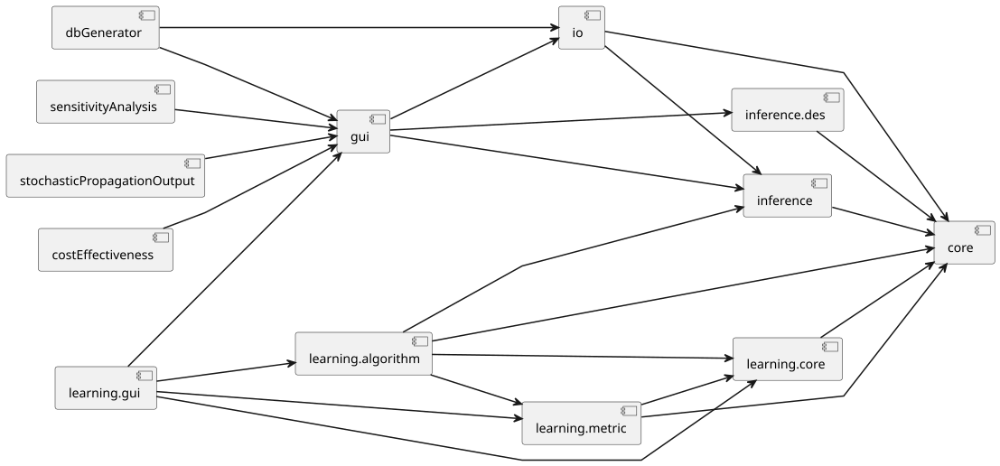

# OpenMarkov's organization

OpenMarkov is a
[Maven multimodular project](https://www.sonatype.com/resources/guides/maven-by-example/multi-module-project),
meaning it is structured as set of **modules**, which allows OpenMarkov to be easily extended.

The code for these modules is stored in the
[OpenMarkov project (in GitHub)](https://github.com/OpenMarkov/OpenMarkov/tree/development), and
example of these modules are ``core``, ``gui`` or ``full``.

Modules can depend on each other as long as there are no cyclic dependencies. For example, the
module ``gui`` depends on ``io``, but it would be invalid if ``io`` also depended on ``gui``.

This represents the dependency graph between each of the modules (the modules ``full`` and
``bnEvaluation`` have been skipped for readability reasons).

In OpenMarkov we distinguish between two kinds of modules:

- Core modules: This is where raw functionalities are specified, such as how the nodes are stored in
  a Probabilistic Network or how the Inference algorithm work. 
  Example of this are ``core``, ``io``, and ``inference``.
- GUI modules: This is where Graphical User Interfaces (GUIs) are written, and they allow a user to
  use the functionalities of the core modules without requiring any knowledge on software
  development. 
  Example of this are ``gui`` and ``learning.gui``.