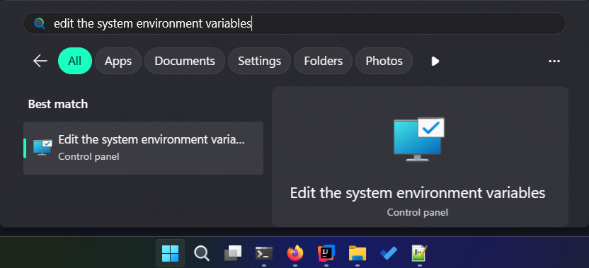
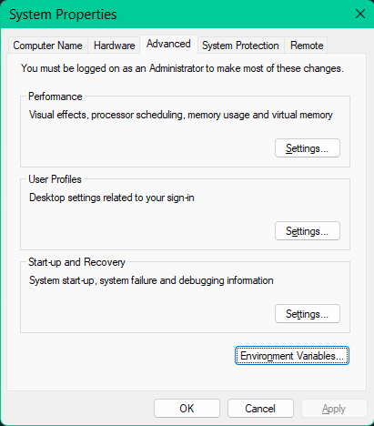
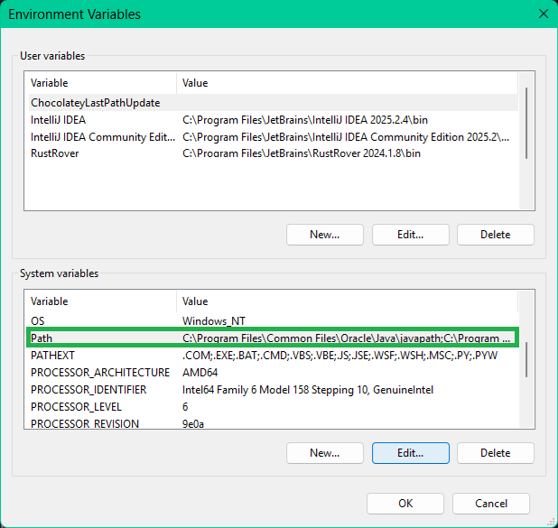
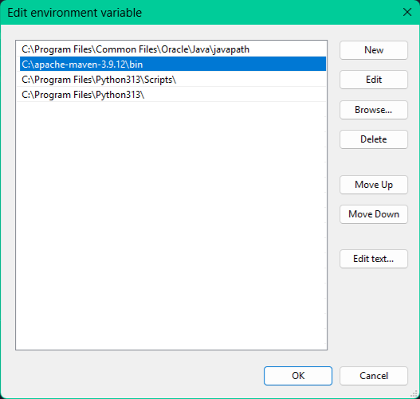
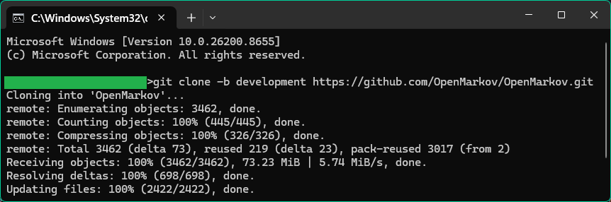
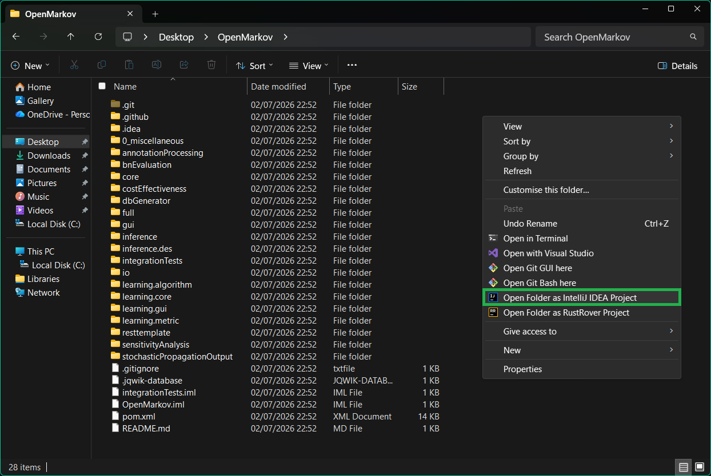
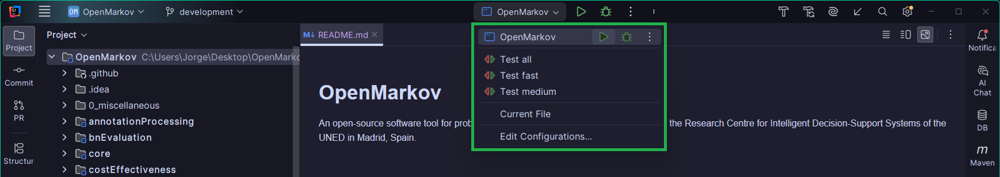
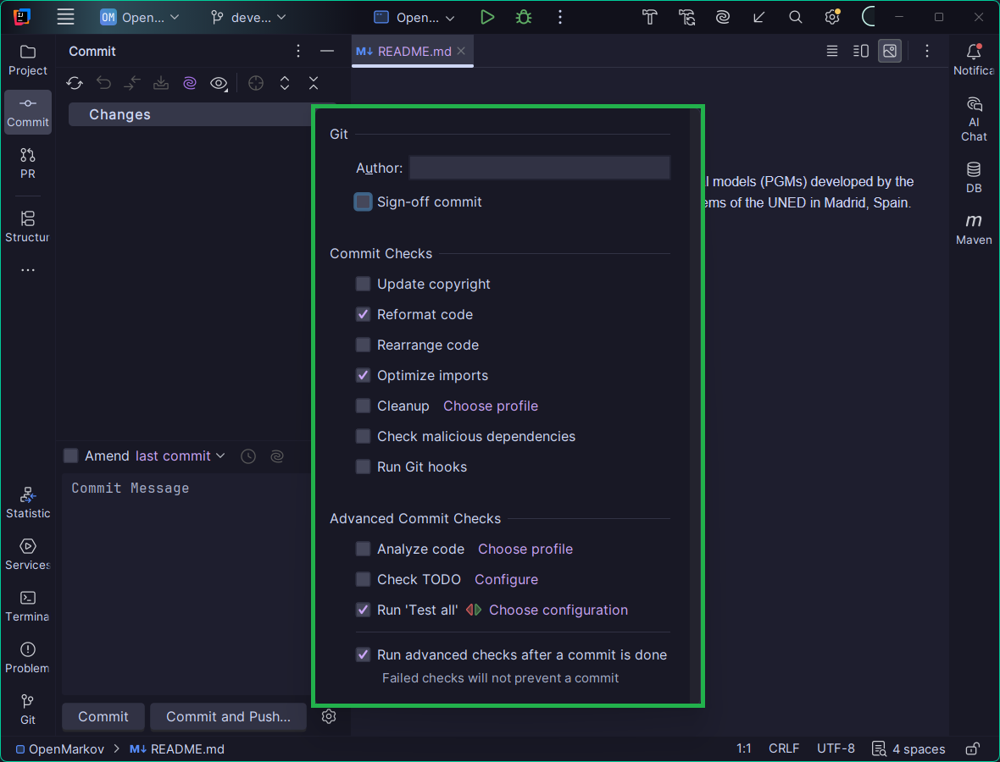
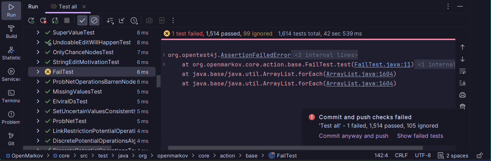

<!-- TOC -->
* [1. Setting up the Environment](#1-setting-up-the-environment)
  * [1.1 Install a Java Development Kit (JDK)](#11-install-a-java-development-kit-jdk)
  * [1.2 Install an Integrated Development Environment (IDE)](#12-install-an-integrated-development-environment-ide)
  * [1.3 Install Git](#13-install-git)
* [2. Setting up an OpenMarkov project](#2-setting-up-an-openmarkov-project)
  * [2.1 Clone OpenMarkov](#21-clone-openmarkov)
  * [2.2 Open the project](#22-open-the-project)
  * [2.3 Automate actions on the project when committing](#23-automate-actions-on-the-project-when-committing)
  * [2.4 Recommended plugins for IntelliJ (Optional)](#24-recommended-plugins-for-intellij-optional)
<!-- TOC -->

# 1. Setting up the Environment

In this section we cover the installation of the programs required to properly work on OpenMarkov's 
code.

## 1.1 Install a Java Development Kit (JDK)

In order to compile OpenMarkov, you need version 25 or newer. There are several JDKs, in two main
tracks: open-source JDKs such as [OpenJDK](https://openjdk.java.net), and commercial JDKs such
as [Oracle JDK](https://www.oracle.com/java/technologies/javase-downloads.html).

Microsoft has compiled [OpenJDK builds](https://www.microsoft.com/openjdk) for different operating
systems; this is the option we recommend for Windows and iOS. Linux distributions usually include
more recent versions of OpenJDK. If you wish to use the most recent version for any operating
system, download the binary files from the [OpenJDK site](https://openjdk.java.net).

Alternatively, you may use
the [Oracle JDK](https://www.oracle.com/java/technologies/javase-downloads.html)
installer for your operating system, but if you intend to release compiled Java programs, keep in
mind the restrictions specified in its license.

## 1.2 Install an Integrated Development Environment (IDE)

If you wish to browse and/or modify OpenMarkov's code or use it as an API, we recommend you to use
an IDE, especially IntelliJ, which is the IDE we are going to cover. (We do not cover other IDEs
or other operating systems because none of the researchers in our group are using them, but the
installation is similar.)

IntelliJ comes with two licenses: the Community license, which is free, or their Ultimate license,
which is paid but has more features than the Community edition. For our purposes, you can go with
the one you prefer.

The installation and update/downgrade of IntelliJ can be simplified greatly using the
[JetBrains Toolbox](https://www.jetbrains.com/toolbox-app/) application, both in Windows and Linux,
but you might install it manually,
which can be done by downloading IntelliJ for your operating system
from [its official page](https://www.jetbrains.com/idea/download),
and then opening it and follow the installation wizard if you are a Windows/Mac user, or unzip the
tar file and follow the instructions in *Install-Linux-tar* if you are a Linux user.

## 1.3 Install Git

When installing an IDE such as JetBrains' IntelliJ, they usually prompt you to install Git via a 
single-clic, taking care of the installation in your stead.

If this is not your case, you can install it manually, which can be done with the 
[Git Wizard Installer for Windows users](https://git-scm.com/install/windows), or executing the
```sudo apt install git``` command for Linux users.

<!---
## 1.4 Install Maven (Only required when using the [minimal project setup](#23-option-a-minimal-setup))

Maven can be installed as specified in their [official page](https://maven.apache.org/install.html),
which is just downloading a zip file, extracting it, and adding it to the PATH variable.

In Windows OS this can be done following these steps:

| Action                                                                                     | Demonstration                                                                    |
|--------------------------------------------------------------------------------------------|----------------------------------------------------------------------------------|
| 1. Find the ``Edit the system enviroment variables`` option.                               |  |
| 2. Click on ``Enviroment variables``.                                                      |  |
| 3. Select the ``Path`` variable among the ``System variables`` and then clic on ``Edit``.  |       |
| 4. Select ``New``, and in the new variable put the path to the ``bin`` directory of Maven. |           |
--->

# 2. Setting up an OpenMarkov project

In this section we cover the setup of an OpenMarkov project and how to make it more comfortable to
work with the environment.

## 2.1 Clone OpenMarkov

You have to clone OpenMarkov using git in order to be able to upload changes, you can do this using
the following command:

```
git clone -b development https://github.com/OpenMarkov/OpenMarkov.git
```

Once cloned, your terminal will look like this:



## 2.2 Open the project

In IntelliJ, you can either open the project via opening IntelliJ and select
``File -> Open project``, or you can open the newly created directory with OpenMarkov and do
right-click and select ``Open Folder as IntelliJ IDEA Project``



IntelliJ is our recommended IDE, and as such, you get better support for it: Once opened, you'll
have 4 different run configurations available:



## 2.3 Automate actions on the project when committing

The only configuration required for an OpenMarkov project is the actions that are taken before
creating a commit. For this, go into the ``Commit`` tab, press on the cog icon, and copy the 
configuration to the one in this picture:



This makes so before doing a commit:

- The code will be reformated, making it cleaner to read for other members.
- The code will have the import clauses cleaned, erasing any "import" clauses you forgot to manually
  erase (this happens very often for most of the developers).
- Tests will be checked, and if they are wrong, you will be told of it. This ensures your code
  hasn't broken up any of the contracts of OpenMarkov, and it will be more likely your code has no
  bugs.

For example, if a test fails when trying to commit some changes, you'll see a screen like this:



## 2.4 Recommended plugins for IntelliJ (Optional)

If you find yourself comfortable working on IntelliJ, we recommend checking out our wiki page 
regarding [plugins of interest](IntelliJ/Plugins_of_interest.md), as they might make your job more
confortable when working with OpenMarkov (and perhaps other projects).